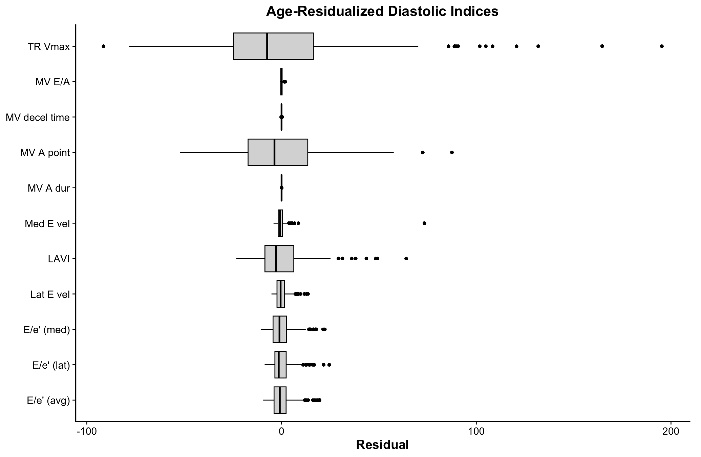

# Modeling Left Ventricular Diastolic Dysfunction and Cardiopulmonary
Fitness in HCM
Mark E. Pepin, MD, PhD, MS, FESC
2026-03-25

- [0.1 Repository
  Artifacts](#repository-artifacts)
- [1 Data Import and Cohort
  Assembly](#data-import-and-cohort-assembly)
  - [1.1 Import and clean CPX
    data](#import-and-clean-cpx-data)
  - [1.2 Comorbidity
    exclusions](#comorbidity-exclusions)
  - [1.3 Merge echocardiographic
    data](#merge-echocardiographic-data)
  - [1.4 Import clinical
    outcomes](#import-clinical-outcomes)
  - [1.5 Cohort flow
    diagram](#cohort-flow-diagram)
- [2 ASE 2025 Diastolic
  Dysfunction Grading](#ase-2025-diastolic-dysfunction-grading)
- [3 GAMLSS / SEAMLSS Continuous
  Modeling](#gamlss--seamlss-continuous-modeling)
- [4 Cross-Sectional Nonlinear
  Analysis](#cross-sectional-nonlinear-analysis)
  - [4.1 Primary outcome: Peak
    VO$_2$ (FRIEND 2.0 %
    predicted)](#primary-outcome-peak-vo_2-friend-20--predicted)
  - [4.2 Secondary outcome:
    VE/VCO$_2$ slope](#secondary-outcome-vevco_2-slope)
  - [4.3 Sensitivity: Echo
    alignment window](#sensitivity-echo-alignment-window)
- [5 Longitudinal GAMM
  Analysis](#longitudinal-gamm-analysis)
- [6 Heart Failure Outcome
  Analysis](#heart-failure-outcome-analysis)
- [7 Patient
  Characteristics](#patient-characteristics)
  - [7.1 Table 1](#table-1)
  - [7.2 Figure 1: Cohort
    Characteristics](#figure-1-cohort-characteristics)
  - [7.3 Figure 2: Longitudinal
    Analysis](#figure-2-longitudinal-analysis)
- [8 Supplemental
  Analyses](#supplemental-analyses)
  - [8.1 Age-residualized
    diastolic indices](#age-residualized-diastolic-indices)
  - [8.2 Export missing echo
    audit](#export-missing-echo-audit)

## Repository Artifacts

- [Quarto source](README_HCM.Diastology.qmd)
- [Figures](outputs/figures/)
- [Tables](outputs/tables/)
- [Supporting statistics](outputs/stats/)
- [Echo linkage
  audit](outputs/audit/Serial_CPX_missing_resting_echo.xlsx)

# Data Import and Cohort Assembly

## Import and clean CPX data

The initial phase imports raw Cardiopulmonary Exercise Testing (CPET)
data, assigns a stable patient identifier (ID) per MRN, retains patients
with serial testing ($\geq 2$ sessions), restricts to HCM with adequate
effort (peak RER $\geq 1.0$), and derives biometric indices (BSA, BMI,
LBMI).

    CPX tests (HCM, adequate effort): 1269 tests, 424 patients

## Comorbidity exclusions

Patients with documented CAD, COPD, or interstitial lung disease are
excluded so that exercise limitations are attributable to HCM-specific
pathology.

## Merge echocardiographic data

Each CPET is aligned with the closest prior resting echocardiogram
within a configurable window (default 365 days).

    Baseline cohort: 367 patients
    Longitudinal observations: 1088

## Import clinical outcomes

    Patients with outcome data: 1263
    Composite HF events: 286

## Cohort flow diagram

# ASE 2025 Diastolic Dysfunction Grading

The 2025 ASE guidelines propose a hierarchical framework integrating
E/e’ (\>14), Ar-A duration difference ($\geq$ 30 ms), left atrial volume
index (\>34 mL/m$^2$), and peak tricuspid regurgitation velocity (\>2.8
m/s). Pulmonary venous Ar duration was not available in this dataset;
grading proceeds with 3 of 4 criteria.

**ASE 2025 DD Grade Distribution (Baseline):**

       Normal       Grade I      Grade II     Grade III Indeterminate 
          556           109           113            36           449 

<table class="gt_table" style="width:100%;"
data-quarto-postprocess="true" data-quarto-disable-processing="false"
data-quarto-bootstrap="false">
<caption><strong>Table: Patient Characteristics Stratified by ASE 2025
DD Grade</strong></caption>
<colgroup>
<col style="width: 14%" />
<col style="width: 14%" />
<col style="width: 14%" />
<col style="width: 14%" />
<col style="width: 14%" />
<col style="width: 14%" />
<col style="width: 14%" />
</colgroup>
<thead>
<tr class="gt_col_headings">
<th id="label" class="gt_col_heading gt_columns_bottom_border gt_left"
data-quarto-table-cell-role="th"
scope="col"><strong>Characteristic</strong></th>
<th id="stat_1"
class="gt_col_heading gt_columns_bottom_border gt_center"
data-quarto-table-cell-role="th"
scope="col"><strong>Normal</strong> 
N = 5561</th>
<th id="stat_2"
class="gt_col_heading gt_columns_bottom_border gt_center"
data-quarto-table-cell-role="th" scope="col"><strong>Grade
I</strong> 
N = 1091</th>
<th id="stat_3"
class="gt_col_heading gt_columns_bottom_border gt_center"
data-quarto-table-cell-role="th" scope="col"><strong>Grade
II</strong> 
N = 1131</th>
<th id="stat_4"
class="gt_col_heading gt_columns_bottom_border gt_center"
data-quarto-table-cell-role="th" scope="col"><strong>Grade
III</strong> 
N = 361</th>
<th id="stat_5"
class="gt_col_heading gt_columns_bottom_border gt_center"
data-quarto-table-cell-role="th"
scope="col"><strong>Indeterminate</strong> 
N = 01</th>
<th id="p.value"
class="gt_col_heading gt_columns_bottom_border gt_center"
data-quarto-table-cell-role="th"
scope="col"><strong>p-value</strong>2</th>
</tr>
</thead>
<tbody class="gt_table_body">
<tr>
<td class="gt_row gt_left" headers="label"
style="font-weight: bold">Age, years</td>
<td class="gt_row gt_center" headers="stat_1">45.2 (16.0)</td>
<td class="gt_row gt_center" headers="stat_2">51.4 (15.3)</td>
<td class="gt_row gt_center" headers="stat_3">51.6 (20.6)</td>
<td class="gt_row gt_center" headers="stat_4">55.6 (10.5)</td>
<td class="gt_row gt_center" headers="stat_5">NA (NA)</td>
<td class="gt_row gt_center" headers="p.value">&lt;0.001</td>
</tr>
<tr>
<td class="gt_row gt_left" headers="label"
style="font-weight: bold">Sex</td>
<td class="gt_row gt_center" headers="stat_1"> 
</td>
<td class="gt_row gt_center" headers="stat_2"> 
</td>
<td class="gt_row gt_center" headers="stat_3"> 
</td>
<td class="gt_row gt_center" headers="stat_4"> 
</td>
<td class="gt_row gt_center" headers="stat_5"> 
</td>
<td class="gt_row gt_center" headers="p.value">0.077</td>
</tr>
<tr>
<td class="gt_row gt_left" headers="label">    Male</td>
<td class="gt_row gt_center" headers="stat_1">363 (65%)</td>
<td class="gt_row gt_center" headers="stat_2">60 (55%)</td>
<td class="gt_row gt_center" headers="stat_3">70 (62%)</td>
<td class="gt_row gt_center" headers="stat_4">18 (50%)</td>
<td class="gt_row gt_center" headers="stat_5">0 (NA%)</td>
<td class="gt_row gt_center" headers="p.value"> 
</td>
</tr>
<tr>
<td class="gt_row gt_left" headers="label">    Female</td>
<td class="gt_row gt_center" headers="stat_1">193 (35%)</td>
<td class="gt_row gt_center" headers="stat_2">49 (45%)</td>
<td class="gt_row gt_center" headers="stat_3">43 (38%)</td>
<td class="gt_row gt_center" headers="stat_4">18 (50%)</td>
<td class="gt_row gt_center" headers="stat_5">0 (NA%)</td>
<td class="gt_row gt_center" headers="p.value"> 
</td>
</tr>
<tr>
<td class="gt_row gt_left" headers="label"
style="font-weight: bold">BMI, kg/m²</td>
<td class="gt_row gt_center" headers="stat_1">27.9 (6.2)</td>
<td class="gt_row gt_center" headers="stat_2">28.6 (4.8)</td>
<td class="gt_row gt_center" headers="stat_3">26.8 (5.8)</td>
<td class="gt_row gt_center" headers="stat_4">28.0 (4.7)</td>
<td class="gt_row gt_center" headers="stat_5">NA (NA)</td>
<td class="gt_row gt_center" headers="p.value">0.061</td>
</tr>
<tr>
<td class="gt_row gt_left" headers="label"
style="font-weight: bold">LBMI, kg/m²</td>
<td class="gt_row gt_center" headers="stat_1">23.4 (5.5)</td>
<td class="gt_row gt_center" headers="stat_2">24.7 (5.8)</td>
<td class="gt_row gt_center" headers="stat_3">24.7 (6.3)</td>
<td class="gt_row gt_center" headers="stat_4">23.0 (5.2)</td>
<td class="gt_row gt_center" headers="stat_5">NA (NA)</td>
<td class="gt_row gt_center" headers="p.value">0.11</td>
</tr>
<tr>
<td class="gt_row gt_left" headers="label" style="font-weight: bold">HCM
Phenotype</td>
<td class="gt_row gt_center" headers="stat_1"> 
</td>
<td class="gt_row gt_center" headers="stat_2"> 
</td>
<td class="gt_row gt_center" headers="stat_3"> 
</td>
<td class="gt_row gt_center" headers="stat_4"> 
</td>
<td class="gt_row gt_center" headers="stat_5"> 
</td>
<td class="gt_row gt_center" headers="p.value"> 
</td>
</tr>
<tr>
<td class="gt_row gt_left" headers="label">    Apical</td>
<td class="gt_row gt_center" headers="stat_1">74 (16%)</td>
<td class="gt_row gt_center" headers="stat_2">2 (2.1%)</td>
<td class="gt_row gt_center" headers="stat_3">3 (2.7%)</td>
<td class="gt_row gt_center" headers="stat_4">0 (0%)</td>
<td class="gt_row gt_center" headers="stat_5">0 (NA%)</td>
<td class="gt_row gt_center" headers="p.value"> 
</td>
</tr>
<tr>
<td class="gt_row gt_left" headers="label">    Asymmetric Septal</td>
<td class="gt_row gt_center" headers="stat_1">345 (73%)</td>
<td class="gt_row gt_center" headers="stat_2">69 (73%)</td>
<td class="gt_row gt_center" headers="stat_3">99 (89%)</td>
<td class="gt_row gt_center" headers="stat_4">26 (81%)</td>
<td class="gt_row gt_center" headers="stat_5">0 (NA%)</td>
<td class="gt_row gt_center" headers="p.value"> 
</td>
</tr>
<tr>
<td class="gt_row gt_left" headers="label">    Burned-out</td>
<td class="gt_row gt_center" headers="stat_1">0 (0%)</td>
<td class="gt_row gt_center" headers="stat_2">2 (2.1%)</td>
<td class="gt_row gt_center" headers="stat_3">0 (0%)</td>
<td class="gt_row gt_center" headers="stat_4">0 (0%)</td>
<td class="gt_row gt_center" headers="stat_5">0 (NA%)</td>
<td class="gt_row gt_center" headers="p.value"> 
</td>
</tr>
<tr>
<td class="gt_row gt_left" headers="label">    Symmetric</td>
<td class="gt_row gt_center" headers="stat_1">51 (11%)</td>
<td class="gt_row gt_center" headers="stat_2">22 (23%)</td>
<td class="gt_row gt_center" headers="stat_3">9 (8.1%)</td>
<td class="gt_row gt_center" headers="stat_4">6 (19%)</td>
<td class="gt_row gt_center" headers="stat_5">0 (NA%)</td>
<td class="gt_row gt_center" headers="p.value"> 
</td>
</tr>
<tr>
<td class="gt_row gt_left" headers="label"
style="font-weight: bold">Peak VO₂ (FRIEND 2.0 %pred)</td>
<td class="gt_row gt_center" headers="stat_1">79.4 (37.1)</td>
<td class="gt_row gt_center" headers="stat_2">80.3 (43.7)</td>
<td class="gt_row gt_center" headers="stat_3">68.9 (35.1)</td>
<td class="gt_row gt_center" headers="stat_4">76.2 (33.1)</td>
<td class="gt_row gt_center" headers="stat_5">NA (NA)</td>
<td class="gt_row gt_center" headers="p.value">0.055</td>
</tr>
<tr>
<td class="gt_row gt_left" headers="label"
style="font-weight: bold">Peak VO₂ (Wasserman %pred)</td>
<td class="gt_row gt_center" headers="stat_1">94.4 (80.9)</td>
<td class="gt_row gt_center" headers="stat_2">78.6 (51.8)</td>
<td class="gt_row gt_center" headers="stat_3">106.2 (83.8)</td>
<td class="gt_row gt_center" headers="stat_4">94.4 (37.9)</td>
<td class="gt_row gt_center" headers="stat_5">NA (NA)</td>
<td class="gt_row gt_center" headers="p.value">0.049</td>
</tr>
<tr>
<td class="gt_row gt_left" headers="label"
style="font-weight: bold">VE/VCO₂ Slope</td>
<td class="gt_row gt_center" headers="stat_1">31.3 (5.4)</td>
<td class="gt_row gt_center" headers="stat_2">33.5 (7.8)</td>
<td class="gt_row gt_center" headers="stat_3">31.3 (4.7)</td>
<td class="gt_row gt_center" headers="stat_4">35.8 (7.1)</td>
<td class="gt_row gt_center" headers="stat_5">NA (NA)</td>
<td class="gt_row gt_center" headers="p.value">&lt;0.001</td>
</tr>
<tr>
<td class="gt_row gt_left" headers="label" style="font-weight: bold">HR
Recovery (1 min)</td>
<td class="gt_row gt_center" headers="stat_1">29.7 (11.6)</td>
<td class="gt_row gt_center" headers="stat_2">23.7 (12.1)</td>
<td class="gt_row gt_center" headers="stat_3">23.9 (10.4)</td>
<td class="gt_row gt_center" headers="stat_4">21.5 (4.7)</td>
<td class="gt_row gt_center" headers="stat_5">NA (NA)</td>
<td class="gt_row gt_center" headers="p.value">&lt;0.001</td>
</tr>
<tr>
<td class="gt_row gt_left" headers="label"
style="font-weight: bold">E/e' (average)</td>
<td class="gt_row gt_center" headers="stat_1">10.1 (2.2)</td>
<td class="gt_row gt_center" headers="stat_2">17.7 (4.8)</td>
<td class="gt_row gt_center" headers="stat_3">19.1 (4.5)</td>
<td class="gt_row gt_center" headers="stat_4">22.3 (6.1)</td>
<td class="gt_row gt_center" headers="stat_5">NA (NA)</td>
<td class="gt_row gt_center" headers="p.value">&lt;0.001</td>
</tr>
<tr>
<td class="gt_row gt_left" headers="label"
style="font-weight: bold">LAVI, mL/m²</td>
<td class="gt_row gt_center" headers="stat_1">33.3 (10.9)</td>
<td class="gt_row gt_center" headers="stat_2">36.3 (18.2)</td>
<td class="gt_row gt_center" headers="stat_3">43.6 (8.6)</td>
<td class="gt_row gt_center" headers="stat_4">54.7 (5.7)</td>
<td class="gt_row gt_center" headers="stat_5">NA (NA)</td>
<td class="gt_row gt_center" headers="p.value">&lt;0.001</td>
</tr>
<tr>
<td class="gt_row gt_left" headers="label" style="font-weight: bold">TR
Vmax, m/s</td>
<td class="gt_row gt_center" headers="stat_1">230.3 (26.2)</td>
<td class="gt_row gt_center" headers="stat_2">263.0 (45.4)</td>
<td class="gt_row gt_center" headers="stat_3">244.7 (36.3)</td>
<td class="gt_row gt_center" headers="stat_4">299.6 (20.3)</td>
<td class="gt_row gt_center" headers="stat_5">NA (NA)</td>
<td class="gt_row gt_center" headers="p.value">&lt;0.001</td>
</tr>
<tr>
<td class="gt_row gt_left" headers="label"
style="font-weight: bold">LVEF, %</td>
<td class="gt_row gt_center" headers="stat_1">64.2 (6.3)</td>
<td class="gt_row gt_center" headers="stat_2">62.8 (8.8)</td>
<td class="gt_row gt_center" headers="stat_3">68.2 (6.6)</td>
<td class="gt_row gt_center" headers="stat_4">65.2 (5.0)</td>
<td class="gt_row gt_center" headers="stat_5">NA (NA)</td>
<td class="gt_row gt_center" headers="p.value">&lt;0.001</td>
</tr>
</tbody><tfoot>
<tr class="gt_footnotes">
<td colspan="7" class="gt_footnote">1
Mean (SD); n (%)</td>
</tr>
<tr class="gt_footnotes">
<td colspan="7" class="gt_footnote">2
Kruskal-Wallis rank sum test; Fisher’s exact test; NA</td>
</tr>
</tfoot>
&#10;</table>

# GAMLSS / SEAMLSS Continuous Modeling

We employ a Semiparametric Additive Model for Location, Scale, and Shape
(GAMLSS) to model the continuous relationship between diastolic indices
and Peak VO$_2$. The SEAMLSS framework derives Z-scores via
$u(x) = \ln(y / \mu(x))$, where $\mu(x)$ is the fitted conditional mean,
providing a stable relative metric that avoids the global distortion of
Box-Cox (LMS) transformations.

# Cross-Sectional Nonlinear Analysis

Individual diastolic indices are modeled against Peak VO$_2$ using
natural splines (df=3) adjusted for age, sex, and lean body mass index.
Likelihood ratio tests compare each diastolic-augmented model to the
clinical base model.

## Primary outcome: Peak VO$_2$ (FRIEND 2.0 % predicted)

| index          | label         |    n | delta_AIC | F_stat | p_value | R2_base | R2_full |
|:---------------|:--------------|-----:|----------:|-------:|--------:|--------:|--------:|
| mv_a_dur       | MV A dur      |  255 |   -13.355 |  6.519 |   0.000 |   0.210 |   0.268 |
| la_vol_index   | LAVI          |  767 |    -7.591 |  4.529 |   0.004 |   0.161 |   0.176 |
| mv_dec_time    | MV decel time |  821 |    -7.024 |  4.339 |   0.005 |   0.191 |   0.204 |
| tr_max_vel     | TR Vmax       |  744 |    -4.732 |  3.569 |   0.014 |   0.175 |   0.187 |
| med_peak_e_vel | Med E vel     |  863 |     0.533 |  1.813 |   0.143 |   0.160 |   0.166 |
| lat_peak_e_vel | Lat E vel     |  863 |     0.626 |  1.782 |   0.149 |   0.164 |   0.169 |
| mv_a_point     | MV A point    | 1029 |     2.477 |  1.169 |   0.321 |   0.189 |   0.192 |
| e_e_med        | E/e’ (med)    |  835 |     3.059 |  0.974 |   0.404 |   0.156 |   0.159 |
| mv_e_a         | MV E/A        | 1023 |     4.386 |  0.535 |   0.659 |   0.188 |   0.189 |
| e_e_ave        | E/e’ (avg)    |  825 |     4.694 |  0.432 |   0.730 |   0.157 |   0.159 |
| e_e_lat        | E/e’ (lat)    |  835 |     5.092 |  0.300 |   0.825 |   0.159 |   0.160 |

Likelihood Ratio Tests: Diastolic Indices vs Peak VO2 (FRIEND 2.0)

## Secondary outcome: VE/VCO$_2$ slope

## Sensitivity: Echo alignment window

# Longitudinal GAMM Analysis

We employ a Generalized Additive Mixed Model (GAMM) via `mgcv::bam()` to
model the nonlinear trajectory of Peak VO$_2$ over time, testing whether
the trajectory diverges as a function of baseline diastolic severity via
a tensor product interaction.

    GAMM cohort: 13012 observations, 248 patients

    GAMM AIC: 121704.4  |  LME AIC: 124943.6

    **GAMM Smooth Terms:**
                                  edf     Ref.df            F   p-value
    s(time_yrs)              3.920402   3.994856  43.45512287 0.0000000
    s(dd_zscore)             1.000269   1.000313   0.07401632 0.7856881
    ti(time_yrs,dd_zscore)   8.887472   8.990240 509.94974036 0.0000000
    s(ID_fac)              206.817436 245.000000  15.79197136 0.0000000

# Heart Failure Outcome Analysis

Time-to-event analysis tests whether ASE 2025 DD grade and continuous DD
Z-scores predict a composite heart failure endpoint (acute HF, chronic
HF, transplant, or death).

Survival cohort: 1231 patients, 254 events

**Log-rank test p-value: 0.0000**

**Cox Model: DD Grade** a flextable object. col_keys: `term`,
`estimate`, `std.error`, `statistic`, `p.value`, `conf.low`, `conf.high`
header has 1 row(s) body has 7 row(s) original dataset sample:
‘data.frame’: 7 obs. of 7 variables: \$ term : chr “dd_gradeGrade I”
“dd_gradeGrade II” “dd_gradeGrade III” “dd_gradeIndeterminate” … \$
estimate : num 1.492 1.39 0.124 NA 1.007 … \$ std.error: num 0.217 0.222
0.651 0 0.005 0.172 0.015 \$ statistic: num 1.84 1.49 -3.21 NA 1.25 … \$
p.value : num 0.065 0.138 0.001 NA 0.212 0.619 0.001 \$ conf.low : num
0.975 0.9 0.035 NA 0.996 … \$ conf.high: num 2.282 2.147 0.445 NA 1.017
…

**Proportional hazards global test p = 0.000**

**Cox Model: Continuous DD Z-Score** a flextable object. col_keys:
`term`, `estimate`, `std.error`, `statistic`, `p.value`, `conf.low`,
`conf.high` header has 1 row(s) body has 4 row(s) original dataset
sample: ‘data.frame’: 4 obs. of 7 variables: \$ term : chr “dd_zscore”
“age” “SexFemale” “LBMI” \$ estimate : num 0.586 1.006 1.344 1.048 \$
std.error: num 0.102 0.003 0.086 0.008 \$ statistic: num -5.24 2.25 3.45
5.7 \$ p.value : num 0 0.024 0.001 0 \$ conf.low : num 0.48 1 1.14 1.03
\$ conf.high: num 0.715 1.011 1.589 1.065

# Patient Characteristics

## Table 1

<table class="gt_table" data-quarto-postprocess="true"
data-quarto-disable-processing="false" data-quarto-bootstrap="false">
<caption><strong>Table 1. Baseline Patient
Characteristics</strong></caption>
<colgroup>
<col style="width: 50%" />
<col style="width: 50%" />
</colgroup>
<thead>
<tr class="gt_col_headings">
<th id="label" class="gt_col_heading gt_columns_bottom_border gt_left"
data-quarto-table-cell-role="th"
scope="col"><strong>Characteristic</strong></th>
<th id="stat_0"
class="gt_col_heading gt_columns_bottom_border gt_center"
data-quarto-table-cell-role="th" scope="col"><strong>N =
1,263</strong>1</th>
</tr>
</thead>
<tbody class="gt_table_body">
<tr>
<td class="gt_row gt_left" headers="label"
style="font-weight: bold">Age, years</td>
<td class="gt_row gt_center" headers="stat_0">46.7 (16.9)</td>
</tr>
<tr>
<td class="gt_row gt_left" headers="label"
style="font-weight: bold">Sex</td>
<td class="gt_row gt_center" headers="stat_0"> 
</td>
</tr>
<tr>
<td class="gt_row gt_left" headers="label">    Male</td>
<td class="gt_row gt_center" headers="stat_0">824 (65%)</td>
</tr>
<tr>
<td class="gt_row gt_left" headers="label">    Female</td>
<td class="gt_row gt_center" headers="stat_0">439 (35%)</td>
</tr>
<tr>
<td class="gt_row gt_left" headers="label"
style="font-weight: bold">Body Mass Index, kg/m²</td>
<td class="gt_row gt_center" headers="stat_0">27.6 (6.0)</td>
</tr>
<tr>
<td class="gt_row gt_left" headers="label"
style="font-weight: bold">Body Surface Area, m²</td>
<td class="gt_row gt_center" headers="stat_0">2.0 (0.3)</td>
</tr>
<tr>
<td class="gt_row gt_left" headers="label"
style="font-weight: bold">Lean Body Mass Index, kg/m²</td>
<td class="gt_row gt_center" headers="stat_0">23.4 (5.6)</td>
</tr>
<tr>
<td class="gt_row gt_left" headers="label" style="font-weight: bold">HCM
Phenotype</td>
<td class="gt_row gt_center" headers="stat_0"> 
</td>
</tr>
<tr>
<td class="gt_row gt_left" headers="label">    Apical</td>
<td class="gt_row gt_center" headers="stat_0">142 (13%)</td>
</tr>
<tr>
<td class="gt_row gt_left" headers="label">    Asymmetric Septal</td>
<td class="gt_row gt_center" headers="stat_0">852 (75%)</td>
</tr>
<tr>
<td class="gt_row gt_left" headers="label">    Burned-out</td>
<td class="gt_row gt_center" headers="stat_0">5 (0.4%)</td>
</tr>
<tr>
<td class="gt_row gt_left" headers="label">    Symmetric</td>
<td class="gt_row gt_center" headers="stat_0">136 (12%)</td>
</tr>
<tr>
<td class="gt_row gt_left" headers="label"
style="font-weight: bold">Peak RER</td>
<td class="gt_row gt_center" headers="stat_0">1.1 (0.1)</td>
</tr>
<tr>
<td class="gt_row gt_left" headers="label"
style="font-weight: bold">Peak VO₂ (FRIEND 2.0 %pred)</td>
<td class="gt_row gt_center" headers="stat_0">77.9 (37.2)</td>
</tr>
<tr>
<td class="gt_row gt_left" headers="label"
style="font-weight: bold">Peak VO₂ (Wasserman %pred)</td>
<td class="gt_row gt_center" headers="stat_0">96.3 (80.8)</td>
</tr>
<tr>
<td class="gt_row gt_left" headers="label"
style="font-weight: bold">VE/VCO₂ Slope</td>
<td class="gt_row gt_center" headers="stat_0">31.1 (5.7)</td>
</tr>
<tr>
<td class="gt_row gt_left" headers="label"
style="font-weight: bold">Heart Rate Recovery (1 min)</td>
<td class="gt_row gt_center" headers="stat_0">28.3 (12.0)</td>
</tr>
<tr>
<td class="gt_row gt_left" headers="label"
style="font-weight: bold">E/e' (average)</td>
<td class="gt_row gt_center" headers="stat_0">13.0 (5.3)</td>
</tr>
<tr>
<td class="gt_row gt_left" headers="label"
style="font-weight: bold">LAVI, mL/m²</td>
<td class="gt_row gt_center" headers="stat_0">35.9 (12.9)</td>
</tr>
<tr>
<td class="gt_row gt_left" headers="label"
style="font-weight: bold">Mitral E Velocity, cm/s</td>
<td class="gt_row gt_center" headers="stat_0">6.2 (6.4)</td>
</tr>
<tr>
<td class="gt_row gt_left" headers="label" style="font-weight: bold">TR
Vmax, m/s</td>
<td class="gt_row gt_center" headers="stat_0">241.5 (41.0)</td>
</tr>
<tr>
<td class="gt_row gt_left" headers="label"
style="font-weight: bold">LVEF, %</td>
<td class="gt_row gt_center" headers="stat_0">63.6 (8.0)</td>
</tr>
</tbody><tfoot>
<tr class="gt_footnotes">
<td colspan="2" class="gt_footnote">1
Mean (SD); n (%)</td>
</tr>
</tfoot>
&#10;</table>

## Figure 1: Cohort Characteristics

## Figure 2: Longitudinal Analysis

# Supplemental Analyses

## Age-residualized diastolic indices

## Export missing echo audit

    Exported 105 CPX tests without echo linkage (39 patients)

    ---
    **Session Info:**

    R version 4.5.2 (2025-10-31)
    Platform: aarch64-apple-darwin20
    Running under: macOS Tahoe 26.3.1

    Matrix products: default
    BLAS:   /System/Library/Frameworks/Accelerate.framework/Versions/A/Frameworks/vecLib.framework/Versions/A/libBLAS.dylib 
    LAPACK: /Library/Frameworks/R.framework/Versions/4.5-arm64/Resources/lib/libRlapack.dylib;  LAPACK version 3.12.1

    locale:
    [1] C.UTF-8/C.UTF-8/C.UTF-8/C/C.UTF-8/C.UTF-8

    time zone: America/Los_Angeles
    tzcode source: internal

    attached base packages:
    [1] parallel  splines   stats     graphics  grDevices utils     datasets 
    [8] methods   base     

    other attached packages:
     [1] gamlss_5.5-0       gamlss.dist_6.1-1  gamlss.data_6.0-7  ggrepel_0.9.6     
     [5] viridis_0.6.5      viridisLite_0.4.3  ggcorrplot_0.1.4.1 flextable_0.9.10  
     [9] gtsummary_2.5.0    openxlsx_4.2.8.1   stringr_1.6.0      scales_1.4.0      
    [13] survival_3.8-6     broom_1.0.12       mgcv_1.9-4         nlme_3.1-168      
    [17] lme4_1.1-38        Matrix_1.7-4       patchwork_1.3.2    ggplot2_4.0.2     
    [21] tidyr_1.3.2        dplyr_1.2.0       

    loaded via a namespace (and not attached):
     [1] tidyselect_1.2.1        farver_2.1.2            S7_0.2.1               
     [4] fastmap_1.2.0           fontquiver_0.2.1        digest_0.6.39          
     [7] lifecycle_1.0.5         magrittr_2.0.4          compiler_4.5.2         
    [10] rlang_1.1.7             sass_0.4.10             tools_4.5.2            
    [13] yaml_2.3.12             gt_1.3.0                data.table_1.18.2.1    
    [16] knitr_1.51              askpass_1.2.1           labeling_0.4.3         
    [19] plyr_1.8.9              xml2_1.5.2              RColorBrewer_1.1-3     
    [22] withr_3.0.2             purrr_1.2.1             grid_4.5.2             
    [25] gdtools_0.5.0           MASS_7.3-65             dichromat_2.0-0.1      
    [28] cli_3.6.5               rmarkdown_2.30          ragg_1.5.0             
    [31] reformulas_0.4.4        generics_0.1.4          otel_0.2.0             
    [34] reshape2_1.4.5          commonmark_2.0.0        minqa_1.2.8            
    [37] base64enc_0.1-6         vctrs_0.7.1             boot_1.3-32            
    [40] jsonlite_2.0.0          fontBitstreamVera_0.1.1 litedown_0.9           
    [43] systemfonts_1.3.1       glue_1.8.0              nloptr_2.2.1           
    [46] stringi_1.8.7           gtable_0.3.6            tibble_3.3.1           
    [49] pillar_1.11.1           htmltools_0.5.9         openssl_2.3.4          
    [52] R6_2.6.1                textshaping_1.0.4       Rdpack_2.6.6           
    [55] evaluate_1.0.5          lattice_0.22-9          markdown_2.0           
    [58] png_0.1-8               rbibutils_2.4.1         backports_1.5.0        
    [61] cards_0.7.1             fontLiberation_0.1.0    Rcpp_1.1.1             
    [64] cardx_0.3.2             zip_2.3.3               uuid_1.2-2             
    [67] gridExtra_2.3           officer_0.7.3           xfun_0.56              
    [70] fs_1.6.6                pkgconfig_2.0.3        
