# Modeling Left Ventricular Diastolic Dysfunction and Cardiopulmonary Fitness in HCM
Mark E. Pepin, MD, PhD, MS, FESC
2026-06-05

# Data Import and Cohort Assembly

Three primary input files drive all analyses. `CPX_input.xlsx` contains
cardiopulmonary exercise test records (sheet `CPX`) and longitudinal
clinical outcomes (sheet `Outcomes_2025`). `Echo_input.xlsx` provides
paired echocardiographic measurements linked by test date.
`HCM_Genetics.xlsx` contains sarcomere variant results used to classify
G+/P- carriers. All files are read directly from `../1_Input/` at render
time with no manual pre-processing.

Data are linked by medical record number (MRN), which is immediately
hashed to a stable integer patient ID (`ID`) to prevent downstream
exposure of identifiable information. CPX records are restricted to
maximal-effort tests (RER ≥ 1.0). The HCM cohort is further refined by
applying pre-specified inclusion criteria: LV maximum wall thickness
≥1.5 cm, apical HCM morphology, or a confirmed pathogenic sarcomere
variant. Patients meeting none of these criteria are excluded as
ambiguous HCM designations. Non-HCM controls are drawn from the same CPX
registry and are confirmed to have no HCM flag in either the primary or
secondary diagnosis fields.

## Import and clean CPX data

``` r
# ── cpx import + clean ────────────────────────────────────────────────────────
# in:  CPX sheet (1 row / test). out: CPX_clean (hcm), CPX_nonhcm_clean (controls)
CPX <- read.xlsx("../1_Input/CPX_input.xlsx", sheet = "CPX", detectDates = TRUE)

# de-id: MRN -> stable per-patient int ID (cur_group_id is deterministic here)
CPX_with_id <- CPX %>%
  group_by(MRN) %>%
  mutate(ID = cur_group_id()) %>%
  ungroup()

# maximal effort only (RER>=1.0) — submax tests aren't interpretable for peak VO2
# keep both dx fields + a loose HCM text flag so controls = no HCM mention at all
CPX_effort_all <- CPX_with_id %>%
  filter(pk.RER >= 1.0) %>%
  mutate(
    diag_primary = trimws(as.character(MCl3)),
    diag_secondary = trimws(as.character(MCl4)),
    has_any_hcm_flag = stringr::str_detect(
      stringr::str_to_upper(
        paste0(coalesce(diag_primary, ""), " ", coalesce(diag_secondary, ""))
      ),
      "HCM"
    )
  )

# cases = primary dx "HCM"; controls = no HCM in either dx field (avoid leakage)
CPX_hcm_effort <- CPX_effort_all %>% filter(MCl3 == "HCM")
CPX_nonhcm_effort <- CPX_effort_all %>% filter(!has_any_hcm_flag)

# seed consort tally; later filter chunks bind_rows onto this
filter_flow <- tibble(
  stage      = c("Initial CPX import", "Assigned stable patient ID",
                 "HCM diagnosis + RER >= 1.0"),
  n_tests    = c(nrow(CPX), nrow(CPX_with_id), nrow(CPX_hcm_effort)),
  n_patients = c(n_distinct(CPX$MRN), n_distinct(CPX_with_id$ID),
                 n_distinct(CPX_hcm_effort$ID))
)

# same formatter for hcm + controls: body-size indices, follow-up time, rename,
# drop impossible %-pred VO2
format_cpx_registry <- function(df, keep_diagnosis = FALSE) {
  out <- df %>%
    mutate(
      BSA  = sqrt((`height.(cm)` * `Weight.(kg)`) / 3600),   # mosteller
      LBMI = LBM.NHANES.no.race / (`height.(cm)` / 100)^2,
      BMI  = `Weight.(kg)` / ((`height.(cm)` / 100)^2)
    ) %>%
    # days since patient's first test = longitudinal time axis
    group_by(ID) %>%
    arrange(cpx_test_date, .by_group = TRUE) %>%
    mutate(days_from_baseline = as.numeric(cpx_test_date - first(cpx_test_date))) %>%
    ungroup() %>%
    select(
      ID, MRN, cpx_test_date, age, Sex = `Sex:.M(0)/F(1)`, BMI, BSA,
      LBM = LBM.NHANES.no.race, LBMI, HCM_Phenotype = MCl4,
      registry_diagnosis_comment = Comments_ddx,
      registry_hcm_field = HCM,
      CPX.sequential, days_from_baseline, pk.RER,
      VO2_FRIEND_PP   = `FRIEND1.%.predicted.VO2`,
      VO2_WASSERMAN_PP = `Wasserman.%predicted.VO2.(2005)`,
      VO2_FRIEND2_PP  = `FRIEND2.%predicted.VO2`,
      HRmax_PP = `%predicted.HR.FRIEND`,
      HRR = `HR.recovery.(1min)`,
      VeVco2_slope = `ve/vco2.slope`,
      diag_primary, diag_secondary, has_any_hcm_flag
    ) %>%
    # %-pred VO2 outside (0,200] = data entry error
    filter(
      (is.na(VO2_FRIEND2_PP) | (VO2_FRIEND2_PP >= 0 & VO2_FRIEND2_PP <= 200)) &
      (is.na(VO2_FRIEND_PP)  | (VO2_FRIEND_PP >= 0 & VO2_FRIEND_PP <= 200))
    )

  # dx text cols only needed to vet controls
  if (!keep_diagnosis) {
    out <- out %>% select(-diag_primary, -diag_secondary, -has_any_hcm_flag)
  }

  out
}

CPX_clean <- format_cpx_registry(CPX_hcm_effort, keep_diagnosis = FALSE)
CPX_nonhcm_clean <- format_cpx_registry(CPX_nonhcm_effort, keep_diagnosis = TRUE)

cat(sprintf("CPX tests (HCM, adequate effort): %d tests, %d patients\n",
            nrow(CPX_clean), n_distinct(CPX_clean$ID)))
```

    CPX tests (HCM, adequate effort): 1655 tests, 805 patients

## Comorbidity exclusions

``` r
# ── comorbidity exclusions ────────────────────────────────────────────────────
# drop pre-test CAD/COPD/ILD so exercise limitation maps to HCM, not ischemia/lung
# NA = treat as absent (keep)
Comorbidities_table <- read.xlsx("../1_Input/CPX_input.xlsx",
                                  sheet = "co-morbidities", detectDates = TRUE)

# keep rows where all 3 flags are 0 or NA
Comorbidities_to_filter <- Comorbidities_table %>%
  select(MRN, cad_pre_test, copd_pre_test, interstitial_lung_dz_pre_test) %>%
  filter(
    (cad_pre_test != 1 | is.na(cad_pre_test)) &
    (copd_pre_test != 1 | is.na(copd_pre_test)) &
    (interstitial_lung_dz_pre_test != 1 | is.na(interstitial_lung_dz_pre_test))
  )

CPX_comorbidity_filtered <- CPX_clean %>% filter(MRN %in% Comorbidities_to_filter$MRN)
CPX_nonhcm_comorbidity_filtered <- CPX_nonhcm_clean %>% filter(MRN %in% Comorbidities_to_filter$MRN)

filter_flow <- bind_rows(filter_flow, tibble(
  stage = "Excluded CAD/COPD/ILD",
  n_tests = nrow(CPX_comorbidity_filtered),
  n_patients = n_distinct(CPX_comorbidity_filtered$ID)
))
```

## Merge echocardiographic data

``` r
# ── echo merge + HCM inclusion ────────────────────────────────────────────────
# nearest-in-time match: m:m join on MRN, keep |cpx-echo| <= 7d, take closest echo
# per test. then derive diastolic indices, fold in genetics, apply AHA/ACC criteria
echo_raw <- read.xlsx("../1_Input/mark_extract_20260316.xlsx", sheet = 1, detectDates = TRUE)

# echo measures we keep (drop the rest)
echo_vars_core <- c(
  "e_e_ave", "e_e_lat", "e_e_med", "mv_a_dur", "mv_a_point", "mv_dec_time",
  "mv_e_a", "tr_max_vel", "la_vol_index", "med_peak_e_vel", "lat_peak_e_vel",
  "ef_modsp4", "la_vol", "pulm_dias_vel", "pulm_sys_vel", "max_pg", "ivsd", "lvpwd", "ivs_lvpw"
)

echo_all <- echo_raw %>%
  mutate(MRN = as.character(mrn), echo_date = as.Date(echo_date)) %>%
  select(MRN, echo_date, all_of(echo_vars_core)) %>%
  mutate(across(all_of(echo_vars_core), ~ as.numeric(as.character(.))))

# 7d window; widened in a later sensitivity analysis
align_window_days <- 7

cpx_aligned <- CPX_comorbidity_filtered %>%
  mutate(MRN = as.character(MRN), cpx_test_date = as.Date(cpx_test_date))

# reused for hcm + controls
align_cpx_to_echo <- function(cpx_df) {
  cpx_df %>%
    mutate(MRN = as.character(MRN), cpx_test_date = as.Date(cpx_test_date)) %>%
    left_join(echo_all, by = "MRN", relationship = "many-to-many") %>%
    mutate(
      delta_days = as.numeric(cpx_test_date - echo_date),
      abs_delta_days = abs(delta_days)
    ) %>%
    filter(!is.na(delta_days), abs_delta_days <= align_window_days) %>%
    # closest echo per test
    group_by(ID, CPX.sequential, cpx_test_date) %>%
    slice_min(order_by = abs_delta_days, n = 1, with_ties = FALSE) %>%
    ungroup() %>%
    # derived indices: e' = mean(med,lat) if both, else whichever exists;
    # max wall = max(septal, PW)
    mutate(
      E_vel = coalesce(med_peak_e_vel, lat_peak_e_vel),
      e_prime_ave = ifelse(!is.na(med_peak_e_vel) & !is.na(lat_peak_e_vel),
                           (med_peak_e_vel + lat_peak_e_vel) / 2,
                           coalesce(med_peak_e_vel, lat_peak_e_vel)),
      lvot_max_gradient = max_pg,
      lv_septal_thickness = ivsd,
      lv_max_wall_thickness = ifelse(
        is.na(ivsd) & is.na(lvpwd), NA_real_, pmax(ivsd, lvpwd, na.rm = TRUE)
      ),
      Sex = factor(Sex, levels = c(0, 1), labels = c("Male", "Female"))
    )
}

cpx_echo <- align_cpx_to_echo(CPX_comorbidity_filtered)
cpx_nonhcm_echo <- align_cpx_to_echo(CPX_nonhcm_comorbidity_filtered)

filter_flow <- bind_rows(filter_flow, tibble(
  stage = "Echo aligned (within +/- 7d)",
  n_tests = nrow(cpx_echo),
  n_patients = n_distinct(cpx_echo$ID)
))

# ── Genetics merge and HCM inclusion criteria ────────────────────────────────
genetics_raw <- read.xlsx("../1_Input/HCM_Genetics.xlsx", sheet = 1, detectDates = TRUE)
names(genetics_raw) <- str_replace_all(names(genetics_raw), "\\.", " ")

genetics_flags <- genetics_raw %>%
  transmute(
    MRN = as.character(MRN),
    genetics_result_raw = str_squish(str_replace_all(as.character(Column1), "\u00a0", " ")),
    genetics_result_raw = na_if(genetics_result_raw, ""),
    genetics_phenotype = na_if(str_squish(as.character(`HCM Phenotype`)), ""),
    genetics_result_available = as.integer(!is.na(genetics_result_raw)),
    pathogenic_variant = case_when(
      is.na(genetics_result_raw) ~ 0L,
      str_detect(str_to_upper(genetics_result_raw), "^NONE") ~ 0L,
      str_to_upper(genetics_result_raw) == "ASH" ~ 0L,
      TRUE ~ 1L
    )
  ) %>%
  distinct(MRN, .keep_all = TRUE)

n_pre_join <- nrow(cpx_echo)
cpx_echo_pre_entry <- cpx_echo %>%
  left_join(genetics_flags, by = "MRN")
stopifnot(nrow(cpx_echo_pre_entry) == n_pre_join)

cpx_echo_pre_entry <- cpx_echo_pre_entry %>%
  mutate(
    HCM_Phenotype = coalesce(genetics_phenotype, as.character(HCM_Phenotype)),
    apical_hcm = as.integer(HCM_Phenotype == "Apical"),
    hcm_selection_reason = case_when(
      !is.na(lv_max_wall_thickness) & lv_max_wall_thickness >= 1.5 ~
        "Wall thickness >= 1.5 cm",
      HCM_Phenotype == "Apical" ~ "Apical HCM",
      # Gene+ with wall >= 1.3 cm meets AHA/ACC phenotypic HCM criteria
      pathogenic_variant == 1 & !is.na(lv_max_wall_thickness) & lv_max_wall_thickness >= 1.3 ~
        "Wall thickness >= 1.3 cm (gene+)",
      pathogenic_variant == 1 ~ "Pathogenic variant carrier",
      TRUE ~ "Excluded unclear HCM designation"
    ),
    hcm_selection_include = hcm_selection_reason %in% c(
      "Wall thickness >= 1.5 cm", "Apical HCM", "Wall thickness >= 1.3 cm (gene+)"
    )
  )

hcm_registry_mrns <- cpx_echo_pre_entry %>% distinct(MRN)
cpx_nonhcm_echo <- cpx_nonhcm_echo %>% anti_join(hcm_registry_mrns, by = "MRN")

cpx_echo <- cpx_echo_pre_entry %>% filter(hcm_selection_include)

filter_flow <- bind_rows(filter_flow, tibble(
  stage = "HCM inclusion: phenotypic criteria (wall ≥1.5 cm, apical, or gene+ ≥1.3 cm)",
  n_tests = nrow(cpx_echo),
  n_patients = n_distinct(cpx_echo$ID)
))
```

## Baseline and longitudinal cohorts

``` r
# ── build analysis cohorts ────────────────────────────────────────────────────
# baseline_df = earliest test/pt (cross-sectional); long_df = >1 test (GAMM)
# *_nonhcm_df = control analogues
num_vars <- c("VO2_FRIEND2_PP", "VO2_FRIEND_PP", "VO2_WASSERMAN_PP", "VeVco2_slope",
              "pk.RER", "age", "BMI", "LBMI", "e_e_ave", "la_vol_index", "tr_max_vel",
              "med_peak_e_vel", "lat_peak_e_vel", "ef_modsp4", "lvot_max_gradient",
              "lv_septal_thickness",
              "mv_e_a", "mv_dec_time", "E_vel", "e_prime_ave")

# earliest test per patient
baseline_df <- cpx_echo %>%
  group_by(ID) %>% arrange(days_from_baseline) %>% slice(1) %>% ungroup() %>%
  mutate(across(any_of(num_vars), ~ as.numeric(as.character(.))))

baseline_spotcheck_df <- cpx_echo_pre_entry %>%
  group_by(ID) %>% arrange(days_from_baseline) %>% slice(1) %>% ungroup() %>%
  mutate(across(any_of(num_vars), ~ as.numeric(as.character(.))))

baseline_nonhcm_df <- cpx_nonhcm_echo %>%
  group_by(ID) %>% arrange(days_from_baseline) %>% slice(1) %>% ungroup() %>%
  mutate(across(any_of(num_vars), ~ as.numeric(as.character(.))))

# longitudinal = patients with >1 aligned test
longitudinal_ids <- cpx_echo %>%
  count(ID, name = "num_aligned_tests") %>%
  filter(num_aligned_tests > 1)

longitudinal_cpx <- cpx_echo %>% semi_join(longitudinal_ids, by = "ID")

# time in yrs; GAMM needs non-missing VO2 + time
long_df <- longitudinal_cpx %>%
  filter(!is.na(VO2_FRIEND2_PP), !is.na(days_from_baseline)) %>%
  mutate(across(any_of(num_vars), ~ as.numeric(as.character(.))),
         time_yrs = days_from_baseline / 365.25,
         cohort = "HCM")

cat(sprintf(
  "Baseline cohort: %d patients\nLongitudinal repeated-test cohort: %d observations across %d HCM patients\n",
  nrow(baseline_df), nrow(long_df), n_distinct(long_df$ID)
))
```

    Baseline cohort: 450 patients
    Longitudinal repeated-test cohort: 669 observations across 218 HCM patients

## Import clinical outcomes and medications

``` r
# ── outcomes + meds ───────────────────────────────────────────────────────────
# endpoints: composite HF (acute/chronic HF, transplant, death), transplant-free
# variant, incident AF/flutter, all-cause death — each w/ time(yrs) + date.
# dedup to 1 row/MRN = worst status (max), earliest time (min).
outcomes_raw <- read.xlsx("../1_Input/CPX_input.xlsx", sheet = "Outcomes_2025", detectDates = TRUE)

# NA-safe reducers; excel dates come as serials or Date
coerce_excel_date <- function(x) {
  if (inherits(x, "Date")) return(as.Date(x))
  x_num <- suppressWarnings(as.numeric(x))
  as.Date(openxlsx::convertToDate(x_num))
}

min_date_or_na <- function(x) {
  x <- as.Date(x); x <- x[!is.na(x)]
  if (length(x) == 0) as.Date(NA) else min(x)
}

max_date_or_na <- function(x) {
  x <- as.Date(x); x <- x[!is.na(x)]
  if (length(x) == 0) as.Date(NA) else max(x)
}

max_numeric_or_na <- function(x) {
  x <- as_num(x); x <- x[!is.na(x)]
  if (length(x) == 0) NA_real_ else max(x)
}

min_numeric_or_na <- function(x) {
  x <- as_num(x); x <- x[!is.na(x)]
  if (length(x) == 0) NA_real_ else min(x)
}

intervention_binary_cols <- c(
  "pre_septal_reduction_surgery", "post_septal_reduction_surgery",
  "pre_ablation_surgery", "post_ablation_surgery",
  "pre_defibrillator", "post_defibrillator",
  "pre_pacemaker", "post_pacemaker",
  "pre_heart_transplant", "post_heart_transplant"
)

intervention_date_cols <- c(
  "pre_septal_reduction_surgery_date", "post_septal_reduction_surgery_date",
  "pre_ablation_surgery_date", "post_ablation_surgery_date",
  "pre_defibrillator_date", "post_defibrillator_date",
  "pre_pacemaker_date", "post_pacemaker_date",
  "pre_heart_transplant_date", "post_heart_transplant_date"
)

outcome_binary_cols <- c(
  "death", "post_acute_heart_failure", "post_chronic_heart_failure",
  "post_heart_transplant", "post_afib_flut",
  intervention_binary_cols
)

outcome_date_cols <- c(
  "death_date_clean", "post_acute_heart_failure_date",
  "post_chronic_heart_failure_date", "post_heart_transplant_date",
  "post_afib_flut_date", "last_enc_date",
  intervention_date_cols
)

outcome_yrs_cols <- c(
  "death_yrs", "post_acute_heart_failure_yrs", "post_chronic_heart_failure_yrs",
  "post_heart_transplant_yrs", "post_afib_flut_yrs"
)

outcomes <- outcomes_raw %>%
  mutate(
    MRN = as.character(MRN),
    cpx_test_date = coerce_excel_date(cpx_test_date)
  ) %>%
  select(any_of(c("MRN", "cpx_test_date", outcome_binary_cols, outcome_date_cols, outcome_yrs_cols))) %>%
  mutate(across(any_of(outcome_binary_cols), ~ as_num(.))) %>%
  mutate(across(any_of(outcome_date_cols), coerce_excel_date)) %>%
  mutate(across(any_of(outcome_yrs_cols), ~ as_num(.)))

# composite HF: event = any component (max); time = earliest (min). coalesce uses
# Inf as the "no event" sentinel, flipped back to NA after pmin
outcomes <- outcomes %>%
  mutate(
    hf_composite = pmax(
      coalesce(post_acute_heart_failure, 0), coalesce(post_chronic_heart_failure, 0),
      coalesce(post_heart_transplant, 0), coalesce(death, 0), na.rm = TRUE
    ),
    hf_composite_yrs = pmin(
      coalesce(post_acute_heart_failure_yrs, Inf), coalesce(post_chronic_heart_failure_yrs, Inf),
      coalesce(post_heart_transplant_yrs, Inf), coalesce(death_yrs, Inf), na.rm = TRUE
    ),
    hf_composite_yrs = ifelse(is.infinite(hf_composite_yrs), NA_real_, hf_composite_yrs),
    hf_composite_date_num = pmin(
      coalesce(as.numeric(post_acute_heart_failure_date), Inf),
      coalesce(as.numeric(post_chronic_heart_failure_date), Inf),
      coalesce(as.numeric(post_heart_transplant_date), Inf),
      coalesce(as.numeric(death_date_clean), Inf), na.rm = TRUE
    ),
    hf_composite_date_num = ifelse(is.infinite(hf_composite_date_num), NA_real_, hf_composite_date_num),
    hf_or_death_no_transplant = pmax(
      coalesce(post_acute_heart_failure, 0), coalesce(post_chronic_heart_failure, 0),
      coalesce(death, 0), na.rm = TRUE
    ),
    hf_or_death_no_transplant_date_num = pmin(
      coalesce(as.numeric(post_acute_heart_failure_date), Inf),
      coalesce(as.numeric(post_chronic_heart_failure_date), Inf),
      coalesce(as.numeric(death_date_clean), Inf), na.rm = TRUE
    ),
    hf_or_death_no_transplant_date_num = ifelse(
      is.infinite(hf_or_death_no_transplant_date_num), NA_real_, hf_or_death_no_transplant_date_num
    )
  )

# per-test intervention index (MRN+date key) — flags pre/post myectomy, ablation, device, txp
outcomes_index <- outcomes %>%
  select(any_of(c("MRN", "cpx_test_date", intervention_binary_cols, intervention_date_cols))) %>%
  group_by(MRN, cpx_test_date) %>%
  summarise(
    across(any_of(intervention_binary_cols), max_numeric_or_na),
    across(any_of(intervention_date_cols), min_date_or_na),
    .groups = "drop"
  )

# 1 row/patient: worst status, earliest time
outcomes_dedup <- outcomes %>%
  select(MRN, hf_composite, hf_composite_yrs, hf_composite_date_num,
         hf_or_death_no_transplant, hf_or_death_no_transplant_date_num,
         post_afib_flut, post_afib_flut_yrs, death, last_enc_date) %>%
  group_by(MRN) %>%
  summarise(
    hf_composite = max(hf_composite, na.rm = TRUE),
    hf_composite_yrs = min(hf_composite_yrs, na.rm = TRUE),
    hf_composite_date_num = min(hf_composite_date_num, na.rm = TRUE),
    hf_or_death_no_transplant = max(hf_or_death_no_transplant, na.rm = TRUE),
    hf_or_death_no_transplant_date_num = min(hf_or_death_no_transplant_date_num, na.rm = TRUE),
    post_afib_flut = max(post_afib_flut, na.rm = TRUE),
    post_afib_flut_yrs = min(post_afib_flut_yrs, na.rm = TRUE),
    death = max(death, na.rm = TRUE),
    last_enc_date = max(last_enc_date, na.rm = TRUE),
    .groups = "drop"
  ) %>%
  mutate(
    across(where(is.numeric), ~ ifelse(is.infinite(.), NA_real_, .)),
    last_enc_date = as.Date(last_enc_date)
  )

n_pre_join <- nrow(baseline_df)
baseline_df <- baseline_df %>%
  left_join(outcomes_dedup, by = "MRN") %>%
  left_join(outcomes_index, by = c("MRN", "cpx_test_date"))
stopifnot(nrow(baseline_df) == n_pre_join)

n_pre_join <- nrow(baseline_spotcheck_df)
baseline_spotcheck_df <- baseline_spotcheck_df %>%
  left_join(outcomes_dedup, by = "MRN") %>%
  left_join(outcomes_index, by = c("MRN", "cpx_test_date"))
stopifnot(nrow(baseline_spotcheck_df) == n_pre_join)

cat(sprintf("Patients with outcome data: %d\nComposite HF events: %d\n",
            sum(!is.na(baseline_df$hf_composite)),
            sum(baseline_df$hf_composite == 1, na.rm = TRUE)))
```

    Patients with outcome data: 450
    Composite HF events: 139

``` r
# ── Medication merge ─────────────────────────────────────────────────────────
# reconcile summary "Betablocker" flag vs 9 individual drug cols: any drug=1 -> on,
# all drugs explicitly 0 -> off, else NA. mismatches -> bb_discordant for QC. same for non-DHP CCB
medications_raw <- read.xlsx("../1_Input/CPX_input.xlsx", sheet = "medications", detectDates = TRUE)

bb_drug_cols <- c("carvedilol", "metoprolol", "bisoprolol", "atenolol", "nebivolol",
                  "propranolol", "nadolol", "sotalol", "other.lol")
non_dhp_ccb_cols <- c("diltiazem", "verapamil")
medication_flag_cols <- c("Betablocker", bb_drug_cols, "Calcium.C.blocker", non_dhp_ccb_cols,
                          "disopyramide", "ACEI/ARB", "Diuretics", "Statin")

medications <- medications_raw %>%
  mutate(MRN = as.character(MRN), cpx_test_date = coerce_excel_date(cpx_test_date)) %>%
  select(any_of(c("MRN", "cpx_test_date", medication_flag_cols))) %>%
  mutate(across(any_of(medication_flag_cols), ~ as_num(.))) %>%
  group_by(MRN, cpx_test_date) %>%
  summarise(across(any_of(medication_flag_cols), max_numeric_or_na), .groups = "drop") %>%
  rowwise() %>%
  mutate(
    med_data_available = as.integer(any(!is.na(c_across(any_of(medication_flag_cols))))),
    bb_drug_positive_n = sum(c_across(any_of(bb_drug_cols)) == 1, na.rm = TRUE),
    bb_drug_nonmissing_n = sum(!is.na(c_across(any_of(bb_drug_cols)))),
    bb_drug_all_zero = bb_drug_nonmissing_n == length(bb_drug_cols) &&
      sum(c_across(any_of(bb_drug_cols)) == 0, na.rm = TRUE) == length(bb_drug_cols),
    bb_any = case_when(
      bb_drug_positive_n > 0 ~ 1,
      !is.na(Betablocker) & Betablocker == 1 ~ 1,
      !is.na(Betablocker) & Betablocker == 0 & bb_drug_positive_n == 0 ~ 0,
      is.na(Betablocker) & bb_drug_all_zero ~ 0,
      TRUE ~ NA_real_
    ),
    bb_discordant = as.integer(
      !is.na(Betablocker) &&
        ((Betablocker == 0 & bb_drug_positive_n > 0) ||
           (Betablocker == 1 & bb_drug_all_zero))
    ),
    non_dhp_ccb_any = case_when(
      sum(c_across(any_of(non_dhp_ccb_cols)) == 1, na.rm = TRUE) > 0 ~ 1,
      sum(!is.na(c_across(any_of(non_dhp_ccb_cols)))) == length(non_dhp_ccb_cols) &&
        sum(c_across(any_of(non_dhp_ccb_cols)) == 0, na.rm = TRUE) == length(non_dhp_ccb_cols) ~ 0,
      TRUE ~ NA_real_
    ),
    ndhp_ccb_any = non_dhp_ccb_any
  ) %>%
  ungroup() %>%
  select(-bb_drug_positive_n, -bb_drug_nonmissing_n, -bb_drug_all_zero)

n_pre_join <- nrow(baseline_df)
baseline_df <- baseline_df %>% left_join(medications, by = c("MRN", "cpx_test_date"))
stopifnot(nrow(baseline_df) == n_pre_join)

n_pre_join <- nrow(long_df)
long_df <- long_df %>% left_join(medications, by = c("MRN", "cpx_test_date"))
stopifnot(nrow(long_df) == n_pre_join)

# ── Censor post-septal-intervention CPETs from longitudinal cohort ────────────
# Post-myectomy/ablation CPETs are excluded because septal reduction acutely
# alters diastolic physiology, confounding trajectory modeling.
n_long_pre_censor <- nrow(long_df)
n_long_pts_pre_censor <- n_distinct(long_df$ID)

long_df <- long_df %>%
  left_join(
    outcomes_index %>%
      select(MRN, cpx_test_date,
             post_septal_reduction_surgery, post_ablation_surgery),
    by = c("MRN", "cpx_test_date")
  ) %>%
  filter(
    coalesce(as_num(post_septal_reduction_surgery), 0) != 1,
    coalesce(as_num(post_ablation_surgery), 0) != 1
  )

n_long_post_censor <- nrow(long_df)
n_long_pts_post_censor <- n_distinct(long_df$ID)
cat(sprintf(
  "Post-intervention CPETs excluded from longitudinal cohort: %d obs (%d -> %d obs across %d -> %d patients)\n",
  n_long_pre_censor - n_long_post_censor,
  n_long_pre_censor, n_long_post_censor,
  n_long_pts_pre_censor, n_long_pts_post_censor
))
```

    Post-intervention CPETs excluded from longitudinal cohort: 127 obs (669 -> 542 obs across 218 -> 176 patients)

``` r
n_pre_join <- nrow(baseline_nonhcm_df)
baseline_nonhcm_df <- baseline_nonhcm_df %>% left_join(medications, by = c("MRN", "cpx_test_date"))
stopifnot(nrow(baseline_nonhcm_df) == n_pre_join)

# ── Comorbidity adjustment (diabetes) ────────────────────────────────────────
comorbidity_adjustment_flags <- Comorbidities_table %>%
  mutate(
    MRN = as.character(MRN),
    cpx_test_date = coerce_excel_date(cpx_test_date),
    dm_pre_test = as_num(dm_pre_test),
    htn_pre_test = as_num(htn_pre_test)
  ) %>%
  select(any_of(c("MRN", "cpx_test_date", "dm_pre_test", "htn_pre_test"))) %>%
  group_by(MRN, cpx_test_date) %>%
  summarise(dm_pre_test = max_numeric_or_na(dm_pre_test),
            htn_pre_test = max_numeric_or_na(htn_pre_test), .groups = "drop")

for (target_df_name in c("baseline_df", "baseline_spotcheck_df", "long_df", "baseline_nonhcm_df")) {
  target_df <- get(target_df_name)
  n_pre <- nrow(target_df)
  assign(target_df_name,
         target_df %>% left_join(comorbidity_adjustment_flags, by = c("MRN", "cpx_test_date")))
  stopifnot(nrow(get(target_df_name)) == n_pre)
}
```

## Manuscript validation: Cohort counts

``` r
# ── cohort sanity check ───────────────────────────────────────────────────────
# render-time guard: counts should match the numbers in the paper (643 pts, 166
# HF events). if upstream filters drift, the mismatch shows up here, not in review
baseline_hcm_n <- nrow(baseline_df)
hf_events_n <- sum(baseline_df$hf_composite == 1, na.rm = TRUE)
hf_cohort_n <- sum(!is.na(baseline_df$hf_composite))

cat("**Cohort Validation**\n\n")
```

**Cohort Validation**

``` r
cat(sprintf("- Baseline HCM cohort: **%d** patients", baseline_hcm_n))
```

- Baseline HCM cohort: **450** patients

``` r
if (baseline_hcm_n == 643) cat(" (matches manuscript)\n") else cat(sprintf(" (manuscript: 643)\n"))
```

(manuscript: 643)

``` r
cat(sprintf("- Composite HF events: **%d** in %d patients with follow-up", hf_events_n, hf_cohort_n))
```

- Composite HF events: **139** in 450 patients with follow-up

``` r
if (hf_events_n == 166) cat(" (matches manuscript)\n") else cat(sprintf(" (manuscript: 166 in 639)\n"))
```

(manuscript: 166 in 639)

``` r
n_obst_baseline <- sum(as_num(baseline_df$lvot_max_gradient) >= 30, na.rm = TRUE)
cat(sprintf("- Obstructive HCM (LVOT ≥30 mm Hg, full cohort): **%d**, non-obstructive: **%d**\n",
            n_obst_baseline, baseline_hcm_n - n_obst_baseline))
```

- Obstructive HCM (LVOT ≥30 mm Hg, full cohort): **182**,
  non-obstructive: **268**

``` r
# ── Longitudinal subcohort description ───────────────────────────────────────
long_summary <- long_df %>%
  group_by(ID) %>%
  summarise(
    n_tests      = n(),
    max_fu_yrs   = max(time_yrs, na.rm = TRUE),
    inter_test_days = if (n() > 1) {
      diffs <- diff(sort(days_from_baseline))
      median(diffs, na.rm = TRUE)
    } else NA_real_,
    .groups = "drop"
  )

n_long_pts   <- nrow(long_summary)
n_long_obs   <- nrow(long_df)
med_fu       <- median(long_summary$max_fu_yrs, na.rm = TRUE)
q1_fu        <- quantile(long_summary$max_fu_yrs, 0.25, na.rm = TRUE)
q3_fu        <- quantile(long_summary$max_fu_yrs, 0.75, na.rm = TRUE)
med_tests    <- median(long_summary$n_tests, na.rm = TRUE)
q1_tests     <- quantile(long_summary$n_tests, 0.25, na.rm = TRUE)
q3_tests     <- quantile(long_summary$n_tests, 0.75, na.rm = TRUE)
med_interval <- median(long_summary$inter_test_days, na.rm = TRUE)
q1_interval  <- quantile(long_summary$inter_test_days, 0.25, na.rm = TRUE)
q3_interval  <- quantile(long_summary$inter_test_days, 0.75, na.rm = TRUE)

cat(sprintf("\n**Longitudinal Subcohort (post-intervention censored)**\n\n"))
```

**Longitudinal Subcohort (post-intervention censored)**

``` r
cat(sprintf("- Patients: **%d** | Observations: **%d**\n", n_long_pts, n_long_obs))
```

- Patients: **176** \| Observations: **542**

``` r
cat(sprintf("- Median follow-up: **%.1f years** (IQR %.1f–%.1f)\n", med_fu, q1_fu, q3_fu))
```

- Median follow-up: **4.0 years** (IQR 2.2–6.2)

``` r
cat(sprintf("- Median CPETs per patient: **%.0f** (IQR %.0f–%.0f)\n", med_tests, q1_tests, q3_tests))
```

- Median CPETs per patient: **3** (IQR 2–4)

``` r
cat(sprintf("- Median inter-test interval: **%.0f days** (IQR %.0f–%.0f)\n",
            med_interval, q1_interval, q3_interval))
```

- Median inter-test interval: **567 days** (IQR 414–902)

## Figure S1: CONSORT-style cohort assembly

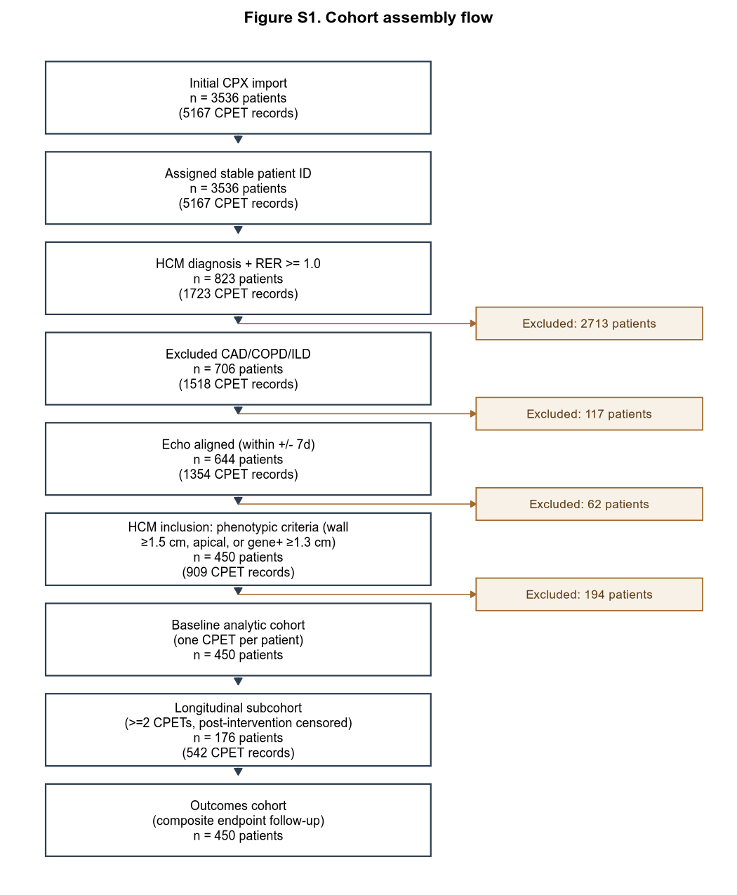

**Figure S1.** CONSORT-style cohort assembly flow. Each box reports the
number of patients (and where applicable, CPET records) remaining after
the corresponding inclusion or exclusion step. Right-hand boxes report
the number of patients excluded at each step.

## Figure S2: Analytic causal model (DAG)

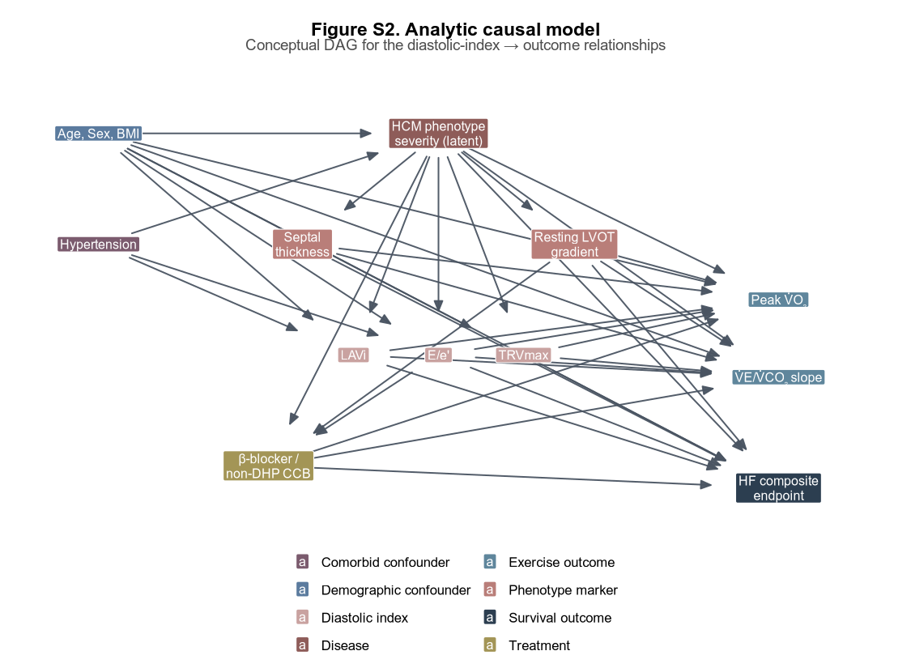

**Figure S2.** Conceptual DAG underlying the adjustment-set choices in
this analysis. The latent HCM-phenotype severity node is the common
cause of all observed diastolic markers, structural markers, and
medication use; this is what makes over-adjustment a risk when sibling
indicators (e.g., septal thickness + LAVi) are entered together as
covariates. Adjustment sets per figure: **Figure 3** (cross-sectional) —
age, sex, BMI, septal thickness, LVOT, β-blocker, non-DHP CCB,
hypertension; **Figure 4** (trajectories) — age, sex, BMI (core); +
medications (sensitivity); **Figure 5** (Cox) — age, sex, BMI,
β-blocker, non-DHP CCB. Figure S3 empirically audits these edges; Figure
S4 estimates the latent severity construct from the observed indicators.

## Table S_DAG: Empirical edge audit of the Figure S2 DAG

``` r
# ── DAG edge audit ────────────────────────────────────────────────────────────
# falsification check on Fig S2: for each assumed edge src->tgt, regress tgt ~ src
# conditioning on that edge's parents; report if the partial assoc survives.
# edge_list = (source, target, condition_on) triples mirroring the drawn DAG
audit_df <- baseline_df %>%
  transmute(
    ID,
    age = as_num(age), Sex = factor(Sex, levels = c("Male", "Female")),
    BMI = as_num(BMI),
    htn_pre_test = as_num(htn_pre_test),
    bb_any = as_num(bb_any), ndhp_ccb_any = as_num(ndhp_ccb_any),
    lv_septal_thickness = as_num(lv_septal_thickness),
    lvot_max_gradient   = as_num(lvot_max_gradient),
    la_vol_index = as_num(la_vol_index),
    e_e_ave      = as_num(e_e_ave),
    tr_max_vel   = as_num(tr_max_vel),
    VO2_FRIEND2_PP = as_num(VO2_FRIEND2_PP),
    VeVco2_slope   = as_num(VeVco2_slope),
    hf_composite   = as_num(hf_composite)
  )
demog_parents <- c("age", "Sex", "BMI")
demog_parents_with_htn <- c(demog_parents, "htn_pre_test")

edge_list <- tibble::tribble(
  ~source,                ~target,                ~condition_on,
  # Demographics -> diastolic indices and phenotype markers
  "age",                  "lv_septal_thickness",  list(c("Sex", "BMI")),
  "Sex",                  "lv_septal_thickness",  list(c("age", "BMI")),
  "BMI",                  "lv_septal_thickness",  list(c("age", "Sex")),
  "age",                  "lvot_max_gradient",    list(c("Sex", "BMI")),
  "Sex",                  "lvot_max_gradient",    list(c("age", "BMI")),
  "BMI",                  "lvot_max_gradient",    list(c("age", "Sex")),
  "age",                  "la_vol_index",         list(c("Sex", "BMI", "htn_pre_test")),
  "Sex",                  "la_vol_index",         list(c("age", "BMI", "htn_pre_test")),
  "BMI",                  "la_vol_index",         list(c("age", "Sex", "htn_pre_test")),
  "htn_pre_test",         "la_vol_index",         list(demog_parents),
  "age",                  "e_e_ave",              list(c("Sex", "BMI", "htn_pre_test")),
  "Sex",                  "e_e_ave",              list(c("age", "BMI", "htn_pre_test")),
  "BMI",                  "e_e_ave",              list(c("age", "Sex", "htn_pre_test")),
  "htn_pre_test",         "e_e_ave",              list(demog_parents),
  "age",                  "tr_max_vel",           list(c("Sex", "BMI")),
  "Sex",                  "tr_max_vel",           list(c("age", "BMI")),
  "BMI",                  "tr_max_vel",           list(c("age", "Sex")),
  # Phenotype markers + diastolic indices -> exercise outcomes
  "lv_septal_thickness",  "VO2_FRIEND2_PP",       list(demog_parents),
  "lvot_max_gradient",    "VO2_FRIEND2_PP",       list(demog_parents),
  "la_vol_index",         "VO2_FRIEND2_PP",       list(demog_parents),
  "e_e_ave",              "VO2_FRIEND2_PP",       list(demog_parents),
  "tr_max_vel",           "VO2_FRIEND2_PP",       list(demog_parents),
  "lv_septal_thickness",  "VeVco2_slope",         list(demog_parents),
  "lvot_max_gradient",    "VeVco2_slope",         list(demog_parents),
  "la_vol_index",         "VeVco2_slope",         list(demog_parents),
  "e_e_ave",              "VeVco2_slope",         list(demog_parents),
  "tr_max_vel",           "VeVco2_slope",         list(demog_parents),
  # Phenotype markers + diastolic indices -> HF outcome
  "lv_septal_thickness",  "hf_composite",         list(demog_parents),
  "lvot_max_gradient",    "hf_composite",         list(demog_parents),
  "la_vol_index",         "hf_composite",         list(demog_parents),
  "e_e_ave",              "hf_composite",         list(demog_parents),
  "tr_max_vel",           "hf_composite",         list(demog_parents),
  # Diastolic indices -> medication
  "la_vol_index",         "bb_any",               list(demog_parents),
  "e_e_ave",              "bb_any",               list(demog_parents),
  "tr_max_vel",           "bb_any",               list(demog_parents),
  "lvot_max_gradient",    "bb_any",               list(demog_parents),
  "la_vol_index",         "ndhp_ccb_any",         list(demog_parents),
  "e_e_ave",              "ndhp_ccb_any",         list(demog_parents),
  "tr_max_vel",           "ndhp_ccb_any",         list(demog_parents),
  "lvot_max_gradient",    "ndhp_ccb_any",         list(demog_parents),
  # Medication -> outcomes
  "bb_any",               "VO2_FRIEND2_PP",       list(demog_parents),
  "ndhp_ccb_any",         "VO2_FRIEND2_PP",       list(demog_parents),
  "bb_any",               "VeVco2_slope",         list(demog_parents),
  "ndhp_ccb_any",         "VeVco2_slope",         list(demog_parents),
  "bb_any",               "hf_composite",         list(demog_parents),
  "ndhp_ccb_any",         "hf_composite",         list(demog_parents)
)

# Pretty-name lookup for the table
pretty_name <- c(
  age = "Age", Sex = "Sex (Female)", BMI = "BMI",
  htn_pre_test = "Hypertension",
  bb_any = "β-blocker use", ndhp_ccb_any = "Non-DHP CCB use",
  lv_septal_thickness = "Septal thickness",
  lvot_max_gradient = "Resting LVOT gradient",
  la_vol_index = "LAVi", e_e_ave = "E/e'", tr_max_vel = "TRVmax",
  VO2_FRIEND2_PP = "Peak V̇O₂", VeVco2_slope = "V̇E/V̇CO₂ slope",
  hf_composite = "HF composite endpoint"
)

# Per-edge fit: regress target on (source + condition_on); report the partial coefficient for source. Uses pairwise complete-case (only the variables in the model), which preserves sample size and isolates the specific source→target dependence beyond the conditioning set.
fit_audit_edge <- function(source, target, condition_on, data) {
  vars <- unique(c(source, condition_on, target))
  df_t <- data %>% filter(if_all(all_of(vars), ~ !is.na(.)))
  if (nrow(df_t) < 30) return(NULL)
  rhs <- paste(c(source, condition_on), collapse = " + ")
  is_binary_target <- target %in% c("bb_any", "ndhp_ccb_any", "hf_composite")
  if (is_binary_target) {
    fit <- glm(as.formula(paste0(target, " ~ ", rhs)), family = binomial(),
               data = df_t)
    tab <- broom::tidy(fit, exponentiate = TRUE, conf.int = TRUE)
    eff_prefix <- "OR"
  } else {
    fit <- lm(as.formula(paste0(target, " ~ ", rhs)), data = df_t)
    tab <- broom::tidy(fit, conf.int = TRUE)
    eff_prefix <- "β"
  }
  source_term <- if (source == "Sex") "SexFemale" else source
  src_row <- tab %>% filter(term == source_term)
  if (!nrow(src_row)) return(NULL)
  tibble(
    Target       = unname(pretty_name[target]),
    Source       = unname(pretty_name[source]),
    `Conditioned on` = paste(unname(pretty_name[condition_on]), collapse = ", "),
    N            = nrow(df_t),
    Effect       = sprintf("%s %.2f (%.2f–%.2f)", eff_prefix,
                           src_row$estimate, src_row$conf.low, src_row$conf.high),
    p            = src_row$p.value
  )
}

audit_rows <- purrr::pmap_dfr(
  edge_list,
  function(source, target, condition_on)
    fit_audit_edge(source, target, condition_on[[1]], audit_df)
)

audit_rows <- audit_rows %>%
  mutate(`P value` = ifelse(p < 0.001, "<0.001", sprintf("%.3f", p)),
         Supported = ifelse(p < 0.05, "Yes", "No"),
         p_num     = p) %>%
  select(Target, Source, `Conditioned on`, N, Effect, `P value`, Supported, p_num)

write.csv(audit_rows %>% select(-p_num),
          "../2_Output/TableS_DAG_Edge_Audit.csv", row.names = FALSE)

if (!is_gfm_output) {
  audit_ft <- flextable(audit_rows %>% select(-p_num)) %>%
    set_table_properties(layout = "autofit") %>%
    fontsize(size = 8, part = "all") %>%
    font(fontname = "Times New Roman", part = "all") %>%
    bold(part = "header") %>%
    bg(i = ~ Supported == "Yes", j = "Supported", bg = "#E8F4EA") %>%
    bg(i = ~ Supported == "No",  j = "Supported", bg = "#F4EAEA") %>%
    align(j = c("N", "P value", "Supported"), align = "center", part = "all") %>%
    merge_v(j = "Target")
  cat(knitr::knit_print(audit_ft))
}

n_total     <- nrow(audit_rows)
n_supported <- sum(audit_rows$Supported == "Yes", na.rm = TRUE)
cat(sprintf("\n\n**Audit summary:** of %d testable edges in the Figure S2 DAG, %d (%.0f%%) ",
            n_total, n_supported, 100 * n_supported / n_total))
```

**Audit summary:** of 46 testable edges in the Figure S2 DAG, 10 (22%)

``` r
cat("show statistically significant conditional dependence (P < 0.05) ",
    "controlling for the target node's other assumed parents.\n")
```

show statistically significant conditional dependence (P \< 0.05)
controlling for the target node’s other assumed parents.

**Table S_DAG.** Per-edge empirical audit of the Figure S2 DAG. For each
measured edge A → B, B is regressed on A + demographic parents of B
(age, sex, BMI, ± hypertension); the partial effect of A is reported. β
for continuous targets, OR for binary. “Supported” = P \< 0.05 after
demographic adjustment. Pairwise complete-case; N varies by edge. The
audit tests conditional dependence, not causal direction. Latent-node
edges are excluded.

## Figure S3: Empiric Bayesian network (data-validated DAG)

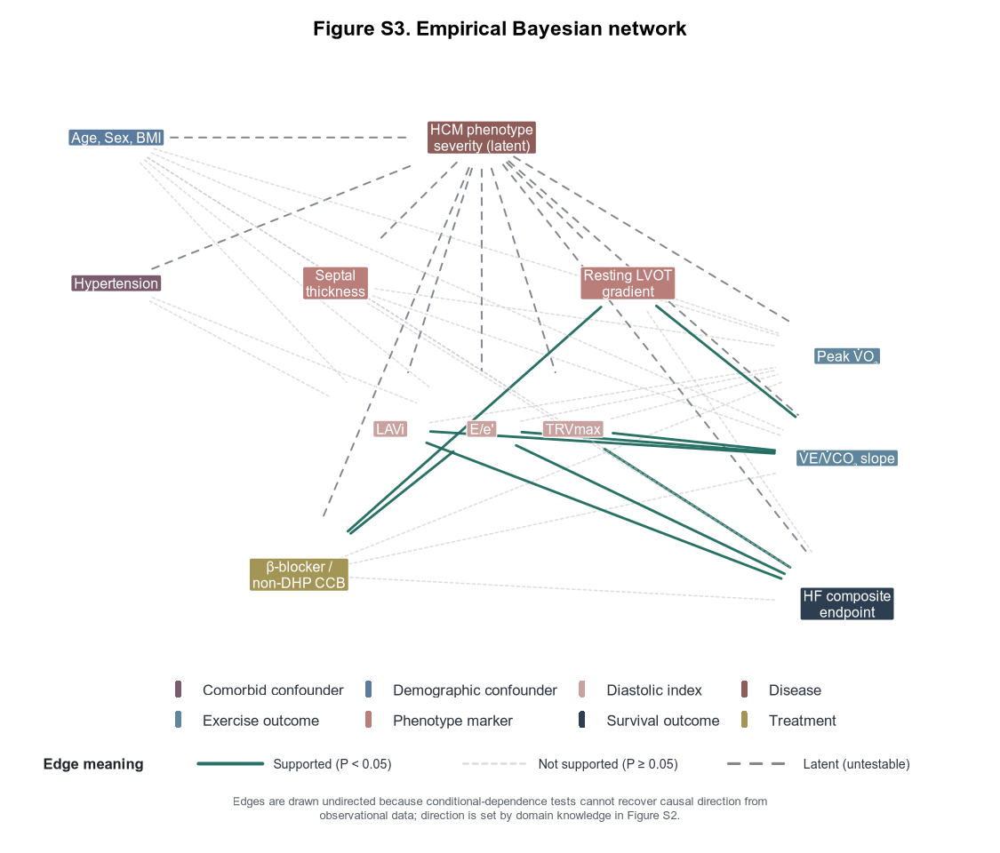

**Figure S3.** Empirical Bayesian network. Same nodes and topology as
Figure S2, edges undirected (observational dependence cannot recover
direction). Edge style encodes the Table S_DAG audit: solid teal = P \<
0.05, dashed grey = P ≥ 0.05, dotted grey = involves the latent node and
is untestable.

<!-- ====================================================================== -->

<!-- ====================================================================== -->

<!-- The remaining analysis sections source the proven code from the        -->

<!-- existing README_HCM.Diastologyv2.qmd. Each section below runs the     -->

<!-- exact same analysis pipeline, organized by manuscript figure.          -->

<!-- ====================================================================== -->

<!-- ====================================================================== -->

<!-- SECTION 2: FIGURE 1 - COHORT VALIDATION & MATCHED COMPARISON          -->

<!-- ====================================================================== -->

# Figure 1: Cohort Validation and Matched Comparison

This figure validates the HCM cohort phenotype by comparing age-, sex-,
and BMI-matched controls (CON) to non-obstructive HCM and obstructive
HCM (LVOT gradient ≥30 mm Hg) across six LVDD parameters. Patients with
a confirmed pathogenic variant + wall thickness ≥ 1.3 cm are also
classified as HCM (per AHA/ACC criteria). G+/P- carriers are excluded
from this analysis, which were actually very few (~20 something).

We identified 1:1 controls using nearest-neighbor propensity-score
matching (`MatchIt::matchit`, `method="nearest"`, `distance="glm"`) on
age, sex, and BMI, with a caliper of 0.2 SD on the linear propensity
score and no replacement. Balance is assessed by standardized mean
differences (SMDs) before and after matching; an SMD threshold of 0.10
is used to confirm adequate balance (`Matching_SMD_Balance.csv`). The
six parameters compared (E/e′, LAVi, LV septal thickness, maximum LVOT
gradient, pulmonary vein S/D ratio, and septal e′) span both ASE primary
and supportive diastolic indices. Obstructive HCM is defined by
**resting** LVOT gradient ≥ 30 mm Hg (provocative gradients were not
uniformly available).

``` r
# ── ASE diastolic grading + filling-pressure class ────────────────────────────
# 3 primary indices vs ASE cutoffs (E/e'>14, LAVi>34, TRV>280) -> combo code/class.
# fp elevated if: >=2 primary abnl, OR 1 primary + >=1 supportive, OR (<=1 primary
# measured) + >=2 supportive (restrictive E/A, short DT, low PV S/D)
baseline_df <- baseline_df %>%
  mutate(
    pv_sd_ratio = ifelse(
      !is.na(pulm_sys_vel) & !is.na(pulm_dias_vel) & pulm_dias_vel > 0,
      pulm_sys_vel / pulm_dias_vel, NA_real_
    ),
    abn_ee   = !is.na(e_e_ave)       & e_e_ave > 14,
    abn_lavi = !is.na(la_vol_index)  & la_vol_index > 34,
    abn_trv  = !is.na(tr_max_vel)    & tr_max_vel > 280,
    n_primary_available = (!is.na(e_e_ave)) + (!is.na(la_vol_index)) + (!is.na(tr_max_vel)),
    n_primary_abnormal  = abn_ee + abn_lavi + abn_trv,
    hcm_combo_code = case_when(
      n_primary_available >= 1 ~ paste0(as.integer(abn_ee), as.integer(abn_lavi), as.integer(abn_trv)),
      TRUE ~ NA_character_
    ),
    hcm_combo_class = case_when(
      hcm_combo_code == "000" ~ "None abnormal",
      hcm_combo_code == "100" ~ "E/e' only",
      hcm_combo_code == "010" ~ "LAVi only",
      hcm_combo_code == "001" ~ "TRVmax only",
      hcm_combo_code == "110" ~ "E/e' + LAVi",
      hcm_combo_code == "101" ~ "E/e' + TRVmax",
      hcm_combo_code == "011" ~ "LAVi + TRVmax",
      hcm_combo_code == "111" ~ "All 3 abnormal",
      TRUE ~ NA_character_
    ),
    hcm_combo_class = factor(
      hcm_combo_class,
      levels = c("None abnormal", "E/e' only", "LAVi only", "TRVmax only",
                 "E/e' + LAVi", "E/e' + TRVmax", "LAVi + TRVmax", "All 3 abnormal")
    ),
    hcm_combo_n_abnormal = ifelse(n_primary_available >= 1, n_primary_abnormal, NA_integer_),
    hcm_combo_abnormal_group = factor(
      hcm_combo_n_abnormal, levels = 0:3, labels = c("0", "1", "2", "3")
    ),
    restrictive_pattern = !is.na(mv_e_a) & mv_e_a >= 2,
    short_dt            = !is.na(mv_dec_time) & mv_dec_time < 150,
    low_pv_sd           = !is.na(pv_sd_ratio) & pv_sd_ratio < 1,
    n_supportive_elevated = restrictive_pattern + short_dt + low_pv_sd,
    elevated_by_primary = n_primary_abnormal >= 2,
    elevated_by_mixed = n_primary_abnormal == 1 & n_supportive_elevated >= 1,
    elevated_by_supportive_only = n_primary_available <= 1 & n_supportive_elevated >= 2,
    fp_class = case_when(
      elevated_by_primary         ~ "Elevated",
      elevated_by_mixed           ~ "Elevated",
      elevated_by_supportive_only ~ "Elevated",
      TRUE                        ~ "Not Elevated"
    ),
    fp_class = factor(fp_class, levels = c("Not Elevated", "Elevated"))
  )

long_df <- long_df %>%
  left_join(baseline_df %>% select(ID, fp_class), by = "ID")
```

## Figure 1: Controls

## Figure 1: Export

``` r
# ── Fig 1: CON vs nonobstructive vs obstructive HCM across 6 LVDD params ───────
# assemble plot df, then build/save the multi-panel comparison figure
validation_df <- case_control_hist_df %>%
  transmute(
    Cohort,
    lv_max_wall_thickness = as_num(lv_max_wall_thickness),
    lv_septal_thickness = as_num(lv_septal_thickness),
    lvot_max_gradient = as_num(lvot_max_gradient),
    la_vol_index = as_num(la_vol_index),
    ef_modsp4 = as_num(ef_modsp4),
    avg_eprime_age_cal = as_num(avg_eprime_age_cal)
  ) %>%
  mutate(Cohort = factor(Cohort, levels = c("CON", "HCM", "Obstructive HCM")))

# Draw order: Obstructive HCM first (behind), then HCM, then CON on top
cohort_draw_order <- c("Obstructive HCM", "HCM", "CON")

cohort_fill_palette <- c(
  "CON"            = "darkgray",
  "HCM"            = "#C9A2A0",
  "Obstructive HCM" = "#8BAFC4"
)

format_pairwise_p_label <- function(p) {
  ifelse(is.na(p), "", ifelse(p < 0.001, "P<0.001", sprintf("P=%.3f", p)))
}

make_hcm_pairwise_brackets <- function(plot_df, var, x_limits = NULL) {
  bracket_pairs <- tibble::tribble(
    ~group1, ~group2,
    "CON", "HCM",
    "CON", "Obstructive HCM"
  )

  p_values <- bracket_pairs %>%
    rowwise() %>%
    mutate(
      p_raw = {
        pair_df <- plot_df %>%
          filter(Cohort %in% c(group1, group2), is.finite(.data[[var]]))
        pair_counts <- table(droplevels(pair_df$Cohort))
        if (n_distinct(droplevels(pair_df$Cohort)) < 2 || min(pair_counts) < 2) {
          NA_real_
        } else {
          suppressWarnings(wilcox.test(pair_df[[var]] ~ pair_df$Cohort, exact = FALSE)$p.value)
        }
      }
    ) %>%
    ungroup() %>%
    mutate(p_adj = p.adjust(p_raw, method = "holm"))

  x_range <- if (!is.null(x_limits)) x_limits else range(plot_df[[var]], na.rm = TRUE)
  x_span <- diff(x_range)
  if (!is.finite(x_span) || x_span <= 0) return(tibble())

  p_values %>%
    mutate(
      y1 = as.numeric(factor(group1, levels = c("CON", "HCM", "Obstructive HCM"))),
      y2 = as.numeric(factor(group2, levels = c("CON", "HCM", "Obstructive HCM"))),
      x = x_range[2] - c(0.045, 0.115) * x_span,
      tick = 0.018 * x_span,
      label_x = x + 0.016 * x_span,
      label_y = (y1 + y2) / 2,
      label = format_pairwise_p_label(p_adj)
    ) %>%
    filter(label != "")
}

# Primary Figure 1 panel: jittered strip plot with median/IQR crossbar
make_hcm_validation_scatter <- function(df, var, title, y_label, ref = NULL,
                                        show_y = TRUE, show_legend = FALSE,
                                        y_limits = NULL, y_breaks = waiver(),
                                        size_scale = 1) {
  plot_df <- df %>%
    filter(is.finite(.data[[var]]), !is.na(Cohort)) %>%
    mutate(Cohort = factor(Cohort, levels = c("CON", "HCM", "Obstructive HCM")))
  if (!is.null(y_limits)) {
    plot_df <- plot_df %>% filter(.data[[var]] >= y_limits[1], .data[[var]] <= y_limits[2])
  }

  p <- ggplot(plot_df, aes(x = Cohort, y = .data[[var]], color = Cohort)) +
    geom_jitter(width = 0.22, alpha = 0.18, size = 0.5, shape = 16, na.rm = TRUE) +
    stat_summary(
      fun.data = function(x) {
        q <- quantile(x, c(0.25, 0.5, 0.75), na.rm = TRUE)
        data.frame(ymin = q[1], y = q[2], ymax = q[3])
      },
      geom = "crossbar", width = 0.44, linewidth = 0.5, color = "black", fill = NA
    ) +
    {if (!is.null(ref)) geom_hline(yintercept = ref, linetype = "22", color = "#B05D57", linewidth = 0.42)} +
    scale_color_manual(
      values = cohort_fill_palette, breaks = c("CON", "HCM", "Obstructive HCM"), drop = FALSE,
      guide = if (show_legend) guide_legend(
        override.aes = list(alpha = 0.7, size = 2),
        keywidth = unit(7 * size_scale, "pt"), keyheight = unit(5 * size_scale, "pt")
      ) else "none"
    ) +
    scale_y_continuous(limits = y_limits, breaks = y_breaks, expand = expansion(mult = c(0.03, 0.05))) +
    labs(title = title, y = if (show_y) y_label else NULL, x = NULL) +
    theme_jacc(base_size = 8.5 * size_scale) +
    theme(
      plot.title = element_text(face = "bold", hjust = 0.5, size = 7.7 * size_scale, margin = margin(b = 2 * size_scale)),
      axis.title.y = element_text(face = "plain", size = 6.9 * size_scale),
      axis.text.x = element_text(size = 6.6 * size_scale, color = "#2D3440", angle = 25, hjust = 1),
      axis.text.y = element_text(size = 6.6 * size_scale, color = "#2D3440"),
      axis.line = element_line(color = "#3E4650", linewidth = 0.3),
      axis.ticks = element_line(color = "#3E4650", linewidth = 0.25),
      plot.margin = margin(2 * size_scale, 4 * size_scale, 4 * size_scale, 4 * size_scale),
      legend.position = if (show_legend) c(0.96, 0.93) else "none",
      legend.justification = c(1, 1),
      legend.direction = "vertical",
      legend.title = element_blank(),
      legend.text = element_text(size = 5.0 * size_scale, color = "#2D3440"),
      legend.background = element_rect(fill = alpha("white", 0.94), color = "#B9C2CA", linewidth = 0.25),
      legend.margin = margin(1 * size_scale, 2 * size_scale, 1 * size_scale, 2 * size_scale),
      legend.key = element_rect(fill = alpha("white", 0), color = NA)
    )

  if (!show_y) {
    p <- p + theme(
      axis.title.y = element_blank(), axis.text.y = element_blank(), axis.ticks.y = element_blank()
    )
  }
  p
}

# Validation panel: density curves with horizontal boxplots and individual observations
# per_cohort_xlims: named list of c(lo, hi) per cohort for group-specific range truncation
make_hcm_validation_density <- function(df, var, title, x_label, ref = NULL, bins = 20,
                                        show_y = FALSE, x_limits = NULL, x_breaks = waiver(),
                                        show_legend = FALSE, per_cohort_xlims = NULL,
                                        show_brackets = FALSE,
                                        size_scale = 1) {
  plot_df <- df %>% filter(is.finite(.data[[var]]), !is.na(Cohort)) %>%
    mutate(
      Cohort = factor(Cohort, levels = c("CON", "HCM", "Obstructive HCM")),
      Cohort_y = as.numeric(Cohort),
      Cohort_draw = factor(Cohort, levels = cohort_draw_order)
    )

  if (!is.null(per_cohort_xlims)) {
    plot_df <- plot_df %>%
      group_by(Cohort_draw) %>%
      filter({
        lims <- per_cohort_xlims[[as.character(Cohort_draw[1])]]
        if (is.null(lims)) rep(TRUE, n())
        else .data[[var]] >= lims[1] & .data[[var]] <= lims[2]
      }) %>%
      ungroup()
  } else if (!is.null(x_limits)) {
    plot_df <- plot_df %>% filter(.data[[var]] >= x_limits[1], .data[[var]] <= x_limits[2])
  }

  bracket_df <- if (show_brackets) {
    make_hcm_pairwise_brackets(plot_df, var, x_limits = x_limits)
  } else {
    tibble(x = numeric(), xend = numeric(), y1 = numeric(), y2 = numeric(),
           tick = numeric(), label_x = numeric(), label_y = numeric(), label = character())
  }

  p_box <- ggplot(plot_df, aes(x = .data[[var]], y = Cohort_y, group = Cohort, color = Cohort_draw, fill = Cohort_draw)) +
    geom_boxplot(
      width = 0.48, outlier.shape = NA, alpha = 0.18, linewidth = 0.32 * size_scale, orientation = "y",
      na.rm = TRUE
    ) +
    geom_point(
      position = position_jitter(width = 0, height = 0.10),
      size = 0.52 * size_scale, alpha = 0.34, stroke = 0, na.rm = TRUE
    ) +
    geom_segment(
      data = bracket_df,
      aes(x = x, xend = x, y = y1, yend = y2),
      inherit.aes = FALSE, color = "#2D3440", linewidth = 0.24 * size_scale
    ) +
    geom_segment(
      data = bracket_df,
      aes(x = x - tick, xend = x, y = y1, yend = y1),
      inherit.aes = FALSE, color = "#2D3440", linewidth = 0.24 * size_scale
    ) +
    geom_segment(
      data = bracket_df,
      aes(x = x - tick, xend = x, y = y2, yend = y2),
      inherit.aes = FALSE, color = "#2D3440", linewidth = 0.24 * size_scale
    ) +
    geom_text(
      data = bracket_df,
      aes(x = label_x, y = label_y, label = label),
      inherit.aes = FALSE, angle = 90, hjust = 0.5, vjust = 0.5,
      size = 1.85 * size_scale, color = "#2D3440", family = "Arial"
    ) +
    {if (!is.null(ref)) geom_vline(xintercept = ref, linetype = "22", color = "#B05D57", linewidth = 0.42)} +
    labs(title = title, x = NULL, y = NULL) +
    scale_color_manual(values = cohort_fill_palette, breaks = c("CON", "HCM", "Obstructive HCM"), drop = FALSE, guide = "none") +
    scale_fill_manual(
      values = cohort_fill_palette, breaks = c("CON", "HCM", "Obstructive HCM"), drop = FALSE, guide = "none"
    ) +
    scale_x_continuous(limits = x_limits, breaks = x_breaks, expand = expansion(mult = c(0.01, 0.02))) +
    scale_y_continuous(
      breaks = c(1, 2, 3),
      labels = c("CON", "HCM", "Obstructive HCM"),
      limits = c(0.55, 3.45),
      expand = expansion(mult = c(0.02, 0.02))
    ) +
    theme_jacc(base_size = 8.5 * size_scale) +
    theme(
      plot.title = element_text(face = "bold", hjust = 0.5, size = 7.7 * size_scale, margin = margin(b = 1.5 * size_scale)),
      axis.title = element_blank(),
      axis.text.x = element_blank(),
      axis.ticks.x = element_blank(),
      axis.text.y = element_text(size = 5.2 * size_scale, color = "#2D3440"),
      axis.ticks.y = element_blank(),
      axis.line.x = element_blank(),
      axis.line.y = element_blank(),
      panel.grid.major.x = element_blank(),
      panel.grid.major.y = element_blank(),
      panel.grid.minor = element_blank(),
      plot.margin = margin(2 * size_scale, 4 * size_scale, 0, 4 * size_scale),
      legend.position = "none"
    ) +
    coord_cartesian(clip = "off")

  p_density <- ggplot(plot_df, aes(x = .data[[var]], group = Cohort_draw)) +
    geom_density(
      aes(fill = Cohort_draw, color = Cohort_draw),
      alpha = 0.20, linewidth = 0.52 * size_scale, adjust = 1.1, na.rm = TRUE
    ) +
    {if (!is.null(ref)) geom_vline(xintercept = ref, linetype = "22", color = "#B05D57", linewidth = 0.42)} +
    labs(x = x_label, y = if (show_y) "Density" else NULL) +
    scale_fill_manual(
      values = cohort_fill_palette, breaks = c("CON", "HCM", "Obstructive HCM"), drop = FALSE,
      guide = "none" 
    ) +
    scale_color_manual(
      values = cohort_fill_palette, breaks = c("CON", "HCM", "Obstructive HCM"), drop = FALSE,
      guide = guide_legend(
        override.aes = list(alpha = 0.95, fill = NA, linewidth = 0.8),
        keywidth = unit(9 * size_scale, "pt"), keyheight = unit(5 * size_scale, "pt")
      )
    ) +
    scale_x_continuous(limits = x_limits, breaks = x_breaks, expand = expansion(mult = c(0.01, 0.02))) +
    theme_jacc(base_size = 8.5 * size_scale) +
    theme(
      plot.title = element_blank(),
      axis.title.x = element_text(face = "plain", size = 6.9 * size_scale, margin = margin(t = 2 * size_scale)),
      axis.title.y = element_text(face = "plain", size = 6.9 * size_scale),
      axis.text = element_text(size = 6.6 * size_scale, color = "#2D3440"),
      axis.line = element_line(color = "#3E4650", linewidth = 0.3),
      axis.ticks = element_line(color = "#3E4650", linewidth = 0.25),
      plot.margin = margin(2 * size_scale, 4 * size_scale, 2 * size_scale, 4 * size_scale),
      legend.position = if (show_legend) c(0.96, 0.93) else "none",
      legend.justification = c(1, 1),
      legend.direction = "vertical",
      legend.title = element_blank(),
      legend.text = element_text(size = 5.0 * size_scale, color = "#2D3440"),
      legend.background = element_rect(fill = alpha("white", 0.94), color = "#B9C2CA", linewidth = 0.25),
      legend.margin = margin(1 * size_scale, 2 * size_scale, 1 * size_scale, 2 * size_scale),
      legend.key = element_rect(fill = alpha("white", 0), color = NA)
    )

  if (!show_y) {
    p_density <- p_density + theme(
      axis.title.y = element_blank(), axis.text.y = element_blank(), axis.ticks.y = element_blank()
    )
  }

  composite <- p_box / p_density + plot_layout(heights = c(0.46, 1))
  wrap_elements(full = patchwork::patchworkGrob(composite))
}

# Backward-compat alias (function was previously called make_hcm_validation_hist)
make_hcm_validation_hist <- make_hcm_validation_density

p_validate_row <- (
  make_hcm_validation_hist(validation_df, "lv_max_wall_thickness", "Max Wall Thickness", "cm",
                           show_y = TRUE, x_limits = c(0, 3), x_breaks = c(0, 1, 2, 3),
                           show_brackets = FALSE) |
  make_hcm_validation_hist(validation_df, "lv_septal_thickness", "IVSd", "cm",
                           x_limits = c(0, 3), x_breaks = c(0, 1, 2, 3),
                           show_brackets = FALSE) |
  make_hcm_validation_hist(validation_df, "avg_eprime_age_cal", "Age-calibrated e'",
                           "Observed - age-expected (cm/s)", show_legend = TRUE,
                           show_brackets = FALSE)
) / (
  make_hcm_validation_hist(validation_df, "lvot_max_gradient", "Resting LVOT Gradient", "mm Hg",
                           show_y = TRUE, x_limits = c(0, 150), x_breaks = c(0, 50, 100, 150),
                           show_brackets = FALSE) |
  make_hcm_validation_hist(validation_df, "la_vol_index", "LAVi", "mL/m²",
                           x_limits = c(0, 75), x_breaks = c(0, 25, 50, 75), show_y = TRUE,
                           show_brackets = FALSE) |
  make_hcm_validation_hist(validation_df, "ef_modsp4", "LVEF", "%",
                           x_limits = c(40, 85), x_breaks = c(40, 50, 60, 70, 80),
                           show_brackets = FALSE)
) +
  plot_layout(heights = c(1, 1), widths = c(1, 1, 1)) +
  plot_annotation(tag_levels = "A", tag_prefix = "(", tag_suffix = ")") &
  theme(plot.tag = element_text(face = "bold", size = 11))

figure1_export_width  <- 7.2
figure1_export_height <- 4.8
figure1_legend_fontsize <- 9

show_and_save_jacc(
  p_validate_row,
  "../2_Output/Figure1_MatchedControls_and_BaselineCharacteristics.pdf",
  w = figure1_export_width,
  h = figure1_export_height
)
```

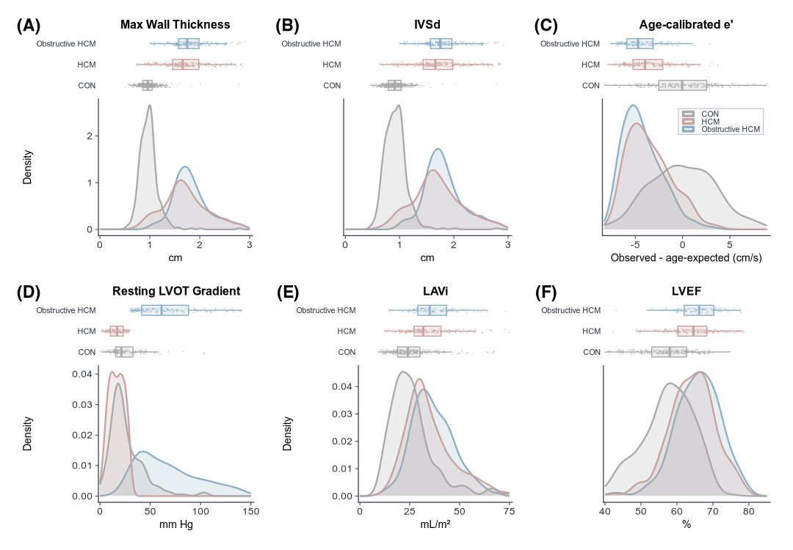

``` r
save_jacc(
  p_validate_row,
  "../Manuscript/Figures/Figure1_MatchedControls_and_BaselineCharacteristics_Preprint.pdf",
  w = figure1_export_width,
  h = figure1_export_height
)
save_jacc(
  p_validate_row,
  "../2_Output/Figure1_MatchedControls_and_BaselineCharacteristics_Preprint.pdf",
  w = figure1_export_width,
  h = figure1_export_height
)

legend_fig1_pdf <- paste0(
  "**Figure 1. Matched Cohort Validation.** ",
  "Age-, sex-, and BMI-matched controls (CON; gray), non-obstructive HCM (rose), and obstructive HCM ",
  "(LVOT gradient \u226530 mm Hg; steel blue) are compared across six echocardiographic parameters. ",
  "Each panel shows kernel density curves with a horizontally oriented boxplot and individual patient values. ",
  "**(A)** Maximum wall thickness. ",
  "**(B)** Interventricular septal thickness in diastole (IVSd). ",
  "**(C)** Age-calibrated average e\u2019. ",
  "**(D)** Left ventricular outflow tract (LVOT) gradient. ",
  "**(E)** Left atrial volume index (LAVi). ",
  "**(F)** Left ventricular ejection fraction (LVEF)."
)

save_jacc_with_embedded_legend(
  p_validate_row,
  "../Manuscript/Figures/Figure1_MatchedControls_and_BaselineCharacteristics.pdf",
  legend_text = legend_fig1_pdf,
  w = figure1_export_width,
  h = figure1_export_height,
  legend_fontsize = figure1_legend_fontsize
)
save_jacc_with_embedded_legend(
  p_validate_row,
  "../2_Output/Figure1_MatchedControls_and_BaselineCharacteristics.pdf",
  legend_text = legend_fig1_pdf,
  w = figure1_export_width,
  h = figure1_export_height,
  legend_fontsize = figure1_legend_fontsize
)

cat(sprintf("\n::: {.manuscript-check}\n**Figure 1 Validation**\n\n"))
```

<div class="manuscript-check">

**Figure 1 Validation**

``` r
cat(sprintf("- Matched HCM: **%d**, CON: **%d**", matched_hcm_n, matched_nonhcm_n))
```

- Matched HCM: **409**, CON: **409**

``` r
if (matched_hcm_n == 583 && matched_nonhcm_n == 583) cat(" (matches manuscript)\n") else cat(sprintf(" (manuscript: 583/583)\n"))
```

(manuscript: 583/583)

``` r
cat(sprintf("- HCM normal diastology: **%d**, abnormal: **%d**\n", hcm_normal_n, hcm_abnormal_n))
```

- HCM normal diastology: **208**, abnormal: **201**

``` r
cat(sprintf("- Obstructive HCM (LVOT ≥30 mm Hg): **%d**\n", n_hcm_obstructive))
```

- Obstructive HCM (LVOT ≥30 mm Hg): **168**

``` r
cat(sprintf("- Non-obstructive HCM: **%d**\n", n_hcm_nonobstructive))
```

- Non-obstructive HCM: **241**

``` r
cat(":::\n")
```

</div>

## Density

## Figure 1: Abstract Figure

``` r
# Kruskal-Wallis test: age-calibrated average e' across Non-HCM / Carrier / HCM groups
eprime_kw_df <- validation_df %>%
  filter(!is.na(avg_eprime_age_cal), !is.na(Cohort)) %>%
  mutate(Cohort = factor(Cohort, levels = c("CON", "HCM", "Obstructive HCM")))

eprime_kw <- kruskal.test(avg_eprime_age_cal ~ Cohort, data = eprime_kw_df)
p_eprime_kw <- eprime_kw$p.value
p_eprime_kw_fmt <- format_p_scientific(p_eprime_kw)

# Dunn post-hoc pairwise comparisons (Bonferroni-adjusted)
if (requireNamespace("dunn.test", quietly = TRUE)) {
  dunn_res <- dunn.test::dunn.test(
    eprime_kw_df$avg_eprime_age_cal,
    eprime_kw_df$Cohort,
    method = "bonferroni", kw = FALSE, label = TRUE, wrap = FALSE, table = FALSE
  )
  dunn_tbl <- tibble(
    comparison = dunn_res$comparisons,
    p_adj      = dunn_res$P.adjusted
  ) %>%
    mutate(p_fmt = format_p_scientific(p_adj))
} else {
  dunn_tbl <- NULL
}

cat("\n::: {.manuscript-check}\n**Age-calibrated e′ Group Comparison (Figure 1 Panel C)**\n\n")
```

<div class="manuscript-check">

**Age-calibrated e′ Group Comparison (Figure 1 Panel C)**

``` r
cat(sprintf("- Kruskal-Wallis P = **%s** (3-group overall)\n", p_eprime_kw_fmt))
```

- Kruskal-Wallis P = **3.29 × 10⁻⁴⁰** (3-group overall)

``` r
if (!is.null(dunn_tbl)) {
  for (i in seq_len(nrow(dunn_tbl))) {
    cat(sprintf("- Dunn %s: P~adj~ = **%s**\n", dunn_tbl$comparison[i], dunn_tbl$p_fmt[i]))
  }
}
```

- Dunn CON - HCM: P<sub>adj</sub> = **8.59 × 10⁻²⁶**
- Dunn CON - Obstructive HCM: P<sub>adj</sub> = **2.58 × 10⁻³²**
- Dunn HCM - Obstructive HCM: P<sub>adj</sub> = **1.89 × 10⁻²**

``` r
cat(":::\n")
```

</div>

**Figure 1.** Matched cohort baseline distributions. Age-, sex-, and
BMI-matched controls (CON; gray) versus non-obstructive HCM (rose) and
obstructive HCM (LVOT gradient ≥30 mm Hg; steel blue). Panels show
kernel density estimates with horizontally oriented boxplots and
individual observations for wall thickness, septal thickness,
age-calibrated average e$'$, LVOT gradient, LAVi, and LVEF.

------------------------------------------------------------------------

<!-- ====================================================================== -->

<!-- SECTION 2: FIGURE 2 - DIASTOLIC PHENOTYPES                            -->

<!-- ====================================================================== -->

# Figure 2: HCM Primary-Parameter Phenotypes

To avoid collapsing HCM diastolic physiology into a binary label, we
categorized baseline LVDD according to the observed combination of the 3
HCM-relevant primary parameters available in this dataset: average
E/e$'$ \>14, left atrial volume index (LAVi) \>34 mL/m$^2$, and peak
tricuspid regurgitation velocity (TRV$_{max}$) \>2.8 m/s. These
variables were selected because they correspond to the principal
HCM-related markers highlighted in the 2025 ASE update for special
populations.

``` r
# ── Panel A: UpSet plot of primary parameter combinations ────────────────────
df_combo <- baseline_df %>% filter(!is.na(hcm_combo_class))
combo_palette <- c(
  "0" = "#E5E8EC",
  "1" = alpha("#C9A2A0", 0.72),
  "2" = "#B97E79",
  "3" = "#8E5C59"
)

combo_palette_fig3 <- c(
  "0" = "#CBD3DA",
  "1" = alpha("#C9A2A0", 0.65),
  "2" = "#B97E79",
  "3" = "#8E5C59"
)

combo_levels <- levels(baseline_df$hcm_combo_class)
combo_signature <- tibble(
  hcm_combo_code = c("000", "100", "010", "001", "110", "101", "011", "111"),
  hcm_combo_class = factor(
    c("None abnormal", "E/e' only", "LAVi only", "TRVmax only",
      "E/e' + LAVi", "E/e' + TRVmax", "LAVi + TRVmax", "All 3 abnormal"),
    levels = combo_levels
  )
) %>%
  mutate(
    hcm_combo_abnormal_group = factor(
      stringr::str_count(hcm_combo_code, "1"),
      levels = 0:3,
      labels = names(combo_palette)
    ),
    `E/e'`   = ifelse(substr(hcm_combo_code, 1, 1) == "1", "+", "-"),
    LAVi     = ifelse(substr(hcm_combo_code, 2, 2) == "1", "+", "-"),
    `TRVmax` = ifelse(substr(hcm_combo_code, 3, 3) == "1", "+", "-"),
    x_id = row_number()
  )

signature_long <- combo_signature %>%
  pivot_longer(cols = c(`E/e'`, LAVi, `TRVmax`),
               names_to = "Parameter", values_to = "Status") %>%
  mutate(
    Parameter = factor(Parameter, levels = c("TRVmax", "LAVi", "E/e'")),
    text_col = ifelse(Status == "+", "white", "black")
  )

param_levels <- c("TRVmax", "LAVi", "E/e'")
param_positions <- c("TRVmax" = 1.00, "LAVi" = 1.74, "E/e'" = 2.48)
x_limits_upset <- c(0.5, nrow(combo_signature) + 0.5)

intersection_counts <- combo_signature %>%
  select(x_id, hcm_combo_class, hcm_combo_abnormal_group) %>%
  left_join(df_combo %>% count(hcm_combo_class), by = "hcm_combo_class") %>%
  mutate(n = coalesce(n, 0L))

upset_matrix <- combo_signature %>%
  pivot_longer(cols = c(`E/e'`, LAVi, `TRVmax`),
               names_to = "Parameter", values_to = "Status") %>%
  mutate(
    Parameter = factor(Parameter, levels = param_levels),
    param_id = unname(param_positions[as.character(Parameter)]),
    dot_fill = ifelse(Status == "+", "active", "inactive")
  )

upset_connectors <- upset_matrix %>%
  filter(Status == "+") %>%
  group_by(x_id, hcm_combo_class, hcm_combo_abnormal_group) %>%
  summarize(
    ymin = min(param_id),
    ymax = max(param_id),
    n_active = n(),
    .groups = "drop"
  ) %>%
  filter(n_active >= 2)

p_upset_top <- intersection_counts %>%
  ggplot(aes(x = x_id, y = n, fill = hcm_combo_abnormal_group)) +
  geom_col(width = 0.72, color = "black", linewidth = 0.2) +
  geom_text(aes(label = n), vjust = -0.25, size = 3.1) +
  scale_fill_manual(values = combo_palette, drop = FALSE) +
  scale_x_continuous(limits = x_limits_upset, breaks = combo_signature$x_id, labels = NULL) +
  scale_y_continuous(expand = expansion(mult = c(0, 0.14))) +
  labs(x = NULL, y = "Patients") +
  theme_jacc() +
  theme(legend.position = "none",
        axis.text.x = element_blank(),
        axis.ticks.x = element_blank(),
        plot.margin = margin(0, 6, 4, 4))

p_upset_matrix <- ggplot(upset_matrix, aes(x = x_id, y = param_id)) +
  geom_segment(
    data = upset_connectors,
    aes(x = x_id, xend = x_id, y = ymin, yend = ymax),
    inherit.aes = FALSE,
    linewidth = 0.55,
    color = "black"
  ) +
  geom_point(aes(color = dot_fill), shape = 16, size = 2.5) +
  scale_color_manual(values = c(active = "black", inactive = "grey75"), drop = FALSE) +
  scale_x_continuous(limits = x_limits_upset, breaks = combo_signature$x_id, labels = NULL) +
  scale_y_continuous(
    breaks = unname(param_positions[param_levels]),
    labels = param_levels,
    limits = c(0.70, 2.78),
    expand = expansion(mult = c(0, 0))
  ) +
  labs(x = NULL, y = NULL) +
  theme_jacc() +
  theme(
    legend.position = "none",
    axis.line = element_blank(),
    axis.ticks = element_blank(),
    axis.text.x = element_blank(),
    axis.text.y = element_text(size = 6.9, margin = margin(r = 4)),
    panel.grid = element_blank(),
    plot.margin = margin(0, 6, 0, 4)
  )

p_bar <- wrap_elements(
  full = patchwork::patchworkGrob(
    p_upset_top / p_upset_matrix + plot_layout(heights = c(4.25, 1.05))
  )
)

p_upset_header <- patchwork::wrap_elements(
  full = grid::grobTree(
    grid::textGrob(
      "(A) HCM Primary Parameter UpSet Plot",
      x = grid::unit(0, "npc"),
      y = grid::unit(1, "npc") - grid::unit(2, "pt"),
      just = c("left", "top"),
      gp = grid::gpar(fontface = "bold", fontsize = 11, col = "#23313F")
    ),
    grid::textGrob(
      sprintf("Baseline cohort with >=1 primary parameter: n = %d", nrow(df_combo)),
      x = grid::unit(0, "npc"),
      y = grid::unit(1, "npc") - grid::unit(14, "pt"),
      just = c("left", "top"),
      gp = grid::gpar(fontsize = 8.4, col = "grey40")
    )
  )
)

# ── Panel B: HCM diastolic abnormality prevalence ────────────────────────────
fig2_prevalence_thresholds <- tribble(
  ~Group,                 ~variable,        ~Parameter,                     ~direction, ~cutoff, ~ThresholdLabel,
  "Primary parameters",   "e_e_ave",        "E/e'",                        ">",         14,      "\u2265 14",
  "Primary parameters",   "la_vol_index",   "LAVi",                        ">",         34,      "\u2265 34 mL/m\u00b2",
  "Primary parameters",   "tr_max_vel",     "TRVmax",                     ">",         280,     "\u2265 2.8 m/s",
  "Supportive parameters","med_peak_e_vel", "Septal e'",                   "<",         6.5,     "< 6.5 cm/s",
  "Supportive parameters","mv_e_a",         "MV E/A",                      ">=",        2,       "\u2265 2.0",
  "Supportive parameters","mv_dec_time",    "MV Decel. time",              "<",         150,     "< 150 ms",
  "Supportive parameters","pv_sd_ratio",    "PV S/D Ratio",                "<",         1,       "< 1.0"
)

fig2_eval_abnormal <- function(x, direction, cutoff) {
  case_when(
    direction == ">"  ~ x > cutoff,
    direction == ">=" ~ x >= cutoff,
    direction == "<"  ~ x < cutoff,
    direction == "<=" ~ x <= cutoff,
    TRUE ~ NA
  )
}

fig2_prepare_values <- function(x, variable) {
  x_num <- as_num(x)
  if (variable == "mv_dec_time") {
    med_val <- stats::median(x_num, na.rm = TRUE)
    if (is.finite(med_val) && med_val < 10) {
      x_num <- x_num * 1000
    }
  }
  x_num
}

fig2_prevalence_summary <- bind_rows(lapply(seq_len(nrow(fig2_prevalence_thresholds)), function(i) {
  spec <- fig2_prevalence_thresholds[i, ]
  values <- fig2_prepare_values(baseline_df[[spec$variable]], spec$variable)
  available_n <- sum(!is.na(values))
  abnormal <- fig2_eval_abnormal(values, spec$direction, spec$cutoff)
  abnormal_n <- sum(abnormal, na.rm = TRUE)
  abnormal_pct <- if (available_n > 0) 100 * abnormal_n / available_n else NA_real_

  tibble(
    Group = spec$Group,
    Parameter = spec$Parameter,
    ThresholdLabel = spec$ThresholdLabel,
    available_n = available_n,
    abnormal_n = abnormal_n,
    abnormal_pct = abnormal_pct,
    label = sprintf("%d/%d (%.1f%%)", abnormal_n, available_n, abnormal_pct)
  )
})) %>%
  mutate(
    Group = factor(Group, levels = c("Primary parameters", "Supportive parameters")),
    Parameter = factor(
      Parameter,
      levels = c("E/e'", "LAVi", "TRVmax", "Septal e'", "MV E/A", "MV Decel. time", "PV S/D Ratio")
    )
  )

fig2_prev_palette <- c(
  "Primary parameters" = "#8E5C59",
  "Supportive parameters" = "#B8C1C9"
)
fig2_prev_label_palette <- c(
  "Primary parameters" = "#8E5C59",
  "Supportive parameters" = "#66717A"
)

fig2_prev_axis_max <- max(70, ceiling((max(fig2_prevalence_summary$abnormal_pct, na.rm = TRUE) + 10) / 10) * 10)
fig2_prev_breaks <- seq(0, fig2_prev_axis_max, by = 20)
fig2_prev_plot_max <- fig2_prev_axis_max + 18

fig2_prev_order <- c("E/e'", "LAVi", "TRVmax", "Septal e'", "MV E/A", "MV Decel. time", "PV S/D Ratio")

fig2_prev_axis_labels <- c(
  "E/e'" = "E/e'\n\u2265 14",
  "LAVi" = "LAVi\n\u2265 34 mL/m\u00b2",
  "TRVmax" = "TRVmax\n\u2265 2.8 m/s",
  "Septal e'" = "Septal e'\n< 6.5 cm/s",
  "MV E/A" = "MV E/A\n\u2265 2.0",
  "MV Decel. time" = "MV Decel. time\n< 150 ms",
  "PV S/D Ratio" = "PV S/D Ratio\n< 1.0"
)

fig2_prevalence_plot_df <- fig2_prevalence_summary %>%
  mutate(
    Parameter = factor(as.character(Parameter), levels = rev(fig2_prev_order)),
    ParameterLabel = factor(
      fig2_prev_axis_labels[as.character(Parameter)],
      levels = rev(unname(fig2_prev_axis_labels[fig2_prev_order]))
    ),
    pct_label_x = pmin(abnormal_pct + 2.5, fig2_prev_axis_max - 4.5),
    pct_label = sprintf("%.1f%%", abnormal_pct),
    count_label_x = fig2_prev_axis_max + 9,
    count_label = sprintf("%d/%d", abnormal_n, available_n)
  )

p_prev_header <- patchwork::wrap_elements(
  full = grid::grobTree(
    grid::textGrob(
      "(B) LVDD Index Prevalence",
      x = grid::unit(0, "npc"),
      y = grid::unit(1, "npc") - grid::unit(2, "pt"),
      just = c("left", "top"),
      gp = grid::gpar(fontface = "bold", fontsize = 11, col = "#23313F", lineheight = 0.95)
    )
  )
)

p_prev <- ggplot(fig2_prevalence_plot_df, aes(x = ParameterLabel, y = abnormal_pct, fill = Group)) +
  geom_col(width = 0.68, color = NA) +
  geom_text(
    aes(y = pct_label_x, label = pct_label, color = Group),
    hjust = 0, size = 2.7, fontface = "bold", show.legend = FALSE
  ) +
  geom_text(
    aes(y = count_label_x, label = count_label),
    hjust = 0, size = 2.35, color = "#56616B", show.legend = FALSE
  ) +
  geom_hline(yintercept = 0, inherit.aes = FALSE, linewidth = 0.3, color = "#3E4650") +
  scale_fill_manual(values = fig2_prev_palette, guide = "none") +
  scale_color_manual(values = fig2_prev_label_palette, guide = "none") +
  scale_y_continuous(
    limits = c(0, fig2_prev_plot_max),
    breaks = fig2_prev_breaks,
    labels = function(x) paste0(x, "%"),
    expand = expansion(mult = c(0, 0))
  ) +
  labs(x = NULL, y = "Abnormal prevalence") +
  coord_flip(clip = "off") +
  theme_jacc(base_size = 8.1) +
  theme(
    axis.title.x = element_blank(),
    axis.title.y = element_text(size = 6.9, margin = margin(r = 4)),
    axis.text.x = element_text(size = 6.6, color = "#2D3440", margin = margin(r = 7)),
    axis.text.y = element_text(size = 6.3, lineheight = 0.92, color = "#2D3440"),
    axis.line.y = element_line(color = "#3E4650", linewidth = 0.3),
    axis.ticks.y = element_line(color = "#3E4650", linewidth = 0.25),
    axis.line.x = element_blank(),
    axis.ticks.x = element_blank(),
    panel.grid.major.y = element_line(color = "#E3E7EB", linewidth = 0.35),
    panel.grid.major.x = element_blank(),
    panel.grid.minor = element_blank(),
    plot.margin = margin(1, 10, 3, 4)
  )

p_prev_panel <- wrap_elements(full = p_prev)

# ── Panel C: Peak VO2 by combination phenotype ───────────────────────────────
p_box_kw_p <- format.pval(
  kruskal.test(VO2_FRIEND2_PP ~ hcm_combo_class, data = df_combo)$p.value,
  digits = 2
)

p_box_header <- patchwork::wrap_elements(
  full = grid::grobTree(
    grid::textGrob(
      expression(bold("(C) Peak V̇O"[2] * " by Combination Phenotype")),
      x = grid::unit(0, "npc"),
      y = grid::unit(1, "npc") - grid::unit(2, "pt"),
      just = c("left", "top"),
      gp = grid::gpar(fontface = "bold", fontsize = 11, col = "#23313F")
    )
  )
)

p_box_top <- df_combo %>%
  filter(!is.na(VO2_FRIEND2_PP)) %>%
  ggplot(aes(x = hcm_combo_class, y = VO2_FRIEND2_PP, fill = hcm_combo_abnormal_group)) +
  geom_boxplot(width = 0.5, outlier.shape = NA, linewidth = 0.3, color = alpha("#56606A", 0.8)) +
  geom_jitter(width = 0.15, alpha = 0.18, size = 0.8, color = "#5E6872") +
  scale_fill_manual(values = combo_palette_fig3, drop = FALSE) +
  scale_x_discrete(drop = FALSE) +
  labs(x = NULL, y = label_peak_vo2_friend_plot) +
  theme_jacc() + theme(legend.position = "none",
                       axis.text.x = element_blank(),
                       axis.ticks.x = element_blank(),
                       axis.title.y = ggtext::element_markdown(),
                       plot.margin = margin(4, 6, 0, 4))

p_box_sig <- signature_long %>%
  ggplot(aes(x = hcm_combo_class, y = Parameter, fill = hcm_combo_abnormal_group)) +
  geom_tile(color = "white", linewidth = 0.6) +
  geom_text(aes(label = Status, color = text_col), size = 3.8, fontface = "bold") +
  scale_fill_manual(values = combo_palette_fig3, drop = FALSE) +
  scale_color_identity() +
  scale_x_discrete(drop = FALSE) +
  labs(x = NULL, y = NULL) +
  theme_jacc() + theme(
    legend.position = "none",
    panel.border = element_blank(),
    axis.line = element_blank(),
    axis.ticks = element_blank(),
    axis.text.x = element_blank(),
    plot.margin = margin(0, 6, 4, 4)
  )

p_box <- p_box_top / p_box_sig + plot_layout(heights = c(4.2, 1.35))
p_box_panel <- wrap_elements(full = patchwork::patchworkGrob(p_box))

# ── Panel D: VE/VCO2 by combination phenotype ────────────────────────────────
p_vevco2_kw_p <- format.pval(
  kruskal.test(VeVco2_slope ~ hcm_combo_class, data = df_combo)$p.value,
  digits = 2
)

p_vevco2_header <- patchwork::wrap_elements(
  full = grid::grobTree(
    grid::textGrob(
      expression(bold("(D) V̇E/V̇CO"[2] * " by Combination Phenotype")),
      x = grid::unit(0, "npc"),
      y = grid::unit(1, "npc") - grid::unit(2, "pt"),
      just = c("left", "top"),
      gp = grid::gpar(fontface = "bold", fontsize = 11, col = "#23313F")
    )
  )
)

p_vevco2_top <- df_combo %>%
  filter(!is.na(VeVco2_slope)) %>%
  ggplot(aes(x = hcm_combo_class, y = VeVco2_slope, fill = hcm_combo_abnormal_group)) +
  geom_boxplot(width = 0.5, outlier.shape = NA, linewidth = 0.3, color = alpha("#56606A", 0.8)) +
  geom_jitter(width = 0.15, alpha = 0.18, size = 0.8, color = "#5E6872") +
  scale_fill_manual(values = combo_palette_fig3, drop = FALSE) +
  scale_x_discrete(drop = FALSE) +
  labs(x = NULL, y = label_vevco2_title_plot) +
  theme_jacc() + theme(legend.position = "none",
                       axis.text.x = element_blank(),
                       axis.ticks.x = element_blank(),
                       axis.title.y = ggtext::element_markdown(),
                       plot.margin = margin(4, 6, 0, 4))

p_vevco2_sig <- signature_long %>%
  ggplot(aes(x = hcm_combo_class, y = Parameter, fill = hcm_combo_abnormal_group)) +
  geom_tile(color = "white", linewidth = 0.6) +
  geom_text(aes(label = Status, color = text_col), size = 3.8, fontface = "bold") +
  scale_fill_manual(values = combo_palette_fig3, drop = FALSE) +
  scale_color_identity() +
  scale_x_discrete(drop = FALSE) +
  labs(x = NULL, y = NULL) +
  theme_jacc() + theme(
    legend.position = "none",
    panel.border = element_blank(),
    axis.line = element_blank(),
    axis.ticks = element_blank(),
    axis.text.x = element_blank(),
    axis.text.y = element_blank(),
    plot.margin = margin(0, 6, 4, 4)
  )

p_vevco2 <- p_vevco2_top / p_vevco2_sig + plot_layout(heights = c(4.2, 1.35))
p_vevco2_panel <- wrap_elements(full = patchwork::patchworkGrob(p_vevco2))

# ── Compose Figure 2 ─────────────────────────────────────────────────────────
fig_ase <- ((p_upset_header / p_bar + plot_layout(heights = c(0.14, 1))) |
              (p_prev_header / p_prev_panel + plot_layout(heights = c(0.10, 1)))) /
  ((p_box_header / p_box_panel + plot_layout(heights = c(0.14, 1))) |
     (p_vevco2_header / p_vevco2_panel + plot_layout(heights = c(0.14, 1)))) +
  plot_layout(heights = c(0.98, 0.92), widths = c(0.92, 1.08)) &
  theme(plot.tag = element_text(face = "bold", size = 11))

figure2_main_width <- 7.2
figure2_main_height <- 8.1
figure2_preprint_width <- 7.2
figure2_preprint_height <- 6.20
figure2_preprint_legend_fontsize <- 9

show_and_save_jacc(
  fig_ase,
  "../2_Output/Figure2_ASE2025_FillingPressure.pdf",
  w = figure2_main_width,
  h = figure2_main_height
)
```


``` r
legend_fig2_pdf <- paste0(
  "**Figure 2. Baseline HCM Diastolic Dysfunction Phenotypes and Cardiopulmonary Performance.** ",
  "**(A)** UpSet plot of the distinct combinations of abnormal diastolic dysfunction parameters ",
  "(E/e\u2019, LAVi, and TRV$_max$) among HCM patients.",
  "**(B)** Prevalence bar chart showing the proportion of HCM patients with each diastolic index ",
  "exceeding its ASE-defined abnormality threshold. ",
  "**(C)** ", label_peak_vo2_md, " (FRIEND 2.0 % predicted) stratified by combinatorial ",
  "filling-pressure phenotype, with Kruskal-Wallis P value. ",
  "**(D)** ", label_vevco2_md, " stratified by the same combinatorial phenotype, ",
  "with Kruskal-Wallis P value."
)

save_jacc_with_embedded_legend(
  fig_ase,
  "../Manuscript/Figures/Figure2_ASE2025_FillingPressure.pdf",
  legend_text = legend_fig2_pdf,
  w = figure2_main_width,
  h = figure2_main_height
)
save_jacc_with_embedded_legend(
  fig_ase,
  "../2_Output/Figure2_ASE2025_FillingPressure.pdf",
  legend_text = legend_fig2_pdf,
  w = figure2_main_width,
  h = figure2_main_height
)
save_jacc(
  fig_ase,
  "../Manuscript/Figures/Figure2_ASE2025_FillingPressure_Preprint.pdf",
  w = figure2_preprint_width,
  h = figure2_preprint_height
)
save_jacc(
  fig_ase,
  "../2_Output/Figure2_ASE2025_FillingPressure_Preprint.pdf",
  w = figure2_preprint_width,
  h = figure2_preprint_height
)

# ── Manuscript validation ────────────────────────────────────────────────────
cat("**Figure 2 Validation**\n\n")
```

**Figure 2 Validation**

``` r
fig2_combo_counts <- table(df_combo$hcm_combo_class)
cat(sprintf("- None abnormal: **%d** (manuscript: 327)\n", fig2_combo_counts["None abnormal"]))
```

- None abnormal: **208** (manuscript: 327)

``` r
cat(sprintf("- E/e' only: **%d** (manuscript: 54)\n", fig2_combo_counts["E/e' only"]))
```

- E/e’ only: **39** (manuscript: 54)

``` r
cat(sprintf("- LAVi only: **%d** (manuscript: 96)\n", fig2_combo_counts["LAVi only"]))
```

- LAVi only: **79** (manuscript: 96)

``` r
cat(sprintf("- TRVmax only: **%d** (manuscript: 18)\n", fig2_combo_counts["TRVmax only"]))
```

- TRVmax only: **12** (manuscript: 18)

``` r
cat(sprintf("- E/e' + LAVi: **%d** (manuscript: 60)\n", fig2_combo_counts["E/e' + LAVi"]))
```

- E/e’ + LAVi: **50** (manuscript: 60)

``` r
cat(sprintf("- E/e' + TRVmax: **%d** (manuscript: 5)\n", fig2_combo_counts["E/e' + TRVmax"]))
```

- E/e’ + TRVmax: **4** (manuscript: 5)

``` r
cat(sprintf("- LAVi + TRVmax: **%d** (manuscript: 14)\n", fig2_combo_counts["LAVi + TRVmax"]))
```

- LAVi + TRVmax: **10** (manuscript: 14)

``` r
cat(sprintf("- All 3 abnormal: **%d** (manuscript: 9)\n", fig2_combo_counts["All 3 abnormal"]))
```

- All 3 abnormal: **7** (manuscript: 9)

``` r
cat(sprintf("\n- %s KW p = **%s** (manuscript: 0.94)\n", label_peak_vo2_md, p_box_kw_p))
```

- Peak V̇O$_2$ KW p = **0.88** (manuscript: 0.94)

``` r
cat(sprintf("- %s KW p = **%s** (manuscript: 4.4e-11)\n", label_vevco2_md, p_vevco2_kw_p))
```

- V̇E/V̇CO$_2$ slope KW p = **2.9e-06** (manuscript: 4.4e-11)

**Figure 2. Baseline HCM Primary-Parameter Phenotypes and
Cardiopulmonary Performance.** **(A)** UpSet plot illustrating the
distinct combinations of abnormal diastolic dysfunction parameters in
HCM. **(B)** Prevalence of diastolic indices. **(C)** Peak V̇O$_2$ and
**(D)** V̇E/V̇CO$_2$ slope by combination phenotype, with Kruskal-Wallis P
values.

``` r
# ── table: baseline characteristics by diastolic phenotype combo ──────────────
tbl_ase <- baseline_df %>%
  filter(!is.na(hcm_combo_class)) %>%
  mutate(
    hcm_primary_binary = factor(
      ifelse(hcm_combo_n_abnormal == 0, "Normal", "Abnormal"),
      levels = c("Normal", "Abnormal")
    )
  ) %>%
  select(hcm_primary_binary, age, Sex, BMI, LBMI, HCM_Phenotype,
         VO2_FRIEND2_PP, VO2_WASSERMAN_PP, VeVco2_slope, HRR,
         lvot_max_gradient, lv_septal_thickness,
         e_prime_ave, med_peak_e_vel, lat_peak_e_vel,
         e_e_ave, la_vol_index, tr_max_vel, mv_e_a, mv_dec_time, ef_modsp4) %>%
  tbl_summary(
    by = hcm_primary_binary,
    label = list(
      age              ~ "Age, years",
      Sex              ~ "Sex",
      BMI              ~ "BMI, kg/m\u00B2",
      LBMI             ~ "LBMI, kg/m\u00B2",
      HCM_Phenotype    ~ "HCM Phenotype",
      VO2_FRIEND2_PP   ~ "Peak V\u0307O\u2082 (FRIEND 2.0 %pred)",
      VO2_WASSERMAN_PP ~ "Peak V\u0307O\u2082 (Wasserman %pred)",
      VeVco2_slope     ~ "V\u0307E/V\u0307CO\u2082 Slope",
      HRR              ~ "HR Recovery (1 min)",
      lvot_max_gradient ~ "Max LVOT Gradient, mm Hg",
      lv_septal_thickness ~ "LV Septal Thickness, cm",
      e_prime_ave      ~ "Average e', cm/s",
      med_peak_e_vel   ~ "Septal e', cm/s",
      lat_peak_e_vel   ~ "Lateral e', cm/s",
      e_e_ave          ~ "E/e' (average)",
      la_vol_index     ~ "LAVi, mL/m\u00B2",
      tr_max_vel       ~ "TRVmax, cm/s",
      mv_e_a           ~ "E/A Ratio",
      mv_dec_time      ~ "MV Deceleration Time, ms",
      ef_modsp4        ~ "LVEF, %"
    ),
    statistic = list(all_continuous() ~ "{mean} ({sd})",
                     all_categorical() ~ "{n} ({p}%)"),
    digits = all_continuous() ~ 1,
    missing = "no"
  ) %>%
  add_p(
    test = list(
      all_continuous() ~ "kruskal.test",
      all_categorical() ~ "fisher.test"
    ),
    test.args = all_tests("fisher.test") ~ list(simulate.p.value = TRUE)
  ) %>%
  bold_labels() %>%
  modify_caption("**Table: Patient Characteristics by Any Abnormal HCM Primary Parameter**")

if (!is_gfm_output) {
  tbl_ase
}

# Table_ASE2025 export removed — not part of the manuscript
```

# Figure 3: Cross-Sectional RCS Analysis

To determine whether LVDD is associated with cardiopulmonary fitness
across the three primary HCM diastolic indices (E/e′, LAVi, and
TRV$_max$) and primary cardiopulmonary exercise outcomes: Peak V̇O$_2$
(FRIEND 2.0 % predicted) and V̇E/V̇CO$_2$ sl, we used restricted cubic
splines (RCS) with 4 knots placed at the 5th, 35th, 65th, and 95th
percentiles of each diastolic index (Hmisc default), adjusted for the
following factors: age, sex, BMI, LV septal thickness, maximum LVOT
gradient, β-blocker use, non-DHP calcium channel blocker use, and
hypertension.

Nonlinearity was formally evaluated by comparing the full spline model
to a covariate-only linear model via LRT; both the overall P-value and
the nonlinearity Q-value (Benjamini–Hochberg-adjusted across
index–outcome pairs) were reported within each panel.

Lastly, and as a secondary descriptor of nonlinearity, a single-knot
piecewise (broken-line) model is also fit with the breakpoint selected
by AIC across 41 candidate values; because this knot is data-selected,
its significance is reported as a parametric-bootstrap p-value (2,000
simulations under the null of linearity), not the uncorrected anova
F-test.

Sparsely sampled tails (below the 2nd or above the 98th percentile of
each index) are masked to prevent extrapolation artefacts. Complete-case
analysis is used; per-model N is annotated in each panel for
verification.

## RCS Helpers

## Restricted Cubic Spline Models

``` r
# ── cross-sectional RCS: index -> exercise outcome ────────────────────────────
# restricted cubic spline (4 knots) per primary index, adjusted; LRT tests overall
# assoc + nonlinearity. fit per outcome, then build the multi-panel curve figure
fit_figure3_outcome <- function(outcome_var) {
  model_list <- list()
  lrt_list <- list()

  for (idx in hcm_primary_indices) {
    fit_obj <- fit_rcs_model(
      figure3_model_df,
      outcome_var,
      idx,
      nk = 4,                       # 4 knots = 2 df, standard for n this size
      adjust_vars = figure3_adjustment_vars,
      adjust_numeric = figure3_adjustment_numeric
    )
    if (is.null(fit_obj)) next
    model_list[[idx]] <- fit_obj
    lrt_list[[idx]] <- extract_rcs_stats(fit_obj, idx, outcome_var)
  }

  lrt_table <- annotate_rcs_lrt_table(bind_rows(lrt_list))
  panel_stats <- if (nrow(lrt_table) > 0) {
    lrt_table %>%
      rowwise() %>%
      mutate(stats_label = format_rcs_stats_label(cur_data())) %>%
      ungroup() %>%
      select(index, stats_label)
  } else {
    tibble(index = character(), stats_label = character())
  }

  if (length(model_list) == 0) {
    return(list(models = model_list, lrt_table = lrt_table, panel_stats = panel_stats))
  }

  pred_curves <- bind_rows(lapply(names(model_list), function(idx) {
    m <- model_list[[idx]]
    lo <- quantile(m$df[[idx]], 0.02, na.rm = TRUE)
    hi <- quantile(m$df[[idx]], 0.98, na.rm = TRUE)
    pred_grid_rcs(idx, m$df, m$spline, m$knots, lo, hi, adjust_vars = m$adjust_vars) %>%
      mutate(
        label = hcm_primary_labels[var],
        ase_cutoff = ase_cutoffs_hcm$ase_cutoff[match(var, ase_cutoffs_hcm$variable)]
      )
  }))

  point_cloud <- bind_rows(lapply(names(model_list), function(idx) {
    m <- model_list[[idx]]
    lo <- quantile(m$df[[idx]], 0.02, na.rm = TRUE)
    hi <- quantile(m$df[[idx]], 0.98, na.rm = TRUE)
    m$df %>%
      transmute(x = .data[[idx]], y = .data[[outcome_var]], var = idx) %>%
      filter(is.finite(x), is.finite(y), x >= lo, x <= hi)
  }))

  piecewise_lines <- bind_rows(lapply(names(model_list), function(idx) {
    m <- model_list[[idx]]
    if (is.null(m$piecewise)) return(NULL)
    lo <- quantile(m$df[[idx]], 0.02, na.rm = TRUE)
    hi <- quantile(m$df[[idx]], 0.98, na.rm = TRUE)
    pred_grid_piecewise(
      idx,
      m$df,
      m$piecewise$fit,
      m$piecewise$best_knot,
      lo,
      hi,
      adjust_vars = m$adjust_vars
    )
  }))
  if (is.null(piecewise_lines) || nrow(piecewise_lines) == 0) {
    piecewise_lines <- tibble(var = character(), x = numeric(), fit = numeric())
  }

  list(
    models = model_list,
    lrt_table = lrt_table,
    panel_stats = panel_stats,
    pred_curves = pred_curves,
    point_cloud = point_cloud,
    piecewise_lines = piecewise_lines
  )
}

figure3_vo2 <- fit_figure3_outcome("VO2_FRIEND2_PP")
figure3_vevco2 <- fit_figure3_outcome("VeVco2_slope")
figure3_hrr <- fit_figure3_outcome("HRR")

write.csv(figure3_vo2$lrt_table, "../2_Output/Stats_CrossSectional_LRT_FRIEND2.csv", row.names = FALSE)
write.csv(figure3_vevco2$lrt_table, "../2_Output/Stats_CrossSectional_LRT_VeVco2.csv", row.names = FALSE)
write.csv(figure3_hrr$lrt_table, "../2_Output/Stats_CrossSectional_LRT_HRR.csv", row.names = FALSE)

build_figure3_panels <- function(result_obj, y_label, line_color, fill_color,
                                 stats_position = "bottom_right",
                                 stats_fill_alpha = 0.62) {
  if (is.null(result_obj$pred_curves) || nrow(result_obj$pred_curves) == 0) return(list())
  y_limits <- range(c(result_obj$pred_curves$lo, result_obj$pred_curves$hi), na.rm = TRUE)
  lapply(seq_along(hcm_primary_indices), function(i) {
    idx <- hcm_primary_indices[i]
    stats_label <- result_obj$panel_stats %>%
      filter(index == idx) %>%
      pull(stats_label)
    panel_stats_position <- if (length(stats_position) >= i) stats_position[[i]] else stats_position[[1]]
    make_rcs_panel(
      pred_df = filter(result_obj$pred_curves, var == idx),
      idx = idx,
      y_label = if (i == 1) y_label else NULL,
      line_color = line_color,
      fill_color = fill_color,
      y_limits = y_limits,
      show_y = i == 1,
      stats_label = if (length(stats_label) > 0) stats_label[[1]] else NULL,
      point_df = NULL,
      stats_position = panel_stats_position,
      piecewise_df = filter(result_obj$piecewise_lines, var == idx),
      stats_fill_alpha = stats_fill_alpha
    )
  })
}

friend2_panels <- build_figure3_panels(
  figure3_vo2,
  label_peak_vo2_friend_plot,
  jacc_cols["navy"],
  jacc_cols["blue"],
  stats_position = rep("bottom_left", 3),
  stats_fill_alpha = 0.62
)
vevco2_panels <- build_figure3_panels(
  figure3_vevco2,
  label_vevco2_title_plot,
  jacc_cols["red"],
  jacc_cols["orange"],
  stats_position = rep("upper_left", 3),
  stats_fill_alpha = 0.62
)
hrr_panels <- build_figure3_panels(
  figure3_hrr,
  "Heart Rate Recovery (1 min)",
  jacc_cols["teal"],
  jacc_cols["blue"],
  stats_position = rep("bottom_left", 3),
  stats_fill_alpha = 0.62
)

if (length(friend2_panels) == 3 && length(vevco2_panels) == 3) {
  fig_rcs_combined <- wrap_plots(friend2_panels, ncol = 3) /
    wrap_plots(vevco2_panels, ncol = 3) +
    plot_annotation(tag_levels = "A", tag_prefix = "(", tag_suffix = ")") &
    theme(plot.tag = element_text(face = "bold", size = 11))

  show_and_save_jacc(fig_rcs_combined, "../2_Output/Figure3_Nonlinear_DiastolicIndices_RCS.pdf", w = 7.0, h = 5.8)

  figure3_preprint_width <- 7.2
  figure3_preprint_height <- 4.45
  save_jacc(
    fig_rcs_combined,
    "../Manuscript/Figures/Figure3_Nonlinear_DiastolicIndices_RCS_Preprint.pdf",
    w = figure3_preprint_width,
    h = figure3_preprint_height
  )
  save_jacc(
    fig_rcs_combined,
    "../2_Output/Figure3_Nonlinear_DiastolicIndices_RCS_Preprint.pdf",
    w = figure3_preprint_width,
    h = figure3_preprint_height
  )

  legend_fig3_pdf <- paste0(
    "**Figure 3. Nonlinear Associations Between Left Ventricular Diastolic Dysfunction and Cardiopulmonary Fitness.** ",
    "Multivariable restricted cubic spline models were adjusted for age, sex, BMI, LV septal thickness, ",
    "maximum LVOT gradient, \u03B2-blocker use, non-DHP calcium-channel blocker use, and hypertension ",
    "in the exact-date medication-available subset. ",
    "Solid lines represent spline estimates with shaded 95% confidence intervals; ",
    "dashed vertical lines denote ASE abnormality thresholds; ",
    "black dashed lines show the best-fitting piecewise linear approximation. ",
    "Panel annotations report complete-case N, linear-model P value, nonlinearity Q value, and spline-vs-linear \u0394AIC. ",
    "**(A)** ", label_peak_vo2_friend_pred_md, " as a function of E/e\u2019. ",
    "**(B)** ", label_peak_vo2_friend_pred_md, " as a function of LAVi. ",
    "**(C)** ", label_peak_vo2_friend_pred_md, " as a function of TRV$_max$. ",
    "**(D)** ", label_vevco2_md, " as a function of E/e\u2019. ",
    "**(E)** ", label_vevco2_md, " as a function of LAVi. ",
    "**(F)** ", label_vevco2_md, " as a function of TRV$_max$."
  )

  save_jacc_with_embedded_legend(
    fig_rcs_combined,
    "../Manuscript/Figures/Figure3_Nonlinear_DiastolicIndices_RCS.pdf",
    legend_text = legend_fig3_pdf,
    w = 7.0,
    h = 5.8
  )
  save_jacc_with_embedded_legend(
    fig_rcs_combined,
    "../2_Output/Figure3_Nonlinear_DiastolicIndices_RCS.pdf",
    legend_text = legend_fig3_pdf,
    w = 7.0,
    h = 5.8
  )
}
```

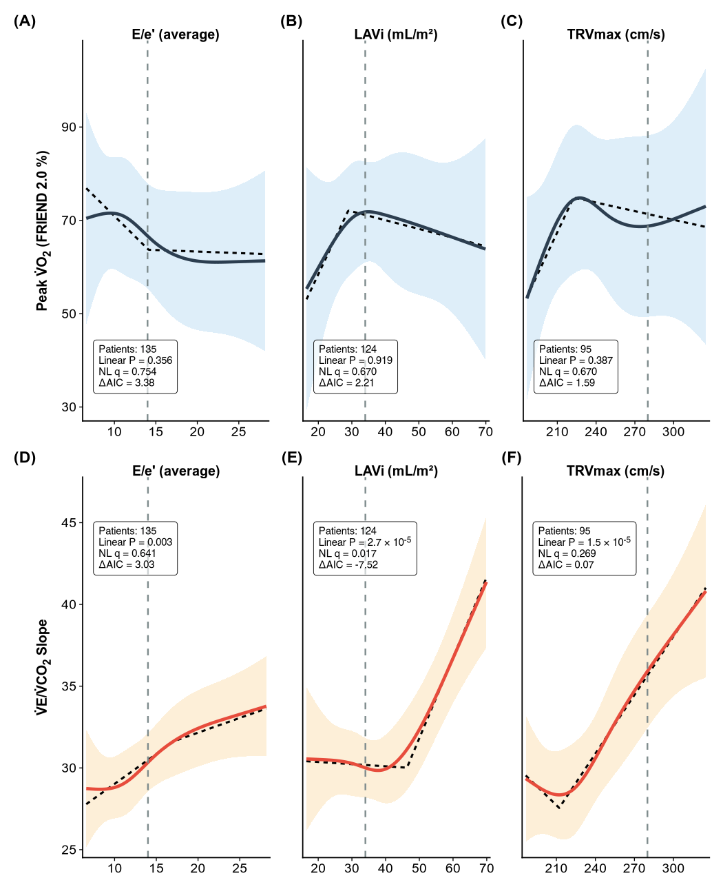

## Figure 3: Abstract export

## LRTs and Curvature Statistics

``` r
# ── table: Fig 3 RCS LRT stats (overall + nonlinearity P per index/outcome) ───
figure3_summary_table_raw <- bind_rows(
  figure3_vo2$lrt_table %>% mutate(Outcome = label_peak_vo2_friend_pred),
  figure3_vevco2$lrt_table %>% mutate(Outcome = label_vevco2)
) %>%
  mutate(
    outcome_order = match(Outcome, c(label_peak_vo2_friend_pred, label_vevco2)),
    parameter_order = match(index, hcm_primary_indices)
  ) %>%
  arrange(outcome_order, parameter_order)

figure3_summary_table_display <- figure3_summary_table_raw %>%
  transmute(
    Outcome = case_when(
      Outcome == label_peak_vo2_friend_pred ~ label_peak_vo2,
      TRUE ~ Outcome
    ),
    Parameter = label,
    N = n,
    `Overall p` = ifelse(overall_p < 0.001, "<0.001", sprintf("%.3f", overall_p)),
    `Nonlinearity q` = ifelse(nonlinear_q < 0.001, "<0.001", sprintf("%.3f", nonlinear_q)),
    `Delta AIC` = ifelse(is.na(delta_AIC_nonlinear), "\u2014", sprintf("%.2f", delta_AIC_nonlinear)),
    `Piecewise knot` = ifelse(is.na(piecewise_knot), "\u2014", sprintf("%.1f", piecewise_knot)),
    `Piecewise q` = ifelse(is.na(piecewise_q), "\u2014", ifelse(piecewise_q < 0.001, "<0.001", sprintf("%.3f", piecewise_q))),
    `Curvature zone` = ifelse(is.na(curvature_zone) | curvature_zone == "None", "\u2014", curvature_zone),
    overall_p_num = overall_p,
    nonlinear_q_num = nonlinear_q,
    piecewise_q_num = piecewise_q
  )

figure3_outcome_break_rows <- figure3_summary_table_display %>%
  count(Outcome, name = "n_rows") %>%
  pull(n_rows) %>%
  cumsum()

figure3_summary_table <- figure3_summary_table_display %>%
  select(-overall_p_num, -nonlinear_q_num, -piecewise_q_num)

figure3_ft <- figure3_summary_table_display %>%
  flextable(col_keys = c("Outcome", "Parameter", "N", "Overall p", "Nonlinearity q", "Delta AIC", "Piecewise knot", "Piecewise q", "Curvature zone")) %>%
  merge_v(j = "Outcome") %>%
  valign(j = "Outcome", valign = "top", part = "body") %>%
  align(j = c("Outcome", "Parameter", "Curvature zone"), align = "left", part = "all") %>%
  align(j = c("N", "Overall p", "Nonlinearity q", "Delta AIC", "Piecewise knot", "Piecewise q"), align = "center", part = "all") %>%
  bold(i = ~ overall_p_num < 0.05, j = "Overall p", part = "body") %>%
  bold(i = ~ nonlinear_q_num < 0.05, j = "Nonlinearity q", part = "body") %>%
  bold(i = ~ !is.na(piecewise_q_num) & piecewise_q_num < 0.05, j = "Piecewise q", part = "body") %>%
  format_pub_table(caption = "Table 2. Key multivariable restricted cubic spline results supporting Figure 3") %>%
  hline(i = figure3_outcome_break_rows, border = officer::fp_border(color = "black", width = 0.8), part = "body")

figure3_ft <- apply_subscript_format(figure3_ft, figure3_summary_table_display, "Outcome")

if (!is_gfm_output) {
  figure3_ft
}

write.csv(figure3_summary_table, "../2_Output/Table2_Figure3_RCS_Summary.csv", row.names = FALSE)
figure3_ft %>% save_as_docx(path = "../2_Output/Table2_Figure3_RCS_Summary.docx")
```

``` r
# ── Fig 3 sanity check: print analytic N + key effect sizes ───────────────────
cat("**Figure 3 Validation**\n\n")
```

**Figure 3 Validation**

``` r
cat(sprintf("- Exact-date medication-adjusted analytic subset: **%d** patients\n", nrow(figure3_model_df)))
```

- Exact-date medication-adjusted analytic subset: **244** patients

``` r
cat(sprintf("- Adjustment set: **%s**\n", figure3_adjustment_label))
```

- Adjustment set: **age, sex, BMI, LV septal thickness, max LVOT
  gradient, β-blocker use, non-DHP CCB use, and hypertension**

``` r
# ── Cross-correlation of diastolic indices ─────────────────────────────────
cat("\n**Diastolic index pairwise correlations (Spearman):**\n\n")
```

**Diastolic index pairwise correlations (Spearman):**

``` r
corr_df <- figure3_model_df %>%
  select(any_of(hcm_primary_indices)) %>%
  mutate(across(everything(), ~ as_num(.)))
pairs <- combn(hcm_primary_indices, 2, simplify = FALSE)
for (pr in pairs) {
  complete <- corr_df %>% filter(!is.na(.data[[pr[1]]]), !is.na(.data[[pr[2]]]))
  if (nrow(complete) >= 10) {
    rho <- cor(complete[[pr[1]]], complete[[pr[2]]], method = "spearman")
    cat(sprintf("- %s vs %s: r = %.3f (n = %d)\n",
                hcm_primary_labels[pr[1]], hcm_primary_labels[pr[2]],
                rho, nrow(complete)))
  }
}
```

- E/e’ (average) vs LAVi (mL/m²): r = 0.322 (n = 164)
- E/e’ (average) vs TRVmax (cm/s): r = 0.410 (n = 102)
- LAVi (mL/m²) vs TRVmax (cm/s): r = 0.338 (n = 104)

``` r
# ── Per-model sample sizes ─────────────────────────────────────────────────
cat("\n**Per-model sample sizes:**\n\n")
```

**Per-model sample sizes:**

``` r
for (outcome_name in c("VO2_FRIEND2_PP", "VeVco2_slope")) {
  result <- switch(outcome_name,
    VO2_FRIEND2_PP = figure3_vo2,
    VeVco2_slope = figure3_vevco2
  )
  for (idx in hcm_primary_indices) {
    m <- result$models[[idx]]
    if (!is.null(m)) {
      cat(sprintf("- %s ~ %s: n = %d\n", outcome_name, hcm_primary_labels[idx], nrow(m$df)))
    }
  }
}
```

- VO2_FRIEND2_PP ~ E/e’ (average): n = 135
- VO2_FRIEND2_PP ~ LAVi (mL/m²): n = 124
- VO2_FRIEND2_PP ~ TRVmax (cm/s): n = 95
- VeVco2_slope ~ E/e’ (average): n = 135
- VeVco2_slope ~ LAVi (mL/m²): n = 124
- VeVco2_slope ~ TRVmax (cm/s): n = 95

``` r
# ── Verify hypertension covariate is present ───────────────────────────────
cat(sprintf("\n- Hypertension (htn_pre_test) available: **%s** (non-missing: %d / %d)\n",
            ifelse("htn_pre_test" %in% names(figure3_model_df), "yes", "NO"),
            sum(!is.na(figure3_model_df$htn_pre_test)),
            nrow(figure3_model_df)))
```

- Hypertension (htn_pre_test) available: **yes** (non-missing: 244 /
  244)

## Supplemental OMARX Threshold Discovery

Because the abnormality thresholds are used as the assumed hingepoint
for the RCS, we applied a custom multivariate adaptive regression spline
(MARS) workflow, called OMARX, to explore data-driven thresholds beyond
guideline-defined cut points. THe primary models used age, sex, BMI,
E/e’, LAVi, TRVmax, septal e’, LV septal thickness, and LVOT gradient;
these were complete-case, with additive, TR-missingness, LVOT-binary,
imputed-predictor, and protected-clinical-knot sensitivity analyses used
to evaluate stability.

These produced only modest explanatory performance in the primary
complete-case models (n=108 for each primary outcome). For peak V̇O2, the
primary model explained only a limited proportion of the variance
(R^2=0.162; adjusted R^2=0.085), and age and BMI were the dominant
retained contributors, with no protected ASE-aligned diastolic knot
retained. For V̇E/V̇CO2 slope, the primary MARS model similarly showed
modest fit (R^2=0.122; adjusted R^2=0.041), with female sex, LV septal
thickness, and TRVmax contributing more than the primary
filling-pressure parameters in the complete-case model.

Nevertheless, sensitivity analyses suggested partial consistency with
ASE thresholds. In additive and imputed models, LAVi knots emerged near
the clinical threshold (approximately 33.9 to 35.9 mL/m^2), and
protected-clinical-knot models for V̇E/V̇CO2 slope retained E/e’ at 14,
LAVi at 34 mL/m^2, and TRVmax at 280 cm/s. Taken together, these
supplemental analyses did not identify a robust alternative threshold
structure that outperformed the guideline-based framework, but they were
broadly compatible with the existing ASE cut points.

## Sensitivity: V̇E/V̇CO₂ Analyses Including Submaximal Tests (All-RER)

This sensitivity analysis repeats the primary cross-sectional RCS models
using all HCM CPETs regardless of peak respiratory exchange ratio (RER ≥
1.0). V̇E/V̇CO₂ slope is physiologically interpretable at submaximal
effort; this analysis confirms whether the primary associations are
robust to inclusion of tests that did not achieve a peak RER ≥ 1.0.

``` r
# Build all-RER HCM baseline cohort using pipeline objects already in scope
CPX_hcm_allrer_raw <- CPX_with_id %>%
  filter(
    ID != "1380",
    MCl3 == "HCM",
    MRN %in% Comorbidities_to_filter$MRN
  ) %>%
  mutate(
    diag_primary   = trimws(as.character(MCl3)),
    diag_secondary = trimws(as.character(MCl4)),
    has_any_hcm_flag = TRUE
  )

CPX_clean_allrer <- format_cpx_registry(CPX_hcm_allrer_raw, keep_diagnosis = FALSE)

cpx_echo_allrer <- align_cpx_to_echo(CPX_clean_allrer) %>%
  left_join(genetics_flags, by = "MRN") %>%
  mutate(
    HCM_Phenotype = coalesce(genetics_phenotype, as.character(HCM_Phenotype)),
    hcm_selection_include = case_when(
      !is.na(lv_max_wall_thickness) & lv_max_wall_thickness >= 1.5 ~ TRUE,
      HCM_Phenotype == "Apical" ~ TRUE,
      pathogenic_variant == 1 & !is.na(lv_max_wall_thickness) & lv_max_wall_thickness >= 1.3 ~ TRUE,
      TRUE ~ FALSE
    )
  ) %>%
  filter(hcm_selection_include)

baseline_allrer_df <- cpx_echo_allrer %>%
  group_by(ID) %>% arrange(days_from_baseline) %>% slice(1) %>% ungroup() %>%
  mutate(across(any_of(num_vars), ~ as.numeric(as.character(.)))) %>%
  left_join(medications, by = c("MRN", "cpx_test_date")) %>%
  left_join(
    comorbidity_adjustment_flags %>% select(MRN, cpx_test_date, dm_pre_test, htn_pre_test),
    by = c("MRN", "cpx_test_date")
  )

cat(sprintf(
  "All-RER sensitivity cohort: %d HCM patients (%+d vs. primary RER≥1.0 cohort of %d)\n",
  nrow(baseline_allrer_df),
  nrow(baseline_allrer_df) - nrow(baseline_df),
  nrow(baseline_df)
))
```

All-RER sensitivity cohort: 489 HCM patients (+39 vs. primary RER≥1.0
cohort of 450)

``` r
# Analytic subset for models — mirror figure3_model_df from all-RER cohort
figure3_model_allrer_df <- baseline_allrer_df %>%
  mutate(
    across(any_of(c("age", "BMI", "VeVco2_slope", hcm_primary_indices,
                    figure3_adjustment_covariates)),
           ~ as_num(.)),
    Sex = factor(Sex, levels = c("Male", "Female"))
  ) %>%
  filter(
    if_all(all_of(figure3_adjustment_covariates), ~ !is.na(.x)),
    !is.na(age), !is.na(Sex), !is.na(BMI)
  )

# Run RCS LRT for Ve/VCO2 ~ each primary diastolic index on all-RER cohort
rer_sensitivity_lrt <- purrr::map_dfr(hcm_primary_indices, function(idx) {
  fit <- fit_rcs_model(
    figure3_model_allrer_df,
    outcome_var    = "VeVco2_slope",
    idx            = idx,
    nk             = 4,
    adjust_vars    = figure3_adjustment_vars,
    adjust_numeric = figure3_adjustment_numeric
  )
  if (is.null(fit)) {
    return(tibble(index = idx, n_allrer = NA_integer_, p_allrer = NA_real_))
  }
  tibble(
    index    = idx,
    n_allrer = nrow(fit$df),
    p_allrer = fit$overall_test$`Pr(>F)`[2]
  )
})

# Merge with primary results already computed in figure3_vevco2$lrt_table
sensitivity_comparison_tbl <- figure3_vevco2$lrt_table %>%
  select(index, label, n_primary = n, p_primary = overall_p) %>%
  left_join(rer_sensitivity_lrt, by = "index") %>%
  transmute(
    `Parameter`      = label,
    `N (RER ≥1.0)` = n_primary,
    `P (RER ≥1.0)` = ifelse(p_primary < 0.001, "<0.001", sprintf("%.3f", p_primary)),
    `N (all RER)`    = n_allrer,
    `P (all RER)`    = ifelse(
      is.na(p_allrer), "—",
      ifelse(p_allrer < 0.001, "<0.001", sprintf("%.3f", p_allrer))
    )
  )

print(knitr::kable(
  sensitivity_comparison_tbl,
  caption = "Table S: Sensitivity — V̇E/V̇CO₂ ~ diastolic index RCS LRT, primary (RER ≥1.0) vs. all-RER cohort"
))
```

| Parameter      | N (RER ≥1.0) | P (RER ≥1.0) | N (all RER) | P (all RER) |
|:---------------|-------------:|:-------------|------------:|:------------|
| LAVi (mL/m²)   |          124 | \<0.001      |         141 | 0.010       |
| TRVmax (cm/s)  |           95 | \<0.001      |         113 | 0.012       |
| E/e’ (average) |          135 | 0.003        |         153 | 0.004       |

Table S: Sensitivity — V̇E/V̇CO₂ ~ diastolic index RCS LRT, primary (RER
≥1.0) vs. all-RER cohort

``` r
write.csv(
  sensitivity_comparison_tbl,
  "../2_Output/Sensitivity_AllRER_VeVco2_LRT.csv",
  row.names = FALSE
)
```

# Figure 4: Longitudinal GAMM Trajectories

This section reproduces the manuscript longitudinal analyses examining
whether baseline diastolic dysfunction severity predicts the trajectory
of cardiopulmonary fitness across serial CPX tests. Patients with at
least one follow-up CPX test after the baseline visit are included in
the longitudinal cohort.

**Statistical approach.** Generalized additive mixed models (GAMM,
implemented via `mgcv::gamm` with REML estimation) are used to model
Peak V̇O$_2$ and V̇E/V̇CO$_2$ slope as functions of time from baseline CPX.
Within-patient correlation is modelled by a per-patient random intercept
and random slope on `time_yrs`
(`random = list(ID_fac = pdDiag(~ 1 + time_yrs))`). For binary
diastolic-status models, the trajectory deviation between abnormal and
normal patients is captured by a varying-coefficient smooth,
`s(time_yrs, by = status_binary_ord, bs = "cr", k = 5)`, using an
ordered factor so that the by-smooth represents the difference smooth
(Abnormal vs Normal). For continuous baseline-severity models, a
tensor-interaction smooth
`ti(time_yrs, baseline_var, bs = c("cr", "cr"), k = c(5, 4))` is used to
model the time × baseline interaction with main effects removed.
P-values for trajectory differences are derived from the smooth-term F
statistic of the difference / tensor smooth. The previous
implementation, which used `mgcv::bam` with a random-intercept smooth
and a `ti()` tensor with a random-effect margin on the binary status
axis, was found to penalize the interaction smooth to effective df ≈ 0
in many sensitivity models; the varying-coefficient parameterization
with explicit lme random effects eliminates this degeneracy.

**Age normalization.** Peak V̇O$_2$ is expressed as FRIEND 2.0 %
predicted at each visit, providing built-in adjustment for age, sex, and
BMI across follow-up. LAVi is additionally z-scored using GAMLSS
(generalized additive models for location, scale, and shape) estimated
from the HCM baseline cohort with sex-stratified smooth splines on age.
The resulting Z-score is a **within-HCM** reference: Z = 0 corresponds
to the average HCM patient of the same age and sex, not a healthy
normal. This cohort-internal Z-score is used as a continuous prognostic
predictor and is interpreted as deviation within the HCM distribution.

**Visualization.** Predicted trajectories are shown at the 25th, 50th,
and 75th percentiles of each baseline diastolic parameter to illustrate
the dose-response relationship over time. Binary (abnormal vs. normal,
using ASE thresholds) trajectory models are retained as supplemental
figures for direct comparison with the primary continuous analyses.

## GAMLSS Z-Score Derivation

## Continuous GAMM Trajectory Panels

``` r
# ── Fig 4: GAMM trajectories of exercise capacity by baseline diastolic burden ─
# mixed GAM (smooth time x stratum + random patient intercept) on the repeated-
# test cohort. stratify by baseline LVDD burden (#abnormal indices) and by each
# binary index. cap follow-up at 10y to avoid sparse-tail extrapolation
# z_source = per-patient LAVi z for the Cox models
z_source <- gamlss_results[["la_vol_index"]]$data %>%
  select(ID, dd_zscore = seamlss_z) %>%
  filter(!is.na(dd_zscore)) %>%
  group_by(ID) %>%
  summarise(dd_zscore = first(dd_zscore), .groups = "drop")

lvdd_burden_lookup <- baseline_df %>%
  transmute(
    ID,
    lvdd_burden = case_when(
      hcm_combo_n_abnormal %in% 1:3 ~ as.character(hcm_combo_n_abnormal),
      TRUE ~ NA_character_
    )
  ) %>%
  distinct(ID, .keep_all = TRUE)

longitudinal_lvdd_df <- long_df %>%
  left_join(lvdd_burden_lookup, by = "ID") %>%
  filter(
    !is.na(lvdd_burden),
    !is.na(time_yrs),
    !is.na(age),
    !is.na(BMI),
    is.finite(time_yrs),
    time_yrs <= 10
  ) %>%
  mutate(
    ID_fac = factor(ID),
    Sex = factor(Sex, levels = c("Male", "Female")),
    lvdd_burden = factor(lvdd_burden, levels = c("1", "2", "3"))
  )

binary_baseline_lookup <- baseline_df %>%
  mutate(
    abn_ee = !is.na(e_e_ave) & e_e_ave > 14,
    abn_lavi = !is.na(la_vol_index) & la_vol_index > 34,
    abn_trv = !is.na(tr_max_vel) & tr_max_vel > 280
  ) %>%
  select(ID, abn_ee, abn_lavi, abn_trv) %>%
  distinct(ID, .keep_all = TRUE)

longitudinal_binary_df <- long_df %>%
  left_join(binary_baseline_lookup, by = "ID") %>%
  filter(!is.na(time_yrs), !is.na(age), !is.na(BMI), is.finite(time_yrs), time_yrs <= 10) %>%
  mutate(
    ID_fac = factor(ID),
    Sex = factor(Sex, levels = c("Male", "Female"))
  )

continuous_baseline_lookup <- baseline_df %>%
  transmute(
    ID,
    baseline_e_e_ave = e_e_ave,
    baseline_la_vol_index = la_vol_index,
    baseline_tr_max_vel = tr_max_vel
  ) %>%
  distinct(ID, .keep_all = TRUE)

longitudinal_continuous_df <- long_df %>%
  left_join(continuous_baseline_lookup, by = "ID") %>%
  filter(!is.na(time_yrs), !is.na(age), !is.na(BMI), is.finite(time_yrs), time_yrs <= 10) %>%
  mutate(
    ID_fac = factor(ID),
    Sex = factor(Sex, levels = c("Male", "Female"))
  )

figure4_core_covariates <- c("age", "Sex", "BMI")
figure4_medication_covariates <- c("bb_any", "ndhp_ccb_any")
figure4_additional_sensitivity_covariates <- c("dm_pre_test")
figure4_medication_adjusted_covariates <- c(figure4_core_covariates, figure4_medication_covariates)
figure4_full_covariates <- c(figure4_medication_adjusted_covariates, figure4_additional_sensitivity_covariates)


figure4_index_specs <- list(
  list(var = "e_e_ave", baseline_var = "baseline_e_e_ave", status_var = "abn_ee", label_short = "E/e'", label_long = "E/e' (average)",
       threshold_subtitle = "Normal ≤ 14 | Abnormal > 14", suffix = "Ee"),
  list(var = "la_vol_index", baseline_var = "baseline_la_vol_index", status_var = "abn_lavi", label_short = "LAVi", label_long = "LAVi (mL/m\u00B2)",
       threshold_subtitle = "Normal ≤ 34 mL/m\u00B2 | Abnormal > 34 mL/m\u00B2", suffix = "LAVi"),
  list(var = "tr_max_vel", baseline_var = "baseline_tr_max_vel", status_var = "abn_trv", label_short = "TRVmax", label_long = "TRVmax (m/s)",
       threshold_subtitle = "Normal ≤ 2.8 m/s | Abnormal > 2.8 m/s", suffix = "TRV")
)

figure4_model_sets <- list(
  list(key = "unadjusted",  label = "Unadjusted",             covariates = character(0)),
  list(key = "demographic", label = "Age, sex, BMI adjusted", covariates = figure4_core_covariates),
  list(key = "medication",  label = "Age, sex, BMI + medication adjusted",
       covariates = figure4_medication_adjusted_covariates),
  list(key = "full",        label = "Age, sex, BMI + medication + diabetes adjusted",
       covariates = figure4_full_covariates)
)

figure4_model_results <- setNames(
  lapply(figure4_model_sets, function(x) list(VO2_FRIEND2_PP = list(), VeVco2_slope = list())),
  vapply(figure4_model_sets, function(x) x$key, character(1))
)

for (model_set in figure4_model_sets) {
  for (spec in figure4_index_specs) {
    figure4_model_results[[model_set$key]][["VO2_FRIEND2_PP"]][[spec$var]] <-
      fit_gamm_binary_panel(longitudinal_binary_df, "VO2_FRIEND2_PP", spec,
                            covariates = model_set$covariates)
    figure4_model_results[[model_set$key]][["VeVco2_slope"]][[spec$var]] <-
      fit_gamm_binary_panel(longitudinal_binary_df, "VeVco2_slope", spec,
                            covariates = model_set$covariates)
  }
}

figure4_results            <- figure4_model_results[["demographic"]]
figure4_unadjusted_results <- figure4_model_results[["unadjusted"]]
figure4_model_label_order  <- vapply(figure4_model_sets, function(x) x$label, character(1))
figure4_main_spec <- figure4_index_specs[[which(
  vapply(figure4_index_specs, function(spec) spec$var, character(1)) == "la_vol_index")]]

figure4_main_results <- list(
  VO2_FRIEND2_PP = setNames(
    lapply(figure4_index_specs, function(spec)
      fit_gamm_continuous_panel(longitudinal_continuous_df, "VO2_FRIEND2_PP", spec,
                                covariates = figure4_core_covariates)),
    vapply(figure4_index_specs, function(spec) spec$var, character(1))
  ),
  VeVco2_slope = setNames(
    lapply(figure4_index_specs, function(spec)
      fit_gamm_continuous_panel(longitudinal_continuous_df, "VeVco2_slope", spec,
                                covariates = figure4_core_covariates)),
    vapply(figure4_index_specs, function(spec) spec$var, character(1))
  )
)

figure4_main_vo2_limits    <- collect_prediction_limits(figure4_main_results[["VO2_FRIEND2_PP"]])
figure4_main_vevco2_limits <- collect_prediction_limits(figure4_main_results[["VeVco2_slope"]])

if (all(vapply(figure4_main_results[["VO2_FRIEND2_PP"]], is.null, logical(1))) &&
    all(vapply(figure4_main_results[["VeVco2_slope"]],   is.null, logical(1))))
  stop("Figure 4 continuous trajectory panels could not be generated.")

figure4_panel_titles <- c("A", "B", "C", "D", "E", "F")

figure4_vo2_panels <- lapply(seq_along(figure4_index_specs), function(i) {
  spec <- figure4_index_specs[[i]]
  make_continuous_trajectory_panel(
    figure4_main_results[["VO2_FRIEND2_PP"]][[spec$var]],
    y_label              = if (i == 1) label_peak_vo2_friend_pred_unicode else NULL,
    y_limits             = figure4_main_vo2_limits,
    title                = paste0("(", figure4_panel_titles[[i]], ") ", spec$label_short),
    show_y               = i == 1, show_x = FALSE, show_legend = i == 1,
    stats_label          = format_continuous_panel_stats_label(
                             figure4_main_results[["VO2_FRIEND2_PP"]][[spec$var]]),
    legend_position      = if (i == 1) c(0.04, 0.06) else "right",
    legend_direction     = "vertical",
    legend_justification = if (i == 1) c(0, 0) else NULL,
    stats_fill_alpha     = 0.62
  )
})

figure4_vevco2_panels <- lapply(seq_along(figure4_index_specs), function(i) {
  spec <- figure4_index_specs[[i]]
  make_continuous_trajectory_panel(
    figure4_main_results[["VeVco2_slope"]][[spec$var]],
    y_label          = if (i == 1) label_vevco2_unicode else NULL,
    y_limits         = figure4_main_vevco2_limits,
    title            = paste0("(", figure4_panel_titles[[i + 3]], ") ", spec$label_short),
    show_y           = i == 1, show_x = TRUE, show_legend = FALSE,
    stats_label      = format_continuous_panel_stats_label(
                         figure4_main_results[["VeVco2_slope"]][[spec$var]]),
    legend_position  = "right", legend_direction = "vertical",
    stats_fill_alpha = 0.62
  )
})

fig4 <- wrap_plots(c(figure4_vo2_panels, figure4_vevco2_panels), ncol = 3, byrow = TRUE)

figure4_main_width      <- 7.45
figure4_main_height     <- 4.15
figure4_preprint_width  <- 7.45
figure4_preprint_height <- 4.30
figure4_legend_fontsize <- 9

show_and_save_jacc(fig4, "../2_Output/Figure4_Longitudinal_GAMM.pdf",
                   w = figure4_main_width, h = figure4_main_height)
```

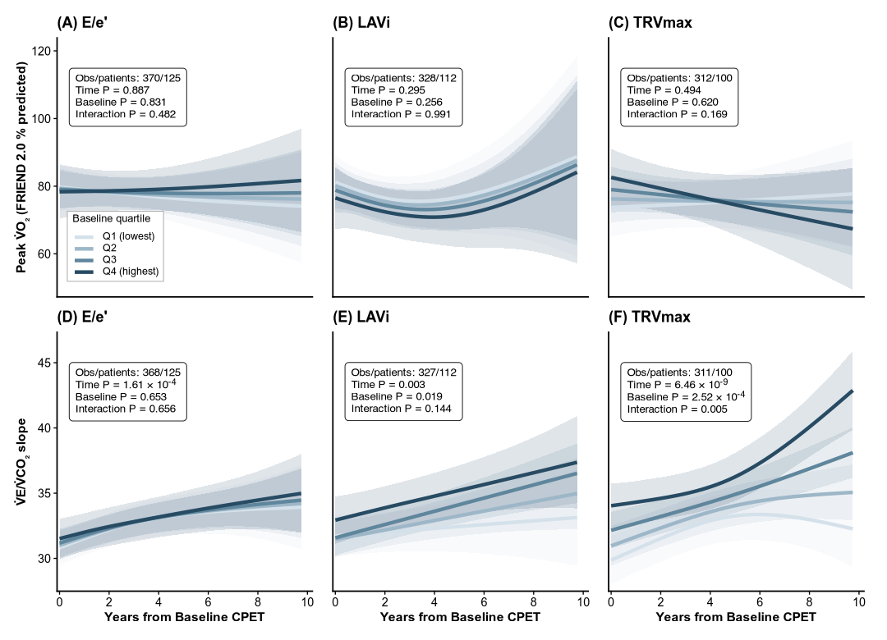

``` r
save_jacc(fig4, "../Manuscript/Figures/Figure4_Longitudinal_GAMM_Preprint.pdf",
          w = figure4_preprint_width, h = figure4_preprint_height)
save_jacc(fig4, "../2_Output/Figure4_Longitudinal_GAMM_Preprint.pdf",
          w = figure4_preprint_width, h = figure4_preprint_height)

legend_fig4_pdf <- paste0(
  "**Figure 4. Longitudinal Cardiopulmonary Trajectories Across Diastolic Dysfunction Parameters.** ",
  "Continuous generalized additive mixed models were adjusted for age, sex, and BMI and fit to repeated ",
  "cardiopulmonary measures across the 3 primary HCM diastolic indices. ",
  "Each diastolic parameter was entered as a continuous predictor with a time interaction; ",
  "lines show model-predicted trajectories at the 25th, 50th, and 75th percentiles for visualization. ",
  "**(A)** ", label_peak_vo2_friend_pred_md, " trajectory across baseline E/e’. ",
  "**(B)** ", label_peak_vo2_friend_pred_md, " trajectory across baseline LAVi. ",
  "**(C)** ", label_peak_vo2_friend_pred_md, " trajectory across baseline TRV$_max$. ",
  "**(D)** ", label_vevco2_md, " trajectory across baseline E/e’. ",
  "**(E)** ", label_vevco2_md, " trajectory across baseline LAVi. ",
  "**(F)** ", label_vevco2_md, " trajectory across baseline TRV$_max$."
)

save_jacc_with_embedded_legend(fig4, "../Manuscript/Figures/Figure4_Longitudinal_GAMM.pdf",
  legend_text = legend_fig4_pdf, w = figure4_main_width, h = figure4_main_height,
  legend_fontsize = figure4_legend_fontsize)
save_jacc_with_embedded_legend(fig4, "../2_Output/Figure4_Longitudinal_GAMM.pdf",
  legend_text = legend_fig4_pdf, w = figure4_main_width, h = figure4_main_height,
  legend_fontsize = figure4_legend_fontsize)
```

## Figure 4 abstract output

## Model Summaries

``` r
# ── table: GAMM smooth-term stats per index (primary, core-adjusted models) ────
figure4_summary_table_raw <- bind_rows(
  bind_rows(lapply(figure4_index_specs, function(spec) {
    extract_continuous_model_rows(
      figure4_main_results[["VO2_FRIEND2_PP"]][[spec$var]],
      label_peak_vo2_friend_pred
    )
  })),
  bind_rows(lapply(figure4_index_specs, function(spec) {
    extract_continuous_model_rows(
      figure4_main_results[["VeVco2_slope"]][[spec$var]],
      label_vevco2
    )
  }))
)

figure4_summary_table_display <- figure4_summary_table_raw %>%
  transmute(
    Outcome = case_when(
      Outcome == label_peak_vo2_friend_pred ~ label_peak_vo2,
      TRUE ~ Outcome
    ),
    `Baseline Parameter` = Parameter,
    `GAMM Term` = `Model component`,
    `Effective df` = ifelse(is.na(edf), "\u2014", sprintf("%.2f", edf)),
    Statistic = `Statistic`,
    `P value` = `P value`,
    p_num
  )

outcome_break_rows <- figure4_summary_table_display %>%
  count(Outcome, name = "n_rows") %>%
  pull(n_rows) %>%
  cumsum()
parameter_break_rows <- figure4_summary_table_display %>%
  count(Outcome, `Baseline Parameter`, name = "n_rows") %>%
  pull(n_rows) %>%
  cumsum()

figure4_summary_table <- figure4_summary_table_display %>%
  select(-p_num)

figure4_ft <- figure4_summary_table_display %>%
  flextable(col_keys = c("Outcome", "Baseline Parameter", "GAMM Term", "Effective df", "Statistic", "P value")) %>%
  merge_v(j = c("Outcome", "Baseline Parameter")) %>%
  valign(j = c("Outcome", "Baseline Parameter"), valign = "top", part = "body") %>%
  align(j = c("Outcome", "Baseline Parameter", "GAMM Term"), align = "left", part = "all") %>%
  align(j = c("Effective df", "Statistic", "P value"), align = "center", part = "all") %>%
  bold(i = ~ p_num < 0.05, j = "P value", part = "body") %>%
  format_pub_table(caption = "Table 3. Key longitudinal GAMM terms for Figure 4 continuous parameter-specific analyses") %>%
  hline(i = parameter_break_rows, border = officer::fp_border(color = "grey55", width = 0.4), part = "body") %>%
  hline(i = outcome_break_rows, border = officer::fp_border(color = "black", width = 0.8), part = "body")

figure4_ft <- apply_subscript_format(figure4_ft, figure4_summary_table_display, "Outcome")
figure4_ft <- apply_scientific_p_format(figure4_ft, figure4_summary_table_display, value_col = "P value", p_col = "p_num", digits = 2, threshold = 0.05)

if (!is_gfm_output) {
  figure4_ft
}

write.csv(figure4_summary_table, "../2_Output/Table3_Figure4_GAMM_Summary.csv", row.names = FALSE)
figure4_ft %>% save_as_docx(path = "../2_Output/Table3_Figure4_GAMM_Summary.docx")
```

## Complete Model Statistics

``` r
# ── table: full GAMM coefficients (parametric + smooth) across all indices ─────
figure4_complete_table_raw <- bind_rows(
  bind_rows(lapply(figure4_index_specs, function(spec) {
    extract_complete_gamm_rows(
      figure4_results[["VO2_FRIEND2_PP"]][[spec$var]],
      label_peak_vo2_friend_pred
    )
  })),
  bind_rows(lapply(figure4_index_specs, function(spec) {
    extract_complete_gamm_rows(
      figure4_results[["VeVco2_slope"]][[spec$var]],
      label_vevco2
    )
  }))
) %>%
  mutate(
    outcome_order = match(Outcome, c(label_peak_vo2_friend_pred, label_vevco2)),
    parameter_order = match(Parameter, vapply(figure4_index_specs, function(spec) spec$label_long, character(1))),
    term_class_order = match(`Term class`, c("Smooth", "Parametric"))
  ) %>%
  arrange(outcome_order, parameter_order, term_class_order, Term) %>%
  select(-outcome_order, -parameter_order, -term_class_order)

figure4_complete_table_display <- figure4_complete_table_raw %>%
  transmute(
    Outcome = case_when(
      Outcome == label_peak_vo2_friend_pred ~ label_peak_vo2,
      TRUE ~ Outcome
    ),
    `Baseline Parameter` = Parameter,
    Sample = sprintf("%d / %d", Observations, Patients),
    Fit = `Fit mode`,
    `Term Class` = `Term class`,
    Term,
    `Effect summary` = case_when(
      `Term class` == "Smooth" ~ sprintf("edf = %.2f; ref df = %.2f", edf, `Ref df`),
      TRUE ~ sprintf("\u03B2 = %.2f; SE = %.2f", Estimate, `Std. Error`)
    ),
    Statistic = sprintf("%s = %.2f", `Statistic type`, `Statistic value`),
    `P value` = ifelse(`P value raw` < 0.001, "<0.001", sprintf("%.3f", `P value raw`)),
    p_num = `P value raw`
  )

figure4_complete_term_break_rows <- figure4_complete_table_display %>%
  count(Outcome, `Baseline Parameter`, `Term Class`, name = "n_rows") %>%
  pull(n_rows) %>%
  cumsum()
figure4_complete_parameter_break_rows <- figure4_complete_table_display %>%
  count(Outcome, `Baseline Parameter`, name = "n_rows") %>%
  pull(n_rows) %>%
  cumsum()
figure4_complete_outcome_break_rows <- figure4_complete_table_display %>%
  count(Outcome, name = "n_rows") %>%
  pull(n_rows) %>%
  cumsum()

figure4_complete_table <- figure4_complete_table_display %>%
  select(-p_num)

figure4_complete_ft <- figure4_complete_table_display %>%
  flextable(col_keys = c("Outcome", "Baseline Parameter", "Sample", "Fit", "Term Class", "Term", "Effect summary", "Statistic", "P value")) %>%
  merge_v(j = c("Outcome", "Baseline Parameter", "Sample", "Fit", "Term Class")) %>%
  valign(j = c("Outcome", "Baseline Parameter", "Sample", "Fit", "Term Class"), valign = "top", part = "body") %>%
  align(j = c("Outcome", "Baseline Parameter", "Fit", "Term Class", "Term", "Effect summary"), align = "left", part = "all") %>%
  align(j = c("Sample", "Statistic", "P value"), align = "center", part = "all") %>%
  bold(i = ~ p_num < 0.05, j = "P value", part = "body") %>%
  format_pub_table(caption = "Supplemental Table. Complete longitudinal GAMM statistics underlying the supplemental parameter-specific Figure 4 binary-status analyses") %>%
  hline(i = figure4_complete_term_break_rows, border = officer::fp_border(color = "grey75", width = 0.3), part = "body") %>%
  hline(i = figure4_complete_parameter_break_rows, border = officer::fp_border(color = "grey55", width = 0.4), part = "body") %>%
  hline(i = figure4_complete_outcome_break_rows, border = officer::fp_border(color = "black", width = 0.8), part = "body")

figure4_complete_ft <- apply_subscript_format(figure4_complete_ft, figure4_complete_table_display, "Outcome")

if (!is_gfm_output) {
  figure4_complete_ft
}

write.csv(figure4_complete_table, "../2_Output/TableS_Figure4_GAMM_Complete.csv", row.names = FALSE)
figure4_complete_ft %>% save_as_docx(path = "../2_Output/TableS_Figure4_GAMM_Complete.docx")
```

``` r
# ── Fig 4 sanity check: GAMM N, EDF, time-smooth P per panel ──────────────────
figure4_validation_row <- function(result, outcome_label, parameter_label) {
  if (is.null(result)) return(NULL)
  tibble(
    Outcome = outcome_label,
    Parameter = parameter_label,
    Observations = result$n_observations,
    Patients = result$n_patients,
    Quartiles = paste0(result$quartile_summary$quartile, ": ", result$quartile_summary$n_patients, collapse = ", ")
  )
}

figure4_main_validation_df <- bind_rows(
  bind_rows(lapply(figure4_index_specs, function(spec) {
    figure4_validation_row(
      figure4_main_results[["VO2_FRIEND2_PP"]][[spec$var]],
      label_peak_vo2,
      spec$label_short
    )
  })),
  bind_rows(lapply(figure4_index_specs, function(spec) {
    figure4_validation_row(
      figure4_main_results[["VeVco2_slope"]][[spec$var]],
      label_vevco2,
      spec$label_short
    )
  }))
)

cat("**Figure 4 Validation (Main Continuous Quartile Analysis)**\n\n")
```

**Figure 4 Validation (Main Continuous Quartile Analysis)**

``` r
for (i in seq_len(nrow(figure4_main_validation_df))) {
  row_i <- figure4_main_validation_df[i, ]
  cat(sprintf(
    "- %s | %s: **%d observations across %d patients**; quartile patients = **%s**\n",
    row_i$Outcome, row_i$Parameter, row_i$Observations, row_i$Patients, row_i$Quartiles
  ))
}
```

- Peak V̇O2 \| E/e’: **370 observations across 125 patients**; quartile
  patients = **Q1 (lowest): 32, Q2: 31, Q3: 31, Q4 (highest): 31**
- Peak V̇O2 \| LAVi: **328 observations across 112 patients**; quartile
  patients = **Q1 (lowest): 28, Q2: 28, Q3: 28, Q4 (highest): 28**
- Peak V̇O2 \| TRVmax: **312 observations across 100 patients**; quartile
  patients = **Q1 (lowest): 25, Q2: 25, Q3: 25, Q4 (highest): 25**
- V̇E/V̇CO2 slope \| E/e’: **368 observations across 125 patients**;
  quartile patients = **Q1 (lowest): 32, Q2: 31, Q3: 31, Q4 (highest):
  31**
- V̇E/V̇CO2 slope \| LAVi: **327 observations across 112 patients**;
  quartile patients = **Q1 (lowest): 28, Q2: 28, Q3: 28, Q4 (highest):
  28**
- V̇E/V̇CO2 slope \| TRVmax: **311 observations across 100 patients**;
  quartile patients = **Q1 (lowest): 25, Q2: 25, Q3: 25, Q4 (highest):
  25**

``` r
cat(sprintf("- Baseline LAVi Z-score derivation available for downstream Cox models: **%s**\n",
            ifelse(nrow(z_source) > 0, "yes", "no")))
```

- Baseline LAVi Z-score derivation available for downstream Cox models:
  **yes**

## Supplemental Figures: Parameter-Specific Binary Trajectories

``` r
# ── Fig S: GAMM trajectories split by each binary index (supplement to Fig 4) ──
for (spec in figure4_index_specs) {
  result <- build_binary_subfigure(spec)
  if (is.null(result)) next

  pdf_name <- paste0("FigureS_", spec$suffix, "_Binary_Trajectories")
  output_pdf <- paste0("../2_Output/", pdf_name, ".pdf")
  manuscript_pdf <- paste0("../Manuscript/Supplemental/", pdf_name, ".pdf")
  dir.create("../Manuscript/Supplemental", showWarnings = FALSE, recursive = TRUE)

  show_and_save_jacc(result$fig, output_pdf, w = 7.2, h = 3.1)

  legend_text <- paste0(
    "**Supplemental Figure.** Parameter-specific longitudinal cardiopulmonary trajectories stratified by binary baseline ",
    spec$label_long, " status. ",
    "**(A)** GAMM-derived ", label_peak_vo2_md, " trajectories. ",
    "**(B)** GAMM-derived ", label_vevco2_md, " trajectories. ",
    "**(C)** Summary of the key status and interaction terms for both models. ",
    "Normal versus abnormal status was defined as ", spec$threshold_subtitle, ". ",
    "Longitudinal models were adjusted for age, sex, and BMI."
  )

  save_jacc_with_embedded_legend(
    result$fig,
    manuscript_pdf,
    legend_text = legend_text,
    w = 7.2,
    h = 3.1
  )

  summary_name <- paste0("TableS_", spec$suffix, "_Binary_GAMM_Summary.csv")
  write.csv(result$summary, paste0("../2_Output/", summary_name), row.names = FALSE)

  legacy_pdf <- paste0("../2_Output/FigureS_", spec$suffix, "_Tertile_Trajectories.pdf")
  legacy_png <- paste0("../2_Output/FigureS_", spec$suffix, "_Tertile_Trajectories.png")
  legacy_summary <- paste0("../2_Output/TableS_", spec$suffix, "_Tertile_GAMM_Summary.csv")
  if (file.exists(output_pdf)) file.copy(output_pdf, legacy_pdf, overwrite = TRUE)
  if (file.exists(sub("\\.pdf$", ".png", output_pdf))) file.copy(sub("\\.pdf$", ".png", output_pdf), legacy_png, overwrite = TRUE)
  if (file.exists(paste0("../2_Output/", summary_name))) file.copy(paste0("../2_Output/", summary_name), legacy_summary, overwrite = TRUE)
}
```

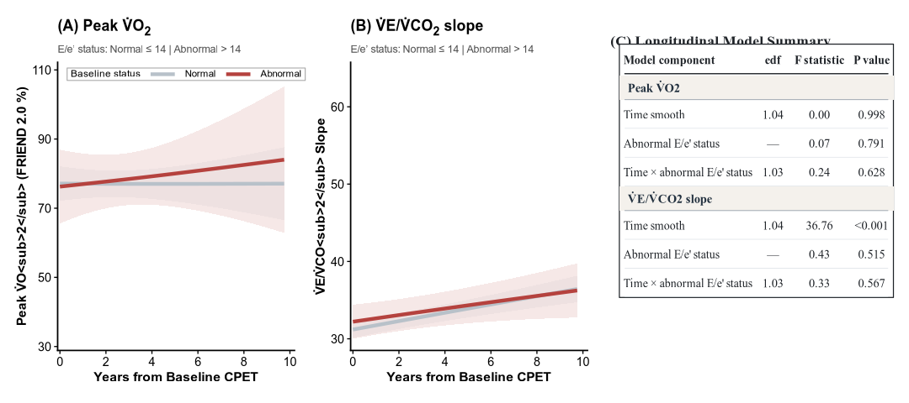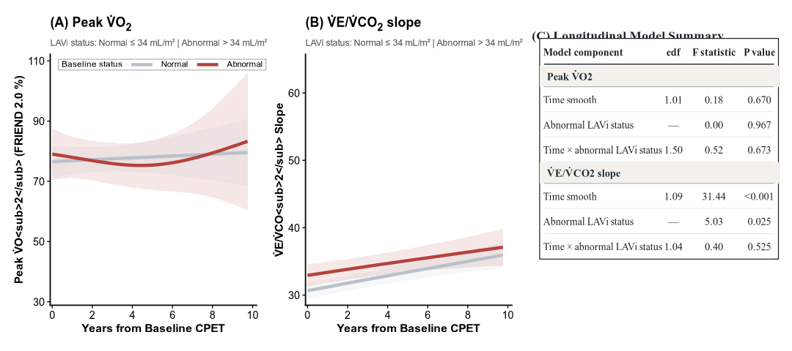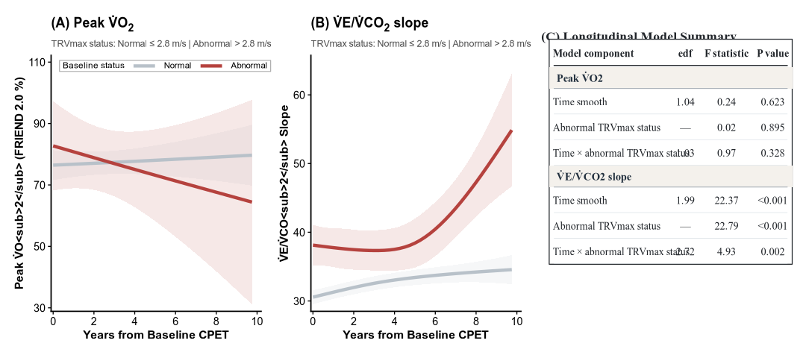

## Supplemental Figure: Unadjusted LAVi Binary GAMM

``` r
# ── Fig S: unadjusted LAVi GAMM (shows covariate adjustment isn't driving signal)
figure4_unadjusted_main <- build_binary_subfigure(
  figure4_main_spec,
  result_source = figure4_unadjusted_results
)

if (!is.null(figure4_unadjusted_main)) {
  unadjusted_pdf <- "../2_Output/FigureS_Figure4_LAVi_Unadjusted_GAMM.pdf"
  manuscript_unadjusted_pdf <- "../Manuscript/Supplemental/FigureS_Figure4_LAVi_Unadjusted_GAMM.pdf"

  show_and_save_jacc(figure4_unadjusted_main$fig, unadjusted_pdf, w = 7.2, h = 3.1)
  save_jacc_with_embedded_legend(
    figure4_unadjusted_main$fig,
    manuscript_unadjusted_pdf,
    legend_text = paste0(
      "**Supplemental Figure.** Unadjusted longitudinal cardiopulmonary trajectories stratified by binary baseline ",
      figure4_main_spec$label_long, " status. ",
      "**(A)** GAMM-derived ", label_peak_vo2_md, " trajectories. ",
      "**(B)** GAMM-derived ", label_vevco2_md, " trajectories. ",
      "**(C)** Summary of the key status and interaction terms for both models. ",
      "Normal versus abnormal status was defined as ", figure4_main_spec$threshold_subtitle, ". ",
      "These sensitivity GAMMs were unadjusted for demographic, medication, or diabetes covariates and included only time smooth, abnormal-status effect, time-by-status interaction, and subject-level random intercept."
    ),
    w = 7.2,
    h = 3.1
  )
}
```

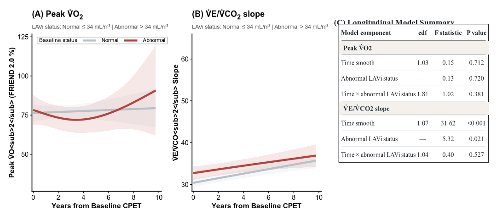

## Supplemental Table: Figure 4 GAMM Sensitivity Analysis

``` r
# ── table: GAMM sensitivity across adjustment sets (core vs +meds vs ...) ──────
figure4_sensitivity_table_raw <- bind_rows(lapply(figure4_model_sets, function(model_set) {
  bind_rows(
    bind_rows(lapply(figure4_index_specs, function(spec) {
      extract_gamm_sensitivity_rows(
        figure4_model_results[[model_set$key]][["VO2_FRIEND2_PP"]][[spec$var]],
        label_peak_vo2_friend_pred,
        model_set$label
      )
    })),
    bind_rows(lapply(figure4_index_specs, function(spec) {
      extract_gamm_sensitivity_rows(
        figure4_model_results[[model_set$key]][["VeVco2_slope"]][[spec$var]],
        label_vevco2,
        model_set$label
      )
    }))
  )
})) %>%
  mutate(
    outcome_order = match(Outcome, c(label_peak_vo2_friend_pred, label_vevco2)),
    parameter_order = match(Parameter, vapply(figure4_index_specs, function(spec) spec$label_long, character(1))),
    relationship_order = case_when(
      str_detect(`Relationship term`, "^Abnormal ") ~ 1L,
      TRUE ~ 2L
    ),
    model_order = match(Model, figure4_model_label_order)
  ) %>%
  arrange(outcome_order, parameter_order, relationship_order, model_order) %>%
  select(-outcome_order, -parameter_order, -relationship_order, -model_order)

figure4_sensitivity_table_display <- figure4_sensitivity_table_raw %>%
  transmute(
    Outcome = case_when(
      Outcome == label_peak_vo2_friend_pred ~ label_peak_vo2,
      TRUE ~ Outcome
    ),
    `Baseline Parameter` = Parameter,
    `Relationship Term` = `Relationship term`,
    Model,
    Sample,
    Fit,
    `Effect summary`,
    Statistic,
    `P value`,
    p_num
  )

figure4_sensitivity_break_rows <- figure4_sensitivity_table_display %>%
  count(Outcome, `Baseline Parameter`, `Relationship Term`, name = "n_rows") %>%
  pull(n_rows) %>%
  cumsum()
figure4_sensitivity_parameter_break_rows <- figure4_sensitivity_table_display %>%
  count(Outcome, `Baseline Parameter`, name = "n_rows") %>%
  pull(n_rows) %>%
  cumsum()
figure4_sensitivity_outcome_break_rows <- figure4_sensitivity_table_display %>%
  count(Outcome, name = "n_rows") %>%
  pull(n_rows) %>%
  cumsum()

figure4_sensitivity_table <- figure4_sensitivity_table_display %>%
  select(-p_num)

figure4_sensitivity_ft <- figure4_sensitivity_table_display %>%
  flextable(col_keys = c("Outcome", "Baseline Parameter", "Relationship Term", "Model", "Sample", "Fit", "Effect summary", "Statistic", "P value")) %>%
  merge_v(j = c("Outcome", "Baseline Parameter", "Relationship Term")) %>%
  valign(j = c("Outcome", "Baseline Parameter", "Relationship Term"), valign = "top", part = "body") %>%
  align(j = c("Outcome", "Baseline Parameter", "Relationship Term", "Model", "Fit", "Effect summary"), align = "left", part = "all") %>%
  align(j = c("Sample", "Statistic", "P value"), align = "center", part = "all") %>%
  bold(i = ~ p_num < 0.05, j = "P value", part = "body") %>%
  format_pub_table(caption = paste0(
    "Supplemental Table. Sequential-adjustment longitudinal GAMM sensitivity analyses ",
    "for the supplemental parameter-specific Figure 4 binary-status models. ",
    "Sample column reports observations / patients. Note: cohort size differs ",
    "across adjustment levels because medication data are not uniformly available ",
    "(med_data_available filter drops ~60% of observations); ",
    "unadjusted-vs-medication-adjusted comparisons therefore reflect a mixture of ",
    "confounding adjustment and cohort restriction. The medication-data-complete ",
    "subset is biased toward patients with longer clinical follow-up."
  )) %>%
  hline(i = figure4_sensitivity_break_rows, border = officer::fp_border(color = "grey75", width = 0.3), part = "body") %>%
  hline(i = figure4_sensitivity_parameter_break_rows, border = officer::fp_border(color = "grey55", width = 0.4), part = "body") %>%
  hline(i = figure4_sensitivity_outcome_break_rows, border = officer::fp_border(color = "black", width = 0.8), part = "body")

figure4_sensitivity_ft <- apply_subscript_format(figure4_sensitivity_ft, figure4_sensitivity_table_display, "Outcome")

if (!is_gfm_output) {
  figure4_sensitivity_ft
}

write.csv(figure4_sensitivity_table, "../2_Output/TableS_Figure4_GAMM_Sensitivity.csv", row.names = FALSE)
figure4_sensitivity_ft %>% save_as_docx(path = "../2_Output/TableS_Figure4_GAMM_Sensitivity.docx")
```

## Supplemental Table: Figure 4 Covariate Coefficients

``` r
# ── table: parametric covariate effects (age/sex/BMI/...) from the GAMMs ───────
figure4_covariate_table_raw <- bind_rows(
  bind_rows(lapply(figure4_index_specs, function(spec) {
    extract_gamm_covariate_rows(
      figure4_results[["VO2_FRIEND2_PP"]][[spec$var]],
      label_peak_vo2_friend_pred
    )
  })),
  bind_rows(lapply(figure4_index_specs, function(spec) {
    extract_gamm_covariate_rows(
      figure4_results[["VeVco2_slope"]][[spec$var]],
      label_vevco2
    )
  }))
) %>%
  mutate(
    outcome_order = match(Outcome, c(label_peak_vo2_friend_pred, label_vevco2)),
    parameter_order = match(Parameter, vapply(figure4_index_specs, function(spec) spec$label_long, character(1))),
    covariate_order = match(Covariate, c("Age", "Female sex", "BMI"))
  ) %>%
  arrange(outcome_order, parameter_order, covariate_order) %>%
  select(-outcome_order, -parameter_order, -covariate_order)

figure4_covariate_table_display <- figure4_covariate_table_raw %>%
  transmute(
    Outcome = case_when(
      Outcome == label_peak_vo2_friend_pred ~ label_peak_vo2,
      TRUE ~ Outcome
    ),
    `Baseline Parameter` = Parameter,
    Sample,
    Covariate,
    `β` = sprintf("%.2f", Estimate),
    `SE` = sprintf("%.2f", `Std. Error`),
    Statistic,
    `P value`,
    p_num
  )

figure4_covariate_parameter_break_rows <- figure4_covariate_table_display %>%
  count(Outcome, `Baseline Parameter`, name = "n_rows") %>%
  pull(n_rows) %>%
  cumsum()
figure4_covariate_outcome_break_rows <- figure4_covariate_table_display %>%
  count(Outcome, name = "n_rows") %>%
  pull(n_rows) %>%
  cumsum()

figure4_covariate_table <- figure4_covariate_table_display %>%
  select(-p_num)

figure4_covariate_ft <- figure4_covariate_table_display %>%
  flextable(col_keys = c("Outcome", "Baseline Parameter", "Sample", "Covariate", "β", "SE", "Statistic", "P value")) %>%
  merge_v(j = c("Outcome", "Baseline Parameter", "Sample")) %>%
  valign(j = c("Outcome", "Baseline Parameter", "Sample"), valign = "top", part = "body") %>%
  align(j = c("Outcome", "Baseline Parameter", "Covariate"), align = "left", part = "all") %>%
  align(j = c("Sample", "β", "SE", "Statistic", "P value"), align = "center", part = "all") %>%
  bold(i = ~ p_num < 0.05, j = "P value", part = "body") %>%
  format_pub_table(caption = "Supplemental Table. Covariate coefficients from age-, sex-, and BMI-adjusted longitudinal GAMMs underlying the supplemental parameter-specific Figure 4 binary-status analyses") %>%
  hline(i = figure4_covariate_parameter_break_rows, border = officer::fp_border(color = "grey55", width = 0.4), part = "body") %>%
  hline(i = figure4_covariate_outcome_break_rows, border = officer::fp_border(color = "black", width = 0.8), part = "body")

figure4_covariate_ft <- apply_subscript_format(figure4_covariate_ft, figure4_covariate_table_display, "Outcome")

if (!is_gfm_output) {
  figure4_covariate_ft
}

write.csv(figure4_covariate_table, "../2_Output/TableS_Figure4_GAMM_Covariates.csv", row.names = FALSE)
figure4_covariate_ft %>% save_as_docx(path = "../2_Output/TableS_Figure4_GAMM_Covariates.docx")
```

# Figure 5: Heart Failure Outcomes

This section reproduces the time-to-event analyses from the manuscript.
The baseline CPX test date serves as the origin for all follow-up
calculations. The primary composite endpoint comprises all-cause
mortality, acute decompensated heart failure hospitalization, and heart
transplantation - whichever occurs first. Follow-up is censored at the
date of last clinical encounter for patients who did not experience an
endpoint event.

**Co-primary endpoints.** Two co-primary diastolic predictors are
pre-specified for the composite endpoint: (i) the LAVi cohort-internal
GAMLSS Z-score entered as a continuous standardized variable, and (ii)
the composite “elevated filling pressure” classifier (binary). Inference
for each co-primary uses a Bonferroni-adjusted α = 0.025; all other
parameter-specific Cox models (E/e′, TRVmax, LVOT gradient, septal
thickness, peak V̇O₂, V̇E/V̇CO₂ Z-scores) are considered secondary /
exploratory and are reported alongside without formal correction.

**Kaplan-Meier analysis.** Event-free survival curves are stratified by
the individual ASE threshold crossings for E/e′ (\>14), LAVi (\>34
mL/m²), and TRV$_max$ (\>2.8 m/s), as well as the composite diastolic
dysfunction classification (any vs. no primary parameter abnormal).
Log-rank test P values are reported for each stratification.

**Cox models.** Multivariable Cox proportional-hazards models are
adjusted for age, sex, BMI, β-blocker use, and non-DHP calcium channel
blocker use. Each diastolic parameter is entered as a continuous
standardized predictor (Z-score, per 1 SD higher) to facilitate
cross-parameter comparison of hazard ratios. For the peak V̇O₂ Z-score,
the sign is reversed (`scale(-V̇O₂)`) so that hazard ratios \> 1
consistently indicate worse prognosis (lower fitness); this is noted in
all table footnotes. Proportional-hazards assumptions are tested via the
scaled-Schoenfeld-residual chi-square test (`survival::cox.zph`); global
and per-covariate results are reported in a supplemental table. Models
with PH violation are flagged for cautious interpretation.

**Sensitivity analyses.** Two pre-specified sensitivity analyses are
run: (1) a medication-adjusted model that additionally adjusts for
baseline medication burden, and (2) an intervention-censored model that
censors patients at the time of major invasive procedures (septal
reduction surgery, alcohol septal ablation, or heart transplantation) to
isolate the prognostic effect of diastolic dysfunction independent of
treatment escalation. A Fine-Gray competing-risks model was considered
but is not used here; instead, intervention-censoring provides the
principal mechanism for distinguishing prognostic from
treatment-mediated effects. Sensitivity results are displayed inline
below the primary analyses.

## Kaplan-Meier Curves and Cox Models

``` r
# ── Fig 5: Cox PH for composite HF endpoint ───────────────────────────────────
# time = test -> event/censor (yrs); censor at last encounter. predictors scaled
# to interpretable units (per 10 mmHg, per 0.5cm, per SD z) so HRs are comparable.
# also derives a transplant-free endpoint + intervention timing for sensitivity
surv_df <- baseline_df %>%
  filter(!is.na(hf_composite), !is.na(hf_composite_yrs) | hf_composite == 0) %>%
  mutate(
    hf_composite_date = as.Date(hf_composite_date_num, origin = "1970-01-01"),
    hf_or_death_no_transplant_date = as.Date(hf_or_death_no_transplant_date_num, origin = "1970-01-01"),
    major_intervention_date_num = pmin(
      coalesce(as.numeric(post_septal_reduction_surgery_date), Inf),
      coalesce(as.numeric(post_ablation_surgery_date), Inf),
      coalesce(as.numeric(post_heart_transplant_date), Inf),
      na.rm = TRUE
    ),
    major_intervention_date_num = ifelse(is.infinite(major_intervention_date_num), NA_real_, major_intervention_date_num),
    major_intervention_date = as.Date(major_intervention_date_num, origin = "1970-01-01"),
    event_time_yrs = as.numeric(hf_composite_date - cpx_test_date) / 365.25,
    event_time_no_transplant_yrs = as.numeric(hf_or_death_no_transplant_date - cpx_test_date) / 365.25,
    major_intervention_time_yrs = as.numeric(major_intervention_date - cpx_test_date) / 365.25,
    censor_time_yrs = as.numeric(as.Date(last_enc_date) - cpx_test_date) / 365.25,
    lvot_max_gradient_10 = lvot_max_gradient / 10,
    lv_septal_thickness_0_5 = lv_septal_thickness / 0.5,
    vo2_friend2_10lower = -VO2_FRIEND2_PP / 10,
    vevco2_slope_5 = VeVco2_slope / 5,
    e_e_ave_z = as.numeric(scale(e_e_ave)),
    tr_max_vel_z = as.numeric(scale(tr_max_vel)),
    lvot_gradient_z = as.numeric(scale(lvot_max_gradient)),
    septal_thickness_z = as.numeric(scale(lv_septal_thickness)),
    vo2_friend2_z = as.numeric(scale(-VO2_FRIEND2_PP)),
    vevco2_slope_z = as.numeric(scale(VeVco2_slope)),
    follow_up_yrs = case_when(
      hf_composite == 1 & !is.na(event_time_yrs) & event_time_yrs > 0 ~ event_time_yrs,
      !is.na(censor_time_yrs) & censor_time_yrs > 0 ~ censor_time_yrs,
      TRUE ~ NA_real_
    ),
    follow_up_yrs = ifelse(is.na(follow_up_yrs) | follow_up_yrs <= 0, 0.01, follow_up_yrs)
  ) %>%
  filter(!is.na(follow_up_yrs), follow_up_yrs > 0)

# Outcomes cohort follow-up summary (for manuscript comment #19)
# surv_df already has follow_up_yrs computed and filtered; use it directly
outcomes_fu_summary <- surv_df %>%
  summarise(
    n_total    = n(),
    n_events   = sum(hf_composite == 1, na.rm = TRUE),
    n_censored = sum(hf_composite == 0, na.rm = TRUE),
    med_fu     = median(follow_up_yrs, na.rm = TRUE),
    q1_fu      = quantile(follow_up_yrs, 0.25, na.rm = TRUE),
    q3_fu      = quantile(follow_up_yrs, 0.75, na.rm = TRUE)
  )
cat(sprintf("Outcomes cohort: N=%d, events=%d (%.1f%%), censored=%d\n",
    outcomes_fu_summary$n_total, outcomes_fu_summary$n_events,
    100 * outcomes_fu_summary$n_events / outcomes_fu_summary$n_total,
    outcomes_fu_summary$n_censored))
```

Outcomes cohort: N=447, events=136 (30.4%), censored=311

``` r
cat(sprintf("Median follow-up: %.1f years (IQR %.1f–%.1f)\n",
    outcomes_fu_summary$med_fu, outcomes_fu_summary$q1_fu, outcomes_fu_summary$q3_fu))
```

Median follow-up: 4.7 years (IQR 1.4–7.9)

``` r
fig5_palette <- c(
  reference = "#C4CBD3",
  highlight = "#C88B8B",
  forest = "#2F4858",
  text = "#1F2328",
  refline = "#B0B8C1"
)

make_km_panel <- function(data, strata_var, title, labels = c("Normal", "Abnormal"), inplot_legend = FALSE) {
  surv_sub <- data %>%
    filter(!is.na(.data[[strata_var]])) %>%
    mutate(km_group = factor(ifelse(.data[[strata_var]], labels[2], labels[1]), levels = labels))

  if (nrow(surv_sub) < 20 || n_distinct(surv_sub$km_group) < 2) return(NULL)

  km_fit  <- survfit(Surv(follow_up_yrs, hf_composite) ~ km_group, data = surv_sub)
  km_data <- broom::tidy(km_fit) %>%
    mutate(strata = str_remove(strata, "^km_group="), strata = factor(strata, levels = labels)) %>%
    filter(!is.na(strata))

  lr_test <- survdiff(Surv(follow_up_yrs, hf_composite) ~ km_group, data = surv_sub)
  lr_p    <- 1 - pchisq(lr_test$chisq, df = length(lr_test$n) - 1)
  km_colors <- setNames(c(fig5_palette["reference"], fig5_palette["highlight"]), labels)

  # KM curve
  p_km <- ggplot(km_data, aes(x = time, y = estimate, color = strata, fill = strata, group = strata)) +
    geom_step(linewidth = 0.9) +
    geom_ribbon(aes(ymin = conf.low, ymax = conf.high), alpha = 0.15, stat = "identity", show.legend = FALSE) +
    scale_color_manual(values = km_colors, name = NULL) +
    scale_fill_manual(values = km_colors, guide = "none") +
    scale_x_continuous(limits = c(0, 10), breaks = seq(0, 10, by = 2), expand = expansion(mult = c(0, 0.02))) +
    scale_y_continuous(limits = c(0, 1), labels = percent) +
    labs(title = title, subtitle = paste0("Log-rank p = ", format.pval(lr_p, digits = 2)),
         x = "Years from Baseline CPET", y = "Event-Free Survival") +
    theme_jacc(base_size = 8.5) +
    theme(
      legend.position = if (inplot_legend) c(0.045, 0.06) else "none",
      legend.justification = c(0, 0),
      legend.direction = "vertical",
      legend.background = element_rect(fill = alpha("white", 0.9), color = "grey75", linewidth = 0.25),
      legend.key = element_rect(fill = alpha("white", 0), color = NA),
      legend.margin = margin(3, 5, 3, 5),
      legend.key.width  = unit(0.55, "cm"),
      legend.key.height = unit(0.28, "cm"),
      legend.text  = element_text(size = 6.8),
      plot.title   = element_text(size = 8.8),
      plot.subtitle = element_text(size = 7.4),
      axis.line  = element_line(color = fig5_palette["text"], linewidth = 0.35),
      axis.text  = element_text(color = fig5_palette["text"]),
      axis.title.y = element_text(color = fig5_palette["text"], margin = margin(r = 3)),
      axis.title.x = element_text(size = 7.0, color = fig5_palette["text"]),
      axis.text.x  = element_text(size = 6.5, color = fig5_palette["text"]),
      axis.ticks.x = element_line(color = fig5_palette["text"], linewidth = 0.25),
      plot.margin  = margin(4, 4, 4, 4)
    ) +
    guides(color = guide_legend(override.aes = list(linewidth = 0.95, alpha = 1),
                                keywidth = unit(0.55, "cm"), keyheight = unit(0.28, "cm")))

  p_km
}

p_km_ee <- make_km_panel(surv_df, "abn_ee", "E/e' > 14", labels = c("E/e' ≤ 14", "E/e' > 14"), inplot_legend = TRUE)
p_km_lavi <- make_km_panel(surv_df, "abn_lavi", "LAVi > 34 mL/m²", labels = c("LAVi ≤ 34", "LAVi > 34"), inplot_legend = TRUE)
p_km_trv <- make_km_panel(surv_df, "abn_trv", "TRVmax > 2.8 m/s", labels = c("TRVmax ≤ 2.8", "TRVmax > 2.8"), inplot_legend = TRUE)

surv_primary_binary <- surv_df %>%
  filter(!is.na(hcm_combo_class)) %>%
  mutate(hcm_primary_abnormal = hcm_combo_n_abnormal > 0)

p_km_fp <- if (nrow(surv_primary_binary) >= 20 && n_distinct(surv_primary_binary$hcm_primary_abnormal) > 1) {
  make_km_panel(surv_primary_binary, "hcm_primary_abnormal", "Composite LVDD", labels = c("Normal", "Abnormal"), inplot_legend = TRUE)
} else {
  NULL
}

surv_model_df <- surv_df %>%
  mutate(pathogenic_variant_model = if_else(pathogenic_variant == 1, 1L, 0L)) %>%
  filter(med_data_available == 1, !is.na(bb_any), !is.na(ndhp_ccb_any), !is.na(age), !is.na(Sex), !is.na(BMI))

surv_fp_model <- surv_model_df %>%
  filter(!is.na(fp_class)) %>%
  mutate(fp_class = factor(fp_class, levels = c("Not Elevated", "Elevated")))

cox_fp <- tryCatch(
  coxph(Surv(follow_up_yrs, hf_composite) ~ fp_class + age + Sex + BMI + bb_any + ndhp_ccb_any, data =surv_fp_model),
  error = function(e) NULL
)

if (!is.null(cox_fp)) {
  write.csv(tidy(cox_fp, exponentiate = TRUE, conf.int = TRUE), "../2_Output/Table3_Cox_FillingPressure.csv", row.names = FALSE)
}

surv_z <- surv_model_df %>% left_join(z_source, by = "ID") %>% filter(!is.na(dd_zscore))
cox_z <- if (nrow(surv_z) >= 20 && sum(surv_z$hf_composite == 1, na.rm = TRUE) >= 5) {
  coxph(Surv(follow_up_yrs, hf_composite) ~ dd_zscore + age + Sex + BMI + bb_any + ndhp_ccb_any,
        data = surv_z)
} else NULL
if (!is.null(cox_z))
  write.csv(tidy(cox_z, exponentiate = TRUE, conf.int = TRUE),
            "../2_Output/Table3_Cox_DDZscore.csv", row.names = FALSE)

cox_z_specs <- list(
  ee     = list(var = "e_e_ave_z",          label = "EEprime"),
  trv    = list(var = "tr_max_vel_z",        label = "TRVmax"),
  lvot   = list(var = "lvot_gradient_z",     label = "LVOTgradient"),
  septal = list(var = "septal_thickness_z",  label = "SeptalThickness"),
  vo2    = list(var = "vo2_friend2_z",       label = "PeakVO2"),
  vevco2 = list(var = "vevco2_slope_z",      label = "VEVCO2")
)

cox_z_results <- imap(cox_z_specs, function(spec, nm) {
  df <- surv_model_df %>% filter(!is.na(.data[[spec$var]]))
  model <- if (nrow(df) >= 20 && sum(df$hf_composite == 1, na.rm = TRUE) >= 5)
    coxph(as.formula(paste0("Surv(follow_up_yrs, hf_composite) ~ ", spec$var,
                            " + age + Sex + BMI + bb_any + ndhp_ccb_any")), data = df)
  else NULL
  if (!is.null(model))
    write.csv(tidy(model, exponentiate = TRUE, conf.int = TRUE),
              paste0("../2_Output/Table3_Cox_", spec$label, ".csv"), row.names = FALSE)
  list(model = model, data = df)
})

surv_ee    <- cox_z_results$ee$data;     cox_ee    <- cox_z_results$ee$model
surv_trv   <- cox_z_results$trv$data;    cox_trv   <- cox_z_results$trv$model
surv_lvot  <- cox_z_results$lvot$data;   cox_lvot  <- cox_z_results$lvot$model
surv_septal<- cox_z_results$septal$data; cox_septal<- cox_z_results$septal$model
surv_vo2   <- cox_z_results$vo2$data;    cox_vo2   <- cox_z_results$vo2$model
surv_vevco2<- cox_z_results$vevco2$data; cox_vevco2<- cox_z_results$vevco2$model

# Crude (unadjusted) Cox models for the three non-significant predictors in Figure 5E,
# used in the supplemental crude-vs-adjusted comparison figure.
cox_lvot_crude <- if (!is.null(cox_lvot)) {
  tryCatch(
    coxph(Surv(follow_up_yrs, hf_composite) ~ lvot_gradient_z, data = surv_lvot),
    error = function(e) NULL
  )
} else NULL

cox_vo2_crude <- if (!is.null(cox_vo2)) {
  tryCatch(
    coxph(Surv(follow_up_yrs, hf_composite) ~ vo2_friend2_z, data = surv_vo2),
    error = function(e) NULL
  )
} else NULL

cox_vevco2_crude <- if (!is.null(cox_vevco2)) {
  tryCatch(
    coxph(Surv(follow_up_yrs, hf_composite) ~ vevco2_slope_z, data = surv_vevco2),
    error = function(e) NULL
  )
} else NULL

forest_rows <- bind_rows(
  if (!is.null(cox_fp)) {
    tidy(cox_fp, exponentiate = TRUE, conf.int = TRUE) %>%
      filter(term %in% c("fp_classElevated", "age", "SexFemale", "BMI", "bb_any", "ndhp_ccb_any")) %>%
      transmute(
        exposure = case_when(
          term == "fp_classElevated" ~ "LVDD",
          term == "age" ~ "Age",
          term == "SexFemale" ~ "Female sex",
          term == "BMI" ~ "BMI",
          term == "bb_any" ~ "β-blocker use",
          term == "ndhp_ccb_any" ~ "Non-DHP CCB use",
          TRUE ~ term
        ),
        estimate, conf.low, conf.high, p.value
      )
  },
  if (!is.null(cox_z)) {
    tidy(cox_z, exponentiate = TRUE, conf.int = TRUE) %>%
      filter(term == "dd_zscore") %>%
      transmute(exposure = "LAVi", estimate, conf.low, conf.high, p.value)
  },
  if (!is.null(cox_ee)) {
    tidy(cox_ee, exponentiate = TRUE, conf.int = TRUE) %>%
      filter(term == "e_e_ave_z") %>%
      transmute(exposure = "E/e'", estimate, conf.low, conf.high, p.value)
  },
  if (!is.null(cox_trv)) {
    tidy(cox_trv, exponentiate = TRUE, conf.int = TRUE) %>%
      filter(term == "tr_max_vel_z") %>%
      transmute(exposure = "TRVmax", estimate, conf.low, conf.high, p.value)
  },
  if (!is.null(cox_lvot)) {
    tidy(cox_lvot, exponentiate = TRUE, conf.int = TRUE) %>%
      filter(term == "lvot_gradient_z") %>%
      transmute(exposure = "Max LVOT Gradient", estimate, conf.low, conf.high, p.value)
  },
  if (!is.null(cox_septal)) {
    tidy(cox_septal, exponentiate = TRUE, conf.int = TRUE) %>%
      filter(term == "septal_thickness_z") %>%
      transmute(exposure = "LV septal thickness", estimate, conf.low, conf.high, p.value)
  },
  if (!is.null(cox_vo2)) {
    tidy(cox_vo2, exponentiate = TRUE, conf.int = TRUE) %>%
      filter(term == "vo2_friend2_z") %>%
      transmute(exposure = "pV̇O2", estimate, conf.low, conf.high, p.value)
  },
  if (!is.null(cox_vevco2)) {
    tidy(cox_vevco2, exponentiate = TRUE, conf.int = TRUE) %>%
      filter(term == "vevco2_slope_z") %>%
      transmute(exposure = "V̇E/V̇CO2 slope", estimate, conf.low, conf.high, p.value)
  }
) %>%
  arrange(desc(estimate)) %>%
  mutate(
    exposure_wrapped = str_wrap(as.character(exposure), width = 16),
    hr_label = sprintf("%.2f (%.2f-%.2f)", estimate, conf.low, conf.high),
    forest_color = ifelse(!is.na(p.value) & p.value < 0.05, fig5_palette["highlight"], fig5_palette["reference"]),
    exposure_wrapped = factor(exposure_wrapped, levels = rev(unique(exposure_wrapped))),
    exposure = factor(exposure, levels = rev(unique(exposure)))
  )

if (nrow(forest_rows) > 0) {
  xmax_data <- max(forest_rows$conf.high, na.rm = TRUE)
  xmax <- xmax_data * 1.25
  xmin <- max(0.5, min(forest_rows$conf.low, na.rm = TRUE) * 0.85)

  p_hf_forest <- ggplot(forest_rows, aes(x = estimate, y = exposure_wrapped)) +
    geom_vline(xintercept = 1, linetype = "dashed", color = fig5_palette["refline"], linewidth = 0.5) +
    geom_errorbarh(aes(xmin = conf.low, xmax = conf.high, color = forest_color), height = 0.14, linewidth = 0.7, show.legend = FALSE) +
    geom_point(size = 2.8, shape = 21, stroke = 0.4, aes(fill = forest_color, color = forest_color), show.legend = FALSE) +
    geom_text(aes(x = pmin(conf.high * 1.035, xmax_data * 1.13), label = hr_label), hjust = 0, size = 2.2, color = fig5_palette["text"]) +
    scale_color_identity() +
    scale_fill_identity() +
    scale_x_continuous(limits = c(xmin, xmax), breaks = c(0.5, 1, 1.5, 2, 3, 4), expand = expansion(mult = c(0.01, 0.005))) +
    labs(title = "Adjusted Hazard Ratios", x = "Hazard Ratio per SD", y = NULL) +
    coord_cartesian(clip = "off") +
    theme_jacc() +
    theme(
      legend.position = "none",
      plot.margin = margin(4, 0, 4, 10),
      axis.text.y = element_text(angle = 0, hjust = 1, size = 6.8, lineheight = 0.62, color = fig5_palette["text"]),
      axis.text.x = element_text(color = fig5_palette["text"]),
      axis.title.x = element_text(color = fig5_palette["text"]),
      axis.line = element_line(color = fig5_palette["text"], linewidth = 0.35)
    )

  km_placeholder <- function(label) ggplot() + annotate("text", x = 0.5, y = 0.5, label = label, size = 3.1) + theme_void()

  fig5 <- wrap_plots(
    A = if (!is.null(p_km_ee)) p_km_ee else km_placeholder("E/e' KM unavailable"),
    B = if (!is.null(p_km_lavi)) p_km_lavi else km_placeholder("LAVi KM unavailable"),
    C = if (!is.null(p_km_trv)) p_km_trv else km_placeholder("TRVmax KM unavailable"),
    D = if (!is.null(p_km_fp)) p_km_fp else km_placeholder("Composite LVDD KM unavailable"),
    E = patchwork::free(p_hf_forest, side = "l", type = "space"),
    design = "
ABC
DEE
"
  ) +
    plot_annotation(tag_levels = "A", tag_prefix = "(", tag_suffix = ")") &
    theme(plot.tag = element_text(face = "bold", size = 11))

  show_and_save_jacc(fig5, "../2_Output/Figure5_HeartFailure_Outcomes.pdf", w = 7.0, h = 6.8)

  figure5_preprint_width <- 7.2
  figure5_preprint_height <- 5.0
  save_jacc(
    fig5,
    "../Manuscript/Figures/Figure5_HeartFailure_Outcomes_Preprint.pdf",
    w = figure5_preprint_width,
    h = figure5_preprint_height
  )
  save_jacc(
    fig5,
    "../2_Output/Figure5_HeartFailure_Outcomes_Preprint.pdf",
    w = figure5_preprint_width,
    h = figure5_preprint_height
  )

  legend_fig5_pdf <- paste0(
    "**Figure 5. Heart-Failure Outcomes Across ASE Diastolic Dysfunction Parameters.** ",
    "The composite endpoint is heart failure hospitalization, heart transplant, or death. ",
    "Each Cox model was adjusted for age, sex, BMI, \u03B2-blocker use, and non-DHP calcium-channel blocker use; ",
    "hazard ratios are expressed per standard deviation and plotted on a log scale. ",
    "**(A)** Kaplan-Meier event-free survival stratified by E/e\u2019 \u226414 (normal) vs. >14 (elevated). ",
    "**(B)** Kaplan-Meier event-free survival stratified by LAVi \u226434 mL/m\u00B2 (normal) vs. >34 mL/m\u00B2 (elevated). ",
    "**(C)** Kaplan-Meier event-free survival stratified by TRV$_max$ \u22642.8 m/s (normal) vs. >2.8 m/s (elevated). ",
    "**(D)** Kaplan-Meier event-free survival stratified by composite primary-parameter diastolic dysfunction ",
    "classification (Normal vs. Abnormal). ",
    "**(E)** Adjusted hazard ratios (\u00B195% CI) from separate Cox models for LVDD classification, LAVi Z-score, ",
    "E/e\u2019, TRV$_max$, maximum LVOT gradient, LV septal thickness, ",
    label_peak_vo2_md, ", and ", label_vevco2_md, "; filled circles indicate P < 0.05."
  )

  save_jacc_with_embedded_legend(
    fig5,
    "../Manuscript/Figures/Figure5_HeartFailure_Outcomes.pdf",
    legend_text = legend_fig5_pdf,
    w = 7.0,
    h = 6.8
  )
  save_jacc_with_embedded_legend(
    fig5,
    "../2_Output/Figure5_HeartFailure_Outcomes.pdf",
    legend_text = legend_fig5_pdf,
    w = 7.0,
    h = 6.8
  )

  # Standalone vectorized export of Figure 5D (composite LVDD KM curve) for visual abstract / PowerPoint
  if (!is.null(p_km_fp)) {
    ggsave("../2_Output/VisualAbstract_5D_CompositeKM.svg", plot = p_km_fp,
           width = 3.5, height = 3.5, device = "svg")
    ggsave("../2_Output/VisualAbstract_5D_CompositeKM.pdf", plot = p_km_fp,
           width = 3.5, height = 3.5, device = cairo_pdf)
  }
}
```

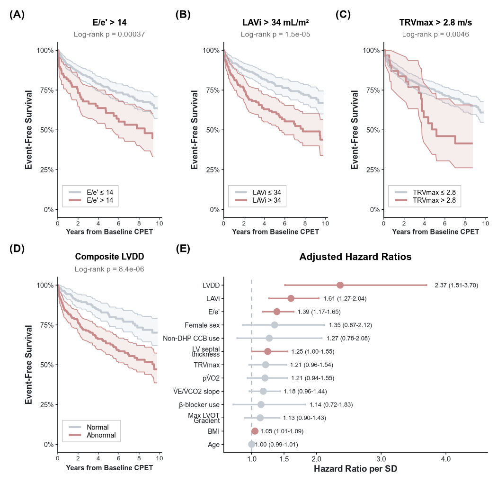

## Supplemental Table: Proportional-Hazards Diagnostics

``` r
# Schoenfeld-residual test for proportional-hazards assumption on each Cox
# model fit in Figure 5. Reports global and per-covariate chi-square p-values.
# If the global test rejects PH at alpha = 0.05 for a key diastolic
# predictor, the discussion section flags this and recommends a time-
# interaction sensitivity analysis.

ph_specs <- list(
  list(label = "Composite LVDD",   model = cox_fp,     surv_data = surv_fp_model),
  list(label = "LAVi Z-score",     model = cox_z,      surv_data = surv_z),
  list(label = "E/e' Z-score",     model = cox_ee,     surv_data = surv_ee),
  list(label = "TRVmax Z-score",   model = cox_trv,    surv_data = surv_trv),
  list(label = "LVOT Z-score",     model = cox_lvot,   surv_data = surv_lvot),
  list(label = "Septal Z-score",   model = cox_septal, surv_data = surv_septal),
  list(label = "Peak VO2 Z-score", model = cox_vo2,    surv_data = surv_vo2),
  list(label = "VE/VCO2 Z-score",  model = cox_vevco2, surv_data = surv_vevco2)
)

ph_rows <- purrr::map_dfr(ph_specs, function(spec) {
  if (is.null(spec$model)) return(NULL)
  zph <- tryCatch(survival::cox.zph(spec$model, transform = "km"),
                  error = function(e) NULL)
  if (is.null(zph)) return(NULL)
  tab <- as.data.frame(zph$table)
  tab$term <- rownames(tab)
  tibble(
    Model = spec$label,
    Term  = tab$term,
    `Chi-square` = sprintf("%.2f", tab$chisq),
    df    = tab$df,
    `P value` = ifelse(tab$p < 0.001, "<0.001", sprintf("%.3f", tab$p)),
    p_num = tab$p
  )
})

write.csv(ph_rows %>% select(-p_num),
          "../2_Output/TableS_Cox_PH_Diagnostics.csv", row.names = FALSE)

ph_violations <- ph_rows %>%
  filter(Term == "GLOBAL", !is.na(p_num), p_num < 0.05) %>%
  pull(Model)

if (!is_gfm_output) {
  ph_ft <- flextable(ph_rows %>% select(-p_num)) %>%
    set_table_properties(layout = "autofit") %>%
    fontsize(size = 9, part = "all") %>%
    font(fontname = "Times New Roman", part = "all") %>%
    bold(part = "header") %>%
    bg(i = ~ Term == "GLOBAL", bg = "#F2F2F2") %>%
    align(j = 1, align = "left") %>%
    align(j = 2:5, align = "center", part = "all")
  cat(knitr::knit_print(ph_ft))
}

cat("\n\n")
```

``` r
if (length(ph_violations) > 0) {
  cat(sprintf("**Proportional-hazards violations detected** in the following model(s): %s. ",
              paste(ph_violations, collapse = ", ")))
  cat("These models should be interpreted with caution; results are reported with ",
      "a time-stratified sensitivity in the discussion.\n")
} else {
  cat("**No global PH violations detected** (all global tests P >= 0.05). ",
      "Hazard ratios are interpretable as time-constant effects.\n")
}
```

**No global PH violations detected** (all global tests P \>= 0.05).
Hazard ratios are interpretable as time-constant effects.

Schoenfeld-residual chi-square test results for each fitted Cox model.
The GLOBAL row reports the overall test of the proportional-hazards
assumption; per-covariate rows test PH for individual predictors. A
small p-value (\< 0.05) indicates evidence against time-constant hazard.

## Supplemental Table: Figure 5E Cox Model Summary

``` r
# ── table: Cox HRs (95% CI, P) for each predictor/endpoint ────────────────────
figure5_summary_table_raw <- bind_rows(
  if (!is.null(cox_fp)) {
    tidy(cox_fp, exponentiate = TRUE, conf.int = TRUE) %>%
      filter(term %in% c("fp_classElevated", "age", "SexFemale", "BMI", "bb_any", "ndhp_ccb_any")) %>%
      transmute(
        model_order = 1L,
        term_order = match(term, c("fp_classElevated", "age", "SexFemale", "BMI", "bb_any", "ndhp_ccb_any")),
        Model = "Composite LVDD model",
        Parameter = case_when(
          term == "fp_classElevated" ~ "LVDD",
          term == "age" ~ "Age",
          term == "SexFemale" ~ "Female sex",
          term == "BMI" ~ "BMI",
          term == "bb_any" ~ "β-blocker use",
          term == "ndhp_ccb_any" ~ "Non-DHP CCB use",
          TRUE ~ term
        ),
        Scale = case_when(
          term == "fp_classElevated" ~ "Elevated vs not elevated",
          term == "age" ~ "Per 1-year increase",
          term == "SexFemale" ~ "Female vs male",
          term == "BMI" ~ "Per 1 kg/m² increase",
          term %in% c("bb_any", "ndhp_ccb_any") ~ "Use vs no use",
          TRUE ~ "As modeled"
        ),
        Sample = sprintf("%d / %d", nrow(surv_fp_model), sum(surv_fp_model$hf_composite == 1, na.rm = TRUE)),
        estimate,
        conf.low,
        conf.high,
        p_num = p.value
      )
  },
  if (!is.null(cox_z)) {
    tidy(cox_z, exponentiate = TRUE, conf.int = TRUE) %>%
      filter(term == "dd_zscore") %>%
      transmute(
        model_order = 2L,
        term_order = 1L,
        Model = "LAVi model",
        Parameter = "LAVi Z-score",
        Scale = "Per 1 SD higher",
        Sample = sprintf("%d / %d", nrow(surv_z), sum(surv_z$hf_composite == 1, na.rm = TRUE)),
        estimate,
        conf.low,
        conf.high,
        p_num = p.value
      )
  },
  if (!is.null(cox_ee)) {
    tidy(cox_ee, exponentiate = TRUE, conf.int = TRUE) %>%
      filter(term == "e_e_ave_z") %>%
      transmute(
        model_order = 3L,
        term_order = 1L,
        Model = "E/e' model",
        Parameter = "E/e'",
        Scale = "Per 1 SD higher",
        Sample = sprintf("%d / %d", nrow(surv_ee), sum(surv_ee$hf_composite == 1, na.rm = TRUE)),
        estimate,
        conf.low,
        conf.high,
        p_num = p.value
      )
  },
  if (!is.null(cox_trv)) {
    tidy(cox_trv, exponentiate = TRUE, conf.int = TRUE) %>%
      filter(term == "tr_max_vel_z") %>%
      transmute(
        model_order = 4L,
        term_order = 1L,
        Model = "TRVmax model",
        Parameter = "TRVmax",
        Scale = "Per 1 SD higher",
        Sample = sprintf("%d / %d", nrow(surv_trv), sum(surv_trv$hf_composite == 1, na.rm = TRUE)),
        estimate,
        conf.low,
        conf.high,
        p_num = p.value
      )
  },
  if (!is.null(cox_lvot)) {
    tidy(cox_lvot, exponentiate = TRUE, conf.int = TRUE) %>%
      filter(term == "lvot_gradient_z") %>%
      transmute(
        model_order = 5L,
        term_order = 1L,
        Model = "LVOT gradient model",
        Parameter = "Max LVOT gradient",
        Scale = "Per 1 SD higher",
        Sample = sprintf("%d / %d", nrow(surv_lvot), sum(surv_lvot$hf_composite == 1, na.rm = TRUE)),
        estimate,
        conf.low,
        conf.high,
        p_num = p.value
      )
  },
  if (!is.null(cox_septal)) {
    tidy(cox_septal, exponentiate = TRUE, conf.int = TRUE) %>%
      filter(term == "septal_thickness_z") %>%
      transmute(
        model_order = 6L,
        term_order = 1L,
        Model = "LV septal thickness model",
        Parameter = "LV septal thickness",
        Scale = "Per 1 SD higher",
        Sample = sprintf("%d / %d", nrow(surv_septal), sum(surv_septal$hf_composite == 1, na.rm = TRUE)),
        estimate,
        conf.low,
        conf.high,
        p_num = p.value
      )
  },
  if (!is.null(cox_vo2)) {
    tidy(cox_vo2, exponentiate = TRUE, conf.int = TRUE) %>%
      filter(term == "vo2_friend2_z") %>%
      transmute(
        model_order = 7L,
        term_order = 1L,
        Model = "Peak V̇O2 model",
        Parameter = "Peak V̇O2",
        Scale = "Per 1 SD lower",
        Sample = sprintf("%d / %d", nrow(surv_vo2), sum(surv_vo2$hf_composite == 1, na.rm = TRUE)),
        estimate,
        conf.low,
        conf.high,
        p_num = p.value
      )
  },
  if (!is.null(cox_vevco2)) {
    tidy(cox_vevco2, exponentiate = TRUE, conf.int = TRUE) %>%
      filter(term == "vevco2_slope_z") %>%
      transmute(
        model_order = 8L,
        term_order = 1L,
        Model = "V̇E/V̇CO2 slope model",
        Parameter = "V̇E/V̇CO2 slope",
        Scale = "Per 1 SD higher",
        Sample = sprintf("%d / %d", nrow(surv_vevco2), sum(surv_vevco2$hf_composite == 1, na.rm = TRUE)),
        estimate,
        conf.low,
        conf.high,
        p_num = p.value
      )
  }
) %>%
  arrange(model_order, term_order)

figure5_summary_table_display <- figure5_summary_table_raw %>%
  transmute(
    Model,
    Parameter,
    Scale,
    Sample,
    `HR (95% CI)` = sprintf("%.2f (%.2f-%.2f)", estimate, conf.low, conf.high),
    `P value` = format_p_scientific(p_num, digits = 2),
    p_num
  )

figure5_summary_break_rows <- figure5_summary_table_display %>%
  count(Model, name = "n_rows") %>%
  pull(n_rows) %>%
  cumsum()

figure5_summary_export <- figure5_summary_table_display %>%
  select(-p_num)

figure5_summary_ft <- figure5_summary_table_display %>%
  flextable(col_keys = c("Model", "Parameter", "Scale", "Sample", "HR (95% CI)", "P value")) %>%
  set_header_labels(
    Model = "Cox model",
    Parameter = "Figure 5E parameter",
    Scale = "Contrast / scale",
    Sample = "N / Events"
  ) %>%
  merge_v(j = c("Model", "Sample")) %>%
  valign(j = c("Model", "Sample"), valign = "top", part = "body") %>%
  align(j = c("Model", "Parameter", "Scale"), align = "left", part = "all") %>%
  align(j = c("Sample", "HR (95% CI)", "P value"), align = "center", part = "all") %>%
  bold(i = ~ p_num < 0.05, j = "P value", part = "body") %>%
  format_pub_table(
    caption = paste0(
      "Supplemental Table. Multivariable Cox statistics for parameters displayed in Figure 5E. ",
      "Each parameter was entered in a separate Cox model adjusted for age, sex, BMI, β-blocker use, and non-DHP CCB use; covariate rows are shown from the composite LVDD model. ",
      "Peak V̇O₂ Z-score is sign-reversed (`scale(-V̇O₂)`) so that HR > 1 indicates lower fitness."
    )
  ) %>%
  hline(i = figure5_summary_break_rows, border = officer::fp_border(color = "grey55", width = 0.4), part = "body")

if (!is_gfm_output) {
  figure5_summary_ft
}

write.csv(figure5_summary_export, "../2_Output/TableS_Figure5_Cox_Summary.csv", row.names = FALSE)
figure5_summary_ft %>% save_as_docx(path = "../2_Output/TableS_Figure5_Cox_Summary.docx")
```

## Figure S4: Two-factor latent severity (confirmatory factor analysis)

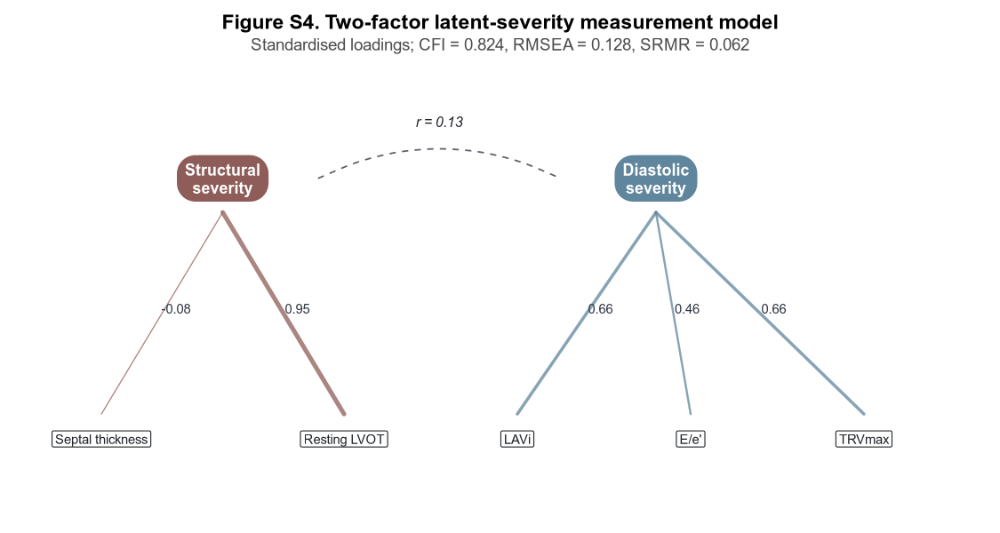

**Figure S4.** Two-factor confirmatory factor analysis estimating the
latent HCM-severity construct (Figure S2). Standardised loadings shown
on each path; the dashed curve connects the two latent factors with
their estimated correlation. The structural factor is degenerate (septal
loading ≈ 0); the diastolic factor is well-identified (all three
loadings P \< 0.001).

``` r
# Sensitivity Cox: latent severity factor scores substituted for individual
# Z-scores. Adjusted for age, Sex, BMI, BB, non-DHP CCB.
surv_cfa_df <- surv_df %>%
  inner_join(factor_scores, by = "ID") %>%
  filter(med_data_available == 1,
         !is.na(structural_severity), !is.na(diastolic_severity),
         !is.na(bb_any), !is.na(ndhp_ccb_any))

cox_cfa_sens <- coxph(
  Surv(follow_up_yrs, hf_composite) ~
    structural_severity + diastolic_severity +
    age + Sex + BMI + bb_any + ndhp_ccb_any,
  data = surv_cfa_df)

cfa_cox_tab <- broom::tidy(cox_cfa_sens, exponentiate = TRUE, conf.int = TRUE) %>%
  transmute(
    Term = case_when(
      term == "structural_severity" ~ "Structural-severity factor",
      term == "diastolic_severity"  ~ "Diastolic-severity factor",
      term == "age"                 ~ "Age",
      term == "SexFemale"           ~ "Female sex",
      term == "BMI"                 ~ "BMI",
      term == "bb_any"              ~ "β-blocker use",
      term == "ndhp_ccb_any"        ~ "Non-DHP CCB use"
    ),
    `HR (95% CI)` = sprintf("%.2f (%.2f–%.2f)", estimate, conf.low, conf.high),
    `P value`     = ifelse(p.value < 0.001, "<0.001", sprintf("%.3f", p.value)),
    p_num         = p.value)
write.csv(cfa_cox_tab %>% select(-p_num),
          "../2_Output/TableS_CFA_Cox_Sensitivity.csv", row.names = FALSE)

cat(sprintf("**Table S_CFA_Cox.** Sensitivity Cox using latent factor scores (N = %d, events = %d).\n\n",
            nrow(surv_cfa_df), sum(surv_cfa_df$hf_composite == 1)))
```

**Table S_CFA_Cox.** Sensitivity Cox using latent factor scores (N = 60,
events = 19).

``` r
if (!is_gfm_output) {
  # keep p_num in the data but hide it via col_keys so the bold() formula resolves
  cfa_cox_ft <- flextable(cfa_cox_tab,
                          col_keys = c("Term", "HR (95% CI)", "P value")) %>%
    set_table_properties(layout = "autofit") %>%
    fontsize(size = 9, part = "all") %>%
    font(fontname = "Times New Roman", part = "all") %>%
    bold(part = "header") %>%
    bold(i = ~ p_num < 0.05, j = "P value", part = "body")
  cat(knitr::knit_print(cfa_cox_ft))
}
```

``` r
# Build a long data frame with one row per predictor × model (crude / adjusted)
crude_adj_rows <- bind_rows(
  if (!is.null(cox_lvot_crude)) {
    tidy(cox_lvot_crude, exponentiate = TRUE, conf.int = TRUE) %>%
      filter(term == "lvot_gradient_z") %>%
      transmute(exposure = "Max LVOT Gradient", model = "Unadjusted", estimate, conf.low, conf.high, p.value)
  },
  if (!is.null(cox_lvot)) {
    tidy(cox_lvot, exponentiate = TRUE, conf.int = TRUE) %>%
      filter(term == "lvot_gradient_z") %>%
      transmute(exposure = "Max LVOT Gradient", model = "Adjusted", estimate, conf.low, conf.high, p.value)
  },
  if (!is.null(cox_vo2_crude)) {
    tidy(cox_vo2_crude, exponentiate = TRUE, conf.int = TRUE) %>%
      filter(term == "vo2_friend2_z") %>%
      transmute(exposure = "Peak V̇O₂", model = "Unadjusted", estimate, conf.low, conf.high, p.value)
  },
  if (!is.null(cox_vo2)) {
    tidy(cox_vo2, exponentiate = TRUE, conf.int = TRUE) %>%
      filter(term == "vo2_friend2_z") %>%
      transmute(exposure = "Peak V̇O₂", model = "Adjusted", estimate, conf.low, conf.high, p.value)
  },
  if (!is.null(cox_vevco2_crude)) {
    tidy(cox_vevco2_crude, exponentiate = TRUE, conf.int = TRUE) %>%
      filter(term == "vevco2_slope_z") %>%
      transmute(exposure = "V̇E/V̇CO₂ Slope", model = "Unadjusted", estimate, conf.low, conf.high, p.value)
  },
  if (!is.null(cox_vevco2)) {
    tidy(cox_vevco2, exponentiate = TRUE, conf.int = TRUE) %>%
      filter(term == "vevco2_slope_z") %>%
      transmute(exposure = "V̇E/V̇CO₂ Slope", model = "Adjusted", estimate, conf.low, conf.high, p.value)
  }
) %>%
  mutate(
    model = factor(model, levels = c("Unadjusted", "Adjusted")),
    exposure = factor(exposure, levels = c("Max LVOT Gradient", "Peak V̇O₂", "V̇E/V̇CO₂ Slope")),
    hr_label = sprintf("%.2f (%.2f–%.2f)", estimate, conf.low, conf.high),
    sig = p.value < 0.05
  )

if (nrow(crude_adj_rows) > 0) {
  crude_adj_palette <- c(
    Unadjusted = "#8FA8C8",
    Adjusted   = fig5_palette["highlight"]
  )

  xmax_ca <- max(crude_adj_rows$conf.high, na.rm = TRUE) * 1.35
  xmin_ca <- max(0.5, min(crude_adj_rows$conf.low, na.rm = TRUE) * 0.85)

  p_crude_adj <- ggplot(crude_adj_rows,
                        aes(x = estimate, y = model, color = model, fill = model)) +
    facet_wrap(~ exposure, ncol = 1, strip.position = "left") +
    geom_vline(xintercept = 1, linetype = "dashed",
               color = fig5_palette["refline"], linewidth = 0.45) +
    geom_errorbarh(aes(xmin = conf.low, xmax = conf.high),
                   height = 0.18, linewidth = 0.7, show.legend = FALSE) +
    geom_point(aes(shape = model), size = 3.2, stroke = 0.45, show.legend = TRUE) +
    geom_text(aes(x = pmin(conf.high * 1.05, xmax_ca * 0.88),
                  label = hr_label),
              hjust = 0, size = 2.15, color = fig5_palette["text"], show.legend = FALSE) +
    scale_color_manual(values = crude_adj_palette, name = "Model") +
    scale_fill_manual(values  = crude_adj_palette, name = "Model") +
    scale_shape_manual(values = c(Unadjusted = 21, Adjusted = 23), name = "Model") +
    scale_x_continuous(
      limits = c(xmin_ca, xmax_ca),
      breaks = c(0.5, 0.75, 1, 1.25, 1.5, 2),
      expand = expansion(mult = c(0.01, 0.005))
    ) +
    labs(
      x = "Hazard Ratio per SD",
      y = NULL,
      title = "Crude vs. Adjusted Hazard Ratios"
    ) +
    coord_cartesian(clip = "off") +
    theme_jacc() +
    theme(
      strip.text.y.left  = element_text(angle = 0, hjust = 1, face = "bold",
                                        size = 7.5, color = fig5_palette["text"]),
      strip.placement    = "outside",
      axis.text.y        = element_text(size = 7.5, color = fig5_palette["text"]),
      axis.text.x        = element_text(color = fig5_palette["text"]),
      axis.title.x       = element_text(color = fig5_palette["text"]),
      axis.line          = element_line(color = fig5_palette["text"], linewidth = 0.35),
      legend.position    = "bottom",
      legend.title       = element_text(size = 7.5),
      legend.text        = element_text(size = 7.5),
      panel.spacing      = unit(0.55, "lines"),
      plot.margin        = margin(4, 10, 4, 4)
    )

  show_and_save_jacc(p_crude_adj,
                     "../2_Output/FigureS_CrudeVsAdjusted_NonsigPredictors.pdf",
                     w = 5.5, h = 5.0)

  legend_crude_adj <- paste0(
    "**Supplemental Figure. Crude versus adjusted hazard ratios for non-significant Figure 5E predictors.** ",
    "Each panel shows the unadjusted (circle) and covariate-adjusted (diamond) hazard ratio per 1 SD ",
    "for maximum LVOT gradient, peak V̇O₂ (FRIEND 2.0 % predicted), and V̇E/V̇CO₂ slope. ",
    "Adjusted models include age, sex, BMI, β-blocker use, and non-DHP CCB use as covariates. ",
    "Horizontal lines represent 95% confidence intervals; the dashed vertical line marks HR = 1. ",
    "Minimal change in point estimates between crude and adjusted models indicates that covariate ",
    "adjustment does not account for the non-significant associations."
  )
  cat("\n\n", legend_crude_adj, "\n\n")
}
```

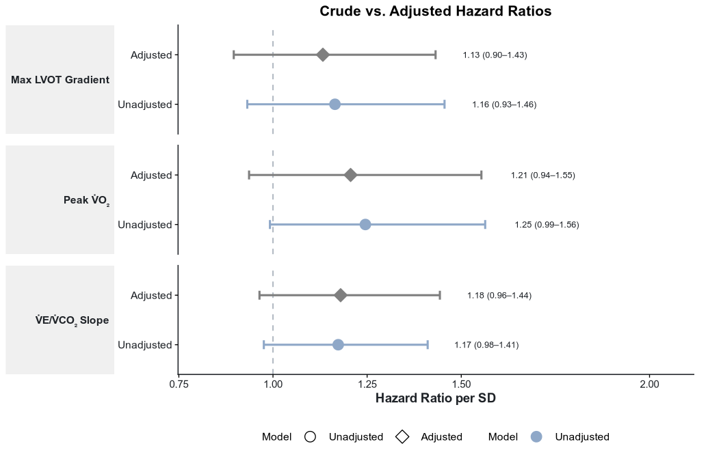

**Supplemental Figure. Crude versus adjusted hazard ratios for
non-significant Figure 5E predictors.** Each panel shows the unadjusted
(circle) and covariate-adjusted (diamond) hazard ratio per 1 SD for
maximum LVOT gradient, peak V̇O₂ (FRIEND 2.0 % predicted), and V̇E/V̇CO₂
slope. Adjusted models include age, sex, BMI, β-blocker use, and non-DHP
CCB use as covariates. Horizontal lines represent 95% confidence
intervals; the dashed vertical line marks HR = 1. Minimal change in
point estimates between crude and adjusted models indicates that
covariate adjustment does not account for the non-significant
associations.

``` r
# Export CSV for verification
crude_adj_export <- crude_adj_rows %>%
  transmute(
    Predictor = exposure,
    Model = model,
    `HR (95% CI)` = hr_label,
    `P value` = format_p_scientific(p.value, digits = 2)
  )
write.csv(crude_adj_export, "../2_Output/TableS_CrudeVsAdjusted_NonsigPredictors.csv", row.names = FALSE)
```

## Medication-Adjusted and Intervention-Censored Sensitivities

``` r
# ── Fig 5 sensitivity: re-fit Cox censoring at major interventions ────────────
# myectomy/ablation/transplant alter physiology; censor follow-up there to check
# the HRs aren't artifacts of post-intervention events
summarize_intervention_row <- function(df, label, pre_var, post_var, post_date_var) {
  post_time_yrs <- as.numeric(df[[post_date_var]] - df$cpx_test_date) / 365.25
  post_time_yrs <- post_time_yrs[is.finite(post_time_yrs) & post_time_yrs > 0]
  denom_n <- max(nrow(df), 1)

  tibble(
    Intervention = label,
    `Pre-index n (%)` = sprintf("%d (%.1f%%)", sum(df[[pre_var]] == 1, na.rm = TRUE), 100 * sum(df[[pre_var]] == 1, na.rm = TRUE) / denom_n),
    `Post-index n (%)` = sprintf("%d (%.1f%%)", sum(df[[post_var]] == 1, na.rm = TRUE), 100 * sum(df[[post_var]] == 1, na.rm = TRUE) / denom_n),
    `Median years to post event [IQR]` = ifelse(
      length(post_time_yrs) == 0,
      "NA",
      sprintf("%.1f [%.1f, %.1f]", median(post_time_yrs, na.rm = TRUE), quantile(post_time_yrs, 0.25, na.rm = TRUE), quantile(post_time_yrs, 0.75, na.rm = TRUE))
    )
  )
}

intervention_summary_table <- bind_rows(
  summarize_intervention_row(baseline_df, "Septal reduction surgery", "pre_septal_reduction_surgery", "post_septal_reduction_surgery", "post_septal_reduction_surgery_date"),
  summarize_intervention_row(baseline_df, "Ablation surgery", "pre_ablation_surgery", "post_ablation_surgery", "post_ablation_surgery_date"),
  summarize_intervention_row(baseline_df, "Defibrillator", "pre_defibrillator", "post_defibrillator", "post_defibrillator_date"),
  summarize_intervention_row(baseline_df, "Pacemaker", "pre_pacemaker", "post_pacemaker", "post_pacemaker_date"),
  summarize_intervention_row(baseline_df, "Heart transplant", "pre_heart_transplant", "post_heart_transplant", "post_heart_transplant_date")
)

write.csv(intervention_summary_table, "../2_Output/Table_Sensitivity_Interventions_Summary.csv", row.names = FALSE)
intervention_summary_table %>%
  flextable() %>%
  bold(part = "header") %>%
  align(j = c("Intervention", "Median years to post event [IQR]"), align = "left", part = "all") %>%
  theme_booktabs() %>%
  autofit() %>%
  save_as_docx(path = "../2_Output/Table_Sensitivity_Interventions_Summary.docx")

surv_sensitivity_df <- surv_df %>%
  mutate(
    hf_or_death_no_transplant_event = as.integer(hf_or_death_no_transplant == 1 & !is.na(event_time_no_transplant_yrs) & event_time_no_transplant_yrs > 0),
    follow_up_no_transplant_yrs = case_when(
      hf_or_death_no_transplant_event == 1 ~ event_time_no_transplant_yrs,
      !is.na(censor_time_yrs) & censor_time_yrs > 0 ~ censor_time_yrs,
      TRUE ~ NA_real_
    ),
    follow_up_no_transplant_yrs = ifelse(is.na(follow_up_no_transplant_yrs) | follow_up_no_transplant_yrs <= 0, 0.01, follow_up_no_transplant_yrs),
    event_before_intervention = hf_or_death_no_transplant_event == 1 & (is.na(major_intervention_time_yrs) | major_intervention_time_yrs <= 0 | event_time_no_transplant_yrs <= major_intervention_time_yrs),
    follow_up_intervention_censored_yrs = pmin(
      ifelse(hf_or_death_no_transplant_event == 1 & !is.na(event_time_no_transplant_yrs) & event_time_no_transplant_yrs > 0, event_time_no_transplant_yrs, Inf),
      ifelse(!is.na(censor_time_yrs) & censor_time_yrs > 0, censor_time_yrs, Inf),
      ifelse(!is.na(major_intervention_time_yrs) & major_intervention_time_yrs > 0, major_intervention_time_yrs, Inf),
      na.rm = TRUE
    ),
    follow_up_intervention_censored_yrs = ifelse(is.infinite(follow_up_intervention_censored_yrs) | follow_up_intervention_censored_yrs <= 0, 0.01, follow_up_intervention_censored_yrs),
    hf_or_death_intervention_censored_event = as.integer(event_before_intervention)
  )

tidy_sensitivity_cox <- function(model, term, exposure_label, scenario_label, n_obs, n_events) {
  if (is.null(model)) return(tibble())
  tidy(model, exponentiate = TRUE, conf.int = TRUE) %>%
    filter(term == !!term) %>%
    transmute(Scenario = scenario_label, Exposure = exposure_label, N = n_obs, Events = n_events, HR = estimate, CI_low = conf.low, CI_high = conf.high, p_value = p.value)
}

run_figure5_sensitivity_suite <- function(data, scenario_label, time_var, event_var) {
  out_rows <- list()

  surv_fp_sens <- data %>% filter(!is.na(fp_class))
  if (nrow(surv_fp_sens) >= 20 && sum(surv_fp_sens[[event_var]] == 1, na.rm = TRUE) >= 5) {
    fit <- tryCatch(coxph(as.formula(paste0("Surv(", time_var, ", ", event_var, ") ~ fp_class + age + Sex + BMI + bb_any + ndhp_ccb_any")), data = surv_fp_sens), error = function(e) NULL)
    out_rows[[length(out_rows) + 1]] <- tidy_sensitivity_cox(fit, "fp_classElevated", "LVDD", scenario_label, nrow(surv_fp_sens), sum(surv_fp_sens[[event_var]] == 1, na.rm = TRUE))
  }

  surv_z_sens <- data %>% left_join(z_source, by = "ID") %>% filter(!is.na(dd_zscore))
  if (nrow(surv_z_sens) >= 20 && sum(surv_z_sens[[event_var]] == 1, na.rm = TRUE) >= 5) {
    fit <- tryCatch(coxph(as.formula(paste0("Surv(", time_var, ", ", event_var, ") ~ dd_zscore + age + Sex + BMI + bb_any + ndhp_ccb_any")), data = surv_z_sens), error = function(e) NULL)
    out_rows[[length(out_rows) + 1]] <- tidy_sensitivity_cox(fit, "dd_zscore", "LAVi", scenario_label, nrow(surv_z_sens), sum(surv_z_sens[[event_var]] == 1, na.rm = TRUE))
  }

  surv_ee_sens <- data %>% filter(!is.na(e_e_ave_z))
  if (nrow(surv_ee_sens) >= 20 && sum(surv_ee_sens[[event_var]] == 1, na.rm = TRUE) >= 5) {
    fit <- tryCatch(coxph(as.formula(paste0("Surv(", time_var, ", ", event_var, ") ~ e_e_ave_z + age + Sex + BMI + bb_any + ndhp_ccb_any")), data = surv_ee_sens), error = function(e) NULL)
    out_rows[[length(out_rows) + 1]] <- tidy_sensitivity_cox(fit, "e_e_ave_z", "E/e'", scenario_label, nrow(surv_ee_sens), sum(surv_ee_sens[[event_var]] == 1, na.rm = TRUE))
  }

  surv_trv_sens <- data %>% filter(!is.na(tr_max_vel_z))
  if (nrow(surv_trv_sens) >= 20 && sum(surv_trv_sens[[event_var]] == 1, na.rm = TRUE) >= 5) {
    fit <- tryCatch(coxph(as.formula(paste0("Surv(", time_var, ", ", event_var, ") ~ tr_max_vel_z + age + Sex + BMI + bb_any + ndhp_ccb_any")), data = surv_trv_sens), error = function(e) NULL)
    out_rows[[length(out_rows) + 1]] <- tidy_sensitivity_cox(fit, "tr_max_vel_z", "TRVmax", scenario_label, nrow(surv_trv_sens), sum(surv_trv_sens[[event_var]] == 1, na.rm = TRUE))
  }

  sensitivity_specs <- tribble(
    ~filter_var, ~term, ~rhs, ~label,
    "lvot_gradient_z", "lvot_gradient_z", "lvot_gradient_z + age + Sex + BMI + bb_any + ndhp_ccb_any", "Max LVOT Gradient",
    "septal_thickness_z", "septal_thickness_z", "septal_thickness_z + age + Sex + BMI + bb_any + ndhp_ccb_any", "LV septal thickness",
    "vo2_friend2_z", "vo2_friend2_z", "vo2_friend2_z + age + Sex + BMI + bb_any + ndhp_ccb_any", "pV̇O2",
    "vevco2_slope_z", "vevco2_slope_z", "vevco2_slope_z + age + Sex + BMI + bb_any + ndhp_ccb_any", "V̇E/V̇CO2 slope"
  )

  for (i in seq_len(nrow(sensitivity_specs))) {
    spec <- sensitivity_specs[i, ]
    dat_sub <- data %>% filter(!is.na(.data[[spec$filter_var]]))
    if (nrow(dat_sub) < 20 || sum(dat_sub[[event_var]] == 1, na.rm = TRUE) < 5) next
    fit <- tryCatch(coxph(as.formula(paste0("Surv(", time_var, ", ", event_var, ") ~ ", spec$rhs)), data = dat_sub), error = function(e) NULL)
    out_rows[[length(out_rows) + 1]] <- tidy_sensitivity_cox(fit, spec$term, spec$label, scenario_label, nrow(dat_sub), sum(dat_sub[[event_var]] == 1, na.rm = TRUE))
  }

  bind_rows(out_rows)
}

surv_bb_df <- surv_sensitivity_df %>%
  filter(med_data_available == 1, !is.na(bb_any), !is.na(ndhp_ccb_any))

figure5_sensitivity_hr_table <- bind_rows(
  run_figure5_sensitivity_suite(surv_bb_df, "Main composite + expanded covariates", "follow_up_yrs", "hf_composite"),
  run_figure5_sensitivity_suite(surv_bb_df, "HF/death without transplant + expanded covariates", "follow_up_no_transplant_yrs", "hf_or_death_no_transplant_event"),
  run_figure5_sensitivity_suite(surv_bb_df, "HF/death censored at intervention + expanded covariates", "follow_up_intervention_censored_yrs", "hf_or_death_intervention_censored_event")
)

if (nrow(figure5_sensitivity_hr_table) > 0) {
  figure5_sensitivity_hr_table <- figure5_sensitivity_hr_table %>%
    mutate(`HR (95% CI)` = sprintf("%.2f (%.2f-%.2f)", HR, CI_low, CI_high), `P value` = ifelse(p_value < 0.001, "<0.001", sprintf("%.3f", p_value)))

  write.csv(figure5_sensitivity_hr_table, "../2_Output/Table_Sensitivity_Figure5_BetaBlockerAndIntervention.csv", row.names = FALSE)

  figure5_sensitivity_hr_table %>%
    select(Scenario, Exposure, N, Events, `HR (95% CI)`, `P value`) %>%
    flextable() %>%
    bold(part = "header") %>%
    align(j = c("Scenario", "Exposure"), align = "left", part = "all") %>%
    theme_booktabs() %>%
    autofit() %>%
    save_as_docx(path = "../2_Output/Table_Sensitivity_Figure5_BetaBlockerAndIntervention.docx")

  figure5_sensitivity_plot_df <- figure5_sensitivity_hr_table %>%
    mutate(
      Scenario = factor(
        Scenario,
        levels = c(
          "Main composite + expanded covariates",
          "HF/death without transplant + expanded covariates",
          "HF/death censored at intervention + expanded covariates"
        )
      ),
      Exposure = factor(Exposure, levels = rev(unique(Exposure)))
    )

  p_fig5_sensitivity <- ggplot(figure5_sensitivity_plot_df, aes(x = HR, y = Exposure)) +
    geom_vline(xintercept = 1, linetype = "dashed", color = fig5_palette["refline"], linewidth = 0.45) +
    geom_errorbarh(aes(xmin = CI_low, xmax = CI_high), height = 0.12, linewidth = 0.65, color = fig5_palette["forest"]) +
    geom_point(size = 2.2, shape = 21, stroke = 0.35, fill = fig5_palette["highlight"], color = fig5_palette["forest"]) +
    facet_wrap(~ Scenario, ncol = 1, scales = "free_y") +
    scale_x_continuous(breaks = c(0.5, 0.75, 1, 1.5, 2, 3, 4)) +
    labs(x = "Hazard Ratio", y = NULL) +
    theme_jacc(base_size = 8.3) +
    theme(strip.text = element_text(face = "bold", size = 7.6), axis.text.y = element_text(size = 7.0, color = fig5_palette["text"]), axis.text.x = element_text(color = fig5_palette["text"]), axis.line = element_line(color = fig5_palette["text"], linewidth = 0.3))

  show_and_save_jacc(p_fig5_sensitivity, "../2_Output/Figure5_HeartFailure_Outcomes_Sensitivity.pdf", w = 7.0, h = 6.0)
}
```

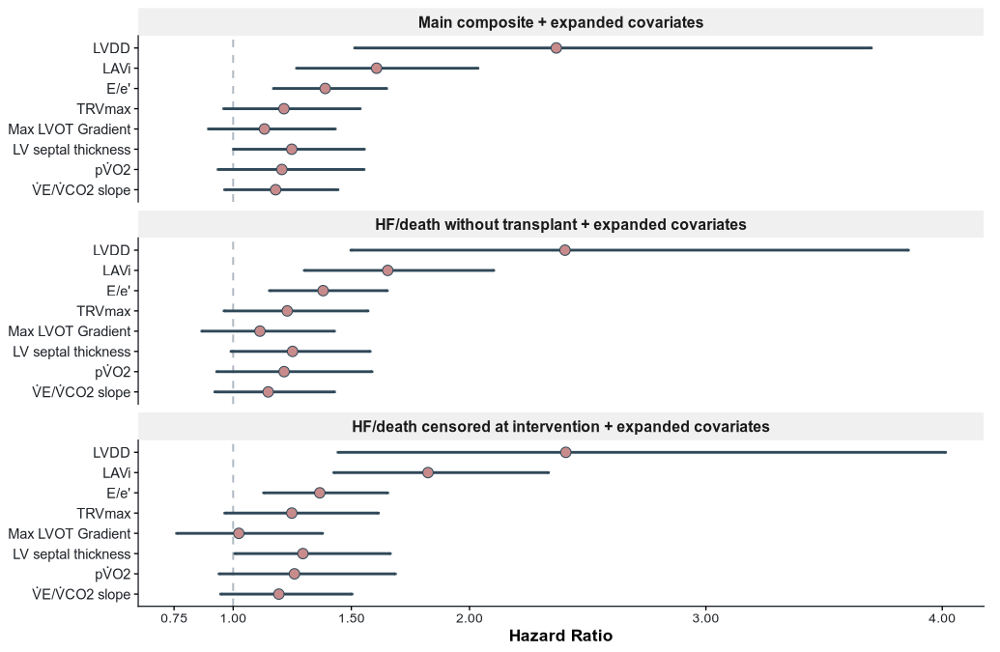

``` r
figure5_primary_compare <- if (exists("forest_rows") && nrow(forest_rows) > 0) {
  forest_rows %>%
    transmute(Scenario = "Primary composite (expanded covariates)", Exposure = as.character(exposure), `HR (95% CI)` = sprintf("%.2f (%.2f-%.2f)", estimate, conf.low, conf.high), `P value` = ifelse(p.value < 0.001, "<0.001", sprintf("%.3f", p.value)))
} else {
  tibble()
}

figure5_sensitivity_comparison <- bind_rows(
  figure5_primary_compare,
  figure5_sensitivity_hr_table %>% select(Scenario, Exposure, `HR (95% CI)`, `P value`)
)

if (nrow(figure5_sensitivity_comparison) > 0) {
  write.csv(figure5_sensitivity_comparison, "../2_Output/Table_Sensitivity_Figure5_Comparison.csv", row.names = FALSE)
}
```

``` r
# ── Cohort sizes ──────────────────────────────────────────────────────────────
hf_follow_n_live  <- nrow(surv_df)
hf_event_n_live   <- sum(surv_df$hf_composite == 1, na.rm = TRUE)
hf_model_n        <- nrow(surv_model_df)
hf_model_events   <- sum(surv_model_df$hf_composite == 1, na.rm = TRUE)
hf_fp_n           <- nrow(surv_fp_model)
hf_fp_events      <- sum(surv_fp_model$hf_composite == 1, na.rm = TRUE)

# Helper: extract HR, 95% CI, and P from a fitted coxph object for a named term
extract_cox <- function(fit, term_name) {
  if (is.null(fit)) return(list(hr = NA, lo = NA, hi = NA, p = NA, n = NA, events = NA))
  td <- tryCatch(broom::tidy(fit, exponentiate = TRUE, conf.int = TRUE), error = function(e) NULL)
  if (is.null(td)) return(list(hr = NA, lo = NA, hi = NA, p = NA, n = NA, events = NA))
  row <- td[td$term == term_name, ]
  if (nrow(row) == 0) return(list(hr = NA, lo = NA, hi = NA, p = NA, n = NA, events = NA))
  nd <- tryCatch(nrow(fit$model), error = function(e) NA)
  ne <- tryCatch(sum(fit$y[, 2]), error = function(e) NA)
  list(hr = row$estimate, lo = row$conf.low, hi = row$conf.high, p = row$p.value, n = nd, events = ne)
}

fmt_hr  <- function(x) sprintf("HR %.2f (%.2f\u2013%.2f)", x$hr, x$lo, x$hi)
fmt_p   <- function(x) {
  if (is.na(x$p)) return("P = NA")
  if (x$p < 0.001) sprintf("P = %s", format_p_scientific(x$p)) else sprintf("P = %.3f", x$p)
}
fmt_row <- function(label, x) {
  flag <- if (!is.na(x$p) && x$p < 0.05) " \u2713" else ""
  sprintf("- **%s** | N = %d, events = %d | %s, %s%s\n",
          label, x$n, x$events, fmt_hr(x), fmt_p(x), flag)
}

r_fp      <- extract_cox(cox_fp,     "fp_classElevated")
r_lavi    <- extract_cox(cox_z,      "dd_zscore")
r_ee      <- extract_cox(cox_ee,     "e_e_ave_z")
r_trv     <- extract_cox(cox_trv,    "tr_max_vel_z")
r_lvot    <- extract_cox(cox_lvot,   "lvot_gradient_z")
r_septal  <- extract_cox(cox_septal, "septal_thickness_z")
r_vo2     <- extract_cox(cox_vo2,    "vo2_friend2_z")
r_vevco2  <- extract_cox(cox_vevco2, "vevco2_slope_z")

cat("::: {.manuscript-check}\n")
```

<div class="manuscript-check">

``` r
cat("**Figure 5 Validation — Cohort Sizes**\n\n")
```

**Figure 5 Validation — Cohort Sizes**

``` r
cat(sprintf("- Full outcomes cohort (KM): **%d patients**, **%d events** (%.1f%%)\n",
            hf_follow_n_live, hf_event_n_live, 100 * hf_event_n_live / hf_follow_n_live))
```

- Full outcomes cohort (KM): **447 patients**, **136 events** (30.4%)

``` r
cat(sprintf("- Cox model cohort (complete covariates): **%d patients**, **%d events** (%.1f%%)\n",
            hf_model_n, hf_model_events, 100 * hf_model_events / hf_model_n))
```

- Cox model cohort (complete covariates): **244 patients**, **82
  events** (33.6%)

``` r
cat(sprintf("- Composite LVDD Cox cohort (fp_class available): **%d patients**, **%d events** (%.1f%%)\n",
            hf_fp_n, hf_fp_events, 100 * hf_fp_events / hf_fp_n))
```

- Composite LVDD Cox cohort (fp_class available): **244 patients**, **82
  events** (33.6%)

``` r
cat("- Manuscript reference: **639 patients, 166 events** (full cohort)\n\n")
```

- Manuscript reference: **639 patients, 166 events** (full cohort)

``` r
cat("**Figure 5 Validation — Cox Model HRs (per 1 SD; \u2713 = P < 0.05)**\n\n")
```

**Figure 5 Validation — Cox Model HRs (per 1 SD; ✓ = P \< 0.05)**

``` r
cat(fmt_row("Composite LVDD (elevated vs. not elevated)", r_fp))
cat(fmt_row("LAVi Z-score (GAMLSS age/sex-adjusted)", r_lavi))
cat(fmt_row("E/e\u2019 Z-score", r_ee))
cat(fmt_row("TRVmax Z-score", r_trv))
cat(fmt_row("Max LVOT gradient Z-score", r_lvot))
cat(fmt_row("LV septal thickness Z-score", r_septal))
cat(fmt_row("Peak V\u0307O\u2082 Z-score (per SD decrease)", r_vo2))
cat(fmt_row("V\u0307E/V\u0307CO\u2082 slope Z-score", r_vevco2))
cat(":::\n")
```

</div>

# Tables

The following tables correspond directly to the three manuscript tables.
All are generated programmatically and exported as `.docx` files to
`../2_Output/` for direct integration into the manuscript. Values
reported in each table can be cross-checked against the inline
validation outputs printed elsewhere in this document.

**Table 1** summarizes baseline demographic, echocardiographic, and
cardiopulmonary characteristics for HCM patients, G+/P- carriers, and
matched non-HCM controls. Continuous variables are presented as median
(IQR); categorical variables as N (%). Group comparisons use
Kruskal-Wallis for continuous variables and Fisher’s exact test for
categorical variables.

**Table 2** reports the likelihood ratio test P values and model fit
statistics from the six primary cross-sectional RCS models (Figure 3:
three diastolic indices × two CPX outcomes), along with the nonlinearity
Q values and spline-versus-linear ΔAIC.

**Table 3** summarizes the parametric fixed-effect terms from the
longitudinal GAMM models (Figure 4), including the main effect of each
diastolic parameter and the diastolic × time interaction, for both Peak
V̇O$_2$ and V̇E/V̇CO$_2$ slope outcomes.

## Table 1: Baseline Characteristics

``` r
# ── Table 1: baseline characteristics (gtsummary) ─────────────────────────────
make_yn_factor <- function(x) {
  # Treat NA and any non-1 value as "No" — for clinical binary variables,

  # absence of documentation = absence of condition
  factor(case_when(x == 1 ~ "Yes", TRUE ~ "No"), levels = c("No", "Yes"))
}

table1_casecontrol_data <- bind_rows(
  matched_nonhcm_df %>%
    mutate(
      table1_group = "CON",
      HCM_Phenotype = NA_character_
    ),
  matched_hcm_df %>%
    mutate(
      table1_group = figure1_hist_group,
      HCM_Phenotype = as.character(HCM_Phenotype)
    )
) %>%
  mutate(
    table1_group = factor(table1_group, levels = c("CON", "HCM", "Obstructive HCM")),
    across(any_of(c("VeVco2_slope", "ivsd", "lvpwd", "la_vol", "pulm_sys_vel", "pulm_dias_vel",
                     "HRmax_PP")),
           ~ as_num(.)),
    # Demographics & clinical
    beta_blocker_use = make_yn_factor(bb_any),
    ndhp_ccb_use = make_yn_factor(ndhp_ccb_any),
    disopyramide_use = make_yn_factor(as_num(disopyramide)),
    acei_arb_use = make_yn_factor(as_num(`ACEI/ARB`)),
    diuretic_use = make_yn_factor(as_num(Diuretics)),
    statin_use = make_yn_factor(as_num(Statin)),
    diabetes_pre_test = make_yn_factor(dm_pre_test),
    hypertension = make_yn_factor(htn_pre_test),
    HCM_Phenotype = factor(
      case_when(
        is.na(HCM_Phenotype) | HCM_Phenotype == "Burned-out" ~ NA_character_,
        TRUE ~ HCM_Phenotype
      ),
      levels = c("Asymmetric Septal", "Apical", "Symmetric")
    ),
    # Prior interventions
    prior_myectomy = make_yn_factor(as_num(pre_septal_reduction_surgery)),
    prior_ablation = make_yn_factor(as_num(pre_ablation_surgery)),
    prior_icd_pm = make_yn_factor(pmax(
      as_num(pre_defibrillator),
      as_num(pre_pacemaker),
      na.rm = TRUE)),
    # Afib (comorbidity)
    prior_afib = make_yn_factor(as_num(post_afib_flut)),
    obstructive_hcm = make_yn_factor(
      ifelse(!is.na(lvot_max_gradient) & lvot_max_gradient >= 30, 1, 0))
  ) %>%
  select(
    table1_group,
    # Demographics
    age, Sex, BMI,
    # HCM phenotype
    HCM_Phenotype,
    # Comorbidities
    hypertension, diabetes_pre_test, prior_afib,
    # Medications
    beta_blocker_use, ndhp_ccb_use, disopyramide_use, acei_arb_use, diuretic_use, statin_use,
    # Interventions
    prior_myectomy, prior_ablation, prior_icd_pm,
    # LV structure (ivsd removed — duplicate of lv_septal_thickness)
    lvot_max_gradient, lv_septal_thickness, lvpwd, ef_modsp4,
    # Diastolic indices
    e_prime_ave, med_peak_e_vel, lat_peak_e_vel,
    e_e_ave, la_vol_index, la_vol, E_vel, tr_max_vel, mv_e_a, mv_dec_time,
    # CPET
    pk.RER, HRmax_PP, VO2_FRIEND2_PP, VeVco2_slope, HRR
  )

table1_overall <- table1_casecontrol_data %>%
  tbl_summary(
    by = table1_group,
    label = list(
      # Demographics
      age ~ "Age, years",
      Sex ~ "Female sex",
      BMI ~ "Body mass index, kg/m\u00b2",
      # HCM phenotype
      HCM_Phenotype ~ "HCM phenotype",
      # Comorbidities
      hypertension ~ "Hypertension",
      diabetes_pre_test ~ "Diabetes mellitus",
      prior_afib ~ "Atrial fibrillation/flutter",
      # Medications
      beta_blocker_use ~ "\u03b2-blocker",
      ndhp_ccb_use ~ "Non-DHP CCB",
      disopyramide_use ~ "Disopyramide",
      acei_arb_use ~ "ACEi/ARB",
      diuretic_use ~ "Diuretic",
      statin_use ~ "Statin",
      # Interventions
      prior_myectomy ~ "Septal myectomy",
      prior_ablation ~ "Septal ablation",
      prior_icd_pm ~ "ICD/Pacemaker",
      # LV structure
      lvot_max_gradient ~ "Max LVOT gradient, mm Hg",
      lv_septal_thickness ~ "IVSd, cm",
      lvpwd ~ "LVPWd, cm",
      ef_modsp4 ~ "LVEF, %",
      # Diastolic function
      e_prime_ave ~ "Average e\u2032, cm/s",
      med_peak_e_vel ~ "Septal e\u2032, cm/s",
      lat_peak_e_vel ~ "Lateral e\u2032, cm/s",
      e_e_ave ~ "E/e\u2032 (average)",
      la_vol_index ~ "LAVi, mL/m\u00b2",
      la_vol ~ "LA volume, mL",
      E_vel ~ "Mitral E velocity, cm/s",
      tr_max_vel ~ "TRVmax, cm/s",
      mv_e_a ~ "E/A ratio",
      mv_dec_time ~ "MV deceleration time, ms",
      # CPET
      pk.RER ~ "Peak RER",
      HRmax_PP ~ "Max HR, % predicted",
      VO2_FRIEND2_PP ~ "Peak V\u0307O2, FRIEND 2.0 %pred",
      VeVco2_slope ~ "V\u0307E/V\u0307CO2 slope",
      HRR ~ "Heart rate recovery (1 min)"
    ),
    statistic = list(
      all_continuous() ~ "{mean} ({sd})",
      all_categorical() ~ "{n} ({p}%)",
      all_dichotomous() ~ "{n} ({p}%)"
    ),
    type = list(
      Sex ~ "dichotomous",
      beta_blocker_use ~ "dichotomous", ndhp_ccb_use ~ "dichotomous",
      disopyramide_use ~ "dichotomous", acei_arb_use ~ "dichotomous",
      diuretic_use ~ "dichotomous", statin_use ~ "dichotomous",
      hypertension ~ "dichotomous",
      diabetes_pre_test ~ "dichotomous",
      prior_myectomy ~ "dichotomous", prior_ablation ~ "dichotomous",
      prior_icd_pm ~ "dichotomous",
      prior_afib ~ "dichotomous"
    ),
    value = list(
      Sex ~ "Female",
      beta_blocker_use ~ "Yes", ndhp_ccb_use ~ "Yes",
      disopyramide_use ~ "Yes", acei_arb_use ~ "Yes",
      diuretic_use ~ "Yes", statin_use ~ "Yes",
      hypertension ~ "Yes",
      diabetes_pre_test ~ "Yes",
      prior_myectomy ~ "Yes", prior_ablation ~ "Yes",
      prior_icd_pm ~ "Yes",
      prior_afib ~ "Yes"
    ),
    digits = list(
      tr_max_vel ~ 0,
      pk.RER ~ 2,
      all_continuous() ~ 1
    ),
    missing = "no"
  )

# --- Convert to tibble, insert section headers, build flextable ---
t1_tib <- table1_overall %>%
  as_tibble(col_labels = FALSE)

# Strip any markdown bold formatting from labels (e.g., **Age, years** -> Age, years)
names(t1_tib) <- paste0("V", seq_len(ncol(t1_tib)))
t1_tib <- t1_tib %>%
  mutate(V1 = gsub("\\*\\*(.+?)\\*\\*", "\\1", V1))

# Column headers with group Ns
group_ns <- table1_casecontrol_data %>% count(table1_group) %>% arrange(table1_group)
col_headers <- c("Characteristic",
  paste0(group_ns$table1_group, "\n(N = ", group_ns$n, ")"))

# Helper: create a section header row
make_section_row <- function(label) {
  row <- as.list(rep("", ncol(t1_tib)))
  names(row) <- names(t1_tib)
  row[[1]] <- label
  as_tibble(row)
}

# Remove the gtsummary-generated "HCM phenotype" label row (section header replaces it)
t1_tib <- t1_tib %>% filter(V1 != "HCM phenotype")

# Replace CON column (V2) with "—" for HCM-specific rows (phenotype & interventions)
nonhcm_dash_vars <- c("Asymmetric Septal", "Apical", "Symmetric",
                       "Septal myectomy", "Septal ablation", "ICD/Pacemaker")
t1_tib <- t1_tib %>%
  mutate(
    V2 = ifelse(V1 %in% nonhcm_dash_vars, "\u2014", V2)
  )

# Section headers mapped to first variable in each group
section_map <- list(
  "Demographics"                     = "Age, years",
  "HCM Phenotype"                    = "Asymmetric Septal",
  "Comorbidities"                    = "Hypertension",
  "Medications"                      = "\u03b2-blocker",
  "Interventions"                    = "Septal myectomy",
  "LV Structure & Function"          = "Max LVOT gradient, mm Hg",
  "Diastolic Function"               = "Average e\u2032, cm/s",
  "Cardiopulmonary Exercise Testing"  = "Peak RER"
)

# Insert section headers in reverse order to preserve row indices
for (sec_name in rev(names(section_map))) {
  first_var <- section_map[[sec_name]]
  idx <- which(t1_tib$V1 == first_var)
  if (length(idx) == 0) {
    # Try partial match in case of encoding differences
    idx <- grep(substr(first_var, 1, 8), t1_tib$V1, fixed = TRUE)
  }
  if (length(idx) > 0) {
    idx <- idx[1]
    t1_tib <- bind_rows(
      t1_tib[seq_len(idx - 1), ],
      make_section_row(sec_name),
      t1_tib[idx:nrow(t1_tib), ]
    )
  }
}

# Identify section header row indices
section_indices <- which(t1_tib$V1 %in% names(section_map))

# Build flextable
thin_border <- officer::fp_border(color = "black", width = 0.8)

table1_ft <- flextable(t1_tib) %>%
  set_header_labels(values = setNames(col_headers, names(t1_tib))) %>%
  font(fontname = "Times New Roman", part = "all") %>%
  fontsize(size = 10, part = "all") %>%
  bold(part = "header") %>%
  line_spacing(space = 1.0, part = "all") %>%
  # Compact padding for body
  padding(padding.top = 1, padding.bottom = 1, padding.left = 3, padding.right = 3, part = "body") %>%
  padding(padding.top = 2, padding.bottom = 2, padding.left = 3, padding.right = 3, part = "header") %>%
  # Three-line publication border style
  border_remove() %>%
  hline_top(border = thin_border, part = "header") %>%
  hline_bottom(border = thin_border, part = "header") %>%
  hline_bottom(border = thin_border, part = "body") %>%
  # Section header formatting: bold, italic, flush left
  bold(i = section_indices, j = 1, part = "body") %>%
  italic(i = section_indices, j = 1, part = "body") %>%
  padding(i = section_indices, j = 1, padding.left = 3, part = "body") %>%
  # Indent variable rows under section headers
  padding(i = setdiff(seq_len(nrow(t1_tib)), section_indices),
          j = 1, padding.left = 14, part = "body") %>%
  # Center-align data columns
  align(j = 2:ncol(t1_tib), align = "center", part = "all") %>%
  # Column widths
  width(j = 1, width = 2.2) %>%
  set_table_properties(layout = "autofit") %>%
  set_caption("Table 1. Baseline Characteristics by Cohort")

table1_ft <- apply_subscript_format(table1_ft, t1_tib, "V1")

table1_ft %>%
  save_as_docx(path = "../2_Output/Table1_Manuscript.docx")

if (!is_gfm_output) {
  table1_ft
}
```

## Table 2: RCS Model Summaries

``` r
# Table 2 = Fig 3 RCS flextable (skip in gfm; rendered as image elsewhere)
if (!is_gfm_output) {
  figure3_ft
}
```

## Table 3: GAMM Model Summaries

``` r
# Table 3 = Fig 4 GAMM flextable (skip in gfm)
if (!is_gfm_output) {
  figure4_ft
}
```

# Methodologic Notes and Acknowledged Limitations

This section documents specific methodologic limitations of the present
analysis that should be acknowledged in the manuscript Discussion.

**Apical HCM pooled with septal HCM.** Apical HCM (Yamaguchi-type)
constitutes ~5–10% of the cohort and exhibits diastolic physiology
distinct from septal hypertrophy (more restrictive filling, less
obstruction, distinct V̇O₂ patterns). This analysis pools apical and
septal HCM in all primary models. A stratified or apical-excluded
sensitivity is **not** included; the limitation is acknowledged here for
completeness.

**Resting LVOT gradient only.** Obstructive HCM is defined by resting
LVOT gradient ≥30 mm Hg. Many patients classified as non-obstructive may
have provocable obstruction during Valsalva, post-PVC, or exercise.
Provocative gradients were not uniformly recorded in this CPX registry.
The 2024 AHA/ACC HCM guideline uses peak provocable gradient as the
canonical definition; readers should interpret cross-comparison with
provocation-based studies cautiously.

**Pathogenic-variant subgroup not analysed.** Genetic testing data are
available for a subset of patients and are used for cohort inclusion
(gene+ with wall thickness ≥1.3 cm). Pathogenic-variant carriers exhibit
younger onset and more progressive natural history. The current analysis
does **not** stratify primary endpoints by sarcomere-variant status;
this is documented as a future direction.

**No competing-risks (Fine-Gray) model for the composite endpoint.**
Heart transplantation and major septal interventions (myectomy, alcohol
septal ablation) are treated via the intervention-censored sensitivity
analysis rather than as competing events. Fine-Gray
subdistribution-hazard modelling is not used in this revision. The
intervention-censored sensitivity provides the principal mechanism for
distinguishing prognostic from treatment-mediated effects, but a formal
competing-risks model would refine the interpretation; this is noted as
a methodologic limitation.

**Medication-data missingness affects sensitivity-table cohort sizes.**
The GAMM sensitivity table reports unadjusted-vs-medication-adjusted
comparisons across cohorts of differing size (full N≈530 obs unadjusted
vs N≈205 obs medication-adjusted) because medication-data availability
is required for the latter models. Interpretation of the gradient from
“unadjusted” to “medication-adjusted” therefore reflects a mixture of
confounding adjustment and cohort restriction. Pre-specified imputation
was not used.

**Co-primary endpoints with Bonferroni α = 0.025.** LAVi cohort-internal
GAMLSS Z-score and the composite “elevated filling pressure” classifier
are jointly co-primary; both retain significance at α = 0.025 after
Bonferroni adjustment. Other parameter-specific Cox models (E/e′,
TRVmax, septal thickness, LVOT, V̇O₂, V̇E/V̇CO₂ Z-scores) are exploratory
and uncorrected.

**LAVi Z-score is cohort-internal.** GAMLSS-derived LAVi Z-scores
reference the HCM baseline cohort itself, not an external healthy
population. Z = 0 represents the average HCM patient of the same age and
sex; positive Z indicates above-average LAVi for that age/sex subgroup
*within HCM*. This is acceptable as a cohort-internal prognostic
predictor but cannot be directly compared with literature LAVi Z-scores
derived from healthy reference equations.

# Supplemental Analyses

This section generates supplemental figures and tables that extend or
stress-test the primary manuscript results. Each analysis corresponds to
a figure or table referenced in the manuscript supplement.

**Figure S1** extends the Figure 3 RCS analysis to all available
diastolic parameters beyond the three ASE-recommended primary indices -
including septal e′, MV E/A ratio, MV deceleration time, and pulmonary
vein S/D ratio. This allows readers to assess whether the primary-index
findings generalize across the broader diastolic parameter set.

**Figures S2-S3** report supplemental OMARX analyses applying
multivariate adaptive regression splines (MARS) to explore data-driven
threshold structure in a hypothesis-free manner. As summarized at the
end of the Figure 3 section, these models yielded modest explanatory
performance and did not identify a threshold structure that outperformed
the ASE-guided framework, though protected-clinical-knot models were
broadly compatible with existing cut points.

**Figure S4** presents age-residualized diastolic indices as a
sensitivity analysis confirming that the cross-sectional associations in
Figure 3 persist after removing the age-related component of each
diastolic parameter (linear regression residualization within sex),
ruling out confounding by age-related diastolic change as an alternative
explanation.

## Figure S1: All-Parameter RCS

``` r
# ── Fig S1: RCS curves for all diastolic params x outcomes (full grid) ─────────
supp_outcome_specs <- tribble(
  ~outcome, ~outcome_label, ~curve_color, ~fill_color,
  "VO2_FRIEND2_PP", "Peak V̇O<sub>2</sub> (% Predicted)", jacc_cols["navy"], jacc_cols["blue"],
  "VeVco2_slope", "V̇E/V̇CO<sub>2</sub> Slope", jacc_cols["orange"], jacc_cols["orange"]
)

supp_rcs_all_curves <- list()
supp_rcs_all_stats  <- list()

for (i in seq_len(nrow(supp_outcome_specs))) {
  spec <- supp_outcome_specs[i, ]
  outcome_curves <- list()
  outcome_stats  <- list()

  for (idx in diastolic_indices) {
    fit_obj <- fit_rcs_model(
      figure3_model_df,
      spec$outcome,
      idx,
      nk = 4,
      adjust_vars = figure3_adjustment_vars,
      adjust_numeric = figure3_adjustment_numeric
    )
    if (is.null(fit_obj)) next

    lo <- quantile(fit_obj$df[[idx]], 0.02, na.rm = TRUE)
    hi <- quantile(fit_obj$df[[idx]], 0.98, na.rm = TRUE)

    outcome_curves[[idx]] <- pred_grid_rcs(
      idx, fit_obj$df, fit_obj$spline, fit_obj$knots, lo, hi,
      adjust_vars = fit_obj$adjust_vars
    ) %>%
      mutate(
        outcome       = spec$outcome,
        outcome_label = spec$outcome_label,
        label         = label_map[var],
        panel_label   = paste0(spec$outcome_label, " | ", label_map[var]),
        curve_color   = spec$curve_color,
        fill_color    = spec$fill_color
      ) %>%
      left_join(ase_cutoffs_all, by = c("var" = "variable"))

    stats_row <- tryCatch(
      extract_rcs_stats(fit_obj, idx, spec$outcome) %>%
        mutate(label = label_map[idx]),
      error = function(e) NULL
    )
    if (!is.null(stats_row)) outcome_stats[[idx]] <- stats_row
  }

  supp_rcs_all_curves[[i]] <- bind_rows(outcome_curves)

  if (length(outcome_stats) > 0) {
    supp_rcs_all_stats[[i]] <- annotate_rcs_lrt_table(bind_rows(outcome_stats)) %>%
      mutate(
        outcome_label = spec$outcome_label,
        panel_label   = paste0(spec$outcome_label, " | ", label_map[index])
      )
  }
}

supp_rcs_all_curves <- bind_rows(supp_rcs_all_curves)

supp_rcs_stats_df <- if (length(supp_rcs_all_stats) > 0) {
  bind_rows(supp_rcs_all_stats) %>%
    rowwise() %>%
    mutate(stats_label = format_rcs_stats_label(cur_data())) %>%
    ungroup() %>%
    select(panel_label, stats_label) %>%
    mutate(x = Inf, y = -Inf)
} else {
  tibble(panel_label = character(), stats_label = character(), x = numeric(), y = numeric())
}

if (nrow(supp_rcs_all_curves) > 0) {
  fig_s1_rcs_all <- ggplot(supp_rcs_all_curves, aes(x = x, y = fit)) +
    geom_ribbon(aes(ymin = lo, ymax = hi, fill = outcome_label), alpha = 0.14, color = NA) +
    geom_line(aes(color = outcome_label), linewidth = 0.7) +
    geom_vline(
      data = supp_rcs_all_curves %>% distinct(panel_label, ase_cutoff) %>% filter(!is.na(ase_cutoff)),
      aes(xintercept = ase_cutoff),
      inherit.aes = FALSE,
      color = jacc_cols["blue"],
      linetype = "dashed",
      linewidth = 0.4
    ) +
    {if (nrow(supp_rcs_stats_df) > 0)
      ggtext::geom_richtext(
        data = supp_rcs_stats_df,
        aes(x = x, y = y, label = stats_label),
        inherit.aes = FALSE,
        hjust = 1.02, vjust = -0.15,
        size = 1.9,
        lineheight = 1.1,
        label.size = 0.2,
        fill = alpha("white", 0.88),
        color = "black",
        label.colour = "black"
      )
    } +
    facet_wrap(~ panel_label, scales = "free", ncol = 4) +
    scale_color_manual(values = setNames(supp_outcome_specs$curve_color, supp_outcome_specs$outcome_label)) +
    scale_fill_manual(values = setNames(supp_outcome_specs$fill_color, supp_outcome_specs$outcome_label)) +
    labs(
      title = "Supplemental Restricted Cubic Splines Across All Available Diastolic Parameters",
      subtitle = paste0("Medication-adjusted spline fits for ", label_peak_vo2_plot, " and ", label_vevco2_plot),
      x = NULL,
      y = "Predicted outcome"
    ) +
    theme_jacc() +
    theme(
      strip.text   = ggtext::element_markdown(size = 6),
      axis.text    = element_text(size = 6),
      axis.title   = ggtext::element_markdown(size = 8),
      legend.position = "bottom"
    )

  show_and_save_jacc(fig_s1_rcs_all, "../2_Output/Figure_S1_AllDiastolic_RCS.pdf", w = 11, h = 10.5)
  save_jacc_with_embedded_legend(
    fig_s1_rcs_all,
    "../Manuscript/Supplemental/Figure_S1_AllDiastolic_RCS.pdf",
    legend_text = paste0(
      "**Figure S1.** Supplemental restricted cubic spline models relating all available diastolic parameters to ", label_peak_vo2_md, " and ", label_vevco2_md, ". ",
      "Each panel shows medication-adjusted spline-estimated associations with shaded 95% confidence intervals. ",
      "Dashed blue vertical lines indicate ASE reference cutoffs where available. ",
      "Annotation boxes report patient count, overall linear-association P value, nonlinearity FDR q-value ",
      "(BH-adjusted within each outcome across all 12 diastolic indices), and ΔAIC (spline vs. linear model)."
    ),
    w = 11,
    h = 10.5
  )
}
```

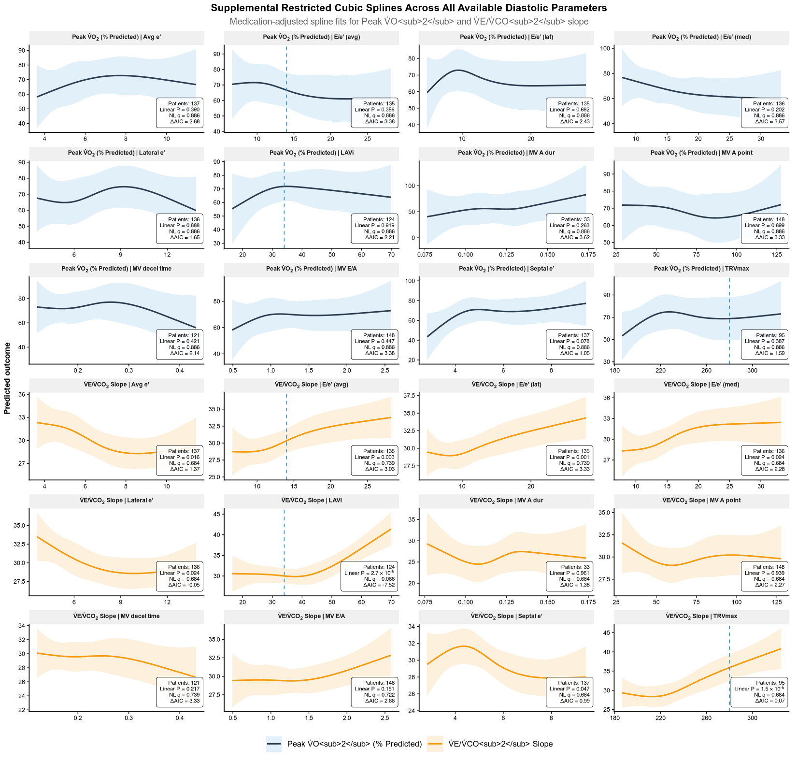

## Figures S2-S3: OMARX

``` r
# ── stage OMARX (python ML) figures/tables into the supplement, if present ─────
# OMARX is the optional ML pipeline (params$run_omarx); copy its outputs if built
copy_from_candidates <- function(target_path, candidates) {
  for (cand in candidates) {
    if (file.exists(cand)) {
      same_path <- tryCatch(
        identical(normalizePath(cand, winslash = "/", mustWork = TRUE),
                  normalizePath(target_path, winslash = "/", mustWork = FALSE)),
        error = function(e) FALSE
      )
      if (same_path) {
        return(TRUE)
      }
      file.copy(cand, target_path, overwrite = TRUE)
      return(TRUE)
    }
  }
  FALSE
}

omarx_assets <- c(
  "Figure_S2_OMARX_ClinicalSummary.pdf",
  "Figure_S3_RCS_vs_OMARX.pdf",
  "Table_S1_OMARX_ModelPerformance.csv",
  "Table_S2_OMARX_Thresholds.csv",
  "Table_S3_OMARX_VariableImportance.csv",
  "Table_S4_OMARX_Summary.docx"
)

for (asset in omarx_assets) {
  copy_from_candidates(
    file.path("../2_Output/Manuscript_Supplemental", asset),
    c(
      file.path("../2_Output/Manuscript_Supplemental", asset),
      file.path("../Manuscript/Supplemental", asset),
      file.path("../2_Output", asset)
    )
  )
}

cat("OMARX supplemental outputs are surfaced from the most recently verified run when `params$run_omarx` is false.\n")
```

OMARX supplemental outputs are surfaced from the most recently verified
run when `params$run_omarx` is false.

## Figure S4: ΔE’ Longitudinal Coupling

``` r
# ── Fig S4: Δe' vs Δexercise-capacity scatter/fit ─────────────────────────────
delta_vo2_df <- build_delta_pair_df(long_df, "VO2_FRIEND2_PP")
delta_vevco2_df <- build_delta_pair_df(long_df, "VeVco2_slope")
delta_vo2_model <- fit_delta_lme(delta_vo2_df)
delta_vevco2_model <- fit_delta_lme(delta_vevco2_df)
delta_vo2_pred <- make_delta_pred(delta_vo2_df, delta_vo2_model)
delta_vevco2_pred <- make_delta_pred(delta_vevco2_df, delta_vevco2_model)

p_delta_vo2 <- plot_delta_panel(delta_vo2_df, delta_vo2_pred, delta_vo2_model, "ΔAverage e' vs ΔPeak V̇O<sub>2</sub>", "ΔPeak V̇O<sub>2</sub> (% predicted)", jacc_cols["navy"], FALSE)
p_delta_vevco2 <- plot_delta_panel(delta_vevco2_df, delta_vevco2_pred, delta_vevco2_model, "ΔAverage e' vs ΔV̇E/V̇CO<sub>2</sub>", "ΔV̇E/V̇CO<sub>2</sub> slope", jacc_cols["red"], TRUE)

fig_delta_eprime <- (p_delta_vo2 | p_delta_vevco2) +
  plot_annotation(tag_levels = "A", tag_prefix = "(", tag_suffix = ")") &
  theme(plot.tag = element_text(face = "bold", size = 11))

show_and_save_jacc(fig_delta_eprime, "../2_Output/Figure_S4_DeltaEprime_LongitudinalCoupling.pdf", w = 7.0, h = 3.8)
```

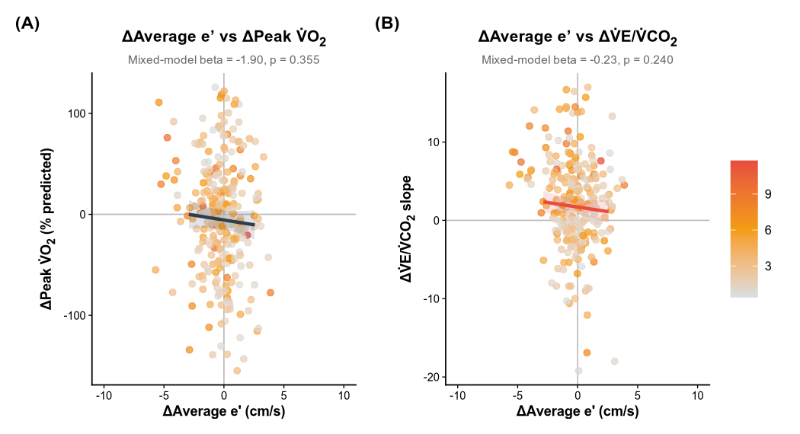

``` r
save_jacc_with_embedded_legend(
  fig_delta_eprime,
  "../Manuscript/Supplemental/Figure_S4_DeltaEprime_LongitudinalCoupling.pdf",
  legend_text = paste0(
    "**Figure S4.** Exploratory within-patient longitudinal coupling between change in average mitral annular e’ and change in cardiopulmonary performance. ",
    "Points represent follow-up studies relative to the first paired observation with both e’ and the given outcome available; solid lines and shaded bands show the adjusted mixed-model association."
  ),
  w = 7.0,
  h = 3.8
)
```

# Output Gallery

All primary and supplemental figures and tables generated by this
analysis are consolidated below for review. Main figures (Figures 1-5)
and main tables (Tables 1-3) are copied to
`../2_Output/Manuscript_Main/`. Supplemental figures (Figures S1-S4) and
supplemental tables are copied to
`../2_Output/Manuscript_Supplemental/`. Each figure is rendered inline
to allow side-by-side comparison with the manuscript; table entries
display the path to the corresponding `.docx` file.

<div class="panel-tabset">

## Main Figures

``` r
# ── render-end gallery: embed final main figures inline for quick review ───────
emit_gallery_figure <- function(fig_dir, filename, title = NULL, legend = NULL) {
  if (is.null(title)) {
    title <- gsub("_", " ", gsub("\\.pdf$", "", filename))
  }
  png_path <- file.path(fig_dir, sub("\\.pdf$", ".png", filename))
  pdf_path <- file.path(fig_dir, filename)
  cat(sprintf("\n### %s\n\n", title))
  if (file.exists(png_path)) {
    cat(sprintf("\n\n", png_path))
  } else if (file.exists(pdf_path)) {
    cat(sprintf("[Open PDF](%s)\n\n", pdf_path))
  } else {
    cat("*Not yet generated.*\n\n")
  }
  if (!is.null(legend) && nzchar(legend)) {
    cat(legend, "\n\n", sep = "")
  }
}

main_fig_dir <- "../2_Output/Manuscript_Main"

emit_gallery_figure(main_fig_dir, "Figure1_MatchedControls_and_BaselineCharacteristics.pdf",
  title = "Figure 1",
  legend = if (exists("legend_fig1_pdf")) legend_fig1_pdf else NULL)
```

### Figure 1

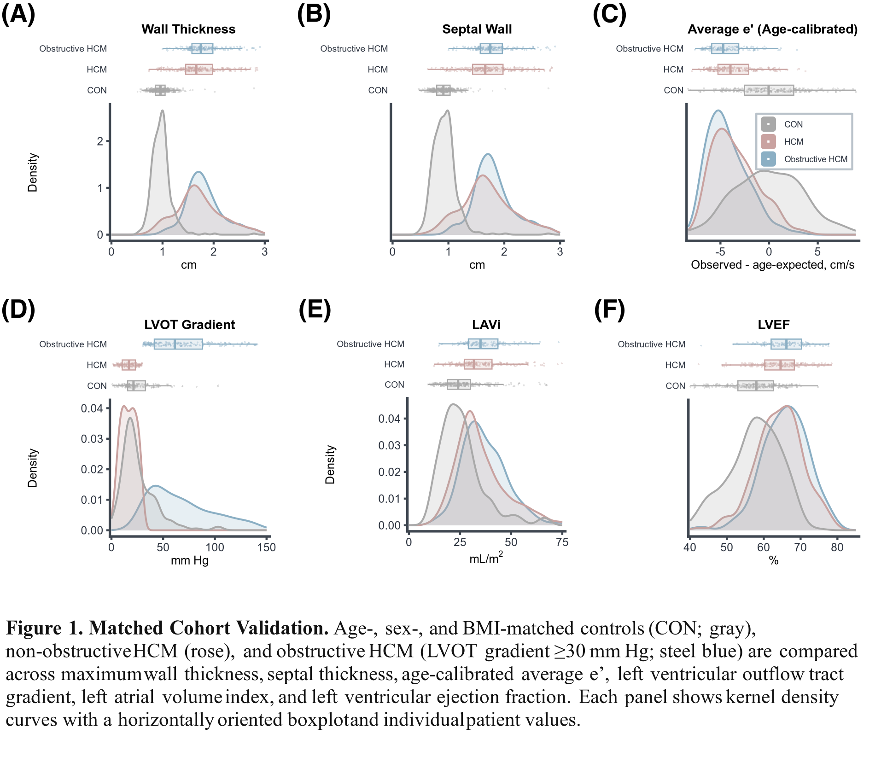

**Figure 1. Matched Cohort Validation.** Age-, sex-, and BMI-matched
controls (CON; gray), non-obstructive HCM (rose), and obstructive HCM
(LVOT gradient ≥30 mm Hg; steel blue) are compared across maximum wall
thickness, septal thickness, age-calibrated average e’, left ventricular
outflow tract gradient, left atrial volume index, and left ventricular
ejection fraction. Each panel shows kernel density curves with a
horizontally oriented boxplot and individual patient values.

``` r
emit_gallery_figure(main_fig_dir, "Figure2_ASE2025_FillingPressure.pdf",
  title = "Figure 2",
  legend = if (exists("legend_fig2_pdf")) legend_fig2_pdf else NULL)
```

### Figure 2

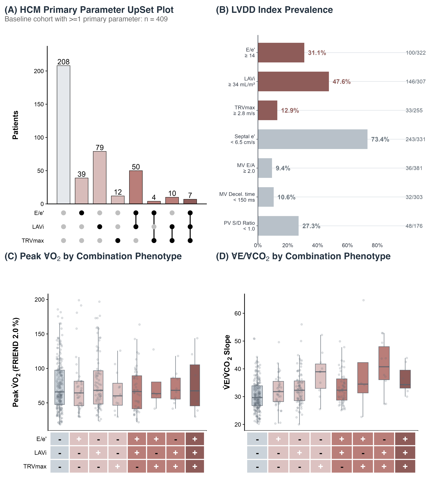

**Figure 2. Baseline HCM Diastolic Dysfunction Phenotypes and
Cardiopulmonary Performance.** **(A)** UpSet plot of the distinct
combinations of abnormal diastolic dysfunction parameters (E/e’, LAVi,
and TRV$_max$) among HCM patients.**(B)** Prevalence bar chart showing
the proportion of HCM patients with each diastolic index exceeding its
ASE-defined abnormality threshold. **(C)** Peak V̇O$_2$ (FRIEND 2.0 %
predicted) stratified by combinatorial filling-pressure phenotype, with
Kruskal-Wallis P value. **(D)** V̇E/V̇CO$_2$ slope stratified by the same
combinatorial phenotype, with Kruskal-Wallis P value.

``` r
emit_gallery_figure(main_fig_dir, "Figure3_Nonlinear_DiastolicIndices_RCS.pdf",
  title = "Figure 3",
  legend = if (exists("legend_fig3_pdf")) legend_fig3_pdf else NULL)
```

### Figure 3

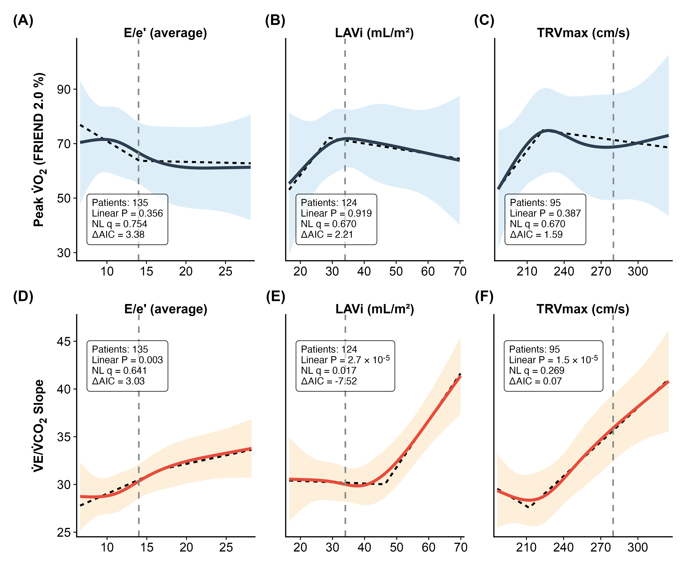

**Figure 3. Nonlinear Associations Between Left Ventricular Diastolic
Dysfunction and Cardiopulmonary Fitness.** Multivariable restricted
cubic spline models were adjusted for age, sex, BMI, LV septal
thickness, maximum LVOT gradient, β-blocker use, non-DHP calcium-channel
blocker use, and hypertension in the exact-date medication-available
subset. Solid lines represent spline estimates with shaded 95%
confidence intervals; dashed vertical lines denote ASE abnormality
thresholds; black dashed lines show the best-fitting piecewise linear
approximation. Panel annotations report complete-case N, linear-model P
value, nonlinearity Q value, and spline-vs-linear ΔAIC. **(A)** Peak
V̇O$_2$ (FRIEND 2.0 % predicted) as a function of E/e’. **(B)** Peak
V̇O$_2$ (FRIEND 2.0 % predicted) as a function of LAVi. **(C)** Peak
V̇O$_2$ (FRIEND 2.0 % predicted) as a function of TRV$_max$. **(D)**
V̇E/V̇CO$_2$ slope as a function of E/e’. **(E)** V̇E/V̇CO$_2$ slope as a
function of LAVi. **(F)** V̇E/V̇CO$_2$ slope as a function of TRV$_max$.

``` r
emit_gallery_figure(main_fig_dir, "Figure4_Longitudinal_GAMM.pdf",
  title = "Figure 4",
  legend = if (exists("legend_fig4_pdf")) legend_fig4_pdf else NULL)
```

### Figure 4

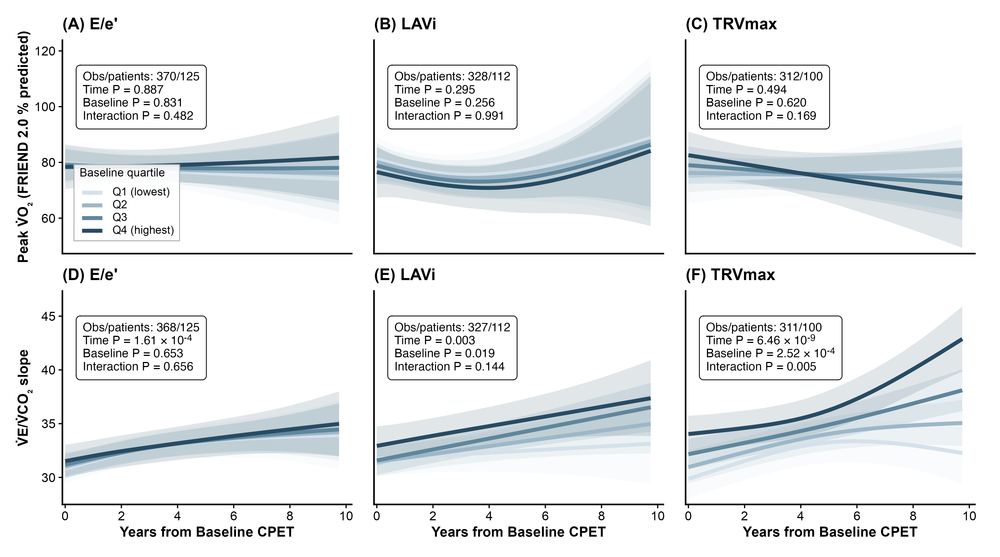

**Figure 4. Longitudinal Cardiopulmonary Trajectories Across Diastolic
Dysfunction Parameters.** Continuous generalized additive mixed models
were adjusted for age, sex, and BMI and fit to repeated cardiopulmonary
measures across the 3 primary HCM diastolic indices. Each diastolic
parameter was entered as a continuous predictor with a time interaction;
lines show model-predicted trajectories at the 25th, 50th, and 75th
percentiles for visualization. **(A)** Peak V̇O$_2$ (FRIEND 2.0 %
predicted) trajectory across baseline E/e’. **(B)** Peak V̇O$_2$ (FRIEND
2.0 % predicted) trajectory across baseline LAVi. **(C)** Peak V̇O$_2$
(FRIEND 2.0 % predicted) trajectory across baseline TRV$_max$. **(D)**
V̇E/V̇CO$_2$ slope trajectory across baseline E/e’. **(E)** V̇E/V̇CO$_2$
slope trajectory across baseline LAVi. **(F)** V̇E/V̇CO$_2$ slope
trajectory across baseline TRV$_max$.

``` r
emit_gallery_figure(main_fig_dir, "Figure5_HeartFailure_Outcomes.pdf",
  title = "Figure 5",
  legend = if (exists("legend_fig5_pdf")) legend_fig5_pdf else NULL)
```

### Figure 5

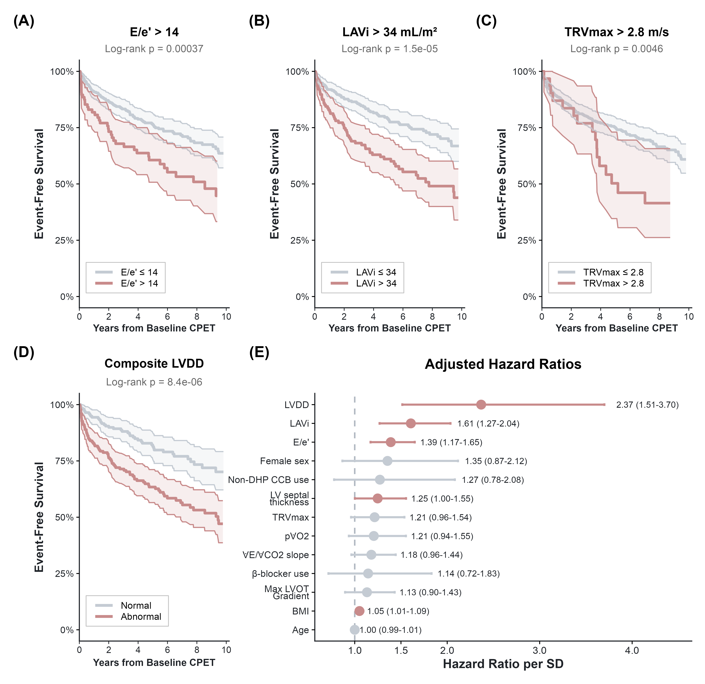

**Figure 5. Heart-Failure Outcomes Across ASE Diastolic Dysfunction
Parameters.** The composite endpoint is heart failure hospitalization,
heart transplant, or death. Each Cox model was adjusted for age, sex,
BMI, β-blocker use, and non-DHP calcium-channel blocker use; hazard
ratios are expressed per standard deviation and plotted on a log scale.
**(A)** Kaplan-Meier event-free survival stratified by E/e’ ≤14 (normal)
vs. \>14 (elevated). **(B)** Kaplan-Meier event-free survival stratified
by LAVi ≤34 mL/m² (normal) vs. \>34 mL/m² (elevated). **(C)**
Kaplan-Meier event-free survival stratified by TRV$_max$ ≤2.8 m/s
(normal) vs. \>2.8 m/s (elevated). **(D)** Kaplan-Meier event-free
survival stratified by composite primary-parameter diastolic dysfunction
classification (Normal vs. Abnormal). **(E)** Adjusted hazard ratios
(±95% CI) from separate Cox models for LVDD classification, LAVi
Z-score, E/e’, TRV$_max$, maximum LVOT gradient, LV septal thickness,
Peak V̇O$_2$, and V̇E/V̇CO$_2$ slope; filled circles indicate P \< 0.05.

## Main Tables

``` r
if (!is_gfm_output) {
  table1_overall
  figure3_ft
  figure4_ft
}
```

## Supplemental Figures

``` r
# ── gallery: embed supplemental figures inline ────────────────────────────────
supp_fig_dir <- "../2_Output/Manuscript_Supplemental"

emit_gallery_figure(supp_fig_dir, "Figure_S1_AllDiastolic_RCS.pdf",
  title = "Figure S1",
  legend = paste0(
    "**Figure S1.** Supplemental restricted cubic spline models relating all available diastolic parameters to ",
    label_peak_vo2_md, " and ", label_vevco2_md, ". ",
    "Each panel shows medication-adjusted spline-estimated associations with shaded 95% confidence intervals. ",
    "Dashed blue vertical lines indicate ASE reference cutoffs where available. ",
    "Annotation boxes report patient count, overall linear-association P value, nonlinearity FDR q-value ",
    "(BH-adjusted within each outcome across all 12 diastolic indices), and ΔAIC (spline vs. linear model)."
  ))
```

### Figure S1

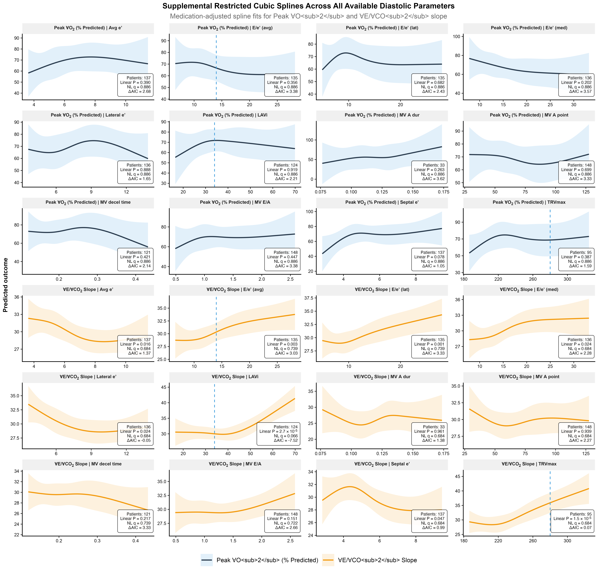

**Figure S1.** Supplemental restricted cubic spline models relating all
available diastolic parameters to Peak V̇O$_2$ and V̇E/V̇CO$_2$ slope. Each
panel shows medication-adjusted spline-estimated associations with
shaded 95% confidence intervals. Dashed blue vertical lines indicate ASE
reference cutoffs where available. Annotation boxes report patient
count, overall linear-association P value, nonlinearity FDR q-value
(BH-adjusted within each outcome across all 12 diastolic indices), and
ΔAIC (spline vs. linear model).

``` r
emit_gallery_figure(supp_fig_dir, "Figure_S2_OMARX_ClinicalSummary.pdf",
  title = "Figure S2",
  legend = paste0(
    "**Figure S2.** OMARX clinical summary. ",
    "Variable importance, threshold performance, and clinical calibration of the ",
    "optimal multivariate adaptive regression cross-validation model for diastolic dysfunction classification. ",
    "*(Generated by the OMARX pipeline; see supplemental methods.)*"
  ))
```

### Figure S2

[Open
PDF](2_Output/Manuscript_Supplemental/Figure_S2_OMARX_ClinicalSummary.pdf)

**Figure S2.** OMARX clinical summary. Variable importance, threshold
performance, and clinical calibration of the optimal multivariate
adaptive regression cross-validation model for diastolic dysfunction
classification. *(Generated by the OMARX pipeline; see supplemental
methods.)*

``` r
emit_gallery_figure(supp_fig_dir, "Figure_S3_RCS_vs_OMARX.pdf",
  title = "Figure S3",
  legend = paste0(
    "**Figure S3.** Head-to-head comparison of restricted cubic spline and OMARX approaches ",
    "for nonlinear association modeling of diastolic indices with cardiopulmonary outcomes. ",
    "*(Generated by the OMARX pipeline; see supplemental methods.)*"
  ))
```

### Figure S3

[Open
PDF](2_Output/Manuscript_Supplemental/Figure_S3_RCS_vs_OMARX.pdf)

**Figure S3.** Head-to-head comparison of restricted cubic spline and
OMARX approaches for nonlinear association modeling of diastolic indices
with cardiopulmonary outcomes. *(Generated by the OMARX pipeline; see
supplemental methods.)*

``` r
emit_gallery_figure(supp_fig_dir, "Figure_S4_DeltaEprime_LongitudinalCoupling.pdf",
  title = "Figure S4",
  legend = paste0(
    "**Figure S4.** Exploratory within-patient longitudinal coupling between change in average mitral ",
    "annular e\u2019 and change in cardiopulmonary performance. ",
    "Points represent follow-up studies relative to the first paired observation with both e\u2019 and the ",
    "given outcome available; solid lines and shaded bands show the adjusted mixed-model association."
  ))
```

### Figure S4

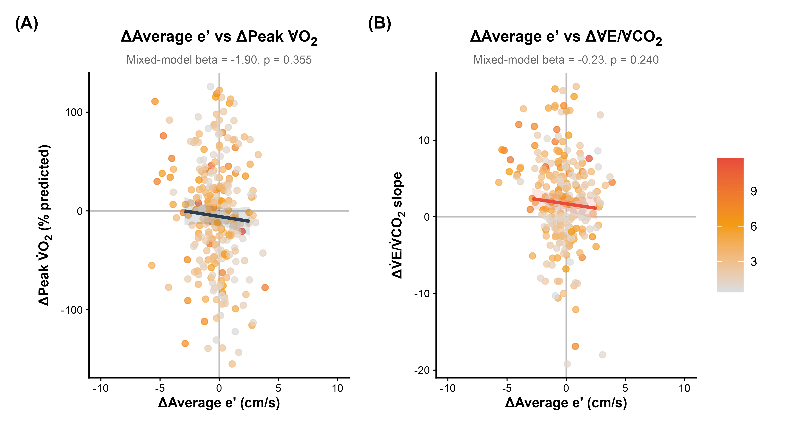

**Figure S4.** Exploratory within-patient longitudinal coupling between
change in average mitral annular e’ and change in cardiopulmonary
performance. Points represent follow-up studies relative to the first
paired observation with both e’ and the given outcome available; solid
lines and shaded bands show the adjusted mixed-model association.

``` r
emit_gallery_figure(supp_fig_dir, "FigureS_CrudeVsAdjusted_NonsigPredictors.pdf",
  title = "Figure S: Crude vs. Adjusted HRs",
  legend = paste0(
    "**Supplemental Figure.** Crude versus adjusted hazard ratios for non-significant Figure 5E predictors. ",
    "Each panel shows the unadjusted (circle) and covariate-adjusted (diamond) hazard ratio per 1 SD ",
    "for maximum LVOT gradient, peak V̇O₂ (FRIEND 2.0 % predicted), and V̇E/V̇CO₂ slope. ",
    "Adjusted models include age, sex, BMI, β-blocker use, and non-DHP CCB use as covariates. ",
    "Horizontal lines represent 95% confidence intervals; the dashed vertical line marks HR = 1. ",
    "Minimal change in point estimates between crude and adjusted models indicates that covariate ",
    "adjustment does not account for the non-significant associations."
  ))
```

### Figure S: Crude vs. Adjusted HRs

[Open
PDF](2_Output/Manuscript_Supplemental/FigureS_CrudeVsAdjusted_NonsigPredictors.pdf)

**Supplemental Figure.** Crude versus adjusted hazard ratios for
non-significant Figure 5E predictors. Each panel shows the unadjusted
(circle) and covariate-adjusted (diamond) hazard ratio per 1 SD for
maximum LVOT gradient, peak V̇O₂ (FRIEND 2.0 % predicted), and V̇E/V̇CO₂
slope. Adjusted models include age, sex, BMI, β-blocker use, and non-DHP
CCB use as covariates. Horizontal lines represent 95% confidence
intervals; the dashed vertical line marks HR = 1. Minimal change in
point estimates between crude and adjusted models indicates that
covariate adjustment does not account for the non-significant
associations.

``` r
emit_gallery_figure(supp_fig_dir, "FigureS_Figure4_LAVi_Unadjusted_GAMM.pdf",
  title = "Figure S: LAVi Unadjusted Trajectories",
  legend = if (exists("figure4_main_spec")) paste0(
    "**Supplemental Figure.** Unadjusted longitudinal cardiopulmonary trajectories stratified by binary ",
    "baseline ", figure4_main_spec$label_long, " status. ",
    "**(A)** GAMM-derived ", label_peak_vo2_md, " trajectories. ",
    "**(B)** GAMM-derived ", label_vevco2_md, " trajectories. ",
    "**(C)** Summary of key status and interaction terms for both models. ",
    "Normal versus abnormal status was defined as ", figure4_main_spec$threshold_subtitle, ". ",
    "These sensitivity GAMMs were unadjusted for demographic, medication, or diabetes covariates."
  ) else NULL)
```

### Figure S: LAVi Unadjusted Trajectories

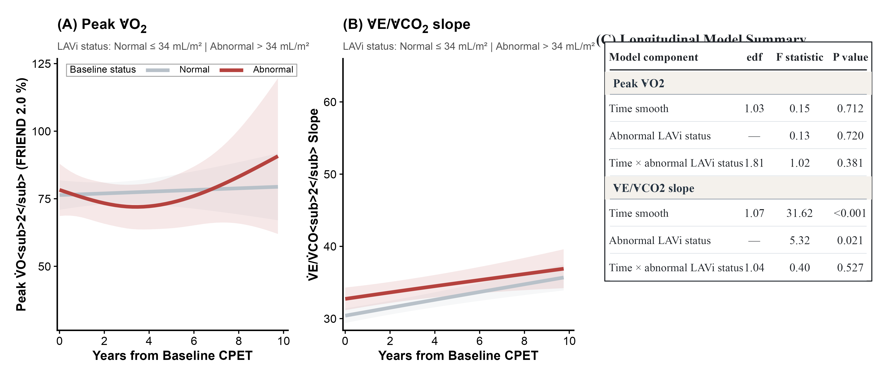

**Supplemental Figure.** Unadjusted longitudinal cardiopulmonary
trajectories stratified by binary baseline LAVi (mL/m²) status. **(A)**
GAMM-derived Peak V̇O$_2$ trajectories. **(B)** GAMM-derived V̇E/V̇CO$_2$
slope trajectories. **(C)** Summary of key status and interaction terms
for both models. Normal versus abnormal status was defined as Normal ≤
34 mL/m² \| Abnormal \> 34 mL/m². These sensitivity GAMMs were
unadjusted for demographic, medication, or diabetes covariates.

## Supplemental Tables

``` r
# ── gallery: render supplemental CSV tables inline ────────────────────────────
supp_table_files <- c(
  "Table_S1_OMARX_ModelPerformance.csv",
  "Table_S2_OMARX_Thresholds.csv",
  "Table_S3_OMARX_VariableImportance.csv",
  "Table_S4_OMARX_Summary.docx",
  "TableS_Figure5_Cox_Summary.csv",
  "TableS_Figure5_Cox_Summary.docx",
  "TableS_Figure4_GAMM_Complete.csv",
  "TableS_Figure4_GAMM_Complete.docx",
  "TableS_Figure4_GAMM_Sensitivity.csv",
  "TableS_Figure4_GAMM_Sensitivity.docx",
  "TableS_Figure4_GAMM_Covariates.csv",
  "TableS_Figure4_GAMM_Covariates.docx"
)

for (tbl_file in supp_table_files) {
  tbl_path <- file.path("../2_Output/Manuscript_Supplemental", tbl_file)
  tbl_label <- gsub("_", " ", gsub("\\.(docx|csv)$", "", tbl_file))
  cat(sprintf("\n### %s\n\n", tbl_label))
  if (!file.exists(tbl_path)) {
    cat("*Not yet generated.*\n\n")
  } else if (grepl("\\.csv$", tbl_file)) {
    tbl_data <- read.csv(tbl_path)
    print(
      flextable(tbl_data) %>%
        bold(part = "header") %>%
        theme_booktabs() %>%
        autofit()
    )
  } else {
    cat(sprintf("Table available at: `%s`\n\n", tbl_path))
  }
}
```

### Table S1 OMARX ModelPerformance

a flextable object. col_keys: `outcome`, `mode`, `predictor_set_name`,
`qc_variant`, `n_complete`, `n`, `r2`, `adj_r2`, `aic`, `bic`,
`n_predictors`, `clinical_knots_protected`, `outcome_label` header has 1
row(s) body has 11 row(s) original dataset sample: ‘data.frame’: 11 obs.
of 13 variables: \$ outcome : chr “VO2_FRIEND2_PP” “VO2_FRIEND2_PP”
“VO2_FRIEND2_PP” “VO2_FRIEND2_PP” … \$ mode : chr “mars” “additive”
“mars” “mars” … \$ predictor_set_name : chr “heart_bmi_primary”
“heart_bmi_primary” “heart_trv_missing_sensitivity”
“heart_binary_lvot_sensitivity” … \$ qc_variant : chr “complete_case”
“complete_case” “trv_missing_sensitivity” “binary_lvot_sensitivity” … \$
n_complete : int 108 108 191 159 444 108 108 191 160 443 … \$ n : int
108 108 191 159 444 108 108 191 160 443 … \$ r2 : num 0.162 0.196 0.152
0.178 0.232 0.122 0.157 0.106 0.144 0.169 … \$ adj_r2 : num 0.085 0.044
0.105 0.128 0.214 0.041 -0.003 0.056 0.093 0.15 … \$ aic : num 1102 1113
1928 1588 4367 … \$ bic : num 1129 1162 1964 1619 4412 … \$ n_predictors
: int 9 9 10 9 9 9 9 10 9 9 … \$ clinical_knots_protected: logi FALSE
FALSE FALSE FALSE FALSE FALSE … \$ outcome_label : chr “Peak VO₂ (%
Predicted)” “Peak VO₂ (% Predicted)” “Peak VO₂ (% Predicted)” “Peak VO₂
(% Predicted)” …

### Table S2 OMARX Thresholds

a flextable object. col_keys: `outcome`, `mode`, `predictor_set_name`,
`qc_variant`, `variable`, `knot`, `n_basis_terms`,
`max_abs_coefficient`, `direction`, `ase_cutoff`, `ase_direction`,
`outcome_label`, `var_label`, `delta_vs_ase` header has 1 row(s) body
has 16 row(s) original dataset sample: ‘data.frame’: 16 obs. of 14
variables: \$ outcome : chr “VO2_FRIEND2_PP” “VO2_FRIEND2_PP”
“VO2_FRIEND2_PP” “VO2_FRIEND2_PP” … \$ mode : chr “additive” “additive”
“additive” “additive” … \$ predictor_set_name : chr “heart_bmi_primary”
“heart_bmi_primary” “heart_bmi_primary” “heart_bmi_primary” … \$
qc_variant : chr “complete_case” “complete_case” “complete_case”
“complete_case” … \$ variable : chr “e_e_ave” “la_vol_index”
“lv_septal_thickness” “med_peak_e_vel” … \$ knot : num 11.21 35.88 1.68
5.29 235.06 … \$ n_basis_terms : int 1 1 1 1 1 1 1 1 1 1 … \$
max_abs_coefficient: num 11.86 11.78 3.27 13.99 21.79 … \$ direction :
chr “positive” “negative” “positive” “negative” … \$ ase_cutoff : int 14
34 NA NA 280 280 14 34 NA NA … \$ ase_direction : chr “\>” “\>” NA NA …
\$ outcome_label : chr “Peak VO₂ (% Predicted)” “Peak VO₂ (% Predicted)”
“Peak VO₂ (% Predicted)” “Peak VO₂ (% Predicted)” … \$ var_label : chr
“E/e’ (average)” “LAVI” “LV septal thickness” “Medial septal e’” … \$
delta_vs_ase : num -2.79 1.88 NA NA -44.94 …

### Table S3 OMARX VariableImportance

a flextable object. col_keys: `variable`, `n_terms`,
`metric_standalone`, `metric_drop`, `pct_drop`, `outcome`, `mode`,
`predictor_set_name`, `qc_variant`, `outcome_label`, `var_label` header
has 1 row(s) body has 101 row(s) original dataset sample: ‘data.frame’:
101 obs. of 11 variables: \$ variable : chr “age” “BMI” “med_peak_e_vel”
“tr_max_vel” … \$ n_terms : int 1 1 1 1 1 1 1 1 1 2 … \$
metric_standalone : num 0.078 0.04 0.055 0 0.013 0.005 0 0.01 0.001
0.079 … \$ metric_drop : num 0.058 0.029 0.019 0.01 0.002 0.001 0.001 0
0 0.051 … \$ pct_drop : num 35.8 17.7 11.8 6.3 1.2 0.7 0.6 0.2 0.1 25.9
… \$ outcome : chr “VO2_FRIEND2_PP” “VO2_FRIEND2_PP” “VO2_FRIEND2_PP”
“VO2_FRIEND2_PP” … \$ mode : chr “mars” “mars” “mars” “mars” … \$
predictor_set_name: chr “heart_bmi_primary” “heart_bmi_primary”
“heart_bmi_primary” “heart_bmi_primary” … \$ qc_variant : chr
“complete_case” “complete_case” “complete_case” “complete_case” … \$
outcome_label : chr “Peak VO₂ (% Predicted)” “Peak VO₂ (% Predicted)”
“Peak VO₂ (% Predicted)” “Peak VO₂ (% Predicted)” … \$ var_label : chr
“Age” “BMI” “Medial septal e’” “TR Vmax” …

### Table S4 OMARX Summary

Table available at:
`../2_Output/Manuscript_Supplemental/Table_S4_OMARX_Summary.docx`

### TableS Figure5 Cox Summary

a flextable object. col_keys: `Model`, `Parameter`, `Scale`, `Sample`,
`HR..95..CI.`, `P.value` header has 1 row(s) body has 13 row(s) original
dataset sample: ‘data.frame’: 13 obs. of 6 variables: \$ Model : chr
“Composite LVDD model” “Composite LVDD model” “Composite LVDD model”
“Composite LVDD model” … \$ Parameter : chr “LVDD” “Age” “Female sex”
“BMI” … \$ Scale : chr “Elevated vs not elevated” “Per 1-year increase”
“Female vs male” “Per 1 kg/m² increase” … \$ Sample : chr “244 / 82”
“244 / 82” “244 / 82” “244 / 82” … \$ HR..95..CI.: chr “2.37
(1.51-3.70)” “1.00 (0.99-1.01)” “1.35 (0.87-2.12)” “1.05 (1.01-1.09)” …
\$ P.value : chr “1.55 × 10⁻⁴” “9.69 × 10⁻¹” “1.83 × 10⁻¹” “1.48 × 10⁻²”
…

### TableS Figure5 Cox Summary

Table available at:
`../2_Output/Manuscript_Supplemental/TableS_Figure5_Cox_Summary.docx`

### TableS Figure4 GAMM Complete

a flextable object. col_keys: `Outcome`, `Baseline.Parameter`, `Sample`,
`Fit`, `Term.Class`, `Term`, `Effect.summary`, `Statistic`, `P.value`
header has 1 row(s) body has 42 row(s) original dataset sample:
‘data.frame’: 42 obs. of 9 variables: \$ Outcome : chr “Peak V̇O2” “Peak
V̇O2” “Peak V̇O2” “Peak V̇O2” … \$ Baseline.Parameter: chr “E/e’ (average)”
“E/e’ (average)” “E/e’ (average)” “E/e’ (average)” … \$ Sample : chr
“533 / 176” “533 / 176” “533 / 176” “533 / 176” … \$ Fit : chr “Smooth
GAMM” “Smooth GAMM” “Smooth GAMM” “Smooth GAMM” … \$ Term.Class : chr
“Smooth” “Smooth” “Parametric” “Parametric” … \$ Term : chr “Time
smooth” “Time × abnormal E/e’ status” “Abnormal E/e’ status” “Age” … \$
Effect.summary : chr “edf = 1.04; ref df = 1.04” “edf = 1.03; ref df =
1.03” “β = 1.06; SE = 3.99” “β = -0.72; SE = 0.09” … \$ Statistic : chr
“F = 0.00” “F = 0.24” “t = 0.27” “t = -7.81” … \$ P.value : chr “0.998”
“0.628” “0.791” “\<0.001” …

### TableS Figure4 GAMM Complete

Table available at:
`../2_Output/Manuscript_Supplemental/TableS_Figure4_GAMM_Complete.docx`

### TableS Figure4 GAMM Sensitivity

a flextable object. col_keys: `Outcome`, `Baseline.Parameter`,
`Relationship.Term`, `Model`, `Sample`, `Fit`, `Effect.summary`,
`Statistic`, `P.value` header has 1 row(s) body has 48 row(s) original
dataset sample: ‘data.frame’: 48 obs. of 9 variables: \$ Outcome : chr
“Peak V̇O2” “Peak V̇O2” “Peak V̇O2” “Peak V̇O2” … \$ Baseline.Parameter: chr
“E/e’ (average)” “E/e’ (average)” “E/e’ (average)” “E/e’ (average)” … \$
Relationship.Term : chr “Abnormal E/e’ status” “Abnormal E/e’ status”
“Abnormal E/e’ status” “Abnormal E/e’ status” … \$ Model : chr
“Unadjusted” “Age, sex, BMI adjusted” “Age, sex, BMI + medication
adjusted” “Age, sex, BMI + medication + diabetes adjusted” … \$ Sample :
chr “533 / 176” “533 / 176” “207 / 123” “204 / 122” … \$ Fit : chr
“Smooth GAMM” “Smooth GAMM” “Smooth GAMM” “Smooth GAMM” … \$
Effect.summary : chr “β = -0.26; SE = 4.44” “β = 1.06; SE = 3.99” “β =
-2.01; SE = 5.97” “β = -1.65; SE = 5.90” … \$ Statistic : chr “t =
-0.06” “t = 0.27” “t = -0.34” “t = -0.28” … \$ P.value : chr “0.952”
“0.791” “0.736” “0.781” …

### TableS Figure4 GAMM Sensitivity

Table available at:
`../2_Output/Manuscript_Supplemental/TableS_Figure4_GAMM_Sensitivity.docx`

### TableS Figure4 GAMM Covariates

a flextable object. col_keys: `Outcome`, `Baseline.Parameter`, `Sample`,
`Covariate`, `β`, `SE`, `Statistic`, `P.value` header has 1 row(s) body
has 18 row(s) original dataset sample: ‘data.frame’: 18 obs. of 8
variables: \$ Outcome : chr “Peak V̇O2” “Peak V̇O2” “Peak V̇O2” “Peak V̇O2”
… \$ Baseline.Parameter: chr “E/e’ (average)” “E/e’ (average)” “E/e’
(average)” “LAVi (mL/m²)” … \$ Sample : chr “533 / 176” “533 / 176” “533
/ 176” “533 / 176” … \$ Covariate : chr “Age” “Female sex” “BMI” “Age” …
\$ β : num -0.72 -2.87 -1.5 -0.72 -2.9 -1.5 -0.72 -2.82 -1.52 0.01 … \$
SE : num 0.09 3.46 0.27 0.09 3.44 0.27 0.09 3.45 0.27 0.01 … \$
Statistic : chr “t = -7.81” “t = -0.83” “t = -5.65” “t = -7.84” … \$
P.value : chr “\<0.001” “0.407” “\<0.001” “\<0.001” …

### TableS Figure4 GAMM Covariates

Table available at:
`../2_Output/Manuscript_Supplemental/TableS_Figure4_GAMM_Covariates.docx`

</div>

# Preprint Assembly

This section assembles the dated submission packages for MedRxiv
preprint and JAMA Cardiology submission. Main figures (Figures 1–5) are
combined into a single PDF; supplemental figures are combined into a
second PDF. Both are stamped with today’s date (`YYMMDD`).

# Session Info

The complete R session environment used to produce all results is
recorded below for reproducibility, including the R version, operating
platform, and exact package versions for all loaded libraries. Any
numerical discrepancies between these results and a reader’s local
environment may reflect version-specific behavior in statistical
packages (e.g., `mgcv`, `survival`, `gamlss`). All analyses were
conducted with the package versions listed.

``` r
cat("\n\n---\n**Session Info:**\n")
```


    ---
    **Session Info:**

``` r
sessionInfo()
```

    R version 4.5.2 (2025-10-31)
    Platform: aarch64-apple-darwin20
    Running under: macOS Tahoe 26.3.1

    Matrix products: default
    BLAS:   /System/Library/Frameworks/Accelerate.framework/Versions/A/Frameworks/vecLib.framework/Versions/A/libBLAS.dylib 
    LAPACK: /Library/Frameworks/R.framework/Versions/4.5-arm64/Resources/lib/libRlapack.dylib;  LAPACK version 3.12.1

    locale:
    [1] C.UTF-8/C.UTF-8/C.UTF-8/C/C.UTF-8/C.UTF-8

    time zone: America/Los_Angeles
    tzcode source: internal

    attached base packages:
     [1] grid      parallel  splines   stats     graphics  grDevices utils    
     [8] datasets  methods   base     

    other attached packages:
     [1] lavaan_0.6-21      digest_0.6.39      cobalt_4.6.2       MatchIt_4.7.2     
     [5] forcats_1.0.1      ggtext_0.1.2       gamlss_5.5-0       gamlss.dist_6.1-1 
     [9] gamlss.data_6.0-7  ggrepel_0.9.6      viridis_0.6.5      viridisLite_0.4.3 
    [13] ggcorrplot_0.1.4.1 flextable_0.9.10   gtsummary_2.5.0    openxlsx_4.2.8.1  
    [17] stringr_1.6.0      scales_1.4.0       survival_3.8-6     broom_1.0.12      
    [21] mgcv_1.9-4         nlme_3.1-168       lme4_1.1-38        Matrix_1.7-4      
    [25] patchwork_1.3.2    ggplot2_4.0.2      purrr_1.2.1        tidyr_1.3.2       
    [29] dplyr_1.2.0       

    loaded via a namespace (and not attached):
     [1] Rdpack_2.6.6            mnormt_2.1.2            dunn.test_1.3.7        
     [4] gridExtra_2.3           rlang_1.1.7             magrittr_2.0.4         
     [7] otel_0.2.0              compiler_4.5.2          systemfonts_1.3.1      
    [10] vctrs_0.7.1             quadprog_1.5-8          pkgconfig_2.0.3        
    [13] fastmap_1.2.0           backports_1.5.0         labeling_0.4.3         
    [16] pbivnorm_0.6.0          rmarkdown_2.30          markdown_2.0           
    [19] nloptr_2.2.1            ragg_1.5.0              xfun_0.56              
    [22] litedown_0.9            jsonlite_2.0.0          uuid_1.2-2             
    [25] chk_0.10.0              cluster_2.1.8.2         R6_2.6.1               
    [28] stringi_1.8.7           RColorBrewer_1.1-3      rpart_4.1.24           
    [31] boot_1.3-32             Rcpp_1.1.1              knitr_1.51             
    [34] base64enc_0.1-6         nnet_7.3-20             tidyselect_1.2.1       
    [37] rstudioapi_0.18.0       dichromat_2.0-0.1       yaml_2.3.12            
    [40] qpdf_1.4.1              lattice_0.22-9          tibble_3.3.1           
    [43] withr_3.0.2             S7_0.2.1                askpass_1.2.1          
    [46] evaluate_1.0.5          foreign_0.8-91          zip_2.3.3              
    [49] xml2_1.5.2              pillar_1.11.1           checkmate_2.3.4        
    [52] stats4_4.5.2            reformulas_0.4.4        generics_0.1.4         
    [55] commonmark_2.0.0        minqa_1.2.8             glue_1.8.0             
    [58] gdtools_0.5.0           Hmisc_5.2-5             tools_4.5.2            
    [61] data.table_1.18.2.1     pdftools_3.9.0          rbibutils_2.4.1        
    [64] cards_0.7.1             colorspace_2.1-2        htmlTable_2.4.3        
    [67] cardx_0.3.2             Formula_1.2-5           cli_3.6.5              
    [70] textshaping_1.0.4       officer_0.7.3           fontBitstreamVera_0.1.1
    [73] svglite_2.2.2           gtable_0.3.6            fontquiver_0.2.1       
    [76] htmlwidgets_1.6.4       farver_2.1.2            htmltools_0.5.9        
    [79] lifecycle_1.0.5         fontLiberation_0.1.0    gridtext_0.1.6         
    [82] openssl_2.3.4           MASS_7.3-65            
