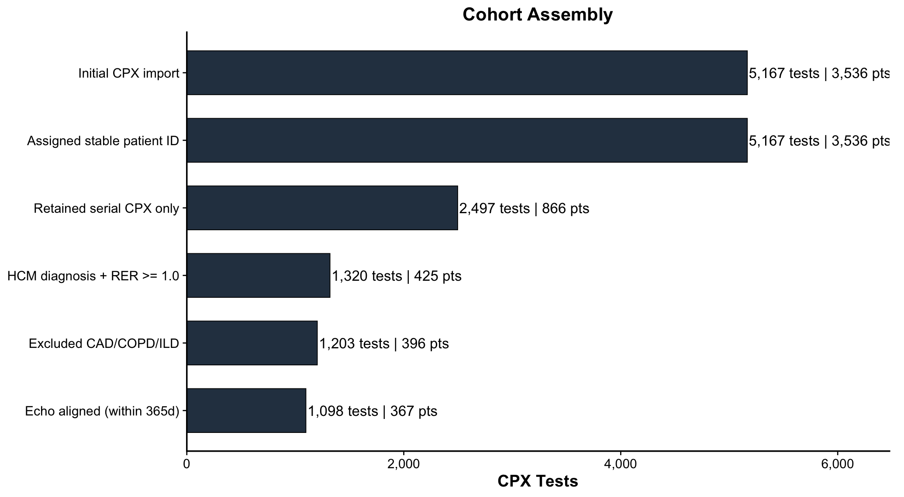
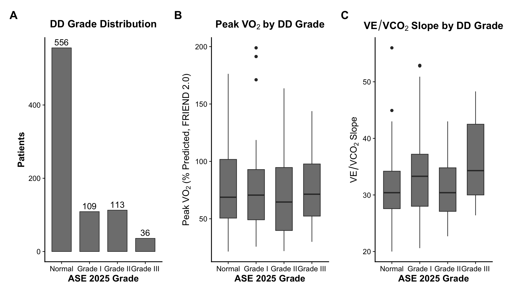
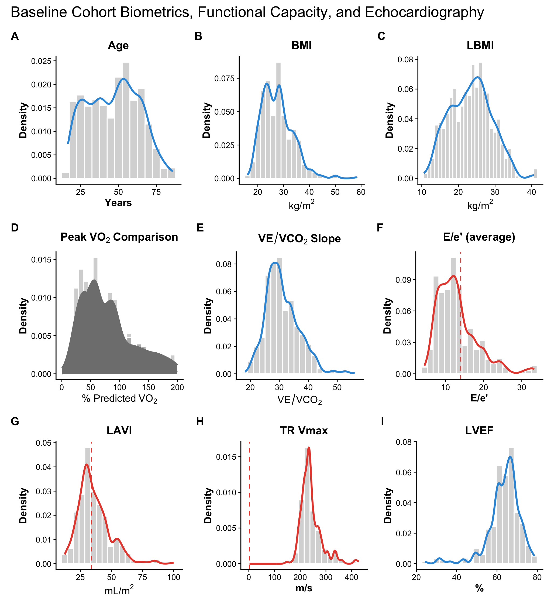
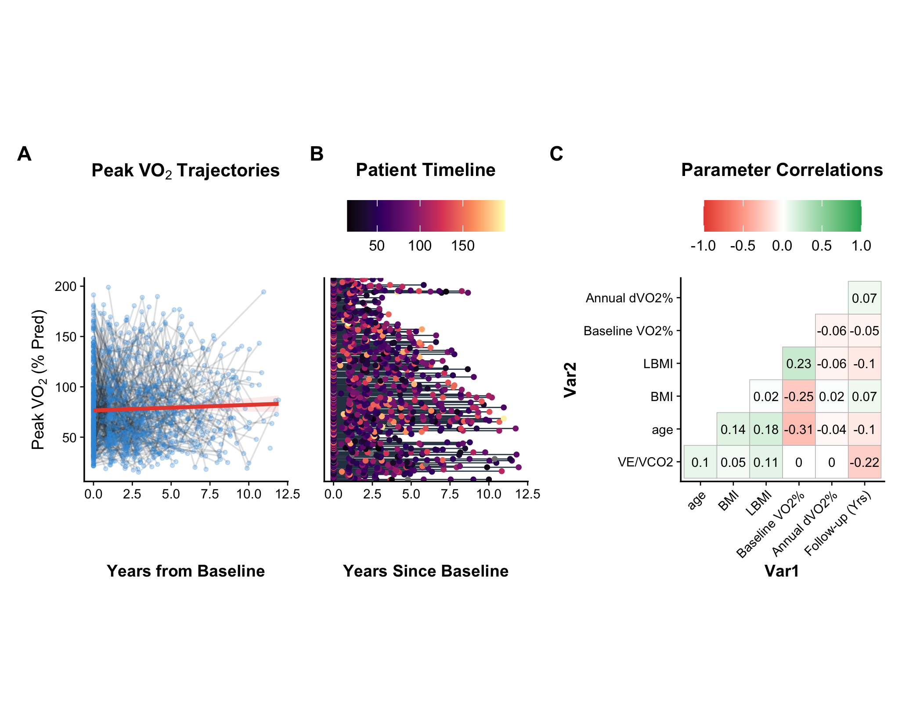

# Modeling Left Ventricular Diastolic Dysfunction and Cardiopulmonary
Fitness in HCM
Mark E. Pepin, MD, PhD, MS, FESC
2026-03-25

- [0.1 Repository
  Artifacts](#repository-artifacts)
- [1 Data Import and Cohort
  Assembly](#data-import-and-cohort-assembly)
  - [1.1 Import and clean CPX
    data](#import-and-clean-cpx-data)
  - [1.2 Comorbidity
    exclusions](#comorbidity-exclusions)
  - [1.3 Merge echocardiographic
    data](#merge-echocardiographic-data)
  - [1.4 Import clinical
    outcomes](#import-clinical-outcomes)
  - [1.5 Cohort flow
    diagram](#cohort-flow-diagram)
- [2 ASE 2025 Diastolic
  Dysfunction Grading](#ase-2025-diastolic-dysfunction-grading)
- [3 GAMLSS / SEAMLSS Continuous
  Modeling](#gamlss--seamlss-continuous-modeling)
- [4 Cross-Sectional Nonlinear
  Analysis](#cross-sectional-nonlinear-analysis)
  - [4.1 Primary outcome: Peak
    VO$_2$ (FRIEND 2.0 %
    predicted)](#primary-outcome-peak-vo_2-friend-20--predicted)
  - [4.2 Secondary outcome:
    VE/VCO$_2$ slope](#secondary-outcome-vevco_2-slope)
  - [4.3 Sensitivity: Echo
    alignment window](#sensitivity-echo-alignment-window)
- [5 Longitudinal GAMM
  Analysis](#longitudinal-gamm-analysis)
- [6 Heart Failure Outcome
  Analysis](#heart-failure-outcome-analysis)
- [7 Patient
  Characteristics](#patient-characteristics)
  - [7.1 Table 1](#table-1)
  - [7.2 Figure 1: Cohort
    Characteristics](#figure-1-cohort-characteristics)
  - [7.3 Figure 2: Longitudinal
    Analysis](#figure-2-longitudinal-analysis)
- [8 Supplemental
  Analyses](#supplemental-analyses)
  - [8.1 Age-residualized
    diastolic indices](#age-residualized-diastolic-indices)
  - [8.2 Export missing echo
    audit](#export-missing-echo-audit)

## Repository Artifacts

- [Quarto source](README_HCM.Diastology.qmd)
- [Figures](outputs/figures/)
- [Tables](outputs/tables/)
- [Supporting statistics](outputs/stats/)
- [Echo linkage
  audit](outputs/audit/Serial_CPX_missing_resting_echo.xlsx)

# Data Import and Cohort Assembly

## Import and clean CPX data

The initial phase imports raw Cardiopulmonary Exercise Testing (CPET)
data, assigns a stable patient identifier (ID) per MRN, retains patients
with serial testing ($\geq 2$ sessions), restricts to HCM with adequate
effort (peak RER $\geq 1.0$), and derives biometric indices (BSA, BMI,
LBMI).

    CPX tests (HCM, adequate effort): 1269 tests, 424 patients

## Comorbidity exclusions

Patients with documented CAD, COPD, or interstitial lung disease are
excluded so that exercise limitations are attributable to HCM-specific
pathology.

## Merge echocardiographic data

Each CPET is aligned with the closest prior resting echocardiogram
within a configurable window (default 365 days).

    Baseline cohort: 367 patients
    Longitudinal observations: 1088

## Import clinical outcomes

    Patients with outcome data: 1263
    Composite HF events: 286

## Cohort flow diagram

# ASE 2025 Diastolic Dysfunction Grading

The 2025 ASE guidelines propose a hierarchical framework integrating
E/e’ (\>14), Ar-A duration difference ($\geq$ 30 ms), left atrial volume
index (\>34 mL/m$^2$), and peak tricuspid regurgitation velocity (\>2.8
m/s). Pulmonary venous Ar duration was not available in this dataset;
grading proceeds with 3 of 4 criteria.

**ASE 2025 DD Grade Distribution (Baseline):**

       Normal       Grade I      Grade II     Grade III Indeterminate 
          556           109           113            36           449 

Stratified baseline characteristics table:
[outputs/tables/Table_ASE2025_Stratified.docx](outputs/tables/Table_ASE2025_Stratified.docx)

# GAMLSS / SEAMLSS Continuous Modeling

We employ a Semiparametric Additive Model for Location, Scale, and Shape
(GAMLSS) to model the continuous relationship between diastolic indices
and Peak VO$_2$. The SEAMLSS framework derives Z-scores via
$u(x) = \ln(y / \mu(x))$, where $\mu(x)$ is the fitted conditional mean,
providing a stable relative metric that avoids the global distortion of
Box-Cox (LMS) transformations.

# Cross-Sectional Nonlinear Analysis

Individual diastolic indices are modeled against Peak VO$_2$ using
natural splines (df=3) adjusted for age, sex, and lean body mass index.
Likelihood ratio tests compare each diastolic-augmented model to the
clinical base model.

## Primary outcome: Peak VO$_2$ (FRIEND 2.0 % predicted)

| index          | label         |    n | delta_AIC | F_stat | p_value | R2_base | R2_full |
|:---------------|:--------------|-----:|----------:|-------:|--------:|--------:|--------:|
| mv_a_dur       | MV A dur      |  255 |   -13.355 |  6.519 |   0.000 |   0.210 |   0.268 |
| la_vol_index   | LAVI          |  767 |    -7.591 |  4.529 |   0.004 |   0.161 |   0.176 |
| mv_dec_time    | MV decel time |  821 |    -7.024 |  4.339 |   0.005 |   0.191 |   0.204 |
| tr_max_vel     | TR Vmax       |  744 |    -4.732 |  3.569 |   0.014 |   0.175 |   0.187 |
| med_peak_e_vel | Med E vel     |  863 |     0.533 |  1.813 |   0.143 |   0.160 |   0.166 |
| lat_peak_e_vel | Lat E vel     |  863 |     0.626 |  1.782 |   0.149 |   0.164 |   0.169 |
| mv_a_point     | MV A point    | 1029 |     2.477 |  1.169 |   0.321 |   0.189 |   0.192 |
| e_e_med        | E/e’ (med)    |  835 |     3.059 |  0.974 |   0.404 |   0.156 |   0.159 |
| mv_e_a         | MV E/A        | 1023 |     4.386 |  0.535 |   0.659 |   0.188 |   0.189 |
| e_e_ave        | E/e’ (avg)    |  825 |     4.694 |  0.432 |   0.730 |   0.157 |   0.159 |
| e_e_lat        | E/e’ (lat)    |  835 |     5.092 |  0.300 |   0.825 |   0.159 |   0.160 |

Likelihood Ratio Tests: Diastolic Indices vs Peak VO2 (FRIEND 2.0)

## Secondary outcome: VE/VCO$_2$ slope

## Sensitivity: Echo alignment window

# Longitudinal GAMM Analysis

We employ a Generalized Additive Mixed Model (GAMM) via `mgcv::bam()` to
model the nonlinear trajectory of Peak VO$_2$ over time, testing whether
the trajectory diverges as a function of baseline diastolic severity via
a tensor product interaction.

    GAMM cohort: 13012 observations, 248 patients

    GAMM AIC: 121704.4  |  LME AIC: 124943.6

    **GAMM Smooth Terms:**
                                  edf     Ref.df            F   p-value
    s(time_yrs)              3.920402   3.994856  43.45512287 0.0000000
    s(dd_zscore)             1.000269   1.000313   0.07401632 0.7856881
    ti(time_yrs,dd_zscore)   8.887472   8.990240 509.94974036 0.0000000
    s(ID_fac)              206.817436 245.000000  15.79197136 0.0000000

# Heart Failure Outcome Analysis

Time-to-event analysis tests whether ASE 2025 DD grade and continuous DD
Z-scores predict a composite heart failure endpoint (acute HF, chronic
HF, transplant, or death).

Survival cohort: 1231 patients, 254 events

**Log-rank test p-value: 0.0000**

**Cox Model: DD Grade**

| term                  | estimate | std.error | statistic | p.value | conf.low | conf.high |
|:----------------------|---------:|----------:|----------:|--------:|---------:|----------:|
| dd_gradeGrade I       |    1.492 |     0.217 |     1.844 |   0.065 |    0.975 |     2.282 |
| dd_gradeGrade II      |    1.390 |     0.222 |     1.485 |   0.138 |    0.900 |     2.147 |
| dd_gradeGrade III     |    0.124 |     0.651 |    -3.206 |   0.001 |    0.035 |     0.445 |
| dd_gradeIndeterminate |       NA |     0.000 |        NA |      NA |       NA |        NA |
| age                   |    1.007 |     0.005 |     1.248 |   0.212 |    0.996 |     1.017 |
| SexFemale             |    0.918 |     0.172 |    -0.498 |   0.619 |    0.655 |     1.286 |
| LBMI                  |    1.049 |     0.015 |     3.195 |   0.001 |    1.019 |     1.081 |

Table 3. Cox Proportional Hazards: Composite HF Endpoint

**Proportional hazards global test p = 0.000**

**Cox Model: Continuous DD Z-Score**

| term      | estimate | std.error | statistic | p.value | conf.low | conf.high |
|:----------|---------:|----------:|----------:|--------:|---------:|----------:|
| dd_zscore |    0.586 |     0.102 |    -5.244 |   0.000 |    0.480 |     0.715 |
| age       |    1.006 |     0.003 |     2.251 |   0.024 |    1.001 |     1.011 |
| SexFemale |    1.344 |     0.086 |     3.452 |   0.001 |    1.136 |     1.589 |
| LBMI      |    1.048 |     0.008 |     5.699 |   0.000 |    1.031 |     1.065 |

Continuous DD Z-Score Cox Model

# Patient Characteristics

## Table 1

Baseline characteristics table:
[outputs/tables/Table1_Manuscript.docx](outputs/tables/Table1_Manuscript.docx)

## Figure 1: Cohort Characteristics

## Figure 2: Longitudinal Analysis

# Supplemental Analyses

## Age-residualized diastolic indices

| index          | label         | n_raw | n_resid | sd_resid |
|:---------------|:--------------|------:|--------:|---------:|
| e_e_ave        | E/e’ (avg)    |   827 |     827 |    5.223 |
| e_e_lat        | E/e’ (lat)    |   837 |     837 |    5.410 |
| e_e_med        | E/e’ (med)    |   837 |     837 |    5.795 |
| mv_a_dur       | MV A dur      |   255 |     255 |    0.023 |
| mv_a_point     | MV A point    |  1031 |    1031 |   24.113 |
| mv_dec_time    | MV decel time |   823 |     823 |    0.066 |
| mv_e_a         | MV E/A        |  1025 |    1025 |    0.502 |
| tr_max_vel     | TR Vmax       |   744 |     744 |   40.487 |
| la_vol_index   | LAVI          |   769 |     769 |   12.863 |
| med_peak_e_vel | Med E vel     |   865 |     865 |    6.430 |
| lat_peak_e_vel | Lat E vel     |   865 |     865 |    3.239 |

Table S. Age-Residualized Diastolic Indices Summary

## Export missing echo audit

    Exported 105 CPX tests without echo linkage (39 patients)

    ---
    **Session Info:**

    R version 4.5.2 (2025-10-31)
    Platform: aarch64-apple-darwin20
    Running under: macOS Tahoe 26.3.1

    Matrix products: default
    BLAS:   /System/Library/Frameworks/Accelerate.framework/Versions/A/Frameworks/vecLib.framework/Versions/A/libBLAS.dylib 
    LAPACK: /Library/Frameworks/R.framework/Versions/4.5-arm64/Resources/lib/libRlapack.dylib;  LAPACK version 3.12.1

    locale:
    [1] C.UTF-8/C.UTF-8/C.UTF-8/C/C.UTF-8/C.UTF-8

    time zone: America/Los_Angeles
    tzcode source: internal

    attached base packages:
    [1] parallel  splines   stats     graphics  grDevices utils     datasets 
    [8] methods   base     

    other attached packages:
     [1] gamlss_5.5-0       gamlss.dist_6.1-1  gamlss.data_6.0-7  ggrepel_0.9.6     
     [5] viridis_0.6.5      viridisLite_0.4.3  ggcorrplot_0.1.4.1 flextable_0.9.10  
     [9] gtsummary_2.5.0    openxlsx_4.2.8.1   stringr_1.6.0      scales_1.4.0      
    [13] survival_3.8-6     broom_1.0.12       mgcv_1.9-4         nlme_3.1-168      
    [17] lme4_1.1-38        Matrix_1.7-4       patchwork_1.3.2    ggplot2_4.0.2     
    [21] tidyr_1.3.2        dplyr_1.2.0       

    loaded via a namespace (and not attached):
     [1] gtable_0.3.6            xfun_0.56               lattice_0.22-9         
     [4] vctrs_0.7.1             tools_4.5.2             Rdpack_2.6.6           
     [7] generics_0.1.4          tibble_3.3.1            pkgconfig_2.0.3        
    [10] data.table_1.18.2.1     RColorBrewer_1.1-3      S7_0.2.1               
    [13] uuid_1.2-2              lifecycle_1.0.5         compiler_4.5.2         
    [16] farver_2.1.2            textshaping_1.0.4       fontquiver_0.2.1       
    [19] fontLiberation_0.1.0    htmltools_0.5.9         yaml_2.3.12            
    [22] pillar_1.11.1           nloptr_2.2.1            MASS_7.3-65            
    [25] openssl_2.3.4           reformulas_0.4.4        boot_1.3-32            
    [28] fontBitstreamVera_0.1.1 tidyselect_1.2.1        zip_2.3.3              
    [31] digest_0.6.39           stringi_1.8.7           reshape2_1.4.5         
    [34] purrr_1.2.1             labeling_0.4.3          fastmap_1.2.0          
    [37] grid_4.5.2              cli_3.6.5               magrittr_2.0.4         
    [40] cards_0.7.1             dichromat_2.0-0.1       withr_3.0.2            
    [43] gdtools_0.5.0           backports_1.5.0         cardx_0.3.2            
    [46] rmarkdown_2.30          officer_0.7.3           otel_0.2.0             
    [49] gridExtra_2.3           askpass_1.2.1           ragg_1.5.0             
    [52] evaluate_1.0.5          knitr_1.51              rbibutils_2.4.1        
    [55] rlang_1.1.7             Rcpp_1.1.1              glue_1.8.0             
    [58] xml2_1.5.2              minqa_1.2.8             jsonlite_2.0.0         
    [61] plyr_1.8.9              R6_2.6.1                systemfonts_1.3.1      
