# Modeling Left Ventricular Diastolic Dysfunction and Cardiopulmonary
Fitness in HCM
Mark E. Pepin, MD, PhD, MS, FESC
2026-03-25

# Data Import and Cohort Assembly

## Import and clean CPX data

The initial phase imports raw Cardiopulmonary Exercise Testing (CPET)
data, assigns a stable patient identifier (ID) per MRN, restricts to HCM
with adequate effort (peak RER $\geq 1.0$), and derives biometric
indices (BSA, BMI, LBMI). Baseline and cross-sectional analyses use all
eligible CPET studies; longitudinal analyses later restrict to patients
with repeated aligned testing.

    CPX tests (HCM, adequate effort): 1649 tests, 804 patients

## Comorbidity exclusions

Patients with documented CAD, COPD, or interstitial lung disease are
excluded so that exercise limitations are attributable to HCM-specific
pathology.

## Merge echocardiographic data

Each CPET is aligned with the closest resting echocardiogram within 1
week on either side of the CPX date.

    Baseline cohort: 643 patients
    Longitudinal repeated-test cohort: 1011 observations across 317 patients

## Import clinical outcomes

    Patients with outcome data: 643
    Composite HF events: 170

## Cohort flow diagram

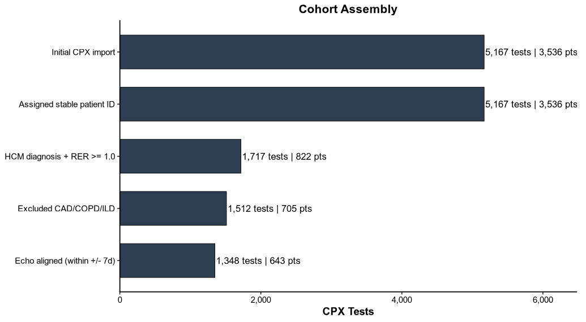

**Legend.** Cohort assembly workflow for the analytic dataset.
Horizontal bars show the number of CPX studies retained at each
sequential filtering step, with labels indicating both the number of
tests and the number of unique patients remaining after each
restriction. The final bar represents the CPX studies successfully
aligned to a resting echocardiogram within the prespecified time window.

# ASE 2025 HCM Diastolic Assessment (Primary Parameter Combination Phenotypes)

To avoid collapsing HCM diastolic physiology into a binary label, we
categorized baseline studies according to the observed combination of
the 3 HCM-relevant primary parameters available in this dataset: average
E/e$'$ \>14, left atrial volume index (LAVI) \>34 mL/m$^2$, and peak
tricuspid regurgitation velocity (TR V$_{max}$) \>2.8 m/s. These
variables were selected because they correspond to the principal
HCM-related markers highlighted in the 2025 American Society of
Echocardiography update for special populations.

Combination phenotypes were assigned whenever at least 1 of the 3
primary parameters was available at baseline. Each patient was mapped to
1 of 8 mutually exclusive profiles reflecting the observed pattern of
abnormal findings: none abnormal, isolated E/e$'$ abnormality, isolated
LAVI abnormality, isolated TR V$_{max}$ abnormality, each possible
2-parameter combination, or all 3 parameters abnormal. Thus, patients
with incomplete primary-parameter data were retained in these
descriptive analyses if at least 1 observed parameter was available; the
“none abnormal” category denotes that no observed primary parameter was
abnormal, not that all 3 parameters were measured and normal.

**Primary HCM Parameter Availability:**

3 indicators available: 230 (35.8%) 2 indicators available: 243 (37.8%)
0-1 indicators available: 170 (26.4%)

**Primary Parameter Combination Phenotypes (Patients With \>=1 Primary
Parameter):**

None abnormal E/e’ only LAVI only TR Vmax only E/e’ + LAVI 327 54 96 18
60 E/e’ + TR Vmax LAVI + TR Vmax All 3 abnormal 5 14 9

**Individual Criterion Prevalence:**

E/e’ \>14: 128 / 465 (27.5%) LAVI \>34: 179 / 447 (40.0%) TR Vmax \>2.8:
46 / 374 (12.3%)

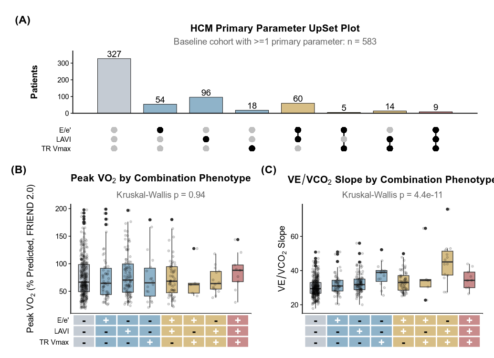

**Figure 2. Baseline HCM Primary-Parameter Phenotypes and
Cardiopulmonary Performance.** **(A)** Frequency of each observed
combination of abnormal E/e$'$, LAVI, and TR V$_{max}$, with black dots
indicating parameters contributing to a given phenotype and gray dots
indicating parameters not present in that combination. **(B)** Peak
VO$_2$ (FRIEND 2.0 % predicted) across phenotypes. **(C)** VE/VCO$_2$
slope across the same phenotypes. Boxplots display the median and
interquartile range, and jittered points represent individual patients.
Bar and strip colors denote the number of abnormal primary parameters
within each phenotype. Abbreviations: HCM = hypertrophic cardiomyopathy;
LAVI = left atrial volume index; TR V$_{max}$ = peak tricuspid
regurgitation velocity; VE/VCO$_2$ = ventilatory efficiency slope;
VO$_2$ = oxygen consumption.

<table class="gt_table" data-quarto-postprocess="true"
data-quarto-disable-processing="false" data-quarto-bootstrap="false">
<caption><strong>Table: Patient Characteristics by Any Abnormal HCM
Primary Parameter</strong></caption>
<colgroup>
<col style="width: 25%" />
<col style="width: 25%" />
<col style="width: 25%" />
<col style="width: 25%" />
</colgroup>
<thead>
<tr class="gt_col_headings">
<th id="label" class="gt_col_heading gt_columns_bottom_border gt_left"
data-quarto-table-cell-role="th"
scope="col"><strong>Characteristic</strong></th>
<th id="stat_1"
class="gt_col_heading gt_columns_bottom_border gt_center"
data-quarto-table-cell-role="th"
scope="col"><strong>Normal</strong> 
N = 3271</th>
<th id="stat_2"
class="gt_col_heading gt_columns_bottom_border gt_center"
data-quarto-table-cell-role="th"
scope="col"><strong>Abnormal</strong> 
N = 2561</th>
<th id="p.value"
class="gt_col_heading gt_columns_bottom_border gt_center"
data-quarto-table-cell-role="th"
scope="col"><strong>p-value</strong>2</th>
</tr>
</thead>
<tbody class="gt_table_body">
<tr>
<td class="gt_row gt_left" headers="label"
style="font-weight: bold">Age, years</td>
<td class="gt_row gt_center" headers="stat_1">47.3 (16.6)</td>
<td class="gt_row gt_center" headers="stat_2">49.1 (16.9)</td>
<td class="gt_row gt_center" headers="p.value">0.2</td>
</tr>
<tr>
<td class="gt_row gt_left" headers="label"
style="font-weight: bold">Sex</td>
<td class="gt_row gt_center" headers="stat_1"> 
</td>
<td class="gt_row gt_center" headers="stat_2"> 
</td>
<td class="gt_row gt_center" headers="p.value">0.3</td>
</tr>
<tr>
<td class="gt_row gt_left" headers="label">    Male</td>
<td class="gt_row gt_center" headers="stat_1">212 (65%)</td>
<td class="gt_row gt_center" headers="stat_2">155 (61%)</td>
<td class="gt_row gt_center" headers="p.value"> 
</td>
</tr>
<tr>
<td class="gt_row gt_left" headers="label">    Female</td>
<td class="gt_row gt_center" headers="stat_1">115 (35%)</td>
<td class="gt_row gt_center" headers="stat_2">101 (39%)</td>
<td class="gt_row gt_center" headers="p.value"> 
</td>
</tr>
<tr>
<td class="gt_row gt_left" headers="label"
style="font-weight: bold">BMI, kg/m²</td>
<td class="gt_row gt_center" headers="stat_1">28.1 (6.2)</td>
<td class="gt_row gt_center" headers="stat_2">27.8 (5.5)</td>
<td class="gt_row gt_center" headers="p.value">&gt;0.9</td>
</tr>
<tr>
<td class="gt_row gt_left" headers="label"
style="font-weight: bold">LBMI, kg/m²</td>
<td class="gt_row gt_center" headers="stat_1">23.2 (5.7)</td>
<td class="gt_row gt_center" headers="stat_2">24.0 (6.0)</td>
<td class="gt_row gt_center" headers="p.value">0.094</td>
</tr>
<tr>
<td class="gt_row gt_left" headers="label" style="font-weight: bold">HCM
Phenotype</td>
<td class="gt_row gt_center" headers="stat_1"> 
</td>
<td class="gt_row gt_center" headers="stat_2"> 
</td>
<td class="gt_row gt_center" headers="p.value">&lt;0.001</td>
</tr>
<tr>
<td class="gt_row gt_left" headers="label">    Apical</td>
<td class="gt_row gt_center" headers="stat_1">55 (22%)</td>
<td class="gt_row gt_center" headers="stat_2">18 (8.1%)</td>
<td class="gt_row gt_center" headers="p.value"> 
</td>
</tr>
<tr>
<td class="gt_row gt_left" headers="label">    Asymmetric Septal</td>
<td class="gt_row gt_center" headers="stat_1">161 (64%)</td>
<td class="gt_row gt_center" headers="stat_2">163 (73%)</td>
<td class="gt_row gt_center" headers="p.value"> 
</td>
</tr>
<tr>
<td class="gt_row gt_left" headers="label">    Burned-out</td>
<td class="gt_row gt_center" headers="stat_1">0 (0%)</td>
<td class="gt_row gt_center" headers="stat_2">2 (0.9%)</td>
<td class="gt_row gt_center" headers="p.value"> 
</td>
</tr>
<tr>
<td class="gt_row gt_left" headers="label">    Symmetric</td>
<td class="gt_row gt_center" headers="stat_1">37 (15%)</td>
<td class="gt_row gt_center" headers="stat_2">39 (18%)</td>
<td class="gt_row gt_center" headers="p.value"> 
</td>
</tr>
<tr>
<td class="gt_row gt_left" headers="label"
style="font-weight: bold">Peak VO₂ (FRIEND 2.0 %pred)</td>
<td class="gt_row gt_center" headers="stat_1">75.9 (36.2)</td>
<td class="gt_row gt_center" headers="stat_2">76.3 (38.2)</td>
<td class="gt_row gt_center" headers="p.value">0.8</td>
</tr>
<tr>
<td class="gt_row gt_left" headers="label"
style="font-weight: bold">Peak VO₂ (Wasserman %pred)</td>
<td class="gt_row gt_center" headers="stat_1">95.3 (77.5)</td>
<td class="gt_row gt_center" headers="stat_2">98.9 (88.3)</td>
<td class="gt_row gt_center" headers="p.value">0.7</td>
</tr>
<tr>
<td class="gt_row gt_left" headers="label"
style="font-weight: bold">VE/VCO₂ Slope</td>
<td class="gt_row gt_center" headers="stat_1">30.1 (5.2)</td>
<td class="gt_row gt_center" headers="stat_2">33.9 (7.3)</td>
<td class="gt_row gt_center" headers="p.value">&lt;0.001</td>
</tr>
<tr>
<td class="gt_row gt_left" headers="label" style="font-weight: bold">HR
Recovery (1 min)</td>
<td class="gt_row gt_center" headers="stat_1">31.2 (12.6)</td>
<td class="gt_row gt_center" headers="stat_2">24.9 (11.1)</td>
<td class="gt_row gt_center" headers="p.value">&lt;0.001</td>
</tr>
<tr>
<td class="gt_row gt_left" headers="label" style="font-weight: bold">Max
LVOT Gradient, mm Hg</td>
<td class="gt_row gt_center" headers="stat_1">36.7 (27.9)</td>
<td class="gt_row gt_center" headers="stat_2">53.5 (44.9)</td>
<td class="gt_row gt_center" headers="p.value">&lt;0.001</td>
</tr>
<tr>
<td class="gt_row gt_left" headers="label" style="font-weight: bold">LV
Septal Thickness, cm</td>
<td class="gt_row gt_center" headers="stat_1">1.4 (0.5)</td>
<td class="gt_row gt_center" headers="stat_2">1.7 (0.5)</td>
<td class="gt_row gt_center" headers="p.value">&lt;0.001</td>
</tr>
<tr>
<td class="gt_row gt_left" headers="label"
style="font-weight: bold">Average e', cm/s</td>
<td class="gt_row gt_center" headers="stat_1">8.8 (3.5)</td>
<td class="gt_row gt_center" headers="stat_2">6.2 (2.0)</td>
<td class="gt_row gt_center" headers="p.value">&lt;0.001</td>
</tr>
<tr>
<td class="gt_row gt_left" headers="label"
style="font-weight: bold">Septal e', cm/s</td>
<td class="gt_row gt_center" headers="stat_1">7.3 (5.1)</td>
<td class="gt_row gt_center" headers="stat_2">5.1 (1.5)</td>
<td class="gt_row gt_center" headers="p.value">&lt;0.001</td>
</tr>
<tr>
<td class="gt_row gt_left" headers="label"
style="font-weight: bold">Lateral e', cm/s</td>
<td class="gt_row gt_center" headers="stat_1">10.3 (3.6)</td>
<td class="gt_row gt_center" headers="stat_2">7.2 (2.9)</td>
<td class="gt_row gt_center" headers="p.value">&lt;0.001</td>
</tr>
<tr>
<td class="gt_row gt_left" headers="label"
style="font-weight: bold">E/e' (average)</td>
<td class="gt_row gt_center" headers="stat_1">9.3 (2.4)</td>
<td class="gt_row gt_center" headers="stat_2">15.7 (6.1)</td>
<td class="gt_row gt_center" headers="p.value">&lt;0.001</td>
</tr>
<tr>
<td class="gt_row gt_left" headers="label"
style="font-weight: bold">LAVI, mL/m²</td>
<td class="gt_row gt_center" headers="stat_1">26.0 (5.0)</td>
<td class="gt_row gt_center" headers="stat_2">42.8 (13.3)</td>
<td class="gt_row gt_center" headers="p.value">&lt;0.001</td>
</tr>
<tr>
<td class="gt_row gt_left" headers="label" style="font-weight: bold">TR
Vmax, cm/s</td>
<td class="gt_row gt_center" headers="stat_1">224.7 (26.2)</td>
<td class="gt_row gt_center" headers="stat_2">260.4 (46.7)</td>
<td class="gt_row gt_center" headers="p.value">&lt;0.001</td>
</tr>
<tr>
<td class="gt_row gt_left" headers="label" style="font-weight: bold">E/A
Ratio</td>
<td class="gt_row gt_center" headers="stat_1">1.3 (0.5)</td>
<td class="gt_row gt_center" headers="stat_2">1.3 (0.6)</td>
<td class="gt_row gt_center" headers="p.value">&gt;0.9</td>
</tr>
<tr>
<td class="gt_row gt_left" headers="label" style="font-weight: bold">MV
Deceleration Time, ms</td>
<td class="gt_row gt_center" headers="stat_1">0.2 (0.1)</td>
<td class="gt_row gt_center" headers="stat_2">0.2 (0.1)</td>
<td class="gt_row gt_center" headers="p.value">0.2</td>
</tr>
<tr>
<td class="gt_row gt_left" headers="label"
style="font-weight: bold">LVEF, %</td>
<td class="gt_row gt_center" headers="stat_1">64.1 (6.3)</td>
<td class="gt_row gt_center" headers="stat_2">63.9 (8.4)</td>
<td class="gt_row gt_center" headers="p.value">0.5</td>
</tr>
</tbody><tfoot>
<tr class="gt_footnotes">
<td colspan="4" class="gt_footnote">1
Mean (SD); n (%)</td>
</tr>
<tr class="gt_footnotes">
<td colspan="4" class="gt_footnote">2
Kruskal-Wallis rank sum test; Fisher’s exact test; Fisher’s Exact Test
for Count Data with simulated p-value (based on 2000 replicates)</td>
</tr>
</tfoot>
&#10;</table>

# Cross-Sectional Nonlinear Analysis

Cross-sectional nonlinear modeling is focused on the 3 HCM-relevant ASE
2025 primary parameters available in this dataset: average E/e$'$, LAVI,
and TR V$_{max}$. For each parameter, we fit restricted cubic spline
models adjusted for age, sex, and lean body mass index, then display
predicted performance across the observed range with the ASE 2025
threshold overlaid. We next repeat the same clinical framing using OMAR,
allowing data-driven thresholds to be compared directly with the ASE
reference cutoffs.

## Primary outcome: Peak VO$_2$ (FRIEND 2.0 % predicted)

## Secondary outcome: VE/VCO$_2$ slope

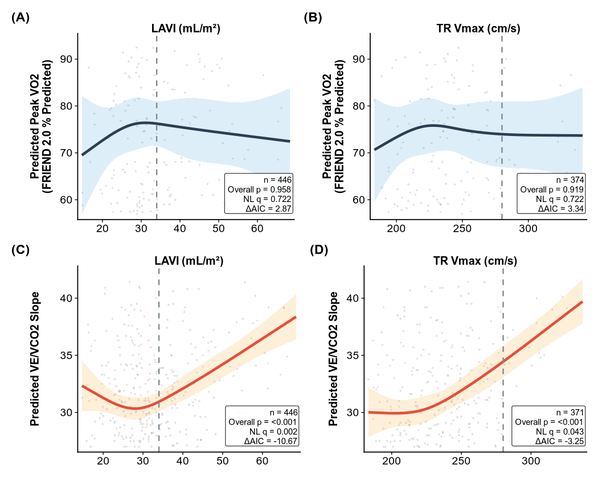

**Figure 3. Focused Restricted Cubic Spline Partial-Effect Plots for
Predictors With the Strongest Evidence of Nonlinearity.** Panels show
adjusted restricted cubic spline partial-effect curves for the ASE
primary diastolic parameter(s) prioritized by the prespecified
nonlinearity screen, with Peak VO$_2$ (FRIEND 2.0 % predicted) in the
top row and VE/VCO$_2$ slope in the bottom row. Raw observed data are
shown as faint background points, shaded bands denote 95% confidence
intervals, and dashed vertical lines mark ASE 2025 thresholds. In-panel
boxes report the complete-case sample size, overall association p value,
nonlinearity q value, and spline-vs-linear 394AIC. The full six-panel
primary-parameter RCS display is exported separately to the supplemental
output. Abbreviations: ASE = American Society of Echocardiography; CI =
confidence interval; HCM = hypertrophic cardiomyopathy; LAVI = left
atrial volume index; TR V$_{max}$ = peak tricuspid regurgitation
velocity; VE/VCO$_2$ = ventilatory efficiency slope; VO$_2$ = oxygen
consumption.

## Sensitivity: Echo alignment window

# OMARX: Adaptive Threshold Discovery

OMARX, implemented from the newer local `omarx_v3.ipynb` notebook
engine, was used to compare a MARS-style global discovery strategy
against a confirmatory additive fit while keeping the manuscript
outcomes unchanged. The revised OMARX analysis is intended to clarify
whether Peak VO$_2$ is driven primarily by age/body-size structure and
whether VE/VCO$_2$ slope shows stronger cardiac contribution from LAVI,
TR V$_{max}$, medial septal e$'$, septal thickness, and obstruction.

Primary OMARX models use the same baseline HCM cohort but expand the
predictor set to include cardiac and body-composition variables
highlighted in the new notebook and the feedback note. Complete-case
MARS models are treated as the primary discovery analysis, additive fits
are confirmatory, and targeted QC is added for clinical-knot protection,
TRV informative missingness, BMI-vs-LBMI choice, binary obstruction
coding, predictor imputation, and bootstrap stability of the LAVI knot
in VE/VCO$_2$.

    --- FEATURE IMPORTANCE ---
    Full model R²: 0.1634

      Variable             Terms      Solo      Drop         %
      --------------------------------------------------------
      age                      1    0.0965    0.0831     50.9%
      BMI                      1    0.0321    0.0186     11.4%
      med_peak_e_vel           1    0.0353    0.0167     10.2%
      tr_max_vel               1    0.0016    0.0098      6.0%
      Sex_num                  1    0.0021    0.0032      2.0%
      lv_septal_thickness      1    0.0134    0.0023      1.4%
      e_e_ave                  1    0.0001    0.0013      0.8%
      lvot_gradient_cont       1    0.0000    0.0008      0.5%
      la_vol_index             1    0.0002    0.0000      0.0%

    --- FEATURE IMPORTANCE ---
    Full model R²: 0.2015

      Variable             Terms      Solo      Drop         %
      --------------------------------------------------------
      age                      2    0.1018    0.0949     47.1%
      tr_max_vel               2    0.0119    0.0316     15.7%
      BMI                      2    0.0322    0.0272     13.5%
      med_peak_e_vel           2    0.0363    0.0119      5.9%
      Sex_num                  1    0.0021    0.0056      2.8%
      lvot_gradient_cont       2    0.0000    0.0055      2.7%
      la_vol_index             2    0.0055    0.0034      1.7%
      lv_septal_thickness      2    0.0178    0.0028      1.4%
      e_e_ave                  2    0.0081    0.0006      0.3%

    --- FEATURE IMPORTANCE ---
    Full model R²: 0.2269

      Variable             Terms      Solo      Drop         %
      --------------------------------------------------------
      age                      1    0.0965    0.1111     49.0%
      LBMI                     1    0.0621    0.0821     36.2%
      med_peak_e_vel           1    0.0353    0.0204      9.0%
      tr_max_vel               1    0.0016    0.0127      5.6%
      Sex_num                  1    0.0021    0.0028      1.2%
      lv_septal_thickness      1    0.0134    0.0007      0.3%
      e_e_ave                  1    0.0001    0.0006      0.3%
      la_vol_index             1    0.0002    0.0003      0.1%
      lvot_gradient_cont       1    0.0000    0.0000      0.0%

    --- FEATURE IMPORTANCE ---
    Full model R²: 0.1446

      Variable             Terms      Solo      Drop         %
      --------------------------------------------------------
      age                      1    0.0912    0.0779     53.9%
      BMI                      1    0.0473    0.0315     21.8%
      trv_missing              1    0.0000    0.0075      5.2%
      trv_value                1    0.0000    0.0069      4.8%
      Sex_num                  1    0.0016    0.0050      3.5%
      med_peak_e_vel           1    0.0110    0.0037      2.6%
      lvot_gradient_cont       1    0.0024    0.0026      1.8%
      la_vol_index             1    0.0002    0.0021      1.5%
      lv_septal_thickness      1    0.0000    0.0011      0.8%
      e_e_ave                  1    0.0005    0.0003      0.2%

    --- FEATURE IMPORTANCE ---
    Full model R²: 0.1625

      Variable             Terms      Solo      Drop         %
      --------------------------------------------------------
      age                      1    0.0854    0.0701     43.1%
      BMI                      1    0.0699    0.0552     34.0%
      med_peak_e_vel           1    0.0138    0.0075      4.6%
      tr_max_vel               1    0.0000    0.0043      2.6%
      lv_septal_thickness      1    0.0078    0.0035      2.2%
      la_vol_index             1    0.0007    0.0003      0.2%
      e_e_ave                  1    0.0001    0.0002      0.1%
      max_pg_30                1    0.0000    0.0002      0.1%
      Sex_num                  1    0.0004    0.0001      0.1%

    --- FEATURE IMPORTANCE ---
    Full model R²: 0.1896

      Variable             Terms      Solo      Drop         %
      --------------------------------------------------------
      age                      1    0.1172    0.0901     47.5%
      BMI                      1    0.0865    0.0552     29.1%
      lvot_gradient_cont       1    0.0078    0.0071      3.7%
      tr_max_vel               1    0.0016    0.0061      3.2%
      la_vol_index             1    0.0009    0.0030      1.6%
      med_peak_e_vel           1    0.0058    0.0020      1.1%
      e_e_ave                  1    0.0009    0.0013      0.7%
      lv_septal_thickness      1    0.0005    0.0001      0.1%
      Sex_num                  1    0.0017    0.0001      0.1%

    --- FEATURE IMPORTANCE ---
    Full model R²: 0.1636

      Variable             Terms      Solo      Drop         %
      --------------------------------------------------------
      la_vol_index             2    0.0917    0.0611     37.3%
      age                      1    0.0298    0.0159      9.7%
      Sex_num                  1    0.0214    0.0118      7.2%
      med_peak_e_vel           1    0.0363    0.0113      6.9%
      lv_septal_thickness      1    0.0085    0.0031      1.9%
      lvot_gradient_cont       1    0.0066    0.0026      1.6%
      BMI                      1    0.0006    0.0023      1.4%
      tr_max_vel               1    0.0457    0.0021      1.3%
      e_e_ave                  1    0.0328    0.0004      0.2%

    --- FEATURE IMPORTANCE ---
    Full model R²: 0.19

      Variable             Terms      Solo      Drop         %
      --------------------------------------------------------
      la_vol_index             2    0.0917    0.0524     27.6%
      med_peak_e_vel           2    0.0541    0.0258     13.6%
      age                      2    0.0376    0.0241     12.7%
      Sex_num                  1    0.0214    0.0113      5.9%
      lv_septal_thickness      2    0.0096    0.0038      2.0%
      tr_max_vel               2    0.0461    0.0037      1.9%
      BMI                      2    0.0015    0.0029      1.5%
      lvot_gradient_cont       2    0.0077    0.0020      1.1%
      e_e_ave                  2    0.0342    0.0018      0.9%

    --- FEATURE IMPORTANCE ---
    Full model R²: 0.1734

      Variable             Terms      Solo      Drop         %
      --------------------------------------------------------
      la_vol_index             2    0.0917    0.0599     34.5%
      age                      1    0.0298    0.0179     10.3%
      LBMI                     1    0.0099    0.0121      7.0%
      Sex_num                  1    0.0214    0.0112      6.5%
      med_peak_e_vel           1    0.0363    0.0101      5.8%
      lv_septal_thickness      1    0.0085    0.0028      1.6%
      lvot_gradient_cont       1    0.0066    0.0022      1.3%
      tr_max_vel               1    0.0457    0.0016      0.9%
      e_e_ave                  1    0.0328    0.0000      0.0%

    --- FEATURE IMPORTANCE ---
    Full model R²: 0.1214

      Variable             Terms      Solo      Drop         %
      --------------------------------------------------------
      Sex_num                  1    0.0298    0.0251     20.7%
      lvot_gradient_cont       1    0.0241    0.0136     11.2%
      age                      1    0.0169    0.0119      9.8%
      la_vol_index             1    0.0415    0.0112      9.2%
      trv_value                1    0.0141    0.0046      3.8%
      med_peak_e_vel           1    0.0276    0.0033      2.7%
      trv_missing              1    0.0073    0.0028      2.3%
      lv_septal_thickness      1    0.0051    0.0009      0.7%
      BMI                      1    0.0010    0.0008      0.7%
      e_e_ave                  1    0.0347    0.0003      0.2%

    --- FEATURE IMPORTANCE ---
    Full model R²: 0.196

      Variable             Terms      Solo      Drop         %
      --------------------------------------------------------
      la_vol_index             2    0.1262    0.0639     32.6%
      med_peak_e_vel           1    0.0543    0.0183      9.3%
      tr_max_vel               1    0.0870    0.0126      6.4%
      Sex_num                  1    0.0209    0.0121      6.2%
      age                      1    0.0171    0.0060      3.1%
      e_e_ave                  1    0.0304    0.0040      2.0%
      lv_septal_thickness      1    0.0124    0.0003      0.2%
      max_pg_30                1    0.0028    0.0003      0.2%
      BMI                      1    0.0001    0.0000      0.0%

    --- FEATURE IMPORTANCE ---
    Full model R²: 0.1961

      Variable             Terms      Solo      Drop         %
      --------------------------------------------------------
      la_vol_index             2    0.1215    0.0419     21.4%
      tr_max_vel               1    0.1190    0.0235     12.0%
      med_peak_e_vel           1    0.0680    0.0187      9.5%
      Sex_num                  1    0.0139    0.0055      2.8%
      lvot_gradient_cont       1    0.0178    0.0036      1.8%
      lv_septal_thickness      1    0.0041    0.0022      1.1%
      e_e_ave                  1    0.0545    0.0016      0.8%
      age                      1    0.0078    0.0014      0.7%
      BMI                      1    0.0000    0.0004      0.2%

    --- FEATURE IMPORTANCE ---
    Full model R²: 0.2063

      Variable             Terms      Solo      Drop         %
      --------------------------------------------------------
      la_vol_index             2    0.0920    0.0736     35.7%
      tr_max_vel               2    0.0570    0.0270     13.1%
      med_peak_e_vel           2    0.0509    0.0228     11.1%
      age                      1    0.0298    0.0184      8.9%
      Sex_num                  1    0.0214    0.0151      7.3%
      lv_septal_thickness      1    0.0085    0.0042      2.0%
      BMI                      1    0.0006    0.0040      1.9%
      lvot_gradient_cont       1    0.0066    0.0028      1.4%
      e_e_ave                  2    0.0328    0.0016      0.8%

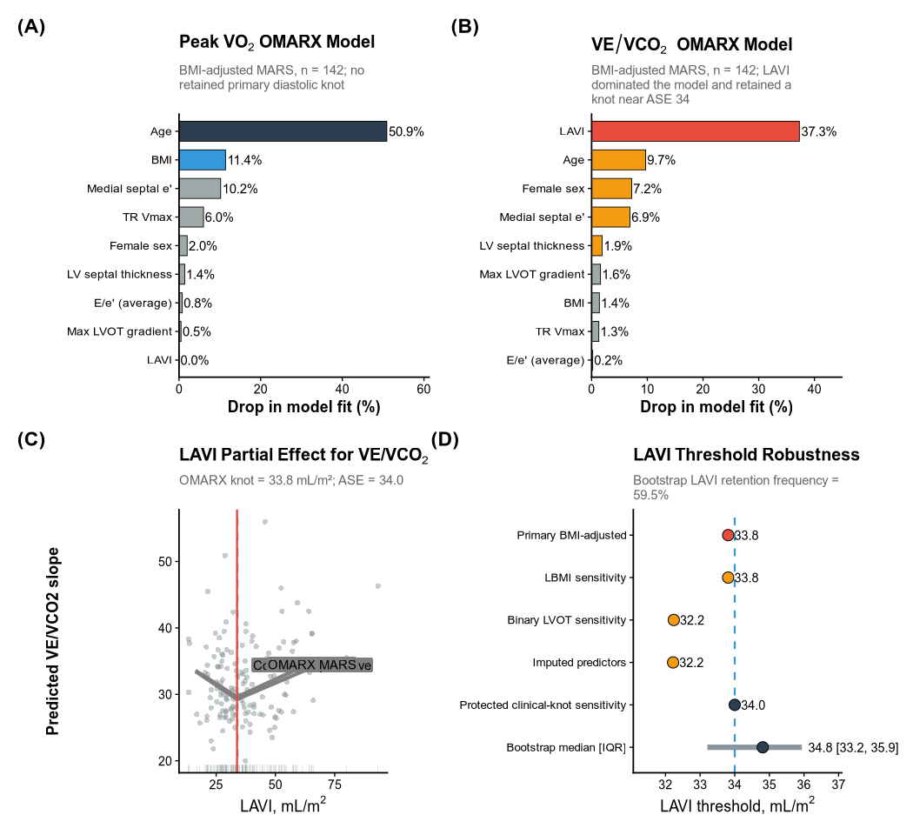

**Legend.** Publication-format summary of the revised OMARX analysis.
**(A)** Variable-importance profile for the BMI-adjusted OMARX MARS
model of Peak VO$_2$, showing dominant contributions from age and BMI
and no retained primary diastolic knot. **(B)** Variable-importance
profile for the corresponding VE/VCO$_2$ model, highlighting LAVI as the
dominant predictor with supplementary contributions from age, sex,
medial septal e$'$, and septal thickness. **(C)** OMARX partial-effect
plot for LAVI in the VE/VCO$_2$ model, with raw complete-case
observations in the background, the primary retained OMARX knot shown as
a solid red line, and the ASE reference value of 34 mL/m$^2$ shown as a
dashed blue line. **(D)** Robustness of the VE/VCO$_2$ LAVI threshold
across prespecified sensitivity analyses and bootstrap quality control.
Segment ranges denote the bootstrap interquartile range where
applicable.

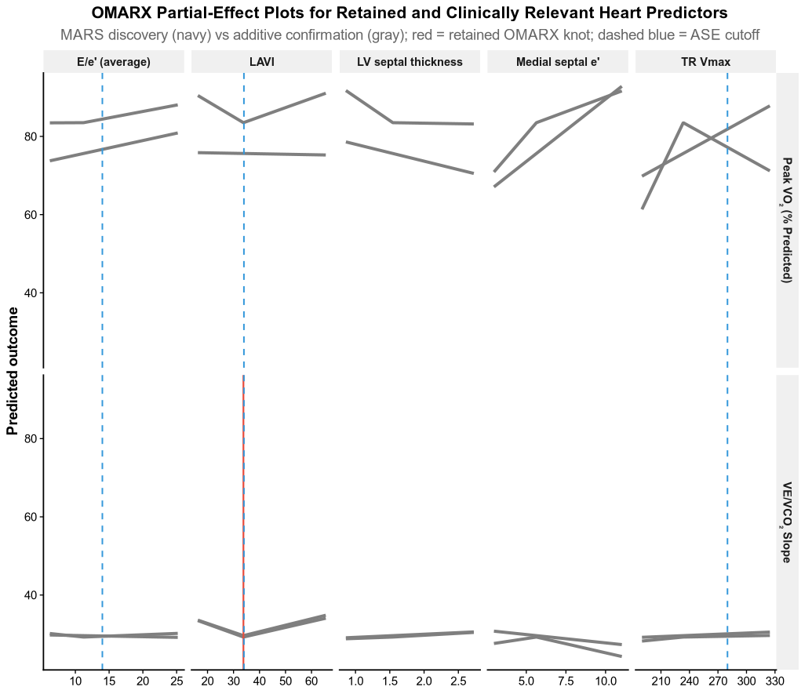

**Legend.** OMARX partial-effect plots for the retained and clinically
relevant heart predictors from the primary complete-case BMI-adjusted
models. Navy curves show the primary MARS discovery fit and gray curves
show the confirmatory additive fit. Solid red vertical lines denote
retained OMARX knots from the MARS fit, and dashed blue lines denote ASE
reference thresholds where available.

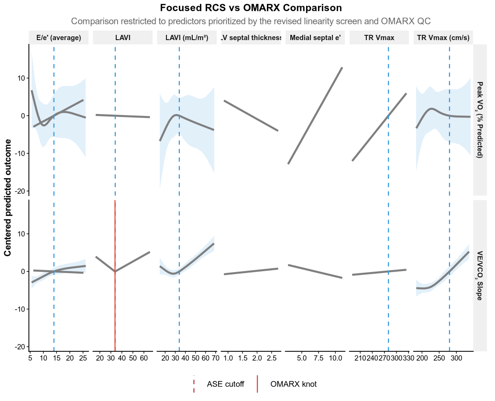

**Legend.** Direct comparison of the revised focused RCS curves and the
primary OMARX MARS partial-effect curves for the predictors that survive
the linearity screen and OMARX QC prioritization. Dashed blue vertical
lines indicate ASE cutoffs and solid red vertical lines indicate
retained OMARX knots.

## OMARX Results

For Peak VO$_2$, the primary complete-case BMI-adjusted MARS model
emphasized Age, BMI, Medial septal e’, consistent with the
interpretation that age and body-size structure dominate this outcome
more strongly than diastolic threshold structure. For VE/VCO$_2$ slope,
the primary complete-case BMI-adjusted MARS model prioritized LAVI, Age,
Female sex, Medial septal e’, supporting a stronger cardiac/diastology
signal than was seen for Peak VO$_2$. Retained MARS knots were
identified in LAVI at 33.8. In bootstrap QC, the LAVI knot was retained
in 59.5% of resamples, with median knot 34.8 mL/m$^2$ and 100.0% of
retained knots lying within 5 mL/m$^2$ of 34.

# Longitudinal GAMM Analysis

We employ generalized additive mixed models (GAMMs) via `mgcv::bam()` to
model nonlinear longitudinal trajectories of peak VO$_2$ and VE/VCO$_2$
slope over time, testing whether the trajectory diverges as a function
of baseline diastolic severity via a tensor product interaction.

    GAMM cohort: 773 observations, 293 patients

    VO2_FRIEND2_PP GAMM cohort: 773 observations, 293 patients
    VeVco2_slope GAMM cohort: 772 observations, 293 patients

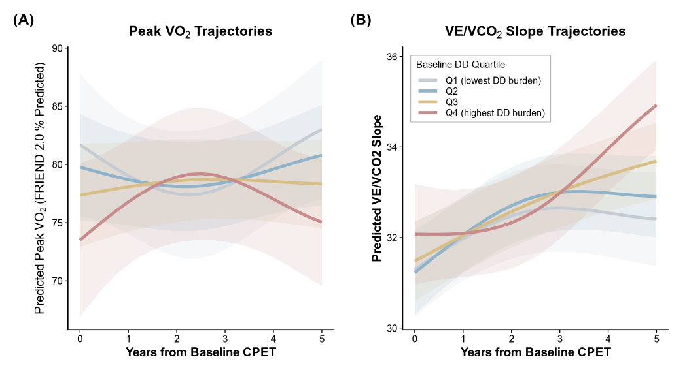

**Figure 4. Longitudinal Model-Derived Cardiopulmonary Trajectories
According to Baseline Diastolic Dysfunction Burden.** **(A)**
Model-derived peak VO$_2$ trajectories from a generalized additive mixed
model across quartiles of baseline diastolic dysfunction burden, defined
using the baseline LAVI-derived DD Z-score. **(B)** Model-derived
VE/VCO$_2$ slope trajectories across the same quartiles. Shaded bands
denote 95% confidence intervals. All models were adjusted for age, sex,
and lean body mass index. Abbreviations: CPET = cardiopulmonary exercise
testing; DD = diastolic dysfunction; GAMM = generalized additive mixed
model; LAVI = left atrial volume index; VE/VCO$_2$ = ventilatory
efficiency slope; VO$_2$ = oxygen consumption.

# Heart Failure Outcome Analysis

Time-to-event analysis tests whether ASE 2025 filling pressure
classification (Normal vs Elevated), continuous DD Z-scores, LVOT
gradient, and LV septal thickness predict a composite heart failure
endpoint (acute HF, chronic HF, transplant, or death).

Survival cohort: 632 patients, 159 events

**Cox Model: Filling Pressure Classification** a flextable object.
col_keys: `term`, `estimate`, `std.error`, `statistic`, `p.value`,
`conf.low`, `conf.high` header has 1 row(s) body has 4 row(s) original
dataset sample: ‘data.frame’: 4 obs. of 7 variables: \$ term : chr
“fp_classElevated” “age” “SexFemale” “LBMI” \$ estimate : num 2.099
0.998 1.293 1.002 \$ std.error: num 0.16 0.005 0.162 0.014 \$ statistic:
num 4.644 -0.327 1.587 0.175 \$ p.value : num 0 0.744 0.113 0.861 \$
conf.low : num 1.535 0.989 0.941 0.976 \$ conf.high: num 2.87 1.01 1.77
1.03

**Proportional hazards global test p = 0.582**
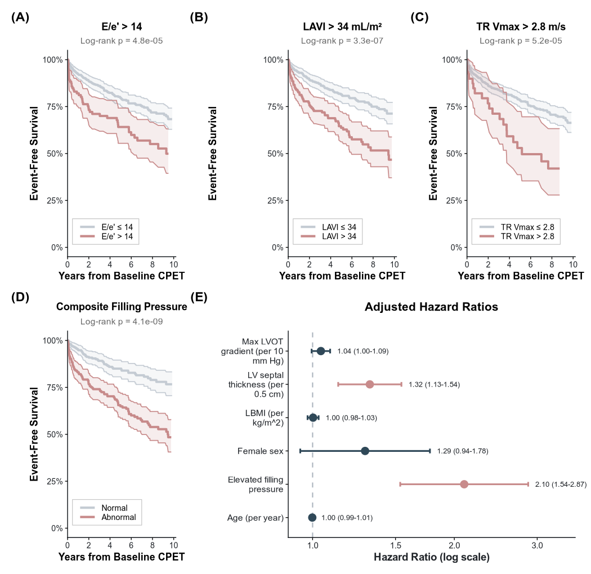

**Figure 5. Heart Failure Outcomes Across ASE Threshold Components,
Primary-Parameter Status, and Structural Obstruction Markers.** **(A)**
Kaplan-Meier estimates for the composite heart failure endpoint
stratified by abnormal baseline E/e$'$ (\>14). **(B)** Kaplan-Meier
estimates stratified by abnormal baseline LAVI (\>34 mL/m$^2$). **(C)**
Kaplan-Meier estimates stratified by abnormal baseline TR V$_{max}$
(\>2.8 m/s). **(D)** Kaplan-Meier estimates stratified by the same
binary primary-parameter grouping used in the patient-characteristics
table (`Normal` = no abnormal primary parameter, `Abnormal` = at least 1
abnormal primary parameter). **(E)** Adjusted hazard ratios from
multivariable Cox proportional hazards models for elevated filling
pressure classification, continuous diastolic dysfunction burden
expressed as the baseline LAVI-derived DD Z-score, max LVOT gradient, LV
septal thickness, age, sex, and lean body mass index. Shaded bands
denote 95% confidence intervals in Kaplan-Meier panels. Abbreviations:
CPET = cardiopulmonary exercise testing; DD = diastolic dysfunction; HCM
= hypertrophic cardiomyopathy; HR = hazard ratio; LAVI = left atrial
volume index; LVOT = left ventricular outflow tract; TR V$_{max}$ = peak
tricuspid regurgitation velocity.

# Patient Characteristics

## Table 1

<table class="gt_table" data-quarto-postprocess="true"
data-quarto-disable-processing="false" data-quarto-bootstrap="false">
<caption><strong>Table 1. Baseline Patient
Characteristics</strong></caption>
<colgroup>
<col style="width: 50%" />
<col style="width: 50%" />
</colgroup>
<thead>
<tr class="gt_col_headings">
<th id="label" class="gt_col_heading gt_columns_bottom_border gt_left"
data-quarto-table-cell-role="th"
scope="col"><strong>Characteristic</strong></th>
<th id="stat_0"
class="gt_col_heading gt_columns_bottom_border gt_center"
data-quarto-table-cell-role="th" scope="col"><strong>N =
643</strong>1</th>
</tr>
</thead>
<tbody class="gt_table_body">
<tr>
<td class="gt_row gt_left" headers="label"
style="font-weight: bold">Age, years</td>
<td class="gt_row gt_center" headers="stat_0">48.0 (16.6)</td>
</tr>
<tr>
<td class="gt_row gt_left" headers="label"
style="font-weight: bold">Sex</td>
<td class="gt_row gt_center" headers="stat_0"> 
</td>
</tr>
<tr>
<td class="gt_row gt_left" headers="label">    Male</td>
<td class="gt_row gt_center" headers="stat_0">411 (64%)</td>
</tr>
<tr>
<td class="gt_row gt_left" headers="label">    Female</td>
<td class="gt_row gt_center" headers="stat_0">232 (36%)</td>
</tr>
<tr>
<td class="gt_row gt_left" headers="label"
style="font-weight: bold">Body Mass Index, kg/m²</td>
<td class="gt_row gt_center" headers="stat_0">27.8 (5.8)</td>
</tr>
<tr>
<td class="gt_row gt_left" headers="label"
style="font-weight: bold">Body Surface Area, m²</td>
<td class="gt_row gt_center" headers="stat_0">2.0 (0.3)</td>
</tr>
<tr>
<td class="gt_row gt_left" headers="label"
style="font-weight: bold">Lean Body Mass Index, kg/m²</td>
<td class="gt_row gt_center" headers="stat_0">23.6 (5.8)</td>
</tr>
<tr>
<td class="gt_row gt_left" headers="label" style="font-weight: bold">HCM
Phenotype</td>
<td class="gt_row gt_center" headers="stat_0"> 
</td>
</tr>
<tr>
<td class="gt_row gt_left" headers="label">    Apical</td>
<td class="gt_row gt_center" headers="stat_0">81 (15%)</td>
</tr>
<tr>
<td class="gt_row gt_left" headers="label">    Asymmetric Septal</td>
<td class="gt_row gt_center" headers="stat_0">362 (68%)</td>
</tr>
<tr>
<td class="gt_row gt_left" headers="label">    Burned-out</td>
<td class="gt_row gt_center" headers="stat_0">2 (0.4%)</td>
</tr>
<tr>
<td class="gt_row gt_left" headers="label">    Symmetric</td>
<td class="gt_row gt_center" headers="stat_0">90 (17%)</td>
</tr>
<tr>
<td class="gt_row gt_left" headers="label"
style="font-weight: bold">Peak RER</td>
<td class="gt_row gt_center" headers="stat_0">1.1 (0.1)</td>
</tr>
<tr>
<td class="gt_row gt_left" headers="label"
style="font-weight: bold">Peak VO₂ (FRIEND 2.0 %pred)</td>
<td class="gt_row gt_center" headers="stat_0">76.2 (36.8)</td>
</tr>
<tr>
<td class="gt_row gt_left" headers="label"
style="font-weight: bold">Peak VO₂ (Wasserman %pred)</td>
<td class="gt_row gt_center" headers="stat_0">97.2 (82.8)</td>
</tr>
<tr>
<td class="gt_row gt_left" headers="label"
style="font-weight: bold">VE/VCO₂ Slope</td>
<td class="gt_row gt_center" headers="stat_0">31.5 (6.4)</td>
</tr>
<tr>
<td class="gt_row gt_left" headers="label"
style="font-weight: bold">Heart Rate Recovery (1 min)</td>
<td class="gt_row gt_center" headers="stat_0">28.4 (12.3)</td>
</tr>
<tr>
<td class="gt_row gt_left" headers="label" style="font-weight: bold">Max
LVOT Gradient, mm Hg</td>
<td class="gt_row gt_center" headers="stat_0">44.4 (37.6)</td>
</tr>
<tr>
<td class="gt_row gt_left" headers="label" style="font-weight: bold">LV
Septal Thickness, cm</td>
<td class="gt_row gt_center" headers="stat_0">1.6 (0.5)</td>
</tr>
<tr>
<td class="gt_row gt_left" headers="label"
style="font-weight: bold">Average e', cm/s</td>
<td class="gt_row gt_center" headers="stat_0">7.6 (3.2)</td>
</tr>
<tr>
<td class="gt_row gt_left" headers="label"
style="font-weight: bold">Septal e', cm/s</td>
<td class="gt_row gt_center" headers="stat_0">6.3 (4.1)</td>
</tr>
<tr>
<td class="gt_row gt_left" headers="label"
style="font-weight: bold">Lateral e', cm/s</td>
<td class="gt_row gt_center" headers="stat_0">8.9 (3.6)</td>
</tr>
<tr>
<td class="gt_row gt_left" headers="label"
style="font-weight: bold">E/e' (average)</td>
<td class="gt_row gt_center" headers="stat_0">12.2 (5.4)</td>
</tr>
<tr>
<td class="gt_row gt_left" headers="label"
style="font-weight: bold">LAVI, mL/m²</td>
<td class="gt_row gt_center" headers="stat_0">34.4 (13.1)</td>
</tr>
<tr>
<td class="gt_row gt_left" headers="label"
style="font-weight: bold">Mitral E Velocity, cm/s</td>
<td class="gt_row gt_center" headers="stat_0">6.3 (4.0)</td>
</tr>
<tr>
<td class="gt_row gt_left" headers="label" style="font-weight: bold">TR
Vmax, cm/s</td>
<td class="gt_row gt_center" headers="stat_0">241.6 (41.3)</td>
</tr>
<tr>
<td class="gt_row gt_left" headers="label" style="font-weight: bold">E/A
Ratio</td>
<td class="gt_row gt_center" headers="stat_0">1.3 (0.5)</td>
</tr>
<tr>
<td class="gt_row gt_left" headers="label" style="font-weight: bold">MV
Deceleration Time, ms</td>
<td class="gt_row gt_center" headers="stat_0">0.2 (0.1)</td>
</tr>
<tr>
<td class="gt_row gt_left" headers="label"
style="font-weight: bold">LVEF, %</td>
<td class="gt_row gt_center" headers="stat_0">63.9 (7.4)</td>
</tr>
</tbody><tfoot>
<tr class="gt_footnotes">
<td colspan="2" class="gt_footnote">1
Mean (SD); n (%)</td>
</tr>
</tfoot>
&#10;</table>

## Figure 1: Cohort Characteristics

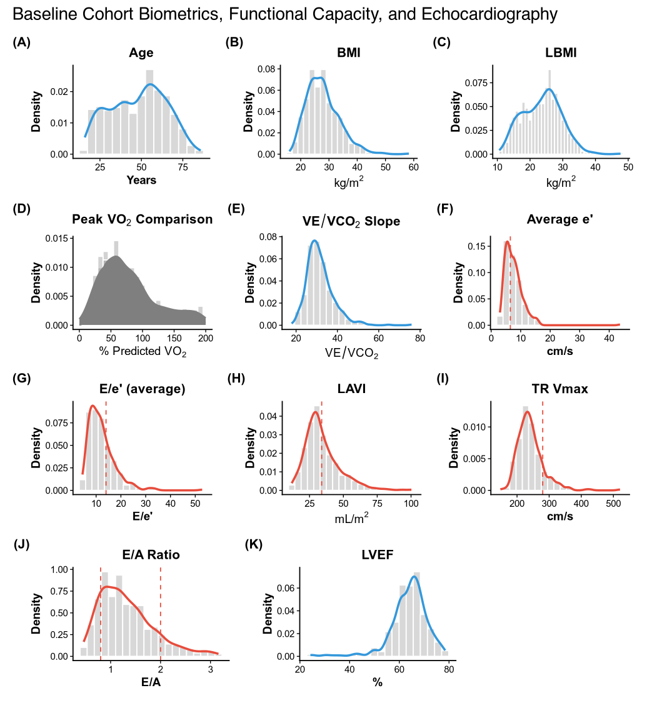

**Legend.** Distribution of baseline clinical, exercise, and
echocardiographic characteristics in the analytic cohort. Panels
summarize age, body mass index, lean body mass index, Peak VO$_2$ by 2
prediction equations, VE/VCO$_2$ slope, and key echocardiographic
measures relevant to diastolic assessment. Dashed red vertical reference
lines indicate clinically relevant threshold values where applicable.

# Supplemental Analyses

## All diastolic parameters: restricted cubic splines

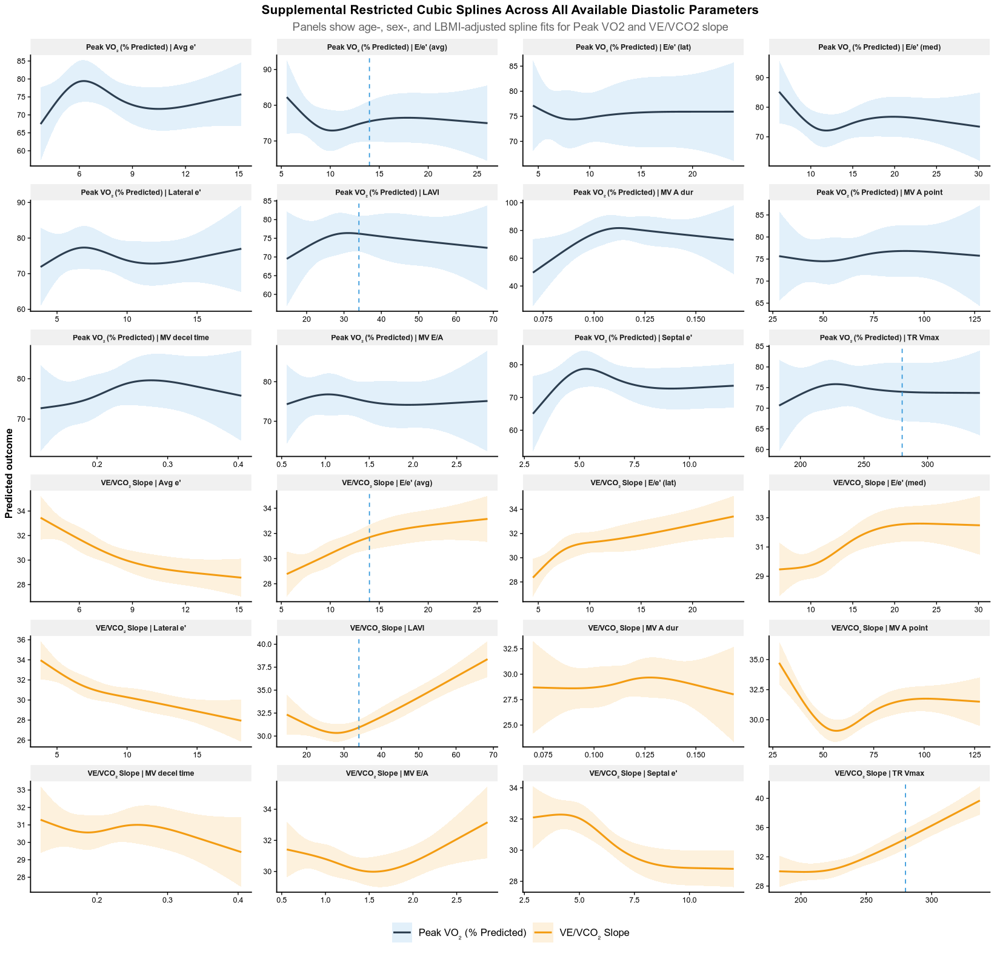

**Legend.** Supplemental restricted cubic spline models relating all
available diastolic parameters to Peak VO$_2$ and VE/VCO$_2$ slope. Each
panel shows the adjusted spline-estimated association for a single
parameter-outcome pair after adjustment for age, sex, and lean body mass
index. Shaded ribbons indicate 95% confidence intervals. Dashed blue
vertical lines indicate ASE 2025 reference cutoffs where available for
the 3 HCM primary parameters.

## All diastolic parameters: OMAR

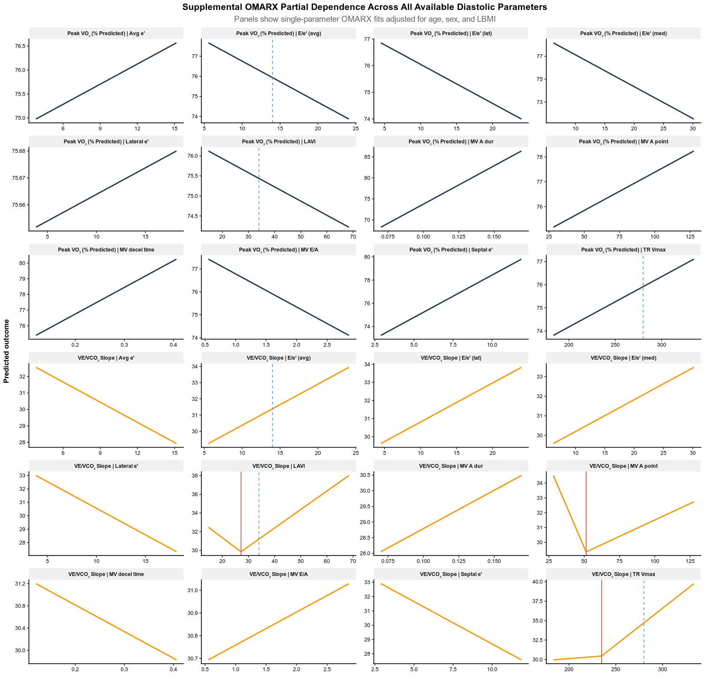

**Legend.** Supplemental OMARX-derived partial dependence plots relating
all available diastolic parameters to Peak VO$_2$ and VE/VCO$_2$ slope.
Each panel shows the modeled marginal association for a single
parameter-outcome pair after adjustment for age, sex, and lean body mass
index. Solid red vertical lines denote OMARX-retained hinge locations,
and dashed blue vertical lines denote ASE 2025 reference cutoffs where
available for the 3 HCM primary parameters.

## Age-residualized diastolic indices

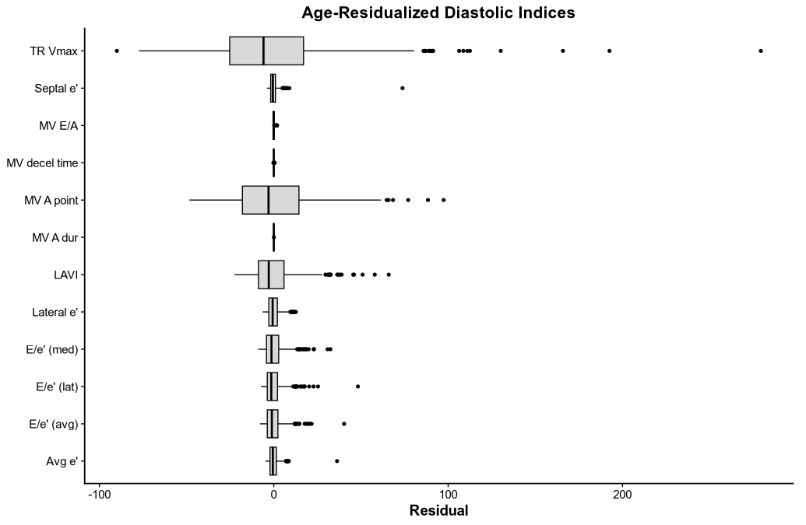

**Legend.** Distribution of age-residualized diastolic indices.
Residuals were derived from nonlinear age-adjustment models for each
index so that the resulting values reflect deviation from the expected
age-specific value. Boxplots show the median, interquartile range, and
distribution of residual variability across the included
echocardiographic parameters.

## Export missing echo audit

    Exported 164 CPX tests without echo linkage (88 patients)

    ---
    **Session Info:**

    R version 4.5.2 (2025-10-31)
    Platform: aarch64-apple-darwin20
    Running under: macOS Tahoe 26.3.1

    Matrix products: default
    BLAS:   /System/Library/Frameworks/Accelerate.framework/Versions/A/Frameworks/vecLib.framework/Versions/A/libBLAS.dylib 
    LAPACK: /Library/Frameworks/R.framework/Versions/4.5-arm64/Resources/lib/libRlapack.dylib;  LAPACK version 3.12.1

    locale:
    [1] C.UTF-8/C.UTF-8/C.UTF-8/C/C.UTF-8/C.UTF-8

    time zone: America/Los_Angeles
    tzcode source: internal

    attached base packages:
    [1] parallel  splines   stats     graphics  grDevices utils     datasets 
    [8] methods   base     

    other attached packages:
     [1] reticulate_1.44.1  gamlss_5.5-0       gamlss.dist_6.1-1  gamlss.data_6.0-7 
     [5] ggrepel_0.9.6      viridis_0.6.5      viridisLite_0.4.3  ggcorrplot_0.1.4.1
     [9] flextable_0.9.10   gtsummary_2.5.0    openxlsx_4.2.8.1   stringr_1.6.0     
    [13] scales_1.4.0       survival_3.8-6     broom_1.0.12       mgcv_1.9-4        
    [17] nlme_3.1-168       lme4_1.1-38        Matrix_1.7-4       patchwork_1.3.2   
    [21] ggplot2_4.0.2      tidyr_1.3.2        dplyr_1.2.0       

    loaded via a namespace (and not attached):
     [1] Rdpack_2.6.6            gridExtra_2.3           rlang_1.1.7            
     [4] magrittr_2.0.4          otel_0.2.0              compiler_4.5.2         
     [7] png_0.1-8               systemfonts_1.3.1       vctrs_0.7.1            
    [10] pkgconfig_2.0.3         fastmap_1.2.0           backports_1.5.0        
    [13] labeling_0.4.3          rmarkdown_2.30          markdown_2.0           
    [16] nloptr_2.2.1            ragg_1.5.0              purrr_1.2.1            
    [19] xfun_0.56               litedown_0.9            jsonlite_2.0.0         
    [22] uuid_1.2-2              cluster_2.1.8.2         R6_2.6.1               
    [25] stringi_1.8.7           RColorBrewer_1.1-3      boot_1.3-32            
    [28] rpart_4.1.24            Rcpp_1.1.1              knitr_1.51             
    [31] base64enc_0.1-6         nnet_7.3-20             tidyselect_1.2.1       
    [34] rstudioapi_0.18.0       dichromat_2.0-0.1       yaml_2.3.12            
    [37] lattice_0.22-9          tibble_3.3.1            withr_3.0.2            
    [40] S7_0.2.1                askpass_1.2.1           evaluate_1.0.5         
    [43] foreign_0.8-91          zip_2.3.3               xml2_1.5.2             
    [46] pillar_1.11.1           checkmate_2.3.4         reformulas_0.4.4       
    [49] generics_0.1.4          commonmark_2.0.0        minqa_1.2.8            
    [52] glue_1.8.0              gdtools_0.5.0           Hmisc_5.2-5            
    [55] tools_4.5.2             data.table_1.18.2.1     fs_1.6.6               
    [58] grid_4.5.2              rbibutils_2.4.1         cards_0.7.1            
    [61] colorspace_2.1-2        cardx_0.3.2             htmlTable_2.4.3        
    [64] Formula_1.2-5           cli_3.6.5               textshaping_1.0.4      
    [67] officer_0.7.3           fontBitstreamVera_0.1.1 gt_1.3.0               
    [70] gtable_0.3.6            sass_0.4.10             digest_0.6.39          
    [73] fontquiver_0.2.1        htmlwidgets_1.6.4       farver_2.1.2           
    [76] htmltools_0.5.9         lifecycle_1.0.5         fontLiberation_0.1.0   
    [79] openssl_2.3.4           MASS_7.3-65            
